# **二叉树**

## **概览**

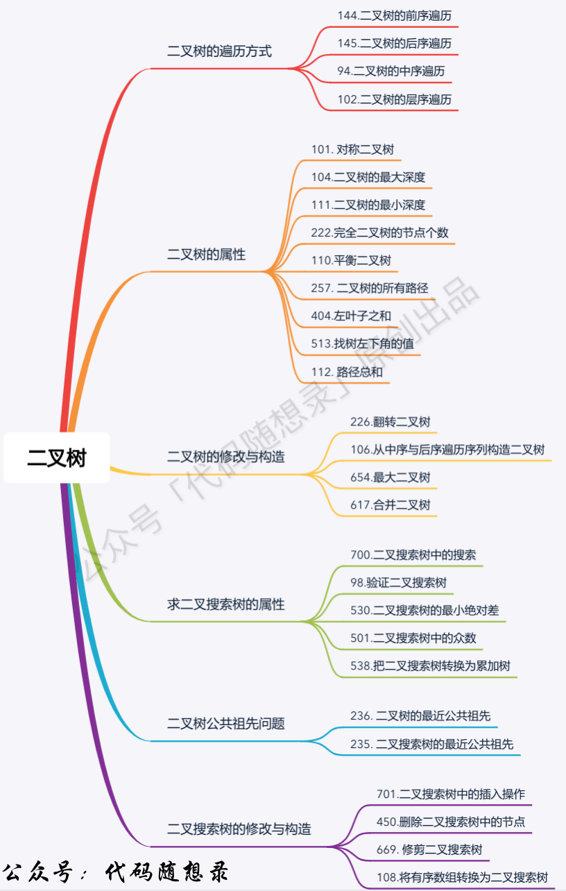

## **理论基础**

### **种类**

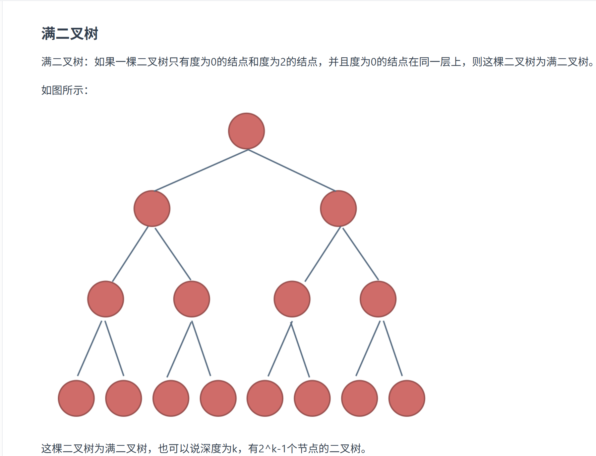
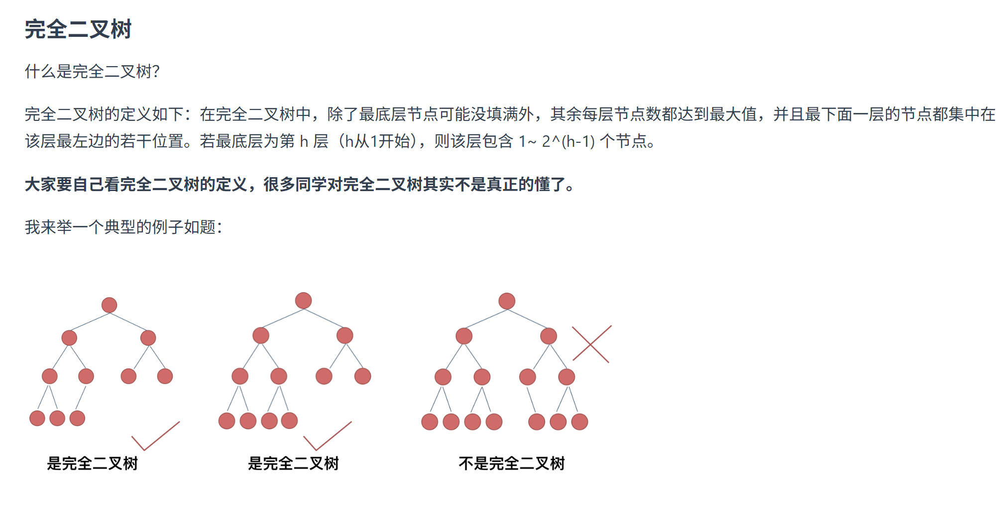
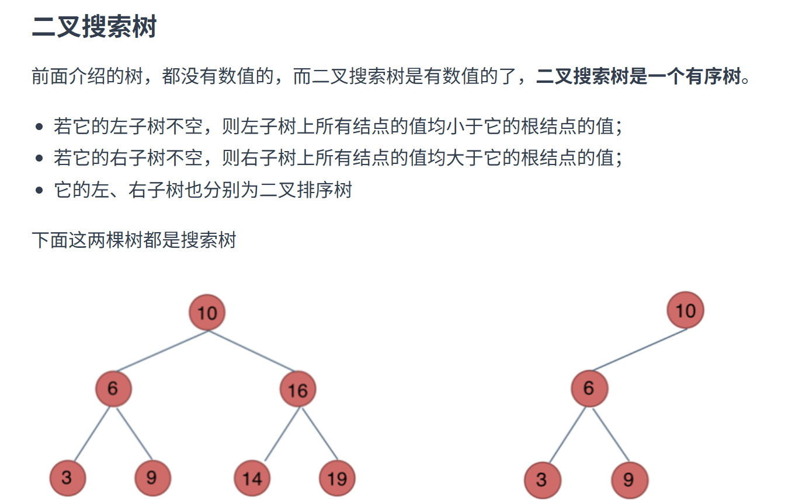
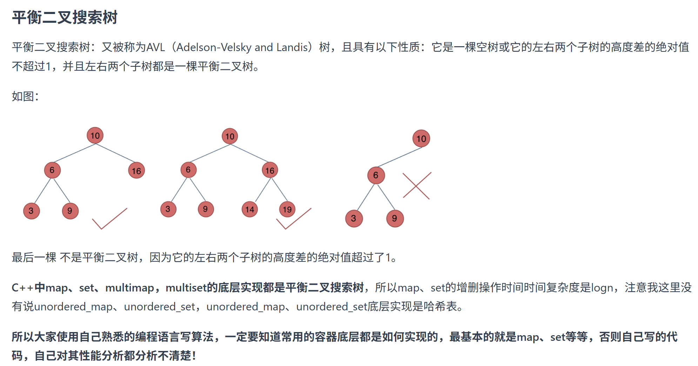

### **存储方式**

- 链式
- 顺序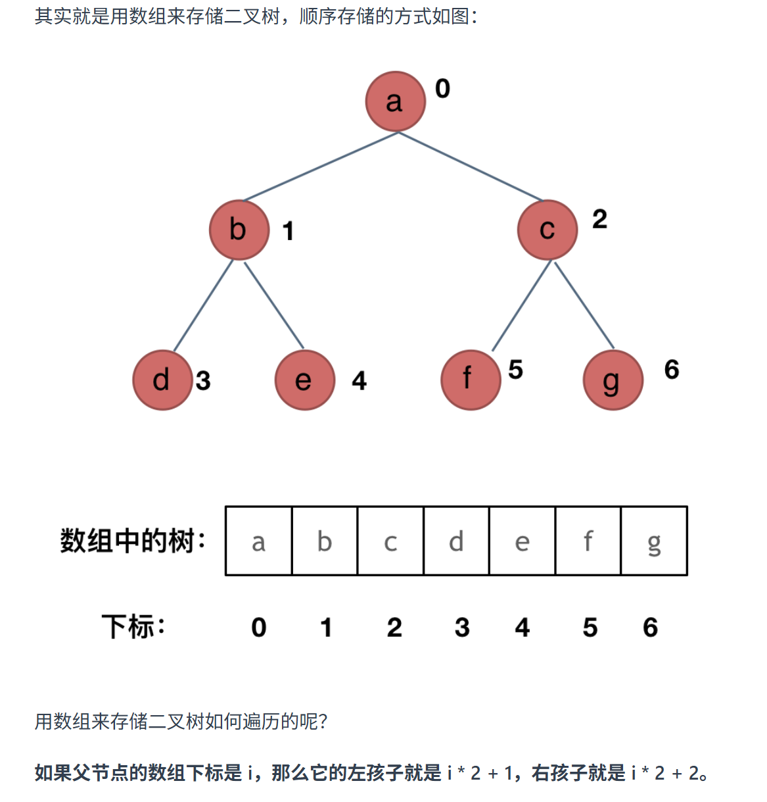

### **遍历方式**

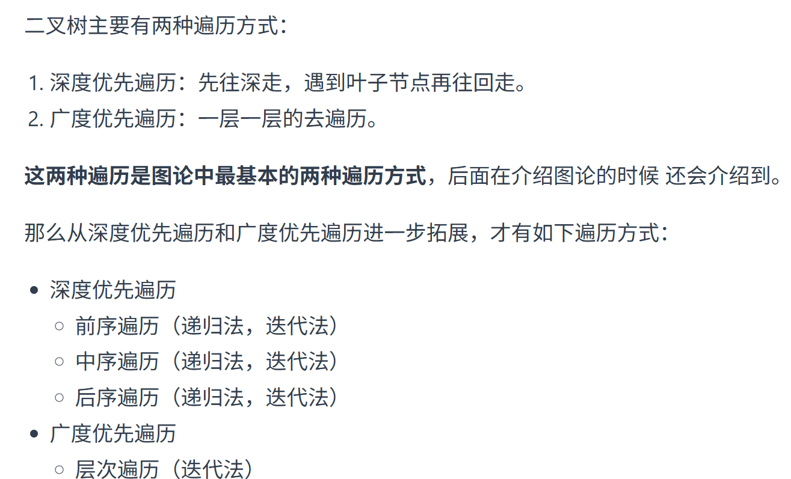
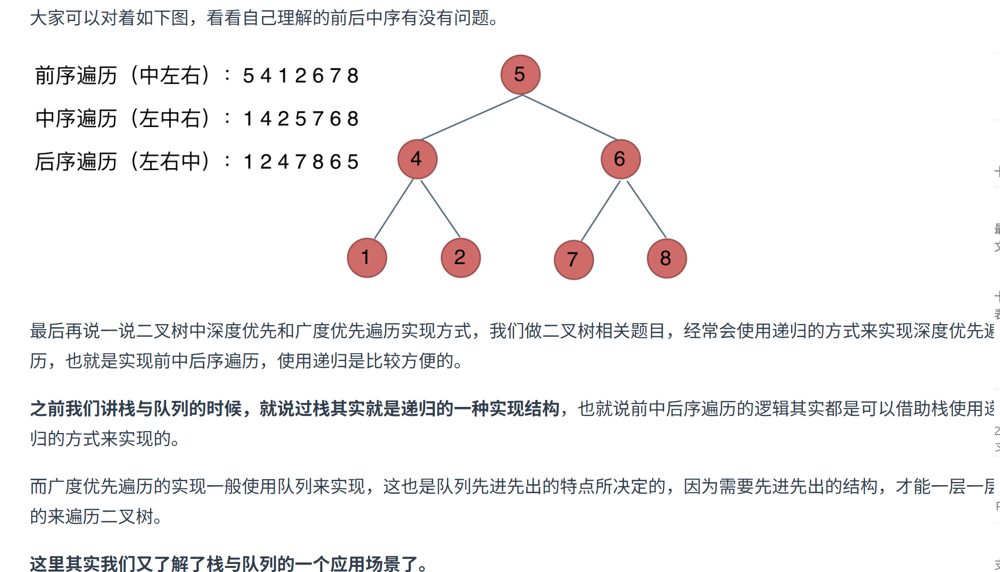
栈->递归->深度优先遍历
队列->广度优先遍历

## **递归遍历**

前序遍历：

```cpp
void traversal(TreeNode* cur, vector<int>& vec) {
    if (cur == NULL) return;
    vec.push_back(cur->val);    // 中
    traversal(cur->left, vec);  // 左
    traversal(cur->right, vec); // 右
}
vector<int> preorderTraversal(TreeNode* root) {
    vector<int> result;
    traversal(root, result);
    return result;
}
```

## **迭代遍历**

- 前序遍历:

```cpp
vector<int> preorderTraversal(TreeNode* root) {
    stack<TreeNode*> st;
    vector<int> result;
    if (root == NULL) return result;
    st.push(root);
    while (!st.empty()) {
        TreeNode* node = st.top();                       // 中
        st.pop();
        result.push_back(node->val);
        if (node->right) st.push(node->right);           // 右（空节点不入栈）
        if (node->left) st.push(node->left);             // 左（空节点不入栈）
    }
    return result;
}
```

- 中序遍历：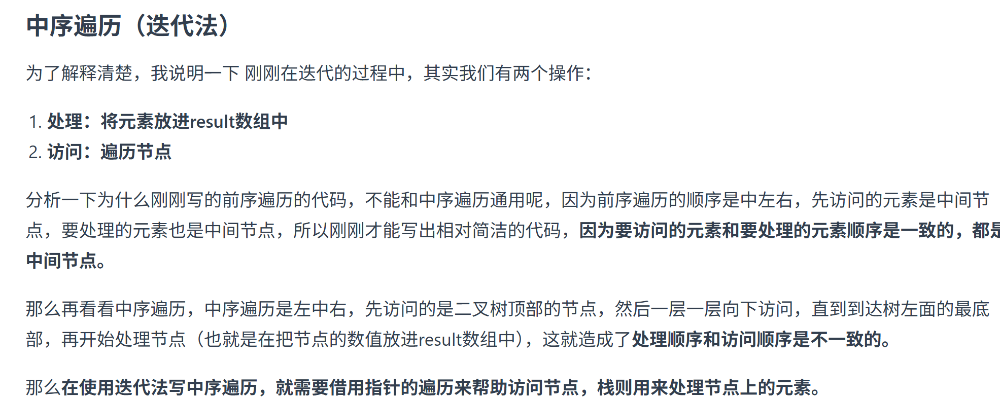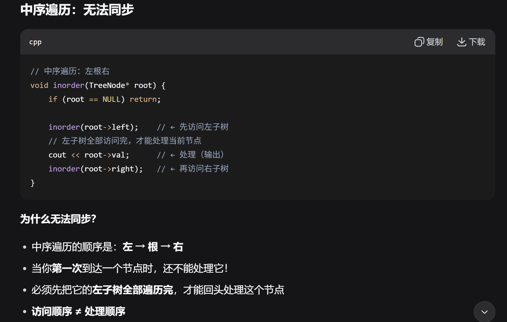**先在最左边遍历到最深处**

```cpp
vector<int> inorderTraversal(TreeNode* root) {
    vector<int> result;
    stack<TreeNode*> st;
    TreeNode* cur = root;
    while (cur != NULL || !st.empty()) {
        if (cur != NULL) { // 指针来访问节点，访问到最底层
            st.push(cur); // 将访问的节点放进栈
            cur = cur->left;                // 左
        } else {
            cur = st.top(); // 从栈里弹出的数据，就是要处理的数据（放进result数组里的数据）
            st.pop();
            result.push_back(cur->val);     // 中
            cur = cur->right;               // 右
        }
    }
    return result;
}
```

- 后序遍历：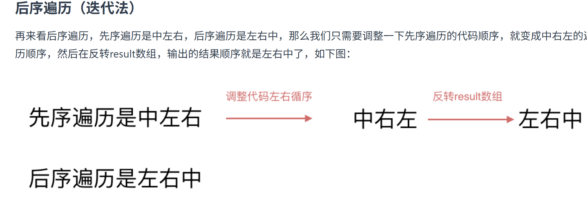

```cpp
vector<int> postorderTraversal(TreeNode* root) {
    stack<TreeNode*> st;
    vector<int> result;
    if (root == NULL) return result;
    st.push(root);
    while (!st.empty()) {
        TreeNode* node = st.top();
        st.pop();
        result.push_back(node->val);
        if (node->left) st.push(node->left); // 相对于前序遍历，这更改一下入栈顺序 （空节点不入栈）
        if (node->right) st.push(node->right); // 空节点不入栈
    }
    reverse(result.begin(), result.end()); // 将结果反转之后就是左右中的顺序了
    return result;
}
```

## **统一迭代法**

### 空指针法中序遍历

```C++
vector<int> inorderTraversal(TreeNode* root) {
    vector<int> result;
    stack<TreeNode*> st;
    if (root != NULL) st.push(root);
    while (!st.empty()) {
        TreeNode* node = st.top();
        if (node != NULL) {
            st.pop(); // 将该节点弹出，避免重复操作，下面再将右中左节点添加到栈中
            if (node->right) st.push(node->right);  // 添加右节点（空节点不入栈）

            st.push(node);                          // 添加中节点
            st.push(NULL); // 中节点访问过，但是还没有处理，加入空节点做为标记。

            if (node->left) st.push(node->left);    // 添加左节点（空节点不入栈）
        } else { // 只有遇到空节点的时候，才将下一个节点放进结果集
            st.pop();           // 将空节点弹出
            node = st.top();    // 重新取出栈中元素
            st.pop();
            result.push_back(node->val); // 加入到结果集
        }
    }
    return result;
}
// 前序
if (node != NULL) {
    st.pop();
    if (node->right) st.push(node->right);  // 右
    if (node->left) st.push(node->left);    // 左
    st.push(node);                          // 中
    st.push(NULL);
}
// 后序
if (node != NULL) {
    st.pop();
    st.push(node);                          // 中
    st.push(NULL);

    if (node->right) st.push(node->right);  // 右
    if (node->left) st.push(node->left);    // 左
} 
```

- **NULL一定在中心结点的后面放入栈**

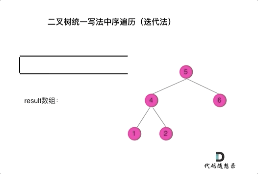
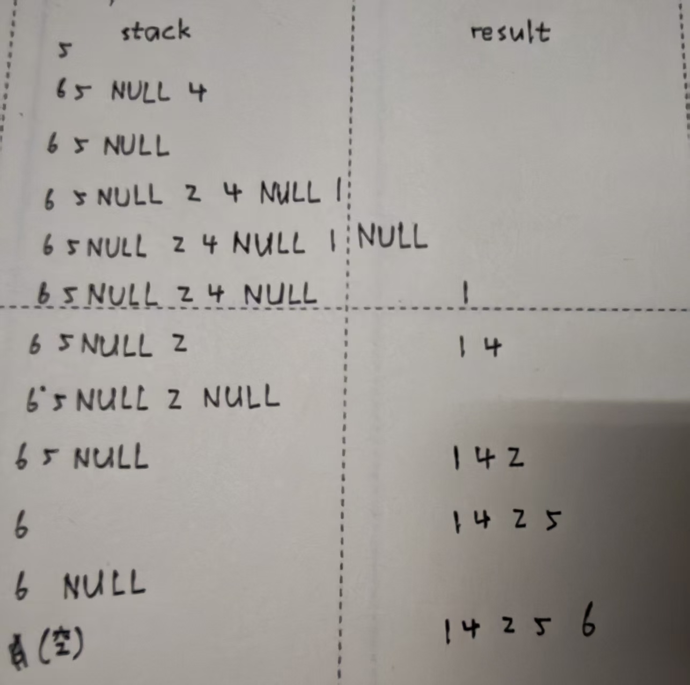

### boolean标记法后序遍历

```cpp
vector<int> postorderTraversal(TreeNode* root) {
    vector<int> result;
    stack<pair<TreeNode*, bool>> st;
    if (root != nullptr)
        st.push(make_pair(root, false)); // 多加一个参数，false 为默认值，含义见下文

    while (!st.empty()) {
        auto node = st.top().first;
        auto visited = st.top().second; //多加一个 visited 参数，使“迭代统一写法”成为一件简单的事
        st.pop();

        if (visited) { // visited 为 True，表示该节点和两个儿子位次之前已经安排过了，现在可以收割节点了
            result.push_back(node->val);
            continue;
        }

        // visited 当前为 false, 表示初次访问本节点，此次访问的目的是“把自己和两个儿子在栈中安排好位次”。
        // 后序遍历是'左右中'，节点自己最先入栈，最后出栈。
        // 同时，设置 visited 为 true，表示下次再访问本节点时，允许收割。
        st.push(make_pair(node, true));

        if (node->right)
            st.push(make_pair(node->right, false)); // 右儿子位置居中

        if (node->left)
            st.push(make_pair(node->left, false)); // 左儿子最后入栈，最先出栈
    }
}

// 前序
/// 前序：中左右 → 入栈顺序：右、左、中
// 因为栈是后进先出，所以先处理的需要后入栈
if (node->right) 
    st.push({node->right, false});  // 右
if (node->left) 
    st.push({node->left, false});   // 左
st.push({node, true});      // 中（标记为已访问）

// 后序
 // 中序：左中右 → 入栈顺序：右、中、左
if (node->right) 
    st.push({node->right, false});  // 右
st.push({node, true});      // 中（标记为已访问）
if (node->left) 
    st.push({node->left, false});   // 左       
```

- **中间结点设为true**

## **层序遍历**

### 迭代法

```cpp
vector<vector<int>> levelOrder(TreeNode* root) {
    queue<TreeNode*> que;
    if (root != NULL) que.push(root);
    vector<vector<int>> result;
    while (!que.empty()) {
        int size = que.size();
        vector<int> vec;
        // 这里一定要使用固定大小size，不要使用que.size()，因为que.size是不断变化的
        for (int i = 0; i < size; i++) {
            TreeNode* node = que.front();
            que.pop();
            vec.push_back(node->val);
            if (node->left) que.push(node->left);
            if (node->right) que.push(node->right);
        }
        result.push_back(vec);
    }
    return result;
}
```

### 递归法

```cpp
void order(TreeNode* cur, vector<vector<int>>& result, int depth){
    if (cur == nullptr) return;

    // 当需要一个新的层级时，创建一个空数组
    if (result.size() == depth) result.push_back(vector<int>());
    
    result[depth].push_back(cur->val);
    order(cur->left, result, depth + 1);
    order(cur->right, result, depth + 1);
}

vector<vector<int>> levelOrder(TreeNode* root) {
    vector<vector<int>> result;
    int depth = 0;
    order(root, result, depth);
    return result;
}
```

### 自底向上(反转一下结果数组即可)

### **填充每个节点的下一个右侧节点指针**

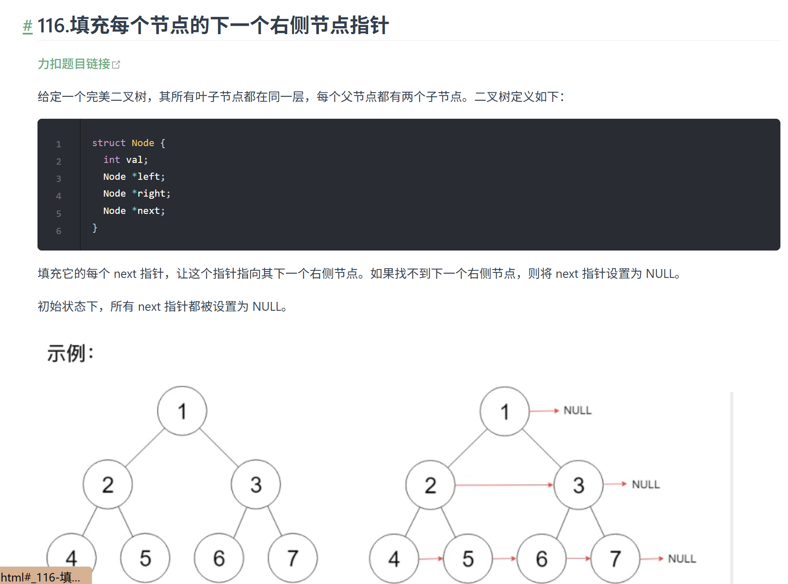

```cpp
Node* connect(Node* root) {
    queue<Node*> que;
    if (root != NULL) que.push(root);
    while (!que.empty()) {
        int size = que.size();
        // vector<int> vec;
        Node* nodePre;
        Node* node;
        for (int i = 0; i < size; i++) {
            if (i == 0) {
                nodePre = que.front(); // 取出一层的头结点
                que.pop();
                node = nodePre;
            } else {
                node = que.front();
                que.pop();
                nodePre->next = node; // 本层前一个节点next指向本节点
                nodePre = nodePre->next;
            }
            if (node->left) que.push(node->left);
            if (node->right) que.push(node->right);
        }
        nodePre->next = NULL; // 本层最后一个节点指向NULL
    }
    return root;

}
```

## **翻转二叉树**

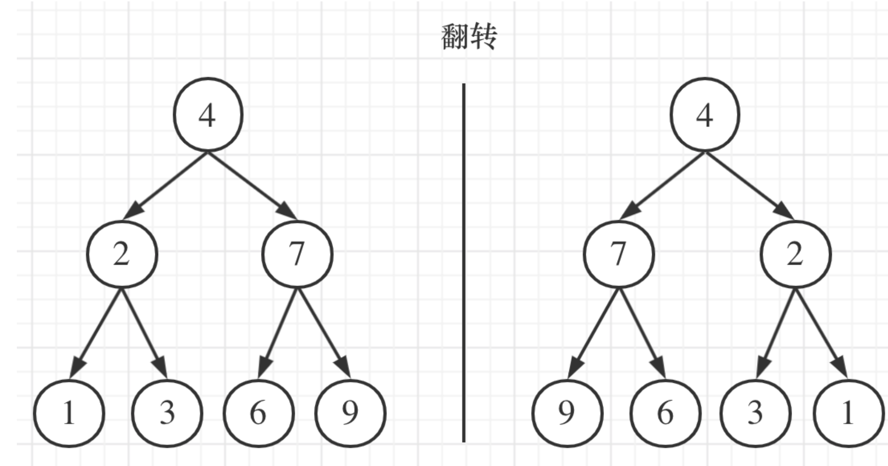

### **递归法**

```cpp
TreeNode* invertTree(TreeNode* root) {
    if (root == NULL) return root;
    swap(root->left, root->right);  // 中
    invertTree(root->left);         // 左
    invertTree(root->right);        // 右
    return root;
}
```

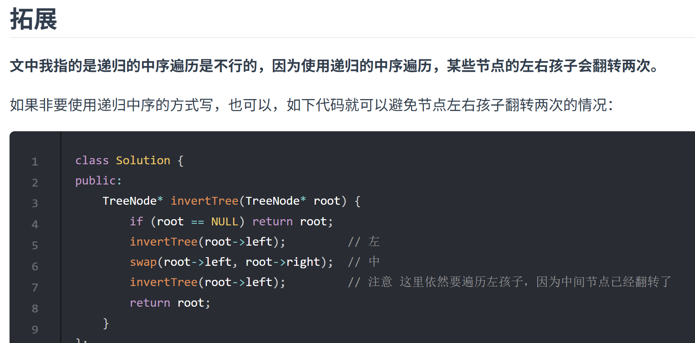

## **对称二叉树**

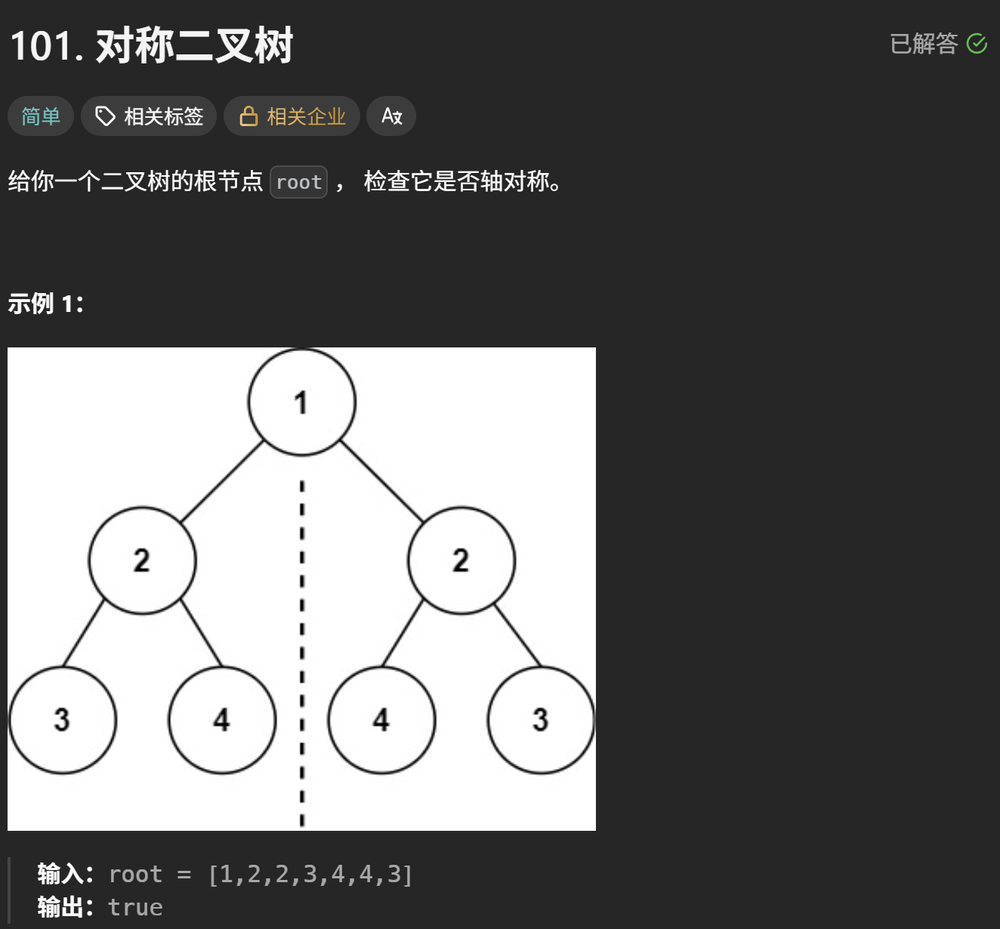

- 递归法

```cpp
bool compare(TreeNode* left, TreeNode* right) {
    // 首先排除空节点的情况
    if (left == NULL && right != NULL) return false;
    else if (left != NULL && right == NULL) return false;
    else if (left == NULL && right == NULL) return true;
    // 排除了空节点，再排除数值不相同的情况
    else if (left->val != right->val) return false;

    // 此时就是：左右节点都不为空，且数值相同的情况
    // 此时才做递归，做下一层的判断
    bool outside = compare(left->left, right->right);   // 左子树：左、 右子树：右
    bool inside = compare(left->right, right->left);    // 左子树：右、 右子树：左
    bool isSame = outside && inside;                    // 左子树：中、 右子树：中 （逻辑处理）
    return isSame;

}
bool isSymmetric(TreeNode* root) {
    if (root == NULL) return true;
    return compare(root->left, root->right);
}
```

- 迭代法

```cpp
bool isSymmetric(TreeNode* root) {
    if (root == NULL) return true;
    queue<TreeNode*> que; //用栈也可以
    que.push(root->left);   // 将左子树头结点加入队列
    que.push(root->right);  // 将右子树头结点加入队列
    
    while (!que.empty()) {  // 接下来就要判断这两个树是否相互翻转
        TreeNode* leftNode = que.front(); que.pop();
        TreeNode* rightNode = que.front(); que.pop();
        if (!leftNode && !rightNode) {  // 左节点为空、右节点为空，此时说明是对称的
            continue;
        }

        // 左右一个节点不为空，或者都不为空但数值不相同，返回false
        if ((!leftNode || !rightNode || (leftNode->val != rightNode->val))) {
            return false;
        }
        que.push(leftNode->left);   // 加入左节点左孩子
        que.push(rightNode->right); // 加入右节点右孩子
        que.push(leftNode->right);  // 加入左节点右孩子
        que.push(rightNode->left);  // 加入右节点左孩子
    }
    return true;
}
```

## **最大深度**

```cpp
int result;
void getDepth(TreeNode* node, int depth) {
    result = depth > result ? depth : result; // 中

    if (node->left == NULL && node->right == NULL) return ;

    if (node->left) { // 左
        depth++;    // 深度+1
        getDepth(node->left, depth);
        depth--;    // 回溯，深度-1
    }
    if (node->right) { // 右
        depth++;    // 深度+1
        getDepth(node->right, depth);
        depth--;    // 回溯，深度-1
    }
    return ;
}
int maxDepth(TreeNode* root) {
    result = 0;
    if (root == 0) return result;
    getDepth(root, 1);
    return result;
}
```

## **最小深度**

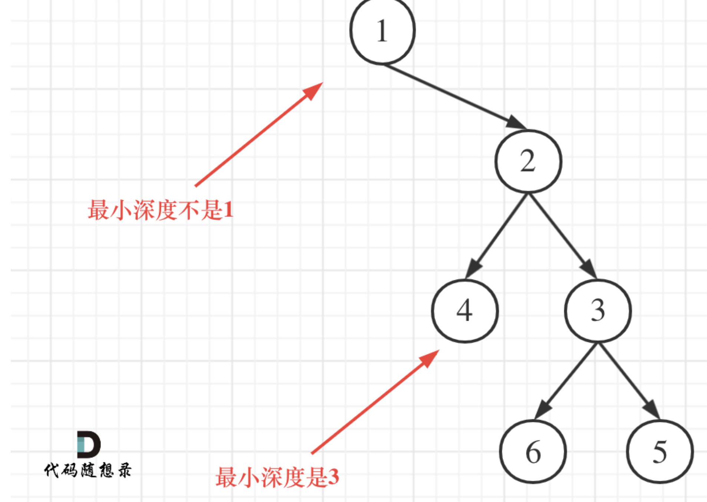

- 递归法

```cpp
int getDepth(TreeNode* node) {
    if (node == NULL) return 0;
    int leftDepth = getDepth(node->left);           // 左
    int rightDepth = getDepth(node->right);         // 右
                                                    // 中
    // 当一个左子树为空，右不为空，这时并不是最低点
    if (node->left == NULL && node->right != NULL) { 
        return 1 + rightDepth;
    }   
    // 当一个右子树为空，左不为空，这时并不是最低点
    if (node->left != NULL && node->right == NULL) { 
        return 1 + leftDepth;
    }
    int result = 1 + min(leftDepth, rightDepth);
    return result;
}

int minDepth(TreeNode* root) {
    return getDepth(root);
}
```

- 迭代法

```cpp
int minDepth(TreeNode* root) {
    if (root == NULL) return 0;
    int depth = 0;
    queue<TreeNode*> que;
    que.push(root);
    while(!que.empty()) {
        int size = que.size();
        depth++; // 记录最小深度
        for (int i = 0; i < size; i++) {
            TreeNode* node = que.front();
            que.pop();
            if (node->left) que.push(node->left);
            if (node->right) que.push(node->right);
            if (!node->left && !node->right) { // 当左右孩子都为空的时候，说明是最低点的一层了，退出
                return depth;
            }
        }
    }
    return depth;
}
```

## **完全二叉树的节点个数**

**在完全二叉树中，如果递归向左遍历的深度不等于递归向右遍历的深度，则说明不是满二叉树**
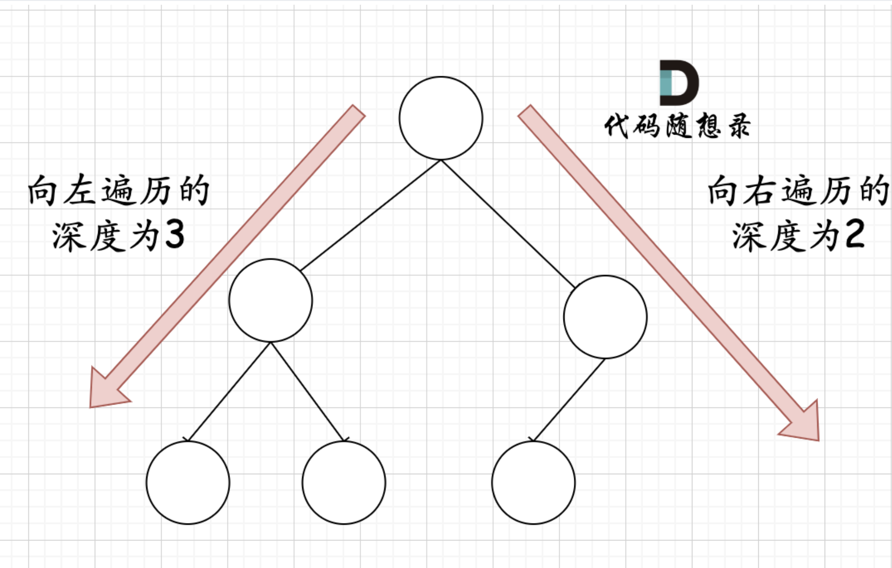

```cpp
int countNodes(TreeNode* root) {
    if(root == NULL) return 0;

    TreeNode* leftNode = root->left;
    TreeNode* rightNode = root->right;
    int leftDepth = 0, rightDepth = 0;

    while(leftNode) {
        leftDepth ++ ;
        leftNode = leftNode->left;
    }
    while(rightNode) {
        rightDepth ++ ;
        rightNode = rightNode->right;
    }

    if(leftDepth == rightDepth) {
        return (2 << leftDepth) - 1;
    }
    // 注意这里不是leftNode和rightNode，因为两个都已经变成了NULL
    return countNodes(root->left) + countNodes(root->right) + 1;
}
```

## **平衡二叉树**

- 一棵高度平衡二叉树定义为：一个二叉树**每个节点** 的左右两个子树的**高度差**的绝对值不超过**1**

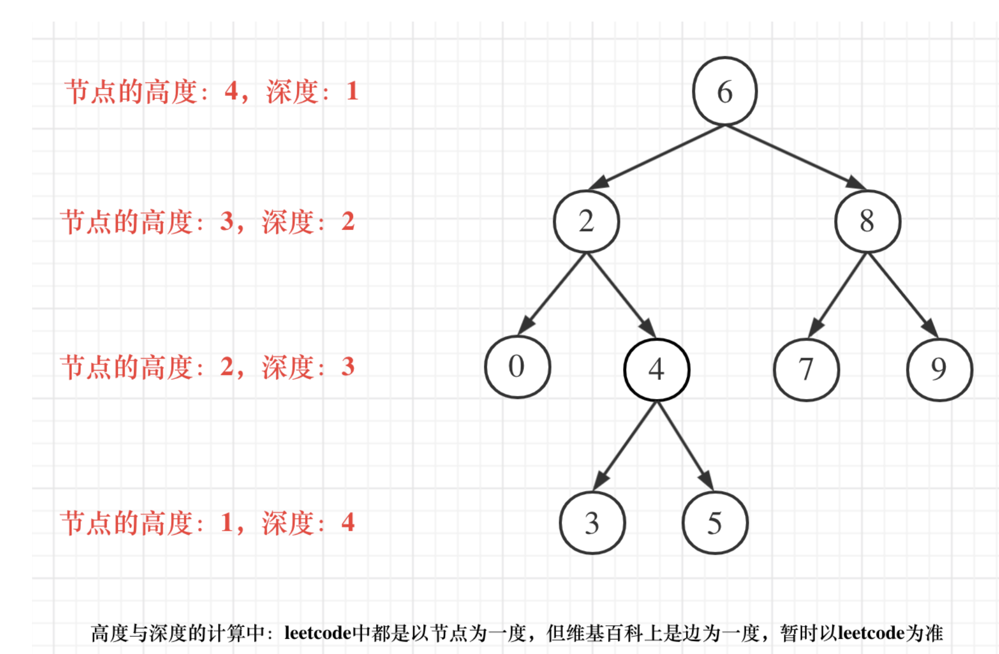

- **真正求深度的逻辑(最大深度):**

```cpp
int result;
void getDepth(TreeNode* node, int depth) {
    result = depth > result ? depth : result; // 中
    if (node->left == NULL && node->right == NULL) return ;                 
    if (node->left) { // 左
        getDepth(node->left, depth + 1);
    }
    if (node->right) { // 右
        getDepth(node->right, depth + 1);
    }
    return ;
}
int maxDepth(TreeNode* root) {
    result = 0;
    if (root == 0) return result;
    getDepth(root, 1);
    return result;
}
```

- 递归法：

```cpp
// 返回以该节点为根节点的二叉树的高度，如果不是平衡二叉树了则返回-1
int getHeight(TreeNode* node) {
    if (node == NULL) {
        return 0;
    }
    int leftHeight = getHeight(node->left);
    if (leftHeight == -1) return -1;
    int rightHeight = getHeight(node->right);
    if (rightHeight == -1) return -1;
    return abs(leftHeight - rightHeight) > 1 ? -1 : 1 + max(leftHeight, rightHeight);
}
bool isBalanced(TreeNode* root) {
    return getHeight(root) == -1 ? false : true;
}
```

- 迭代法：

```cpp
int getDepth(TreeNode* cur) {
    stack<TreeNode*> st;
    if (cur != NULL) st.push(cur);
    int depth = 0; // 记录深度
    int result = 0;
    while (!st.empty()) {
        TreeNode* node = st.top();
        if (node != NULL) {
            st.pop();
            st.push(node);                          // 中
            st.push(NULL);
            depth++;
            if (node->right) st.push(node->right);  // 右
            if (node->left) st.push(node->left);    // 左

        } else {
            st.pop();
            node = st.top();
            st.pop();
            depth--;
        }
        result = result > depth ? result : depth;
    }
    return result;
}

public:
    bool isBalanced(TreeNode* root) {
        stack<TreeNode*> st;
        if (root == NULL) return true;
        st.push(root);
        while (!st.empty()) {
            TreeNode* node = st.top();                       // 中
            st.pop();
            if (abs(getDepth(node->left) - getDepth(node->right)) > 1) {
                return false;
            }
            if (node->right) st.push(node->right);           // 右（空节点不入栈）
            if (node->left) st.push(node->left);             // 左（空节点不入栈）
        }
        return true;
    }
```

## **二叉树的所有路径**

- 递归法

```cpp
class Solution {
private:
    void traversal(TreeNode* cur, string path, vector<string>& result) {
        path += to_string(cur->val); // 中，中为什么写在这里，因为最后一个节点也要加入到path中
        if (cur->left == NULL && cur->right == NULL) {
            result.push_back(path);
            return;
        }
        if (cur->left) {
            path += "->";
            traversal(cur->left, path, result); // 左
            path.pop_back(); // 回溯 '>'
            path.pop_back(); // 回溯 '-'
        }
        if (cur->right) {
            path += "->";
            traversal(cur->right, path, result); // 右
            path.pop_back(); // 回溯'>'
            path.pop_back(); // 回溯 '-'
        }
    }

public:
    vector<string> binaryTreePaths(TreeNode* root) {
        vector<string> result;
        string path;
        if (root == NULL) return result;
        traversal(root, path, result);
        return result;

    }
};
```

- 迭代法：

```cpp
vector<string> binaryTreePaths(TreeNode* root) {
    stack<TreeNode*> treeSt;// 保存树的遍历节点
    stack<string> pathSt;   // 保存遍历路径的节点
    vector<string> result;  // 保存最终路径集合
    if (root == NULL) return result;
    treeSt.push(root);
    pathSt.push(to_string(root->val));
    while (!treeSt.empty()) {
        TreeNode* node = treeSt.top(); treeSt.pop(); // 取出节点 中
        string path = pathSt.top();pathSt.pop();    // 取出该节点对应的路径
        if (node->left == NULL && node->right == NULL) { // 遇到叶子节点
            result.push_back(path);
        }
        if (node->right) { // 右
            treeSt.push(node->right);
            pathSt.push(path + "->" + to_string(node->right->val));
        }
        if (node->left) { // 左
            treeSt.push(node->left);
            pathSt.push(path + "->" + to_string(node->left->val));
        }
    }
    return result;
}
```

## **求所有左叶子之和**

```cpp
iint sumOfLeftLeaves(TreeNode* root) {
    if(root == NULL) return 0;
    if(root->left == NULL && root->right == NULL) return 0;

    int leftVal;
    if(root->left && !root->left->left && !root->left->right) {
        leftVal = root->left->val;
    } else {
        leftVal = sumOfLeftLeaves(root->left);
    }
    int rightVal = sumOfLeftLeaves(root->right);

    int sum = leftVal + rightVal;
    return sum;
}
```

## **找树左下角的值**

```cpp
class Solution {
public:
    int maxDepth = 0;
    int result;
    void traversal(TreeNode* node, int depth) {
        if(node->left == NULL && node->right == NULL) {
            if(depth > maxDepth) {
                maxDepth = depth;
                result = node->val;
            }
        }
        if(node->left) {
            depth ++;
            traversal(node->left, depth);
            depth --;
        }
        if(node->right) {
            depth ++;
            traversal(node->right, depth);
            depth --;
        }
        return;
    }

    int findBottomLeftValue(TreeNode* root) {
        traversal(root, 1);
        return result;
    }
};
```

## **路径总和I(是否存在路径)**

```cpp
class Solution {
private:
    bool traversal(TreeNode* cur, int count) {
        if (!cur->left && !cur->right && count == 0) return true; // 遇到叶子节点，并且计数为0
        if (!cur->left && !cur->right) return false; // 遇到叶子节点直接返回

        if (cur->left) { // 左
            count -= cur->left->val; // 递归，处理节点;
            if (traversal(cur->left, count)) return true;
            count += cur->left->val; // 回溯，撤销处理结果
        }
        if (cur->right) { // 右
            count -= cur->right->val; // 递归，处理节点;
            if (traversal(cur->right, count)) return true;
            count += cur->right->val; // 回溯，撤销处理结果
        }
        return false;
    }

public:
    bool hasPathSum(TreeNode* root, int sum) {
        if (root == NULL) return false;
        return traversal(root, sum - root->val);
    }
```

## **从中序与后序遍历确定一棵二叉树**

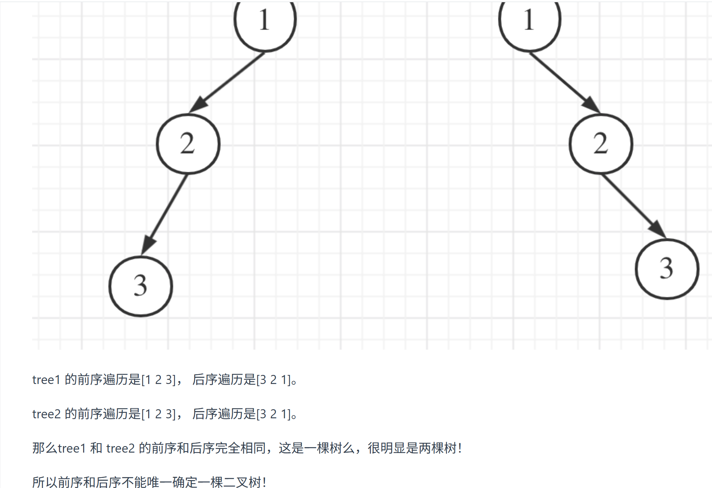

```cpp
class Solution {
private:
    TreeNode* traversal (vector<int>& inorder, vector<int>& postorder) {
        if (postorder.size() == 0) return NULL;

        // 后序遍历数组最后一个元素，就是当前的中间节点
        int rootValue = postorder[postorder.size() - 1];
        TreeNode* root = new TreeNode(rootValue);

        // 叶子节点
        if (postorder.size() == 1) return root;

        // 找到中序遍历的切割点
        int delimiterIndex;
        for (delimiterIndex = 0; delimiterIndex < inorder.size(); delimiterIndex++) {
            if (inorder[delimiterIndex] == rootValue) break;
        }

        // 切割中序数组
        // 左闭右开区间：[0, delimiterIndex)
        vector<int> leftInorder(inorder.begin(), inorder.begin() + delimiterIndex);
        // [delimiterIndex + 1, end)
        vector<int> rightInorder(inorder.begin() + delimiterIndex + 1, inorder.end() );

        // postorder 舍弃末尾元素
        postorder.resize(postorder.size() - 1);

        // 切割后序数组
        // 依然左闭右开，注意这里使用了左中序数组大小作为切割点
        // [0, leftInorder.size)
        vector<int> leftPostorder(postorder.begin(), postorder.begin() + leftInorder.size());
        // [leftInorder.size(), end)
        vector<int> rightPostorder(postorder.begin() + leftInorder.size(), postorder.end());

        root->left = traversal(leftInorder, leftPostorder);
        root->right = traversal(rightInorder, rightPostorder);

        return root;
    }
public:
    TreeNode* buildTree(vector<int>& inorder, vector<int>& postorder) {
        if (inorder.size() == 0 || postorder.size() == 0) return NULL;
        return traversal(inorder, postorder);
    }
};
```

## **最大二叉树**

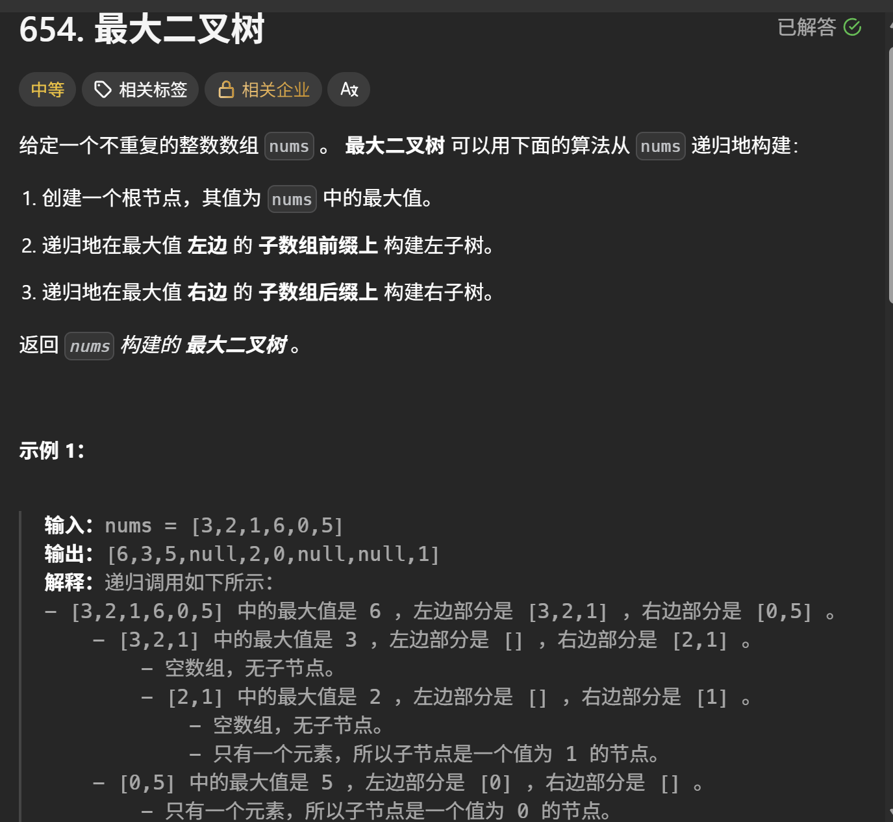

```cpp
class Solution {
private:
    // 在左闭右开区间[left, right)，构造二叉树
    TreeNode* traversal(vector<int>& nums, int left, int right) {
        if (left >= right) return nullptr;

        // 分割点下标：maxValueIndex
        int maxValueIndex = left;
        for (int i = left + 1; i < right; ++i) {
            if (nums[i] > nums[maxValueIndex]) maxValueIndex = i;
        }

        TreeNode* root = new TreeNode(nums[maxValueIndex]);

        // 左闭右开：[left, maxValueIndex)
        root->left = traversal(nums, left, maxValueIndex);

        // 左闭右开：[maxValueIndex + 1, right)
        root->right = traversal(nums, maxValueIndex + 1, right);

        return root;
    }
public:
    TreeNode* constructMaximumBinaryTree(vector<int>& nums) {
        return traversal(nums, 0, nums.size());
    }
};
```

## **合并二叉树**

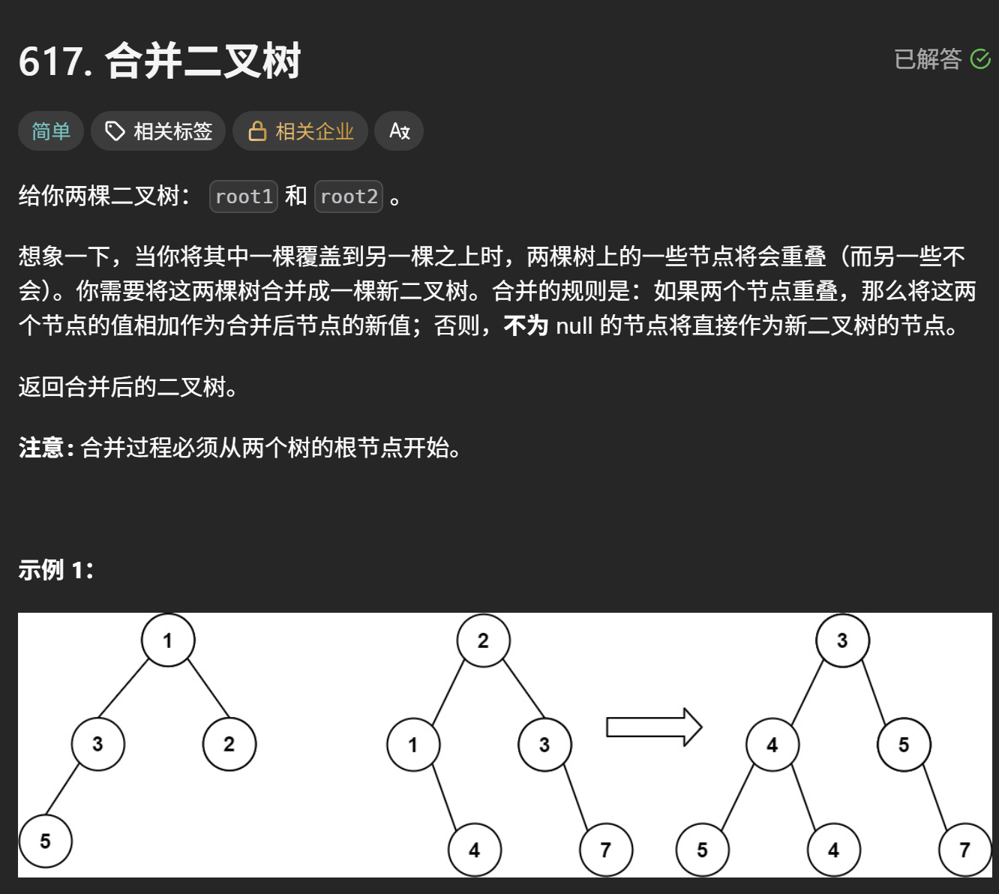

```cpp
TreeNode* mergeTrees(TreeNode* t1, TreeNode* t2) {
    if (t1 == NULL) return t2; // 如果t1为空，合并之后就应该是t2
    if (t2 == NULL) return t1; // 如果t2为空，合并之后就应该是t1
    // 修改了t1的数值和结构
    t1->val += t2->val;                             // 中
    t1->left = mergeTrees(t1->left, t2->left);      // 左
    t1->right = mergeTrees(t1->right, t2->right);   // 右
    return t1;
}
```

## **二叉搜索树的搜索**

- 递归法：

```cpp
TreeNode* searchBST(TreeNode* root, int val) {
    if (root == NULL || root->val == val) return root;
    TreeNode* result = NULL;
    if (root->val > val) result = searchBST(root->left, val);
    if (root->val < val) result = searchBST(root->right, val);
    return result;
}
```

- 迭代法: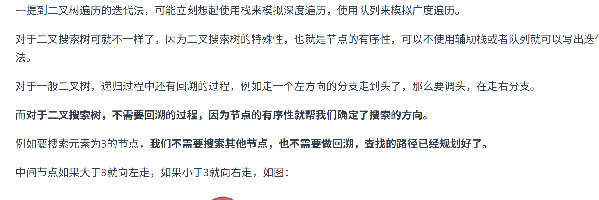

```cpp
TreeNode* searchBST(TreeNode* root, int val) {
    while (root != NULL) {
        if (root->val > val) root = root->left;
        else if (root->val < val) root = root->right;
        else return root;
    }
    return NULL;
}
```

## **验证二叉搜索树**

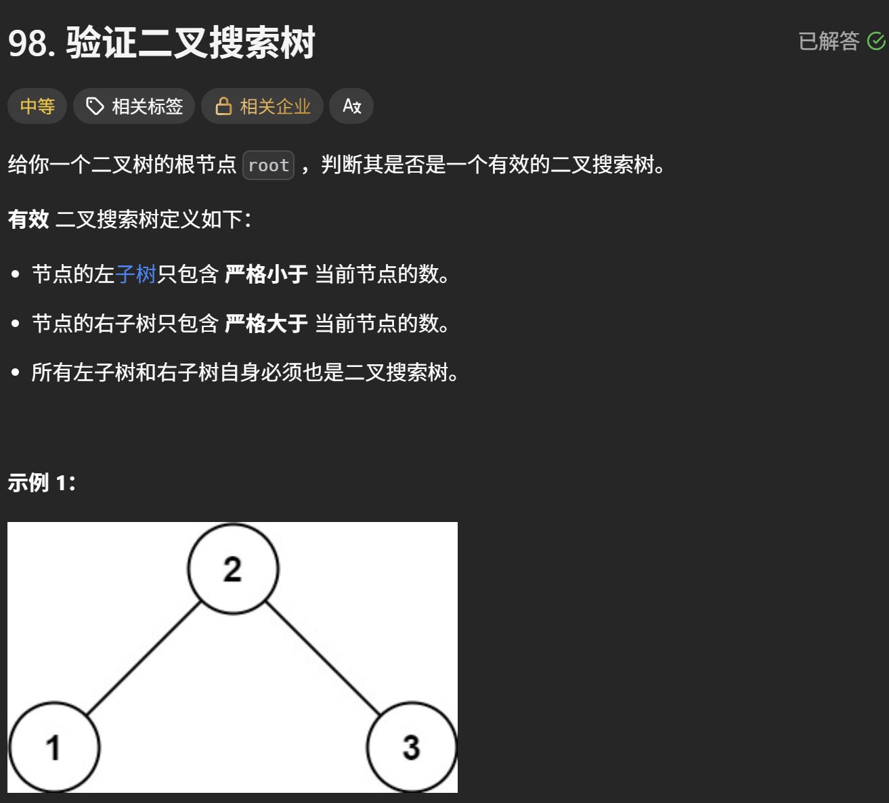

- **中序遍历节点，放进数组，判断是否严格单调**

```cpp
class Solution {
private:
    vector<int> vec;
    void traversal(TreeNode* root) {
        if (root == NULL) return;
        traversal(root->left);
        vec.push_back(root->val); // 将二叉搜索树转换为有序数组
        traversal(root->right);
    }
public:
    bool isValidBST(TreeNode* root) {
        vec.clear(); // 不加这句在leetcode上也可以过，但最好加上
        traversal(root);
        for (int i = 1; i < vec.size(); i++) {
            // 注意要小于等于，搜索树里不能有相同元素
            if (vec[i] <= vec[i - 1]) return false;
        }
        return true;
    }
};
```

- **全局变量记录当前最大值**

```cpp
class Solution {
public:
    long long maxVal = LONG_MIN; // 因为后台测试数据中有int最小值
    bool isValidBST(TreeNode* root) {
        if (root == NULL) return true;

        bool left = isValidBST(root->left);
        // 中序遍历，验证遍历的元素是不是从小到大
        if (maxVal < root->val) maxVal = root->val;
        else return false;
        bool right = isValidBST(root->right);

        return left && right;
    }
};
```

- **用pre记录上一个节点**

```cpp
class Solution {
public:
    TreeNode* pre = NULL; // 用来记录前一个节点
    bool isValidBST(TreeNode* root) {
        if (root == NULL) return true;
        bool left = isValidBST(root->left);

        if (pre != NULL && pre->val >= root->val) return false;
        pre = root; // 记录前一个节点

        bool right = isValidBST(root->right);
        return left && right;
    }
};
```

## **二叉搜索树的绝对差**

```cpp
class Solution {
private:
int result = INT_MAX;
TreeNode* pre = NULL;
void traversal(TreeNode* cur) {
    if (cur == NULL) return;
    traversal(cur->left);   // 左
    if (pre != NULL){       // 中
        result = min(result, cur->val - pre->val);
    }
    pre = cur; // 记录前一个
    traversal(cur->right);  // 右
}
public:
    int getMinimumDifference(TreeNode* root) {
        traversal(root);
        return result;
    }
};
```

## **二叉搜索树的众数**

- 如果没有二叉搜索树的条件:

```cpp
class Solution {
private:

void searchBST(TreeNode* cur, unordered_map<int, int>& map) { // 前序遍历
    if (cur == NULL) return ;
    map[cur->val]++; // 统计元素频率
    searchBST(cur->left, map);
    searchBST(cur->right, map);
    return ;
}
bool static cmp (const pair<int, int>& a, const pair<int, int>& b) {
    return a.second > b.second;
}
public:
    vector<int> findMode(TreeNode* root) {
        unordered_map<int, int> map; // key:元素，value:出现频率
        vector<int> result;

        if (root == NULL) return result;
        searchBST(root, map);
        // map 转换成vector，因为无法根据value来排序map
        vector<pair<int, int>> vec(map.begin(), map.end());
        sort(vec.begin(), vec.end(), cmp); // 给频率排个序

        result.push_back(vec[0].first);
        for (int i = 1; i < vec.size(); i++) {
            // 取最高的放到result数组中
            if (vec[i].second == vec[0].second) result.push_back(vec[i].first);
            else break;
        }

        return result;
    }
};
```

- 如果是二叉搜索树：

```cpp
class Solution {
private:
    int maxCount = 0; // 最大频率
    int count = 0; // 统计频率
    TreeNode* pre = NULL;
    vector<int> result;
    void searchBST(TreeNode* cur) {
        if (cur == NULL) return ;

        searchBST(cur->left);       // 左
                                    // 中
        if (pre == NULL) { // 第一个节点
            count = 1;
        } else if (pre->val == cur->val) { // 与前一个节点数值相同
            count++;
        } else { // 与前一个节点数值不同
            count = 1;
        }
        pre = cur; // 更新上一个节点

        if (count == maxCount) { // 如果和最大值相同，放进result中
            result.push_back(cur->val);
        }

        if (count > maxCount) { // 如果计数大于最大值频率
            maxCount = count;   // 更新最大频率
            result.clear();     // 很关键的一步，不要忘记清空result，之前result里的元素都失效了
            result.push_back(cur->val);
        }

        searchBST(cur->right);      // 右
        return ;
    }

public:
    vector<int> findMode(TreeNode* root) {
        count = 0;
        maxCount = 0;
        pre = NULL; // 记录前一个节点
        result.clear();

        searchBST(root);
        return result;
    }
};
```

## **二叉树的最近公共祖先**

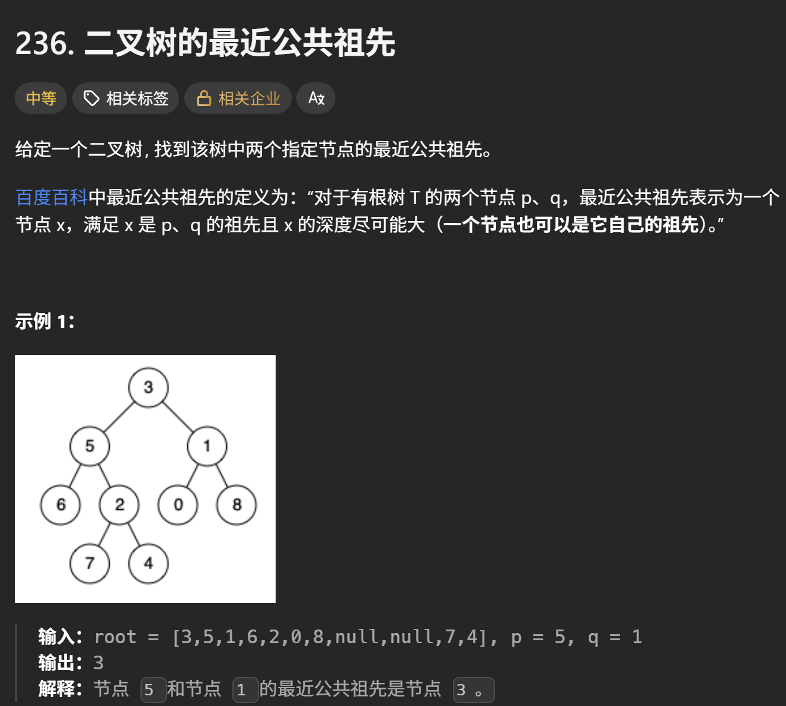

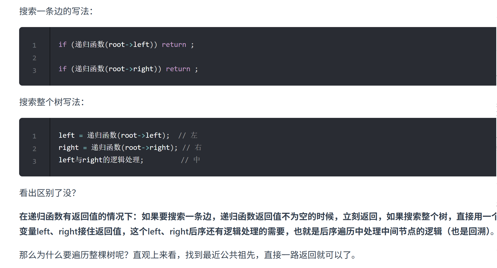

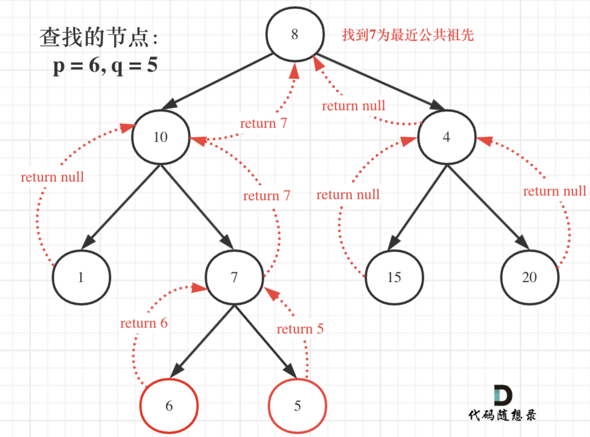

- 普通二叉树没有顺序关系
- 无法确定p和q在哪个子树
- 需要遍历搜索整棵树才能找到p和q的位置

```cpp
TreeNode* lowestCommonAncestor(TreeNode* root, TreeNode* p, TreeNode* q) {
    if (root == q || root == p || root == NULL) return root;
    TreeNode* left = lowestCommonAncestor(root->left, p, q);
    TreeNode* right = lowestCommonAncestor(root->right, p, q);
    if (left != NULL && right != NULL) return root;

    if (left == NULL && right != NULL) return right;
    else if (left != NULL && right == NULL) return left;
    else  { //  (left == NULL && right == NULL)
        return NULL;
    }

}
```

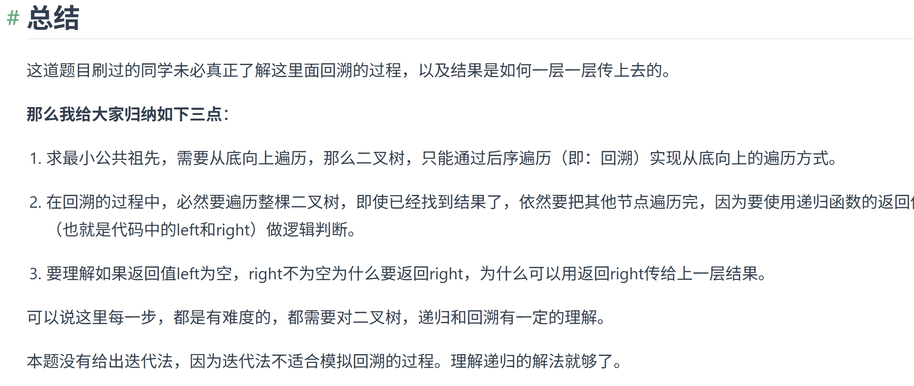
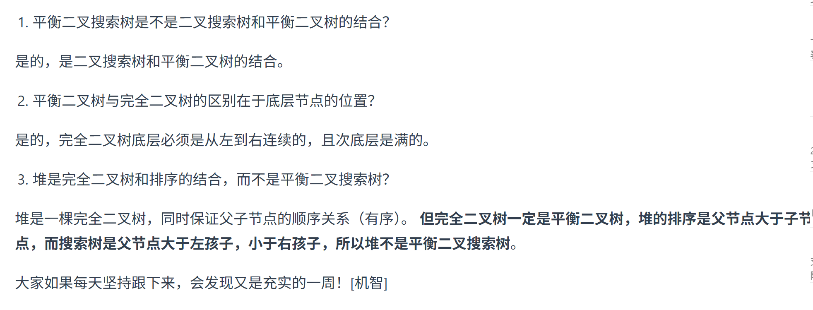

## **二叉搜索树的最近公共祖先**

- BST有明确的大小顺序：左子树所有节点 < 根节点 < 右子树所有节点
- 我们可以根据节点值的大小，直接确定搜索方向
- 不需要回溯，因为路径是确定的

- 递归法：

```cpp
TreeNode* lowestCommonAncestor(TreeNode* root, TreeNode* p, TreeNode* q) {
    if(root == NULL) return root;

    if(root->val > p->val && root->val > q->val) {
        TreeNode* left = lowestCommonAncestor(root->left, p, q);
        if(left) return left;
    }
    if(root->val < p->val && root->val < q->val) {
        TreeNode* right = lowestCommonAncestor(root->right, p, q);
        if(right) return right;
    }

    return root;
}
```

- 迭代法：

```cpp
TreeNode* lowestCommonAncestor(TreeNode* root, TreeNode* p, TreeNode* q) {
    while(root) {
        if (root->val > p->val && root->val > q->val) {
            root = root->left;
        } else if (root->val < p->val && root->val < q->val) {
            root = root->right;
        } else return root;
    }
    return NULL;
}
```

## **二叉搜索树中的插入操作**

```cpp
 TreeNode* insertIntoBST(TreeNode* root, int val) {
    if (root == NULL) {
        TreeNode* node = new TreeNode(val);
        return node;
    }
    TreeNode* cur = root;
    TreeNode* parent = root; // 这个很重要，需要记录上一个节点，否则无法赋值新节点
    while (cur != NULL) {
        parent = cur;
        if (cur->val > val) cur = cur->left;
        else cur = cur->right;
    }
    TreeNode* node = new TreeNode(val);
    if (val < parent->val) parent->left = node;// 此时是用parent节点的进行赋值
    else parent->right = node;
    return root;
}
```

## **二叉搜索树的删除操作**

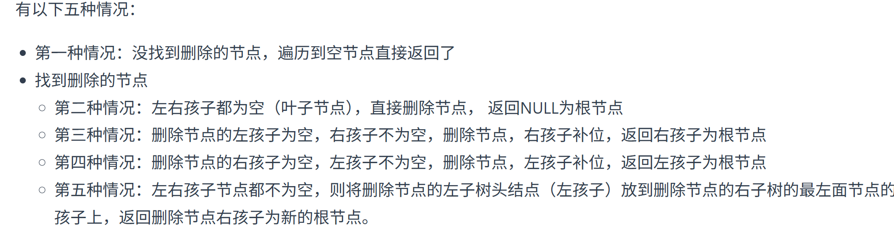

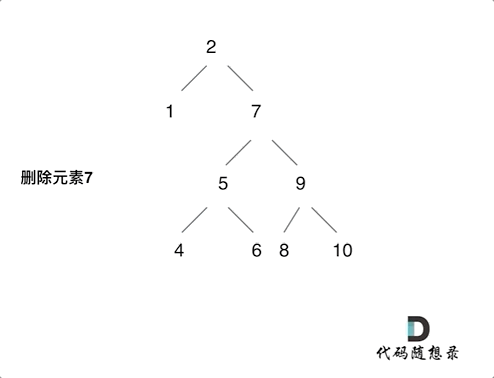

- 递归法：

```cpp
TreeNode* deleteNode(TreeNode* root, int key) {
    if (root == nullptr) return root; // 第一种情况：没找到删除的节点，遍历到空节点直接返回了
    if (root->val == key) {
        // 第二种情况：左右孩子都为空（叶子节点），直接删除节点， 返回NULL为根节点
        if (root->left == nullptr && root->right == nullptr) {
            ///! 内存释放
            delete root;
            return nullptr;
        }
        // 第三种情况：其左孩子为空，右孩子不为空，删除节点，右孩子补位 ，返回右孩子为根节点
        else if (root->left == nullptr) {
            TreeNode* tmp = root;   
            root = root->right;     
            delete tmp;             
            return root;
        }
        // 第四种情况：其右孩子为空，左孩子不为空，删除节点，左孩子补位，返回左孩子为根节点
        else if (root->right == nullptr) {
            TreeNode* tmp = root;   
            root = root->left;     
            delete tmp;             
            return root;
        }
        // 第五种情况：左右孩子节点都不为空，则将删除节点的左子树放到删除节点的右子树的最左面节点的左孩子的位置
        // 并返回删除节点右孩子为新的根节点。
        else {
            TreeNode* cur = root->right; // 找右子树最左面的节点
            while(cur->left != nullptr) {
                cur = cur->left;
            }
            cur->left = root->left; // 把要删除的节点（root）左子树放在cur的左孩子的位置
            TreeNode* tmp = root;   // 把root节点保存一下，下面来删除
            root = root->right;     // 返回旧root的右孩子作为新root
            delete tmp;             // 释放节点内存（这里不写也可以，但C++最好手动释放一下吧）
            return root;
        }
    }
    // 这里相当于把新的节点返回给上一层，上一层就要用 root->left 或者 root->right接住
    if (root->val > key) root->left = deleteNode(root->left, key);
    if (root->val < key) root->right = deleteNode(root->right, key);
    return root;
}
```

- 迭代法：

```cpp
class Solution {
private:
    // 将目标节点（删除节点）的左子树放到 目标节点的右子树的最左面节点的左孩子位置上
    // 并返回目标节点右孩子为新的根节点
    // 是动画里模拟的过程
    TreeNode* deleteOneNode(TreeNode* target) {
        if (target == nullptr) return target;
        if (target->right == nullptr) return target->left;
        TreeNode* cur = target->right;
        while (cur->left) {
            cur = cur->left;
        }
        cur->left = target->left;
        return target->right;
    }
public:
    TreeNode* deleteNode(TreeNode* root, int key) {
        if (root == nullptr) return root;
        TreeNode* cur = root;
        TreeNode* pre = nullptr; // 记录cur的父节点，用来删除cur
        while (cur) {
            if (cur->val == key) break;
            pre = cur;
            if (cur->val > key) cur = cur->left;
            else cur = cur->right;
        }
        if (pre == nullptr) { // 如果搜索树只有头结点
            return deleteOneNode(cur);
        }
        // pre 要知道是删左孩子还是右孩子
        if (pre->left && pre->left->val == key) {
            pre->left = deleteOneNode(cur);
        }
        if (pre->right && pre->right->val == key) {
            pre->right = deleteOneNode(cur);
        }
        return root;
    }
};
```

## **修剪二叉搜索树**

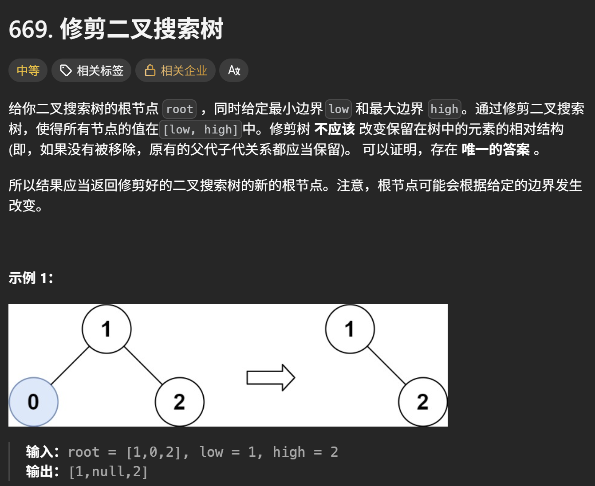

```cpp
TreeNode* trimBST(TreeNode* root, int low, int high) {
    if (root == nullptr ) return nullptr;
    if (root->val < low) {
        TreeNode* right = trimBST(root->right, low, high); // 寻找符合区间[low, high]的节点
        return right;
    }
    if (root->val > high) {
        TreeNode* left = trimBST(root->left, low, high); // 寻找符合区间[low, high]的节点
        return left;
    }
    root->left = trimBST(root->left, low, high); // root->left接入符合条件的左孩子
    root->right = trimBST(root->right, low, high); // root->right接入符合条件的右孩子
    return root;
}
```

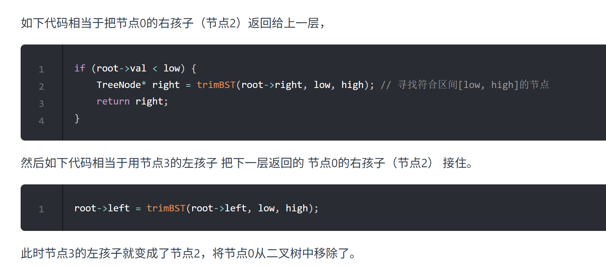

## **将有序数组转换为二叉搜索树**

- 思路：找出分割点(中间点)，递归左右区间

```cpp
class Solution {
private:
    TreeNode* traversal(vector<int>& nums, int left, int right) {
        if (left > right) return nullptr;
        int mid = left + ((right - left) / 2);
        TreeNode* root = new TreeNode(nums[mid]);
        root->left = traversal(nums, left, mid - 1);
        root->right = traversal(nums, mid + 1, right);
        return root;
    }
public:
    TreeNode* sortedArrayToBST(vector<int>& nums) {
        TreeNode* root = traversal(nums, 0, nums.size() - 1);
        return root;
    }
};
```

## **把二叉搜索树转换为累加树**

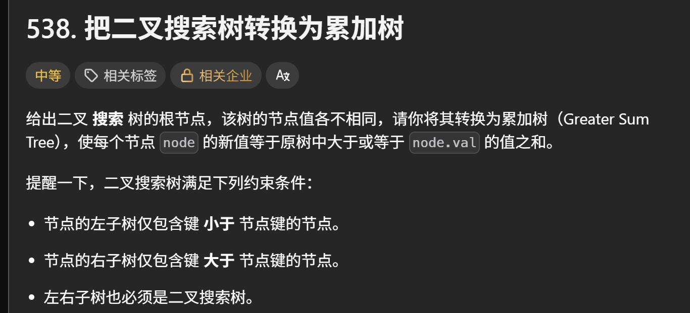

- 思路：**反中序遍历**，因为这样用pre指针记录累加值时可以使pre从0递增

- 递归法：

```cpp
class Solution {
private:
    int pre = 0; // 记录前一个节点的数值
    void traversal(TreeNode* cur) { // 右中左遍历
        if (cur == NULL) return;
        traversal(cur->right);
        cur->val += pre;
        pre = cur->val;
        traversal(cur->left);
    }
public:
    TreeNode* convertBST(TreeNode* root) {
        pre = 0;
        traversal(root);
        return root;
    }
};
```

### 迭代法(中序遍历的统一迭代法)

```cpp
class Solution {
private:
    int pre; // 记录前一个节点的数值
    void traversal(TreeNode* root) {
        stack<TreeNode*> st;
        TreeNode* cur = root;
        while (cur != NULL || !st.empty()) {
            if (cur != NULL) {
                st.push(cur);
                cur = cur->right;   // 右
            } else {
                cur = st.top();     // 中
                st.pop();
                cur->val += pre;
                pre = cur->val;
                cur = cur->left;    // 左
            }
        }
    }
public:
    TreeNode* convertBST(TreeNode* root) {
        pre = 0;
        traversal(root);
        return root;
    }
};
```
