# **动态规划**

## **解题步骤**

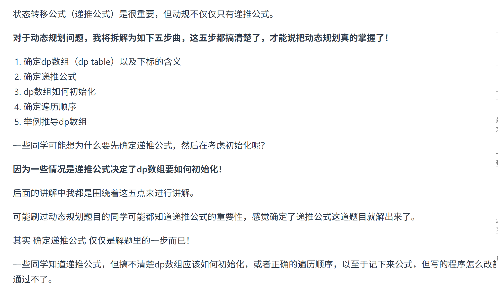

## **使用最小花费爬梯**

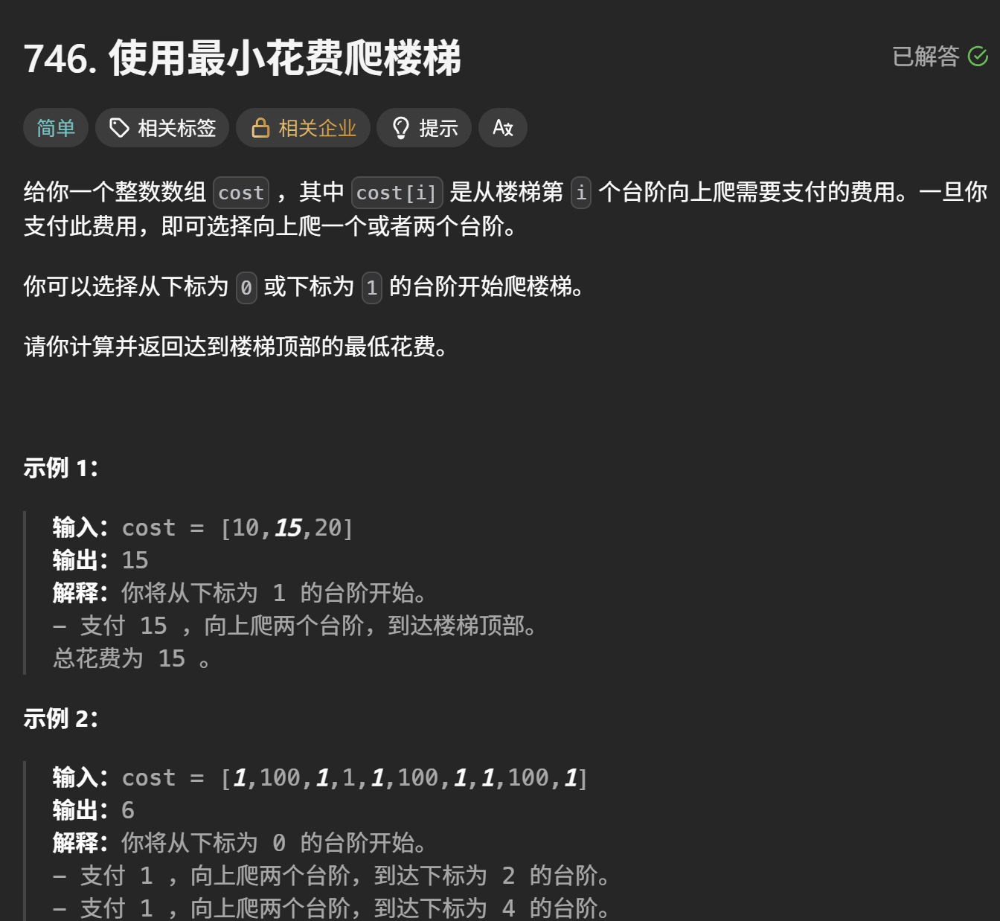

```cpp
// dp[i]的定义：到达第i台阶所花费的最少体力为dp[i]
int minCostClimbingStairs(vector<int>& cost) {
        vector<int> dp(cost.size() + 1);
        dp[0] = 0;
        dp[1] = 0;
        for(int i = 2; i <= cost.size(); i ++) {
            dp[i] = min(dp[i - 1] + cost[i - 1], dp[i - 2] + cost[i - 2]);
        }
        return dp[cost.size()];
    }
```

## **不同路径**

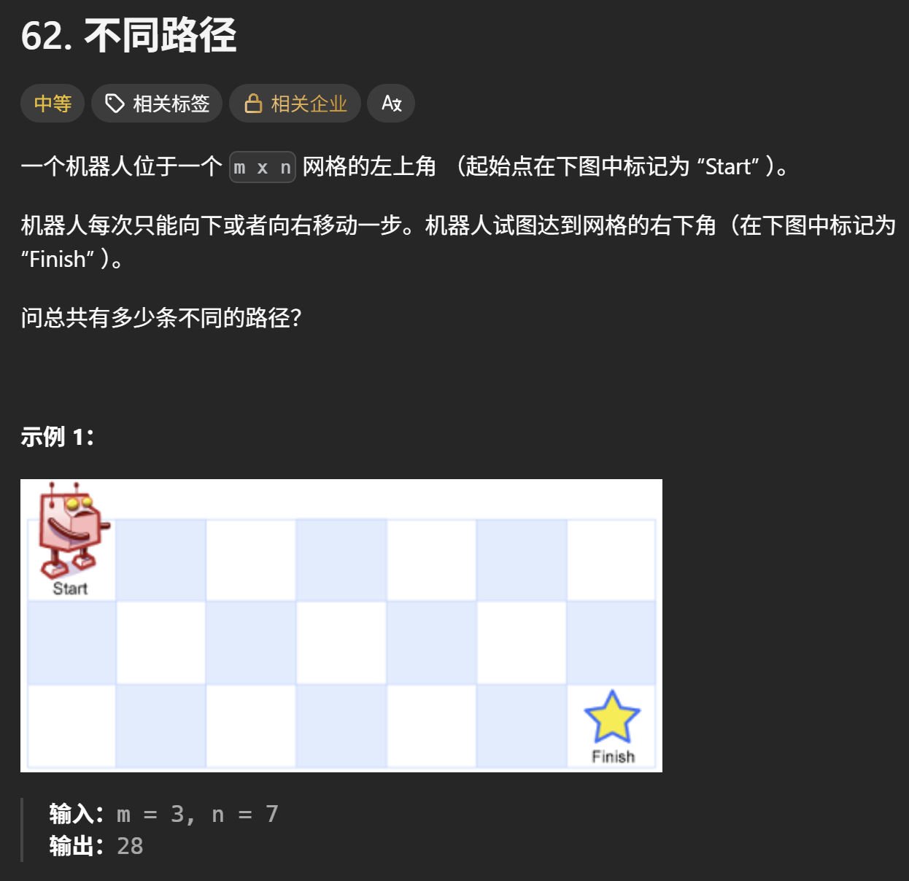

- 深搜

```cpp
class Solution {
private:
    int dfs(int i, int j, int m, int n) {
        if (i > m || j > n) return 0; // 越界了
        if (i == m && j == n) return 1; // 找到一种方法，相当于找到了叶子节点
        return dfs(i + 1, j, m, n) + dfs(i, j + 1, m, n);
    }
public:
    int uniquePaths(int m, int n) {
        return dfs(1, 1, m, n);
    }
};
```

- dp数组

```cpp
int uniquePaths(int m, int n) {
        vector<vector<int>> dp(m, vector<int>(n, 0));
        for(int i = 0; i < m; i ++) {
            dp[i][0] = 1; 
            // 是 1 不是 i 是因为要求的是有多少条路最左边的都只有1条
        }
        for(int j = 0; j < n; j ++) {
            dp[0][j] = 1;
        }
        for(int i = 1; i < m; i ++) {
            for(int j = 1; j < n; j ++) {
                dp[i][j] = dp[i - 1][j] + dp[i][j -1];
            }
        }
        return dp[m - 1][n - 1];
    }
```

- 数论方法: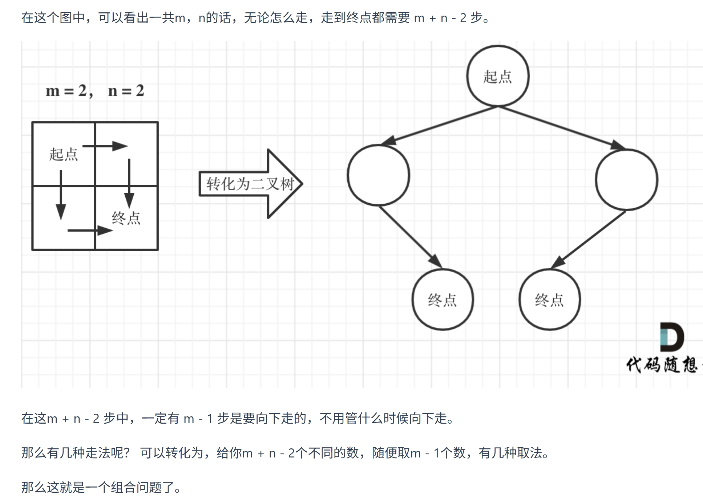

```cpp
// 求组合的时候，要防止两个int相乘溢出！
// 所以不能把算式的分子都算出来，分母都算出来再做除法
int uniquePaths(int m, int n) {
    long long numerator = 1; // 分子
    int denominator = m - 1; // 分母
    int count = m - 1;
    int t = m + n - 2;
    while (count--) {
        numerator *= (t--);
        while (denominator != 0 && numerator % denominator == 0) {
            numerator /= denominator;
            denominator--;
        }
    }
    return numerator;
}
```

## **有障碍的不同路径**

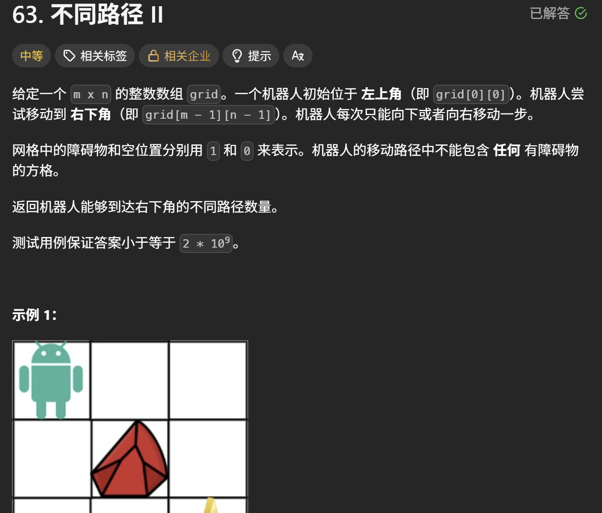

```cpp
// 将dp数组全都初始化为0
// 横竖第一排没有障碍才初始化为1
// 某个点是障碍记得跳过重新赋值
int uniquePathsWithObstacles(vector<vector<int>>& obstacleGrid) {
    int m = obstacleGrid.size();
    int n = obstacleGrid[0].size();
    if (obstacleGrid[m - 1][n - 1] == 1 || obstacleGrid[0][0] == 1) //如果在起点或终点出现了障碍，直接返回0
        return 0;
    vector<vector<int>> dp(m, vector<int>(n, 0));
    for (int i = 0; i < m && obstacleGrid[i][0] == 0; i++) dp[i][0] = 1;
    for (int j = 0; j < n && obstacleGrid[0][j] == 0; j++) dp[0][j] = 1;
    for (int i = 1; i < m; i++) {
        for (int j = 1; j < n; j++) {
            if (obstacleGrid[i][j] == 1) continue;
            dp[i][j] = dp[i - 1][j] + dp[i][j - 1];
        }
    }
    return dp[m - 1][n - 1];
}
```

## **整数拆分**

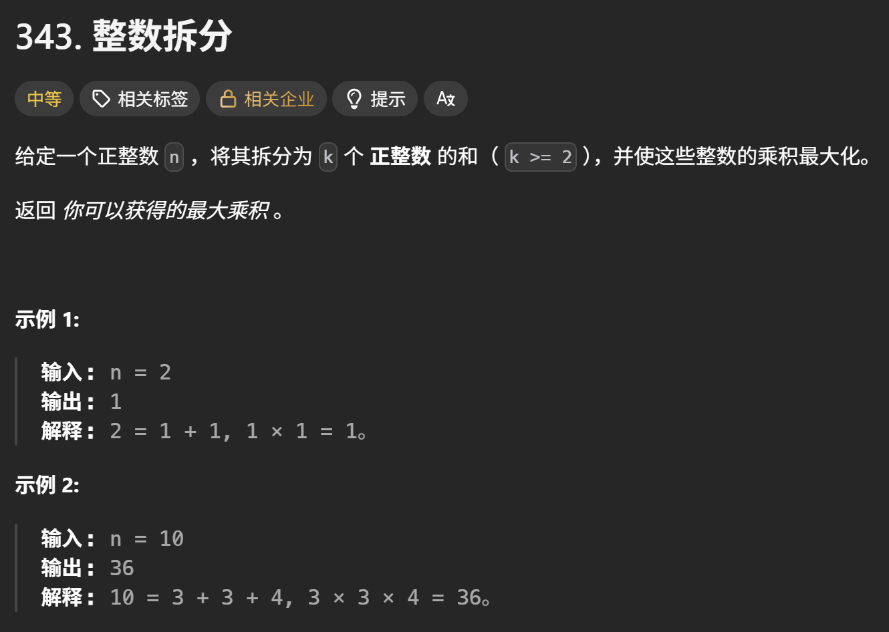

- **dp[i]：分拆数字i，可以得到的最大乘积为dp[i]**
- 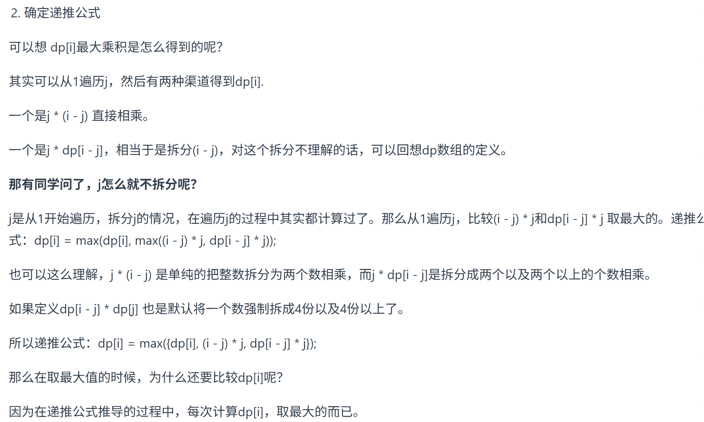
- 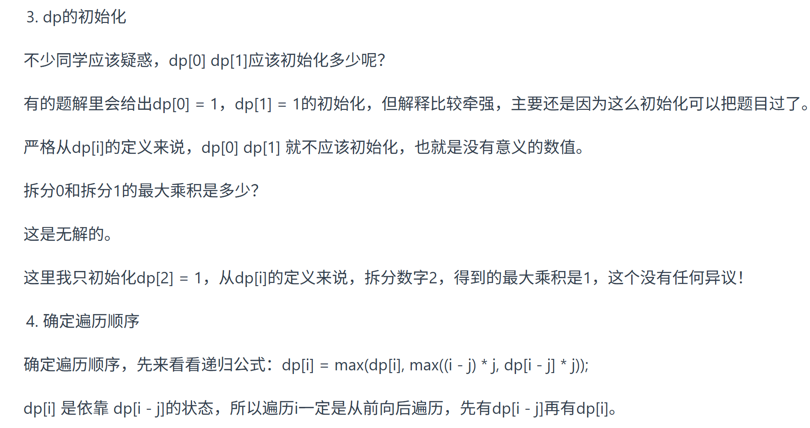
- 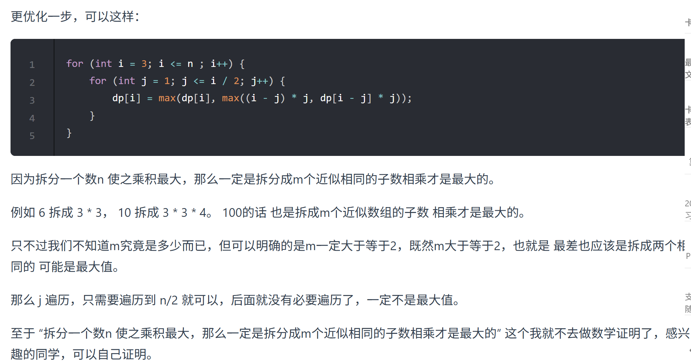

```cpp
int integerBreak(int n) {
    vector<int> dp(n + 1);
    dp[2] = 1;
    for (int i = 3; i <= n ; i++) {
        for (int j = 1; j <= i / 2; j++) {
            dp[i] = max(dp[i], max((i - j) * j, dp[i - j] * j));
        }
    }
    return dp[n];
}
```

## **不同的二叉搜索树**

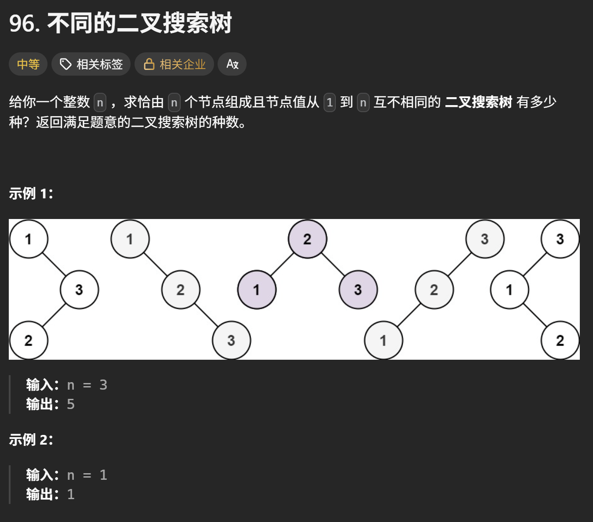

- 思路：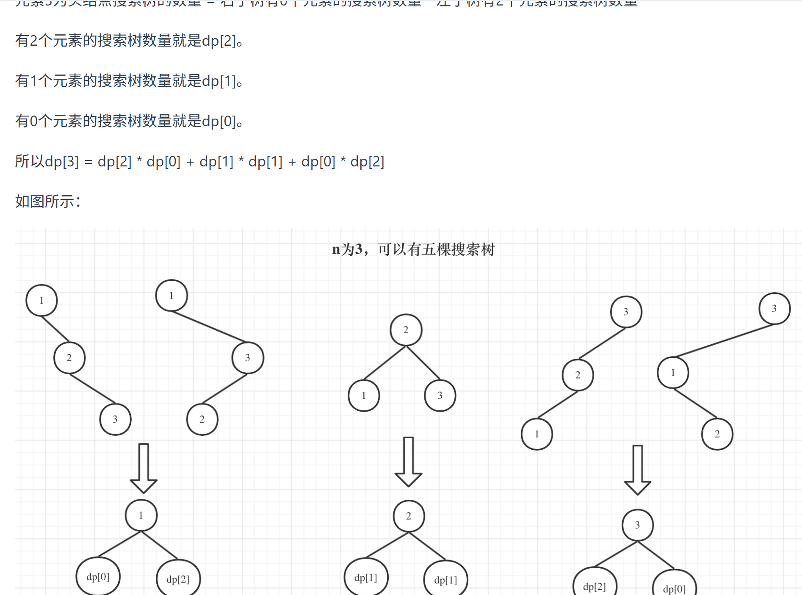
- **dp[i] ： 1到i为节点组成的二叉搜索树的个数为dp[i]**

```cpp
int numTrees(int n) {
    vector<int> dp(n + 1);
    dp[0] = 1;
    for (int i = 1; i <= n; i++) {
        for (int j = 1; j <= i; j++) {
            dp[i] += dp[j - 1] * dp[i - j];
        }
    }
    return dp[n];
}
```

## **01背包**

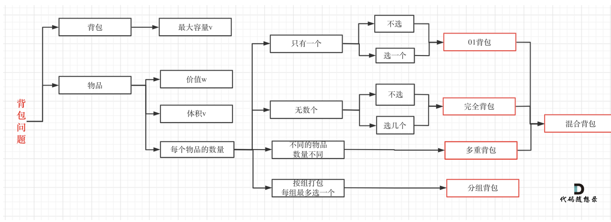

- 问题：有n件物品和一个最多能背重量为w 的背包。第i件物品的重量是weight[i]，得到的价值是value[i] 。每件物品只能用一次，求解将哪些物品装入背包里物品价值总和最大
- 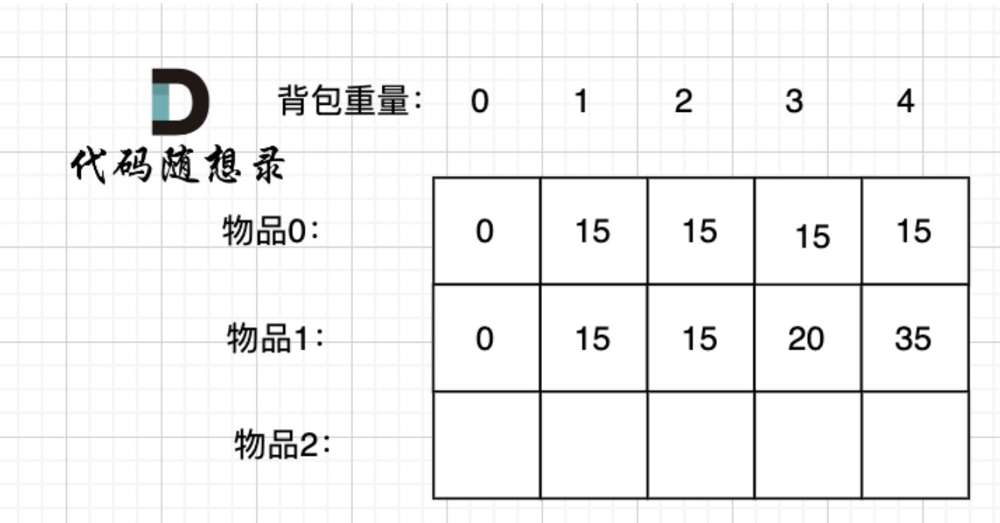
- **dp[i] [j] 表示从下标为[0-i]的物品里任意取，放进容量为j的背包，价值总和最大是多少**
- 递推公式：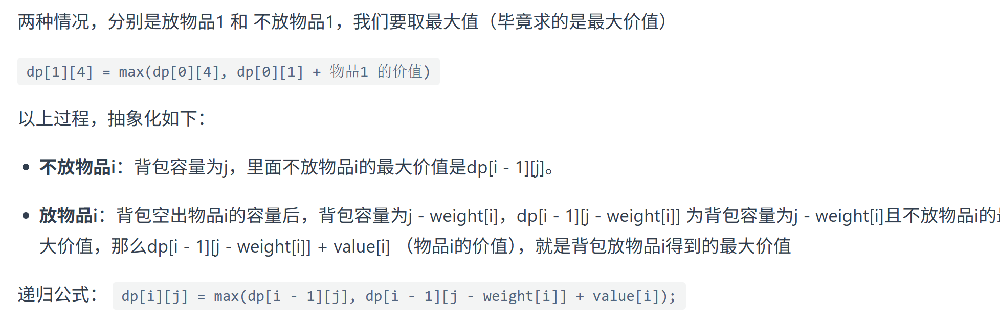

```cpp
int main() {
    int n, bagweight;// bagweight代表行李箱空间

    cin >> n >> bagweight;

    vector<int> weight(n, 0); // 存储每件物品所占空间
    vector<int> value(n, 0);  // 存储每件物品价值

    for(int i = 0; i < n; ++i) {
        cin >> weight[i];
    }
    for(int j = 0; j < n; ++j) {
        cin >> value[j];
    }
    // dp数组, dp[i][j]代表行李箱空间为j的情况下,从下标为[0, i]的物品里面任意取,能达到的最大价值
    vector<vector<int>> dp(weight.size(), vector<int>(bagweight + 1, 0));

    // 初始化, 因为需要用到dp[i - 1]的值
    // j < weight[0]已在上方被初始化为0
    // j >= weight[0]的值就初始化为value[0]
    for (int j = weight[0]; j <= bagweight; j++) {
        dp[0][j] = value[0];
    }

    for(int i = 1; i < weight.size(); i++) { // 遍历科研物品
        for(int j = 0; j <= bagweight; j++) { // 遍历行李箱容量
            if (j < weight[i]) dp[i][j] = dp[i - 1][j]; // 如果装不下这个物品,那么就继承dp[i - 1][j]的值
            else {
                dp[i][j] = max(dp[i - 1][j], dp[i - 1][j - weight[i]] + value[i]);
            }
        }
    }
    cout << dp[n - 1][bagweight] << endl;

    return 0;
}
```

- **滚动数组解法**: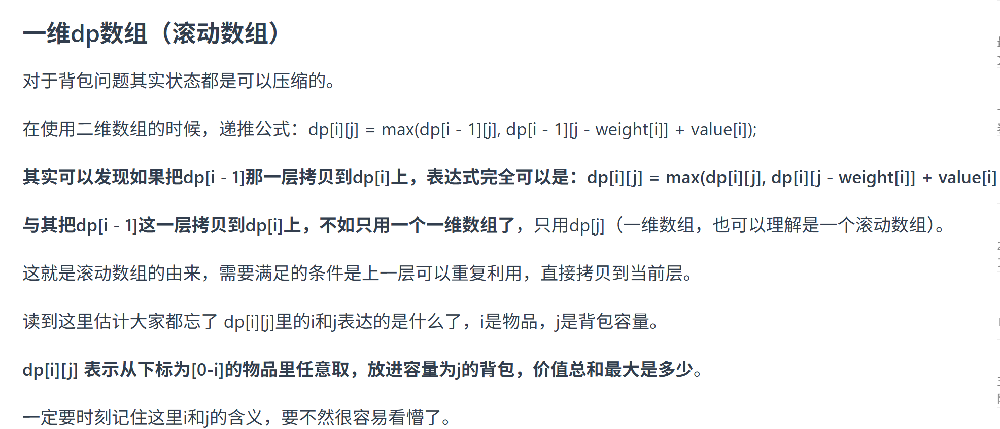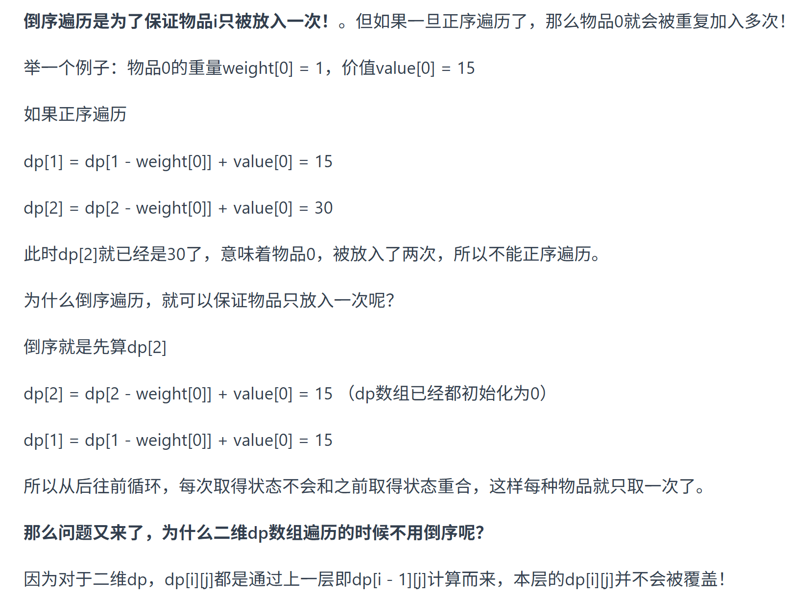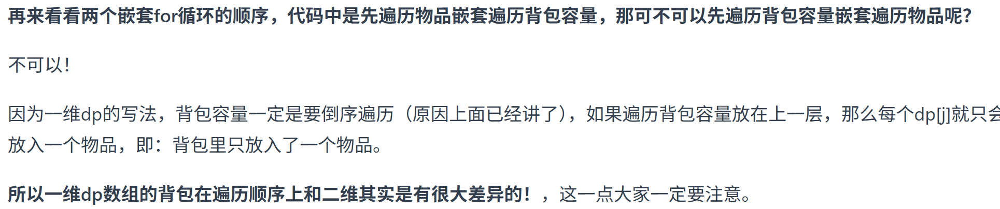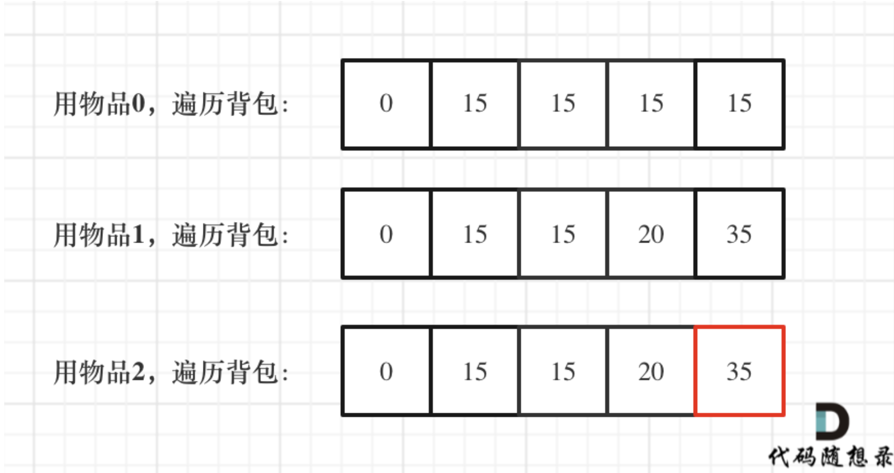

```cpp
// 外层循环遍历每个类型的研究材料
for (int i = 0; i < M; ++i) {
    // 内层循环从 N 空间逐渐减少到当前研究材料所占空间
    for (int j = N; j >= costs[i]; --j) {
        // 考虑当前研究材料选择和不选择的情况，选择最大值
        dp[j] = max(dp[j], dp[j - costs[i]] + values[i]);
    }
}
```

## **分割等和子集**

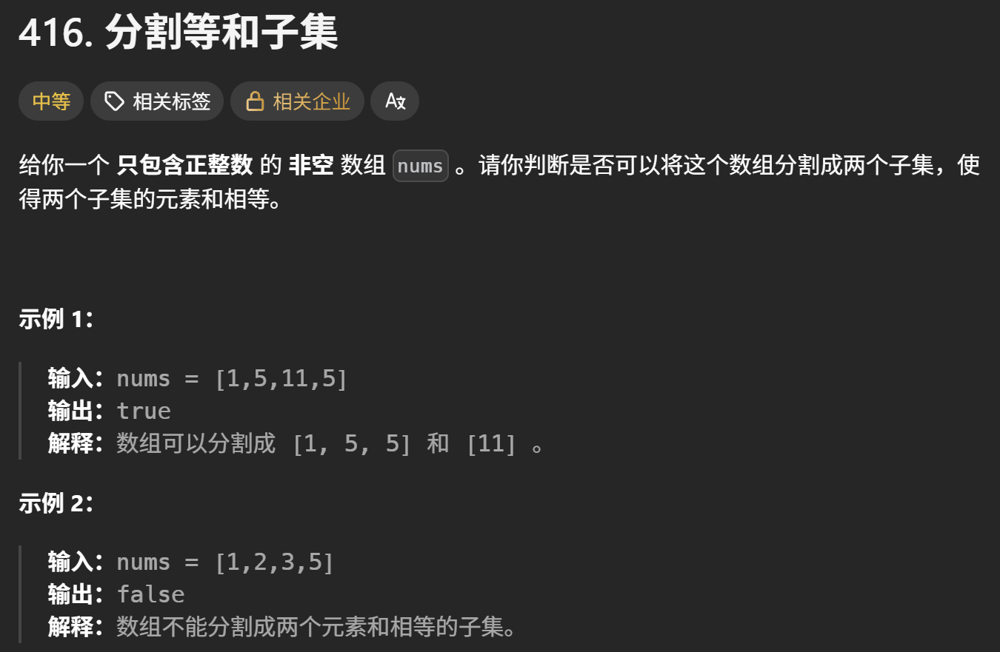

- 思路：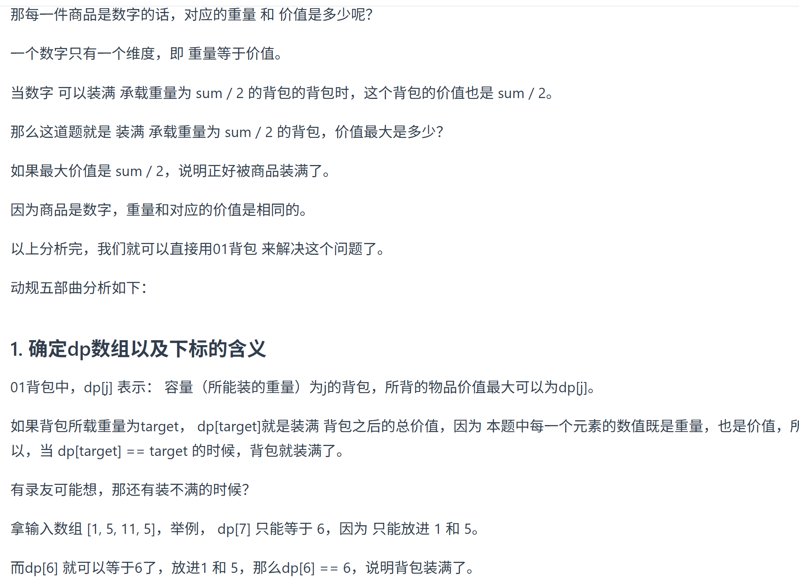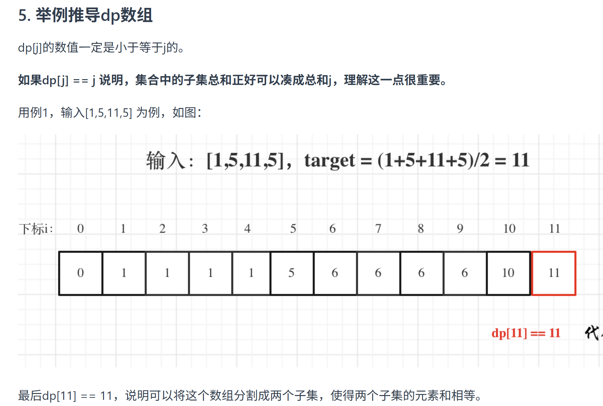

```cpp
bool canPartition(vector<int>& nums) {
    int sum = 0;

    // dp[i]中的i表示背包内总和
    // 题目中说：每个数组中的元素不会超过 100，数组的大小不会超过 200
    // 总和不会大于20000，背包最大只需要其中一半，所以10001大小就可以了
    vector<int> dp(10001, 0);
    for (int i = 0; i < nums.size(); i++) {
        sum += nums[i];
    }
    // 也可以使用库函数一步求和
    // int sum = accumulate(nums.begin(), nums.end(), 0);
    if (sum % 2 == 1) return false;
    int target = sum / 2;

    // 开始 01背包
    for(int i = 0; i < nums.size(); i++) {
        for(int j = target; j >= nums[i]; j--) { // 每一个元素一定是不可重复放入，所以从大到小遍历
            dp[j] = max(dp[j], dp[j - nums[i]] + nums[i]);
        }
    }
    // 集合中的元素正好可以凑成总和target
    if (dp[target] == target) return true;
    return false;
}
```

## **最后一块石头的重量II**

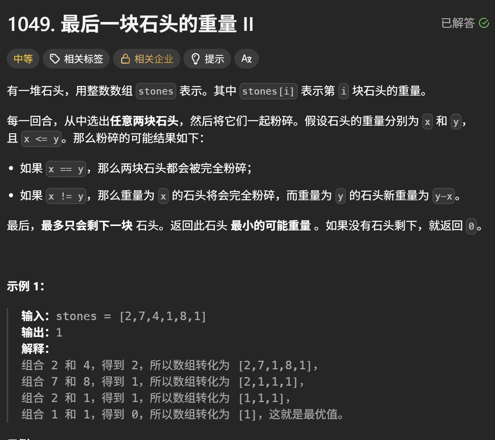
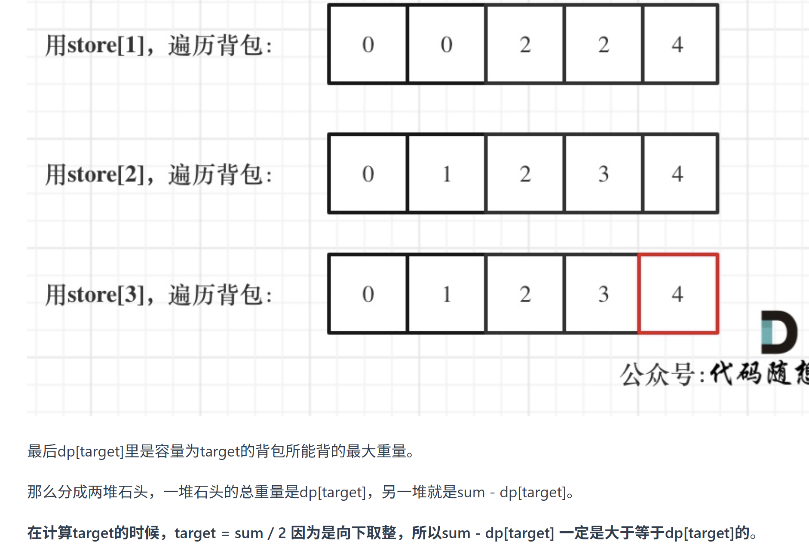

```cpp
int lastStoneWeightII(vector<int>& stones) {
    vector<int> dp(15001, 0);
    int sum = 0;
    for (int i = 0; i < stones.size(); i++) sum += stones[i];
    int target = sum / 2;
    for (int i = 0; i < stones.size(); i++) { // 遍历物品
        for (int j = target; j >= stones[i]; j--) { // 遍历背包
            dp[j] = max(dp[j], dp[j - stones[i]] + stones[i]);
        }
    }
    return sum - dp[target] - dp[target];
}
```

## **目标和**

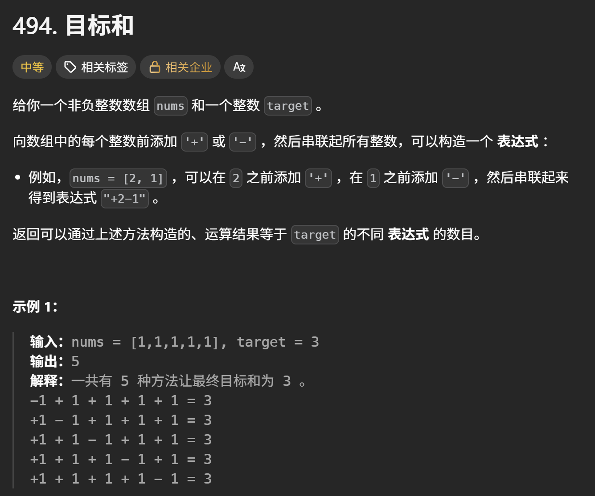

- 回溯算法：

```cpp
class Solution {
private:
    vector<vector<int>> result;
    vector<int> path;
    void backtracking(vector<int>& candidates, int target, int sum, int startIndex) {
        if (sum == target) {
            result.push_back(path);
        }
        // 如果 sum + candidates[i] > target 就终止遍历
        for (int i = startIndex; i < candidates.size() && sum + candidates[i] <= target; i++) {
            sum += candidates[i];
            path.push_back(candidates[i]);
            backtracking(candidates, target, sum, i + 1);
            sum -= candidates[i];
            path.pop_back();

        }
    }
public:
    int findTargetSumWays(vector<int>& nums, int S) {
        int sum = 0;
        for (int i = 0; i < nums.size(); i++) sum += nums[i];
        if (S > sum) return 0; // 此时没有方案
        if ((S + sum) % 2) return 0; // 此时没有方案，两个int相加的时候要格外小心数值溢出的问题
        int bagSize = (S + sum) / 2; // 转变为组合总和问题，bagsize就是要求的和

        // 以下为回溯法代码
        result.clear();
        path.clear();
        sort(nums.begin(), nums.end()); // 需要排序
        backtracking(nums, bagSize, 0, 0);
        return result.size();
    }
};
```

- 背包：

```cpp
int findTargetSumWays(vector<int>& nums, int target) {
    int sum = 0;
    for (int i = 0; i < nums.size(); i++) sum += nums[i];
    if (abs(target) > sum) return 0; // 此时没有方案
    if ((target + sum) % 2 == 1) return 0; // 此时没有方案
    int bagSize = (target + sum) / 2;
    vector<int> dp(bagSize + 1, 0);
    dp[0] = 1;
    for (int i = 0; i < nums.size(); i++) {
        for (int j = bagSize; j >= nums[i]; j--) {
            dp[j] += dp[j - nums[i]];
        }
    }
    return dp[bagSize];
}
```

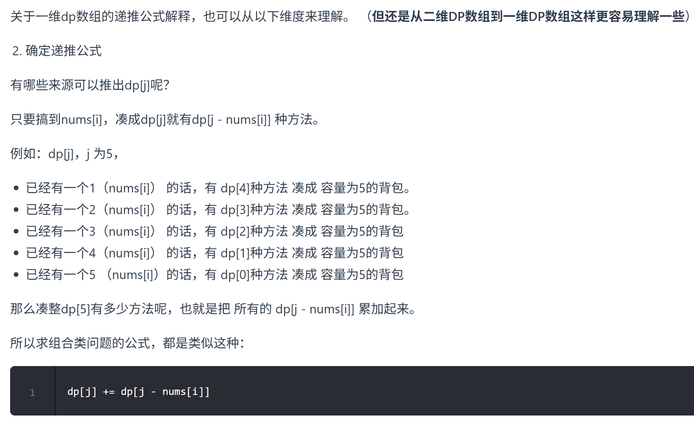

## **一和零**

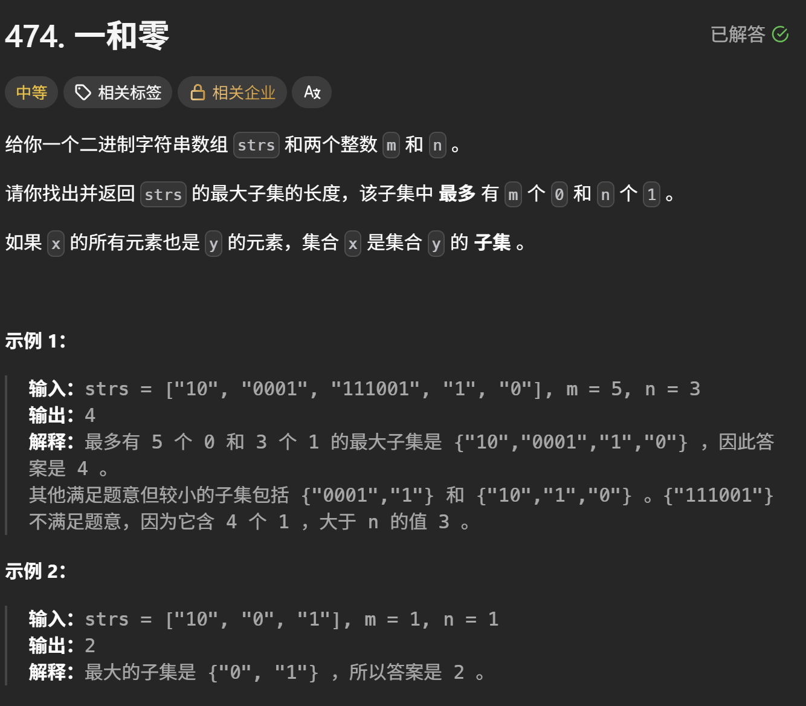

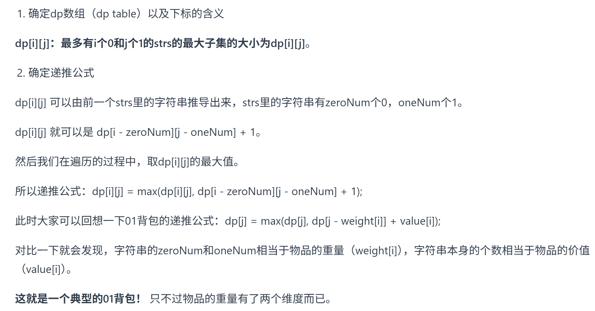

```cpp
int findMaxForm(vector<string>& strs, int m, int n) {
    vector<vector<int>> dp(m + 1, vector<int> (n + 1, 0)); // 默认初始化0
    for (string str : strs) { // 遍历物品
        int oneNum = 0, zeroNum = 0;
        for (char c : str) {
            if (c == '0') zeroNum++;
            else oneNum++;
        }
        for (int i = m; i >= zeroNum; i--) { // 遍历背包容量且从后向前遍历！
            for (int j = n; j >= oneNum; j--) {
                dp[i][j] = max(dp[i][j], dp[i - zeroNum][j - oneNum] + 1);
            }
        }
    }
    return dp[m][n];
}
```

## **完全背包**

- 每个物品可以放**无限次**
- 与01背包的差别：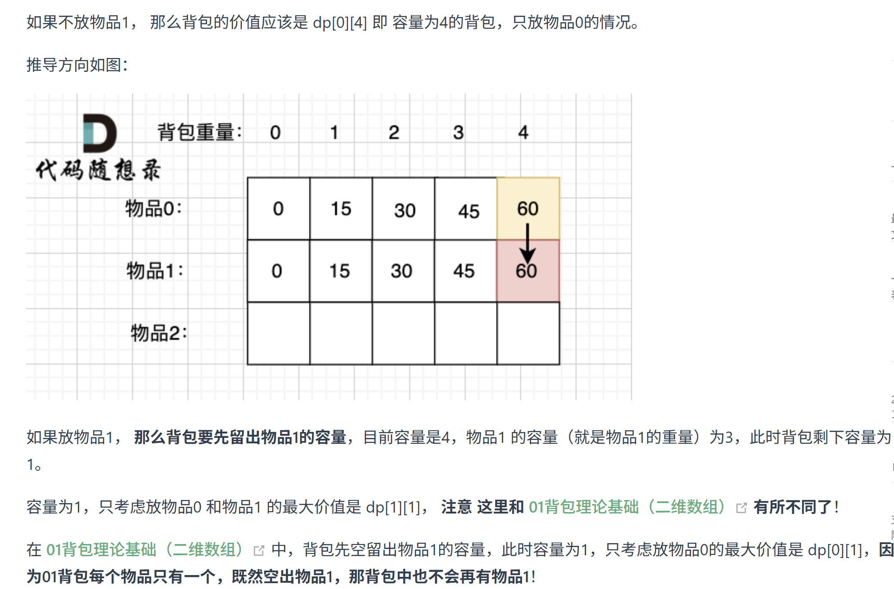
- 二维：

```cpp
int main() {
    int n, bagWeight;
    int w, v;
    cin >> n >> bagWeight;
    vector<int> weight(n);
    vector<int> value(n);
    for (int i = 0; i < n; i++) {
        cin >> weight[i] >> value[i];
    }

    vector<vector<int>> dp(n, vector<int>(bagWeight + 1, 0));

    // 初始化
    for (int j = weight[0]; j <= bagWeight; j++)
        dp[0][j] = dp[0][j - weight[0]] + value[0];

    for (int i = 1; i < n; i++) { // 遍历物品
        for(int j = 0; j <= bagWeight; j++) { // 遍历背包容量
            if (j < weight[i]) dp[i][j] = dp[i - 1][j];
            else dp[i][j] = max(dp[i - 1][j], dp[i][j - weight[i]] + value[i]);
        }
    }

    cout << dp[n - 1][bagWeight] << endl;

    return 0;
}
```

- 一维：**正序，先背包容量先物品都可**，正序是因为同个物品可**无限次放入**，先背包容量先物品都可是因为**正序遍历**，不像倒序遍历一样背包内只会放入一样物品
- 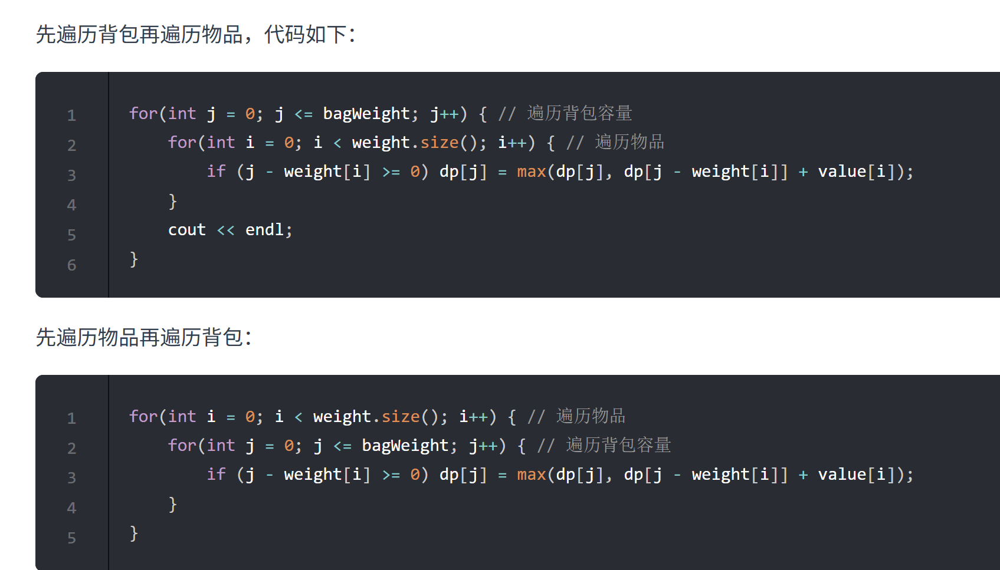

## **零钱兑换II**

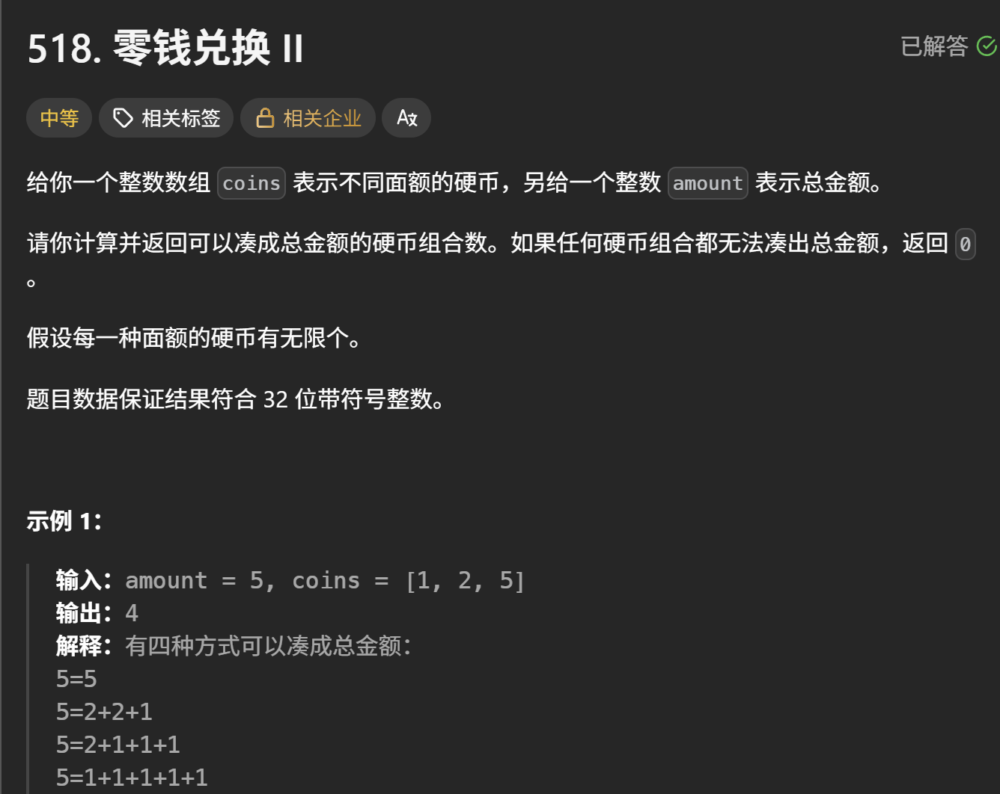

- 二维：

```cpp
int change(int amount, vector<int>& coins) {
    int bagSize = amount;

    vector<vector<uint64_t>> dp(coins.size(), vector<uint64_t>(bagSize + 1, 0));

    // 初始化最上行
    for (int j = 0; j <= bagSize; j++) {
        if (j % coins[0] == 0) dp[0][j] = 1;
    }
    // 初始化最左列
    for (int i = 0; i < coins.size(); i++) {
        dp[i][0] = 1;
    }
    // 以下遍历顺序行列可以颠倒
    for (int i = 1; i < coins.size(); i++) { // 行，遍历物品
        for (int j = 0; j <= bagSize; j++) { // 列，遍历背包
            if (coins[i] > j) dp[i][j] = dp[i - 1][j]; 
            else dp[i][j] = dp[i - 1][j] +  dp[i][j - coins[i]];
        }
    }
    return dp[coins.size() - 1][bagSize];
}
```

- 一维：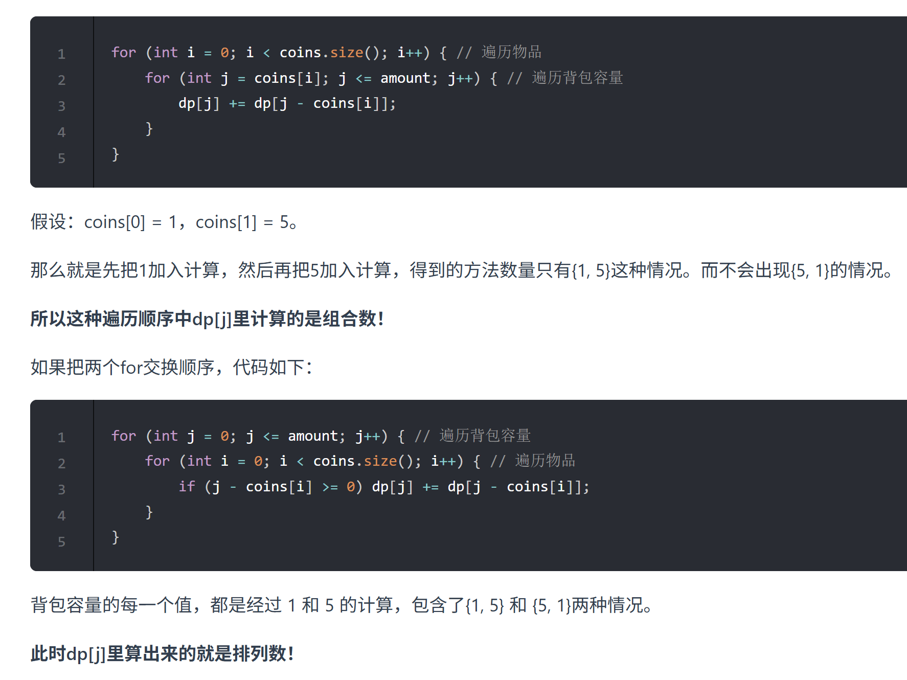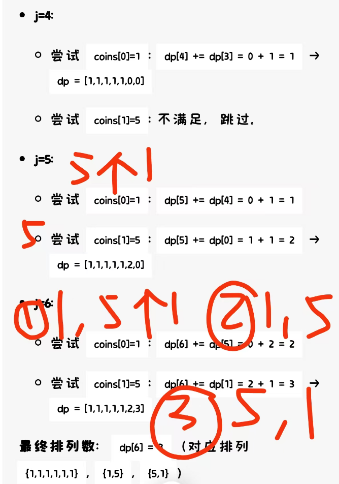

```cpp
int change(int amount, vector<int>& coins) {
    vector<uint64_t> dp(amount + 1, 0); // 防止相加数据超int
    dp[0] = 1; // 只有一种方式达到0
    for (int i = 0; i < coins.size(); i++) { // 遍历物品
        for (int j = coins[i]; j <= amount; j++) { // 遍历背包
            dp[j] += dp[j - coins[i]];
        }
    }
    return dp[amount]; // 返回组合数
}
```

## **组合总和IV**

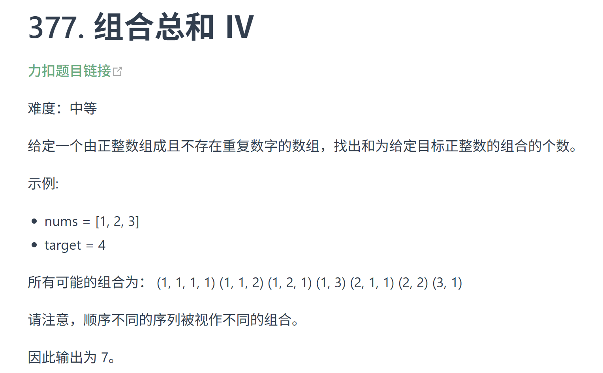

```cpp
int combinationSum4(vector<int>& nums, int target) {
    vector<int> dp(target + 1, 0);
    dp[0] = 1;
    for (int i = 0; i <= target; i++) { // 遍历背包
        for (int j = 0; j < nums.size(); j++) { // 遍历物品
            if (i - nums[j] >= 0 && dp[i] <= INT_MAX - dp[i - nums[j]]) {
                dp[i] += dp[i - nums[j]];
            }
        }
    }
    return dp[target];
}
```

## **零钱兑换**

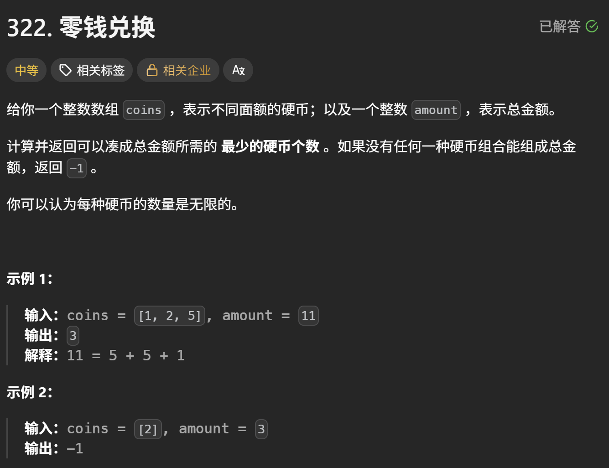

- **本题是要求最少硬币数量，硬币是组合数还是排列数都无所谓！所以两个for循环先后顺序怎样都可以！**

```cpp
int coinChange(vector<int>& coins, int amount) {
    vector<int> dp(amount + 1, INT_MAX);
    dp[0] = 0;
    for (int i = 0; i < coins.size(); i++) { // 遍历物品
        for (int j = coins[i]; j <= amount; j++) { // 遍历背包
            if (dp[j - coins[i]] != INT_MAX) { // 如果dp[j - coins[i]]是初始值则跳过
                dp[j] = min(dp[j - coins[i]] + 1, dp[j]);
            }
        }
    }
    if (dp[amount] == INT_MAX) return -1;
    return dp[amount];
}
```

## **完全平方数**

- 先遍历物品：

```cpp
int numSquares(int n) {
    vector<int> dp(n + 1, INT_MAX);
    dp[0] = 0;
    for (int i = 1; i * i <= n; i++) { // 遍历物品
        for (int j = i * i; j <= n; j++) { // 遍历背包
            // 记得 j 初始为 i*i，不然 j-i*i 会 小于0
            dp[j] = min(dp[j - i * i] + 1, dp[j]);
        }
    }
    return dp[n];
}
```

- 先遍历背包：

```cpp
int numSquares(int n) {
    vector<int> dp(n + 1, INT_MAX);
    dp[0] = 0;
    for (int j = 1; j <= n; j ++) { // 遍历背包
        for (int i = 1; i * i <= j; i ++) { // 遍历物品
            // 记得 i*i <= j
            dp[j] = min(dp[j - i * i] + 1, dp[j]);
        }
    }
    return dp[n];
}
```

## **单词拆分**

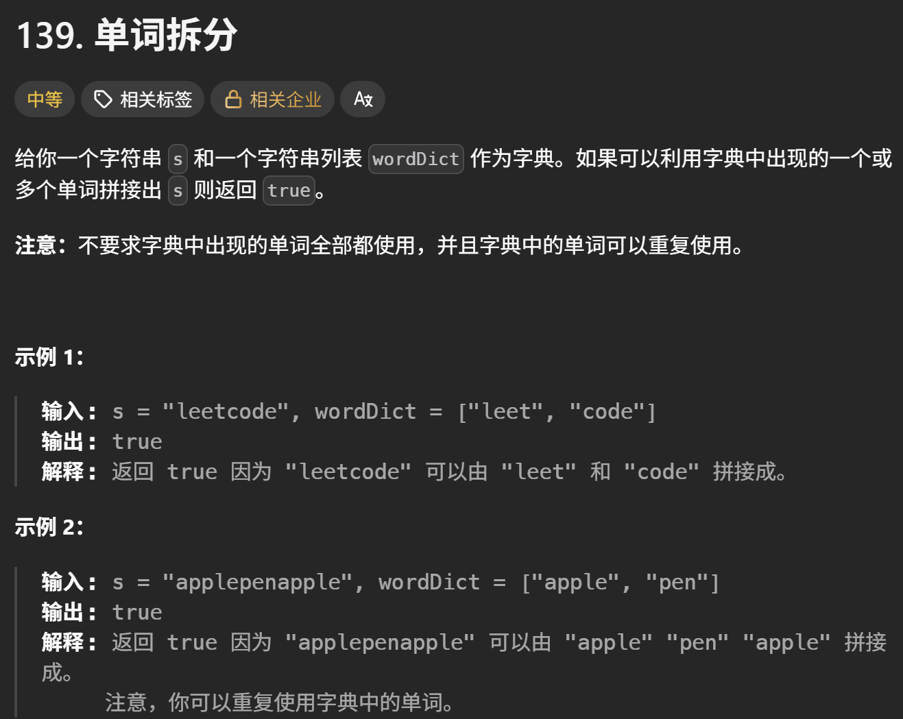

- 回溯算法：

```cpp
class Solution {
private:
    bool backtracking (const string& s,
            const unordered_set<string>& wordSet,
            vector<bool>& memory,
            int startIndex) {
        if (startIndex >= s.size()) {
            return true;
        }
        // 如果memory[startIndex]不是初始值了，直接使用memory[startIndex]的结果
        if (!memory[startIndex]) return memory[startIndex];
        for (int i = startIndex; i < s.size(); i++) {
            string word = s.substr(startIndex, i - startIndex + 1);
            if (wordSet.find(word) != wordSet.end() && backtracking(s, wordSet, memory, i + 1)) {
                return true;
            }
        }
        memory[startIndex] = false; // 记录以startIndex开始的子串是不可以被拆分的
        return false;
    }
public:
    bool wordBreak(string s, vector<string>& wordDict) {
        unordered_set<string> wordSet(wordDict.begin(), wordDict.end());
        vector<bool> memory(s.size(), 1); // -1 表示初始化状态
        return backtracking(s, wordSet, memory, 0);
    }
};
```

- 背包问题：**先遍历背包**

```cpp
bool wordBreak(string s, vector<string>& wordDict) {
    unordered_set<string> wordSet(wordDict.begin(), wordDict.end());
    vector<bool> dp(s.size() + 1, false);
    dp[0] = true;
    for (int i = 1; i <= s.size(); i++) {   // 遍历背包
    // i记得可以等于s.size()，因为这里是遍历背包,不是字符串
        for (int j = 0; j < i; j++) {       // 遍历物品
            string word = s.substr(j, i - j); 
            // substr(起始位置，截取的个数) 
            // i-j最多刚好截取到字符串末尾
            if (wordSet.find(word) != wordSet.end() && dp[j]) {
                dp[i] = true;
            }
        }
    }
    return dp[s.size()];
}
```

- 如果先遍历物品：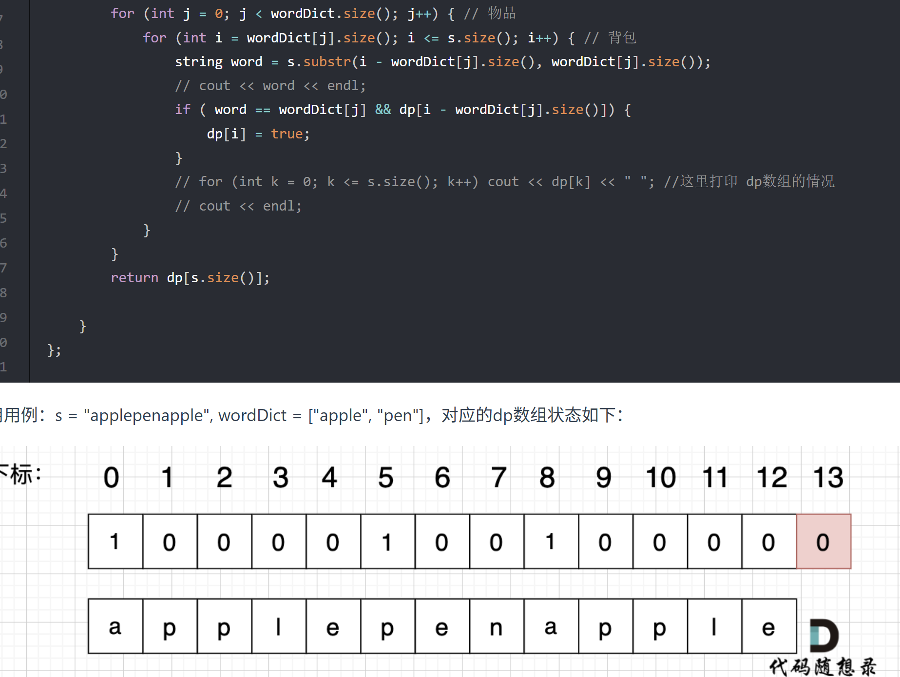
- 因为先用 "apple" 去遍历的时候，dp[8]并没有被赋值为1 （还没用"pen"），所以 dp[13]也不能变成1

## **多重背包**

- **有N种物品和一个容量为V 的背包。第i种物品最多有Mi件可用，每件耗费的空间是Ci ，价值是Wi 。求解将哪些物品装入背包可使这些物品的耗费的空间 总和不超过背包容量，且价值总和最大**
- 转化成**01背包**: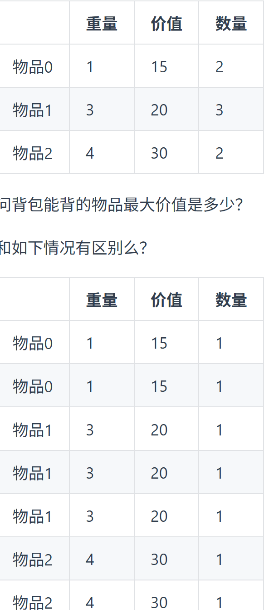

```cpp
int main() {
    int bagWeight,n;
    cin >> bagWeight >> n;
    vector<int> weight(n, 0);
    vector<int> value(n, 0);
    vector<int> nums(n, 0);
    for (int i = 0; i < n; i++) cin >> weight[i];
    for (int i = 0; i < n; i++) cin >> value[i];
    for (int i = 0; i < n; i++) cin >> nums[i];

    vector<int> dp(bagWeight + 1, 0);

    for(int i = 0; i < n; i++) { // 遍历物品
        for(int j = bagWeight; j >= weight[i]; j--) { // 遍历背包容量
            // 以上为01背包，然后加一个遍历个数
            for (int k = 1; k <= nums[i] && (j - k * weight[i]) >= 0; k++) { // 遍历个数
                dp[j] = max(dp[j], dp[j - k * weight[i]] + k * value[i]);
            }
        }
    }

    cout << dp[bagWeight] << endl;
}
```

## **打家劫舍**

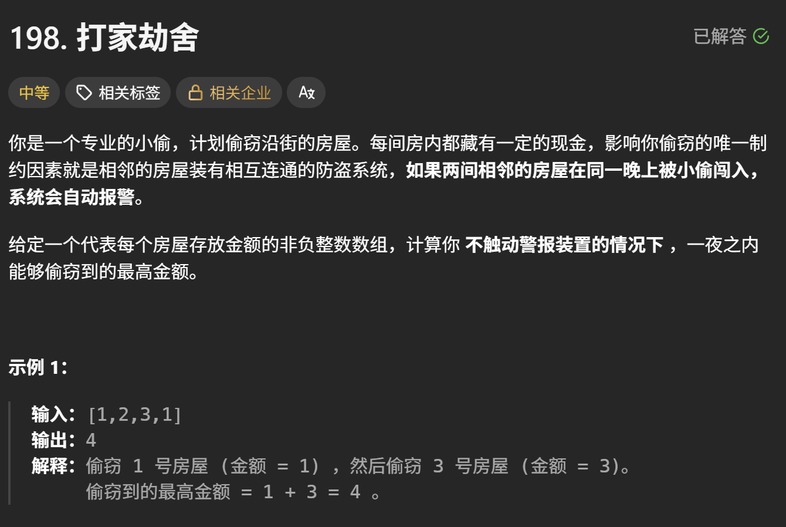

```cpp
int rob(vector<int>& nums) {
    if(nums.size() == 0) return 0;
    if(nums.size() == 1) return nums[0];

    vector<int> dp(nums.size(), 0);
    dp[0] = nums[0];
    dp[1] = max(nums[0], nums[1]);

    for(int i = 2; i < nums.size(); i ++) {
        dp[i] = max(dp[i - 2] + nums[i], dp[i - 1]);
    }

    return dp[nums.size() - 1];
}
```

## **打家劫舍II**

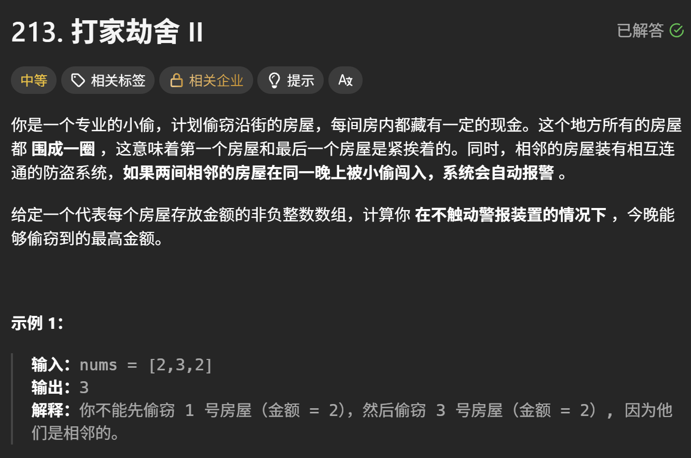

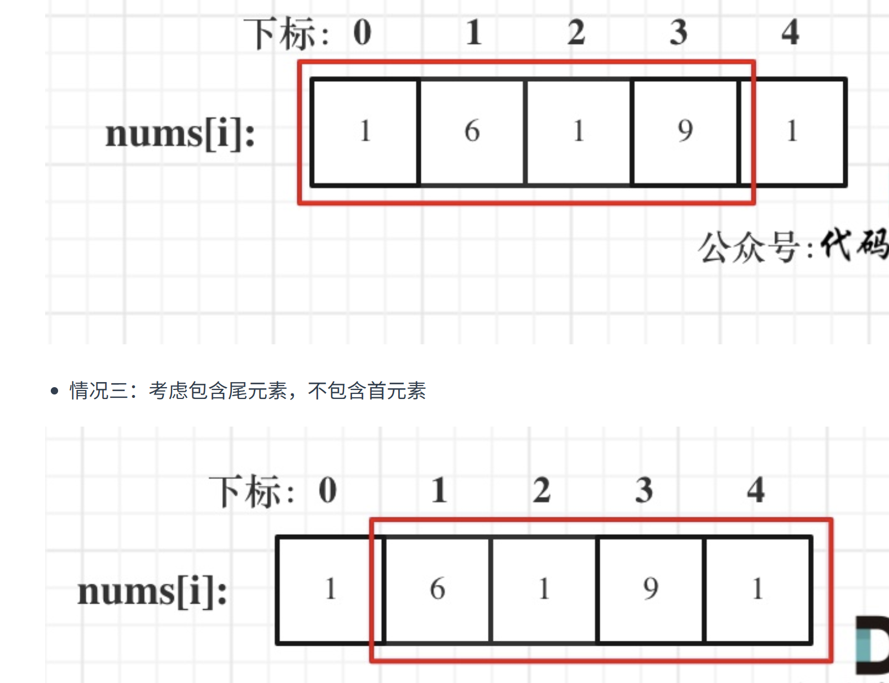

```cpp
class Solution {
public:
    int rob(vector<int>& nums) {
        if (nums.size() == 0) return 0;
        if (nums.size() == 1) return nums[0];
        int result1 = robRange(nums, 0, nums.size() - 2); // 情况二
        int result2 = robRange(nums, 1, nums.size() - 1); // 情况三
        return max(result1, result2);
    }
    // 198.打家劫舍的逻辑
    int robRange(vector<int>& nums, int start, int end) {
        if (end == start) return nums[start];
        vector<int> dp(nums.size());
        dp[start] = nums[start];
        dp[start + 1] = max(nums[start], nums[start + 1]);
        for (int i = start + 2; i <= end; i++) {
            dp[i] = max(dp[i - 2] + nums[i], dp[i - 1]);
        }
        return dp[end];
    }
};
```

## **打家劫舍III**

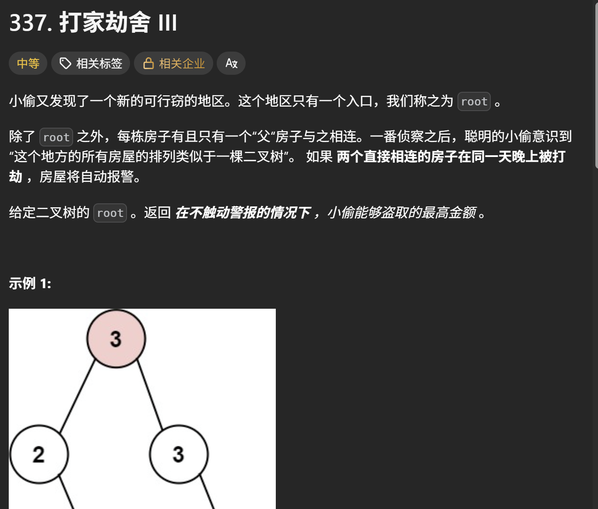

- **后序遍历**:左右子树的最佳结果影响了当前节点的最佳选择结果
- 记忆化递推：

```cpp
class Solution {
public:
    unordered_map<TreeNode* , int> umap; // 记录计算过的结果
    int rob(TreeNode* root) {
        if (root == NULL) return 0;
        if (root->left == NULL && root->right == NULL) return root->val;
        if (umap[root]) return umap[root]; // 如果umap里已经有记录则直接返回
        // 偷父节点
        int val1 = root->val;
        if (root->left) val1 += rob(root->left->left) + rob(root->left->right); // 跳过root->left
        if (root->right) val1 += rob(root->right->left) + rob(root->right->right); // 跳过root->right
        // 不偷父节点
        int val2 = rob(root->left) + rob(root->right); // 考虑root的左右孩子
        umap[root] = max(val1, val2); // umap记录一下结果
        return max(val1, val2);
    }
};
```

- 动态规划：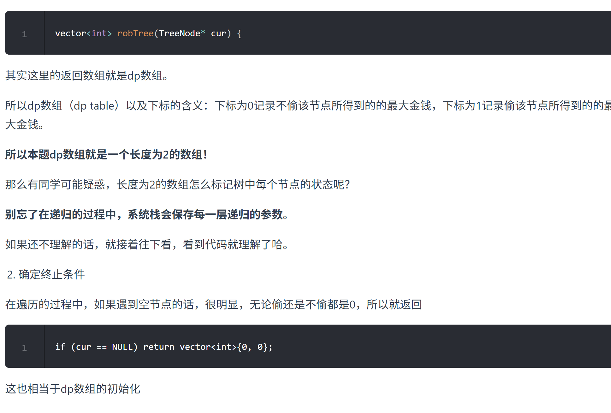

```cpp
class Solution {
public:
    int rob(TreeNode* root) {
        vector<int> result = robTree(root);
        return max(result[0], result[1]);
    }
    // 长度为2的数组，0：不偷，1：偷
    vector<int> robTree(TreeNode* cur) {
        if (cur == NULL) return vector<int>{0, 0};
        vector<int> left = robTree(cur->left);
        vector<int> right = robTree(cur->right);
        // 偷cur，那么就不能偷左右节点。
        int val1 = cur->val + left[0] + right[0];
        // 不偷cur，那么可以偷也可以不偷左右节点，则取较大的情况
        int val2 = max(left[0], left[1]) + max(right[0], right[1]);
        return {val2, val1};
    }
};
```

## **买卖股票的最佳时机**

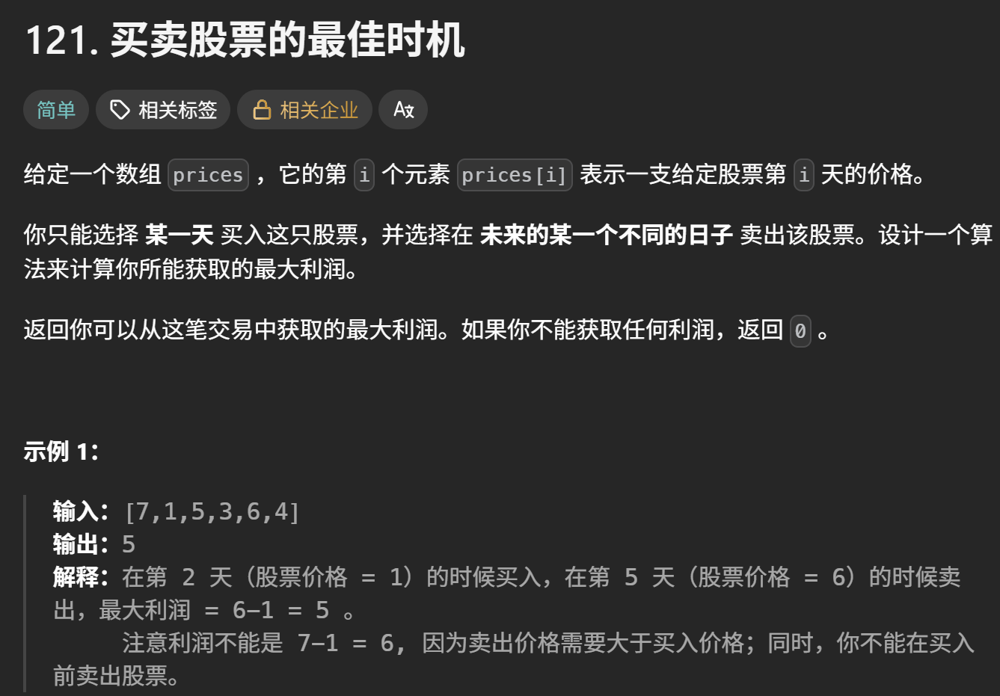

- 贪心：

```cpp
int maxProfit(vector<int>& prices) {
    int low = INT_MAX;
    int result = 0;
    for (int i = 0; i < prices.size(); i++) {
        low = min(low, prices[i]);  // 取最左最小价格
        result = max(result, prices[i] - low); // 直接取最大区间利润
    }
    return result;
}
```

- 动规：

```cpp
int maxProfit(vector<int>& prices) {
    int len = prices.size();
    vector<vector<int>> dp(2, vector<int>(2)); // 注意这里只开辟了一个2 * 2大小的二维数组
    dp[0][0] -= prices[0];
    dp[0][1] = 0;
    for (int i = 1; i < len; i++) {
        dp[i % 2][0] = max(dp[(i - 1) % 2][0], -prices[i]);
        dp[i % 2][1] = max(dp[(i - 1) % 2][1], prices[i] + dp[(i - 1) % 2][0]);
    }
    return dp[(len - 1) % 2][1];
}
```

## **买卖股票的最佳时机II**

- 可以买卖多次，但手中最多持有一支股票

```cpp
int maxProfit(vector<int>& prices) {
    int len = prices.size();
    vector<vector<int>> dp(2, vector<int>(2)); // 注意这里只开辟了一个2 * 2大小的二维数组
    dp[0][0] -= prices[0];
    dp[0][1] = 0;
    for (int i = 1; i < len; i++) {
        dp[i % 2][0] = max(dp[(i - 1) % 2][0], dp[(i - 1) % 2][1] - prices[i]);
        dp[i % 2][1] = max(dp[(i - 1) % 2][1], prices[i] + dp[(i - 1) % 2][0]);
    }
    return dp[(len - 1) % 2][1];
}
```

## **买卖股票的最佳时机III**

- 只能买卖最多两次，手中最多持有一支股票

```cpp
int maxProfit(vector<int>& prices) {
    int len = prices.size();
    vector<vector<int>> dp(2, vector<int>(2)); // 注意这里只开辟了一个2 * 2大小的二维数组
    dp[0][0] -= prices[0];
    dp[0][1] = 0;
    for (int i = 1; i < len; i++) {
        dp[i % 2][0] = max(dp[(i - 1) % 2][0], dp[(i - 1) % 2][1] - prices[i]);
        dp[i % 2][1] = max(dp[(i - 1) % 2][1], prices[i] + dp[(i - 1) % 2][0]);
    }
    return dp[(len - 1) % 2][1];
}
// 优化
for (int i = 1; i < prices.size(); i++) {
    dp[1] = max(dp[1], dp[0] - prices[i]);
    // 每一轮都依赖本轮刚更新的新值
    dp[2] = max(dp[2], dp[1] + prices[i]);
    dp[3] = max(dp[3], dp[2] - prices[i]);
    dp[4] = max(dp[4], dp[3] + prices[i]);
}
```

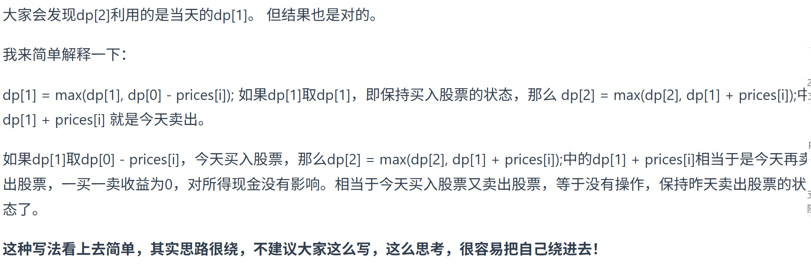

## **买卖股票的最佳时机IV**

- 只能买卖最多k次，手中最多持有一支股票

```cpp
int maxProfit(int k, vector<int>& prices) {
    if(prices.size() <= 1) return 0;

    vector<int> dp(k * 2 + 1, 0);
    for(int i = 1; i < k * 2 + 1; i ++) {
        if(i % 2 != 0) dp[i] -= prices[0];
    }

    for(int i = 1; i < prices.size(); i ++) {
        for(int j = 1; j < k * 2 + 1; j ++) {
            if(j % 2 != 0) {
                dp[j] = max(dp[j], dp[j - 1] - prices[i]);
            } else {
                dp[j] = max(dp[j], dp[j - 1] + prices[i]);
            }
        }
    }

    return dp[k * 2];
}
```

## **买卖股票的最佳时机含冷冻期**

- 今天卖出股票后第二天不可以买入股票
- 可以多次买入股票

```cpp
int maxProfit(vector<int>& prices) {
    if(prices.size() <= 1) return 0;
    vector<int> dp(4, 0);
    dp[0] -= prices[0];
    for(int i = 1; i < prices.size(); i ++) {
        // 这里是为了防止覆盖昨天的数值
        // 因为有冷冻期，必须避免“今天买入今天卖出”的可能
        // 不像前几道
        int old0 = dp[0];
        int old2 = dp[2];

        dp[0] = max(dp[0], max(dp[1] - prices[i], dp[3] - prices[i]));
        dp[1] = max(dp[1], dp[3]);
        dp[2] = old0 + prices[i];
        dp[3] = old2;
    }
    return max(dp[1], max(dp[2], dp[3]));
}
```

## **最长上升子序列**

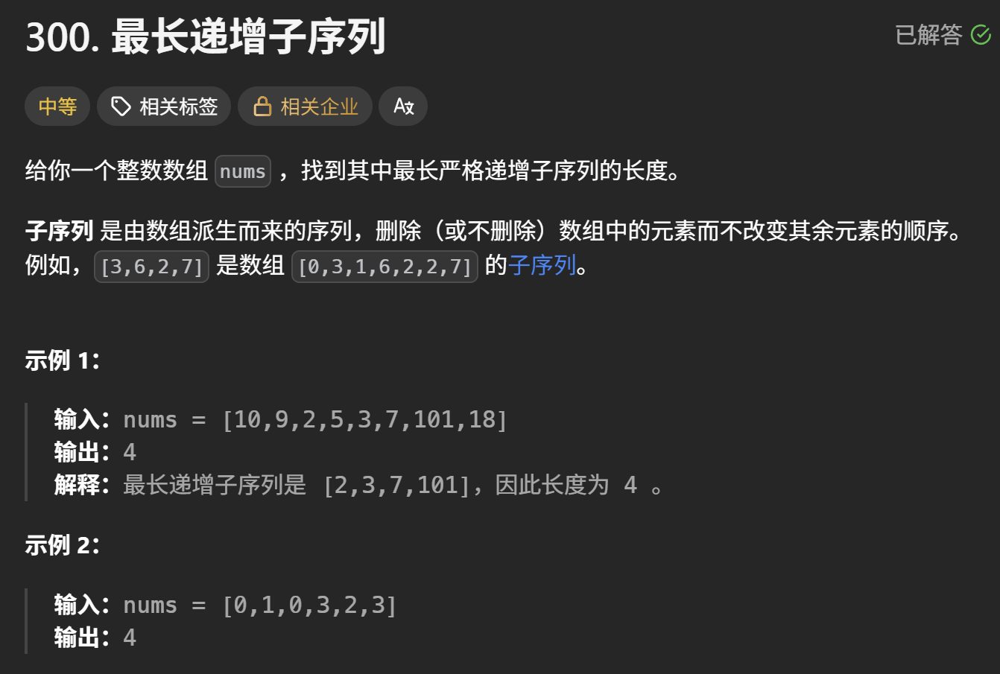

```cpp
int lengthOfLIS(vector<int>& nums) {
    if (nums.size() <= 1) return nums.size();
    vector<int> dp(nums.size(), 1);
    int result = 0;
    for (int i = 1; i < nums.size(); i++) {
        for (int j = 0; j < i; j++) {
            if (nums[i] > nums[j]) dp[i] = max(dp[i], dp[j] + 1);
        }
        if (dp[i] > result) result = dp[i]; // 取长的子序列
    }
    return result;
}
```

## **最长连续递增子序列**

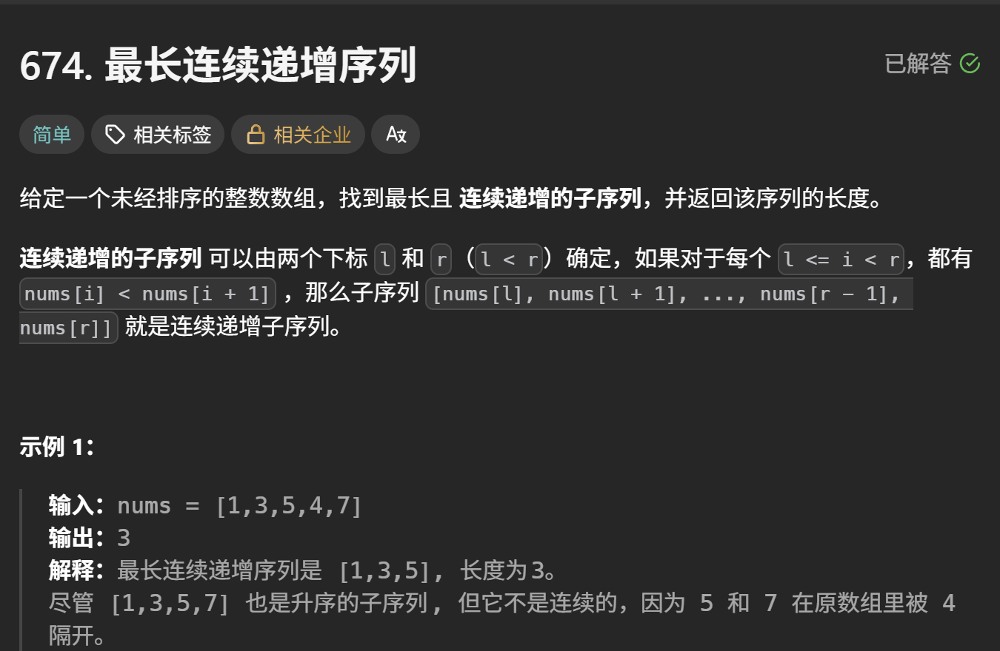

```cpp
int findLengthOfLCIS(vector<int>& nums) {
    if(nums.size() <= 1) return 1;
    vector<int> dp(nums.size(), 1);
    int result = 0;
    for(int i = 1; i < nums.size(); i ++) {
        if(nums[i] > nums[i - 1]) {
            dp[i] = dp[i - 1] + 1;
        }
        result = dp[i] > result ? dp[i] : result;
    }
    return result;
}
```

## **最长重复子数组**

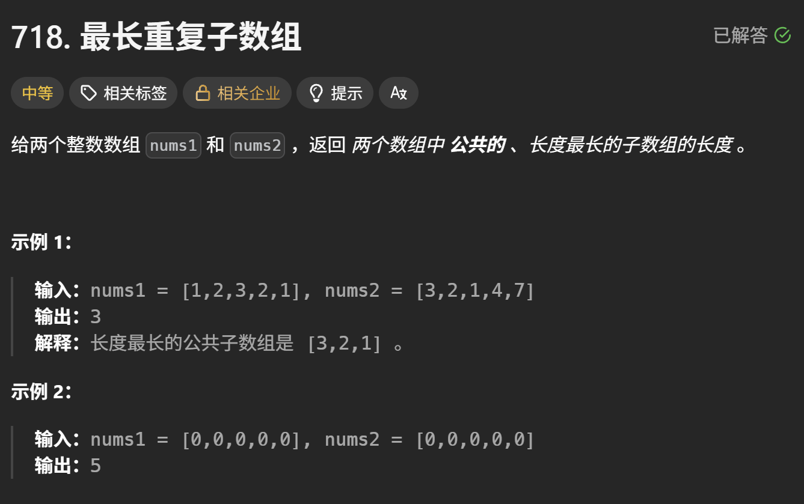

- 二维：

```cpp
int findLength(vector<int>& nums1, vector<int>& nums2) {
    vector<vector<int>> dp (nums1.size() + 1, vector<int>(nums2.size() + 1, 0));
    int result = 0;
    for (int i = 1; i <= nums1.size(); i++) {
        for (int j = 1; j <= nums2.size(); j++) {
            if (nums1[i - 1] == nums2[j - 1]) {
                dp[i][j] = dp[i - 1][j - 1] + 1;
            }
            if (dp[i][j] > result) result = dp[i][j];
        }
    }
    return result;
}
```

- 一维：

```cpp
int findLength(vector<int>& A, vector<int>& B) {
    vector<int> dp(vector<int>(B.size() + 1, 0));
    int result = 0;
    for (int i = 1; i <= A.size(); i++) {
        for (int j = B.size(); j > 0; j--) {
            if (A[i - 1] == B[j - 1]) {
                dp[j] = dp[j - 1] + 1;
            } else dp[j] = 0; // 注意这里不相等的时候要有赋0的操作
            if (dp[j] > result) result = dp[j];
        }
    }
    return result;
}
```

- 拓展：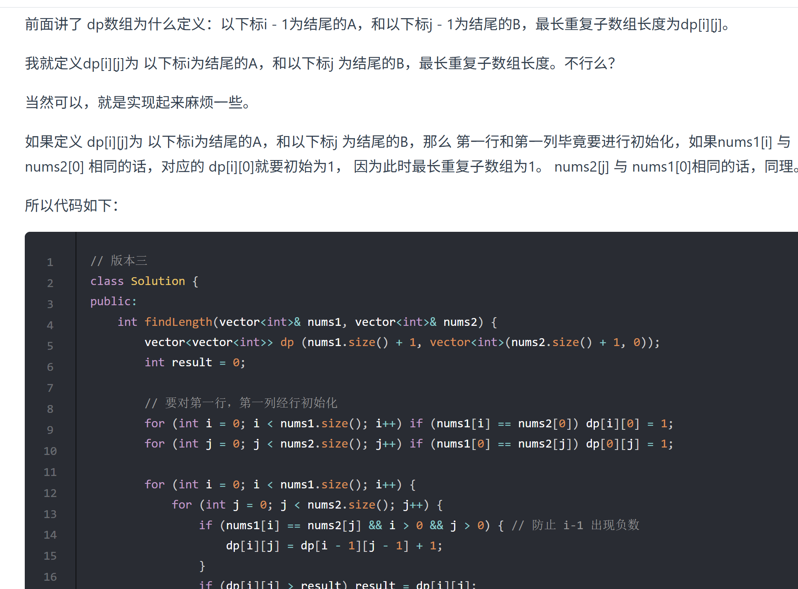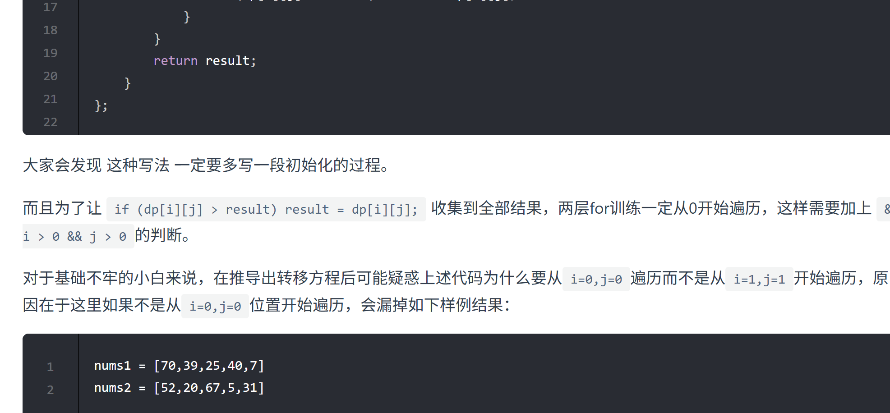

## **最长公共子序列**

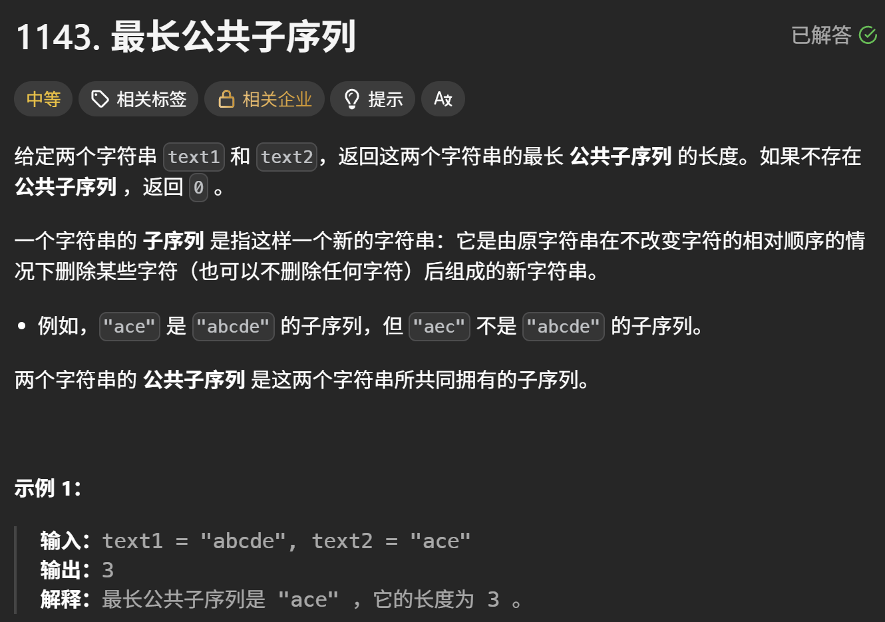

```cpp
int longestCommonSubsequence(string text1, string text2) {
    vector<vector<int>> dp(text1.size() + 1, vector<int>(text2.size() + 1, 0));
    for (int i = 1; i <= text1.size(); i++) {
        for (int j = 1; j <= text2.size(); j++) {
            if (text1[i - 1] == text2[j - 1]) {
                dp[i][j] = dp[i - 1][j - 1] + 1;
            } else {
                dp[i][j] = max(dp[i - 1][j], dp[i][j - 1]);
            }
        }
    }
    return dp[text1.size()][text2.size()];
}
```

## **不相交的线**

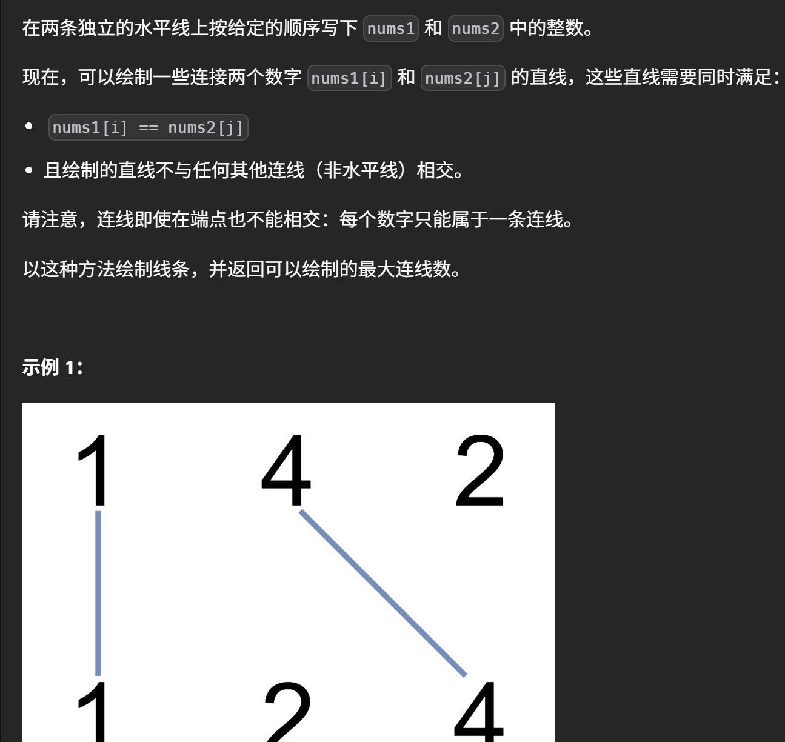

- **其实就是求最长公共子序列的长度**
- 与上一题代码一样

## **最大子数组和**

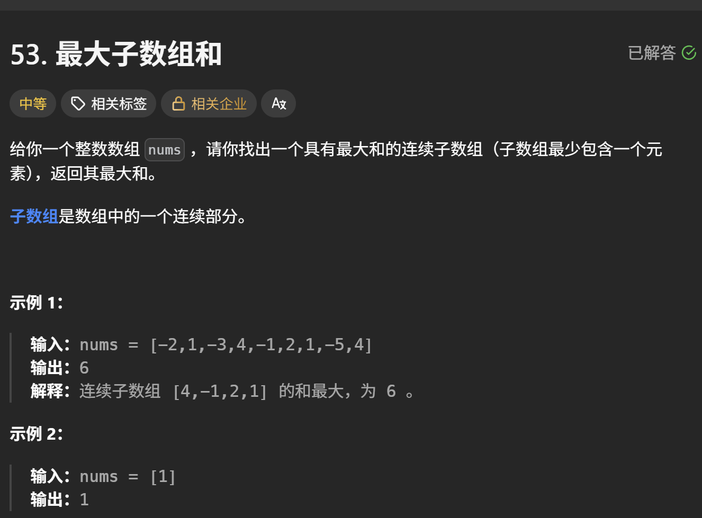

```cpp
int maxSubArray(vector<int>& nums) {
    if (nums.size() == 0) return 0;
    vector<int> dp(nums.size());
    dp[0] = nums[0];
    int result = dp[0];
    for (int i = 1; i < nums.size(); i++) {
        dp[i] = max(dp[i - 1] + nums[i], nums[i]); // 状态转移公式
        if (dp[i] > result) result = dp[i]; // result 保存dp[i]的最大值
    }
    return result;
}
```

## **判断子序列**

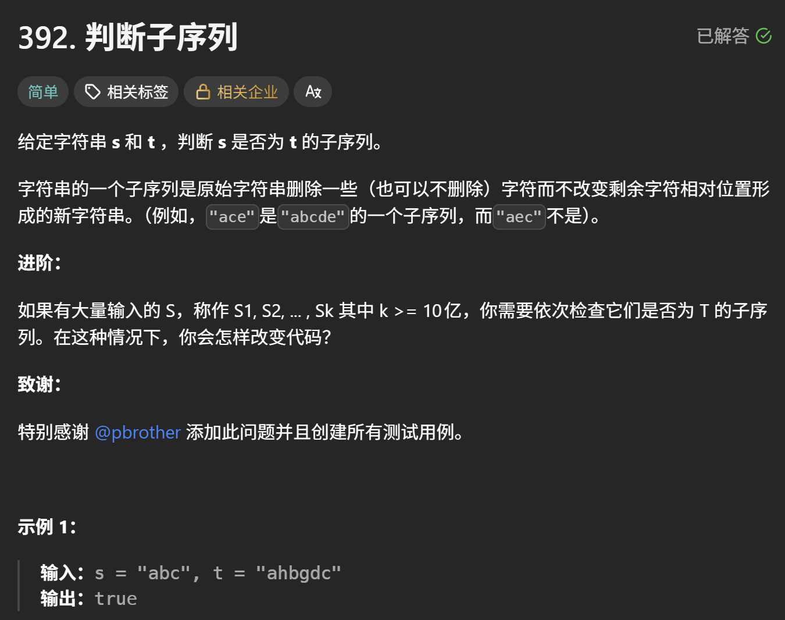

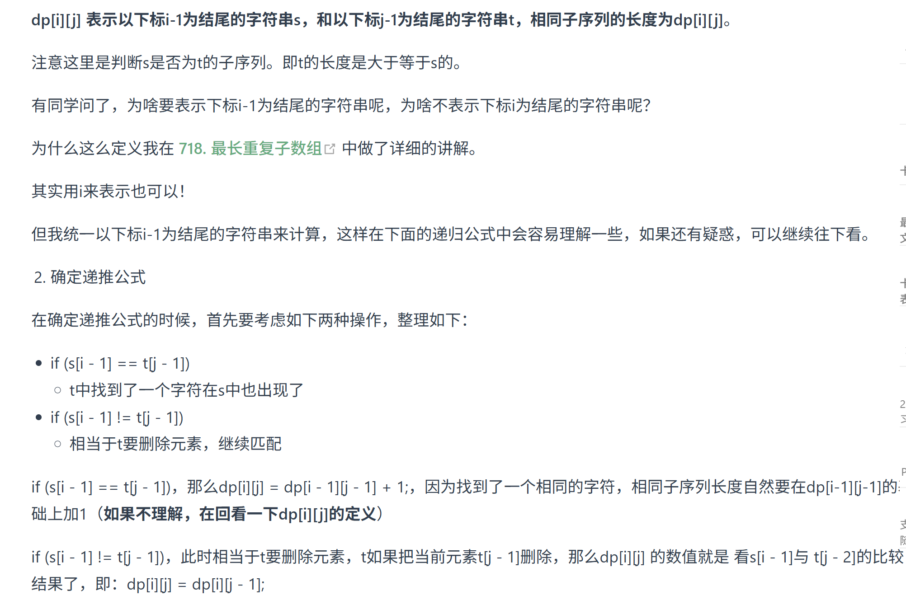

```cpp
bool isSubsequence(string s, string t) {
    vector<vector<int>> dp(s.size() + 1, vector<int>(t.size() + 1, 0));
    for (int i = 1; i <= s.size(); i++) {
        for (int j = 1; j <= t.size(); j++) {
            if (s[i - 1] == t[j - 1]) dp[i][j] = dp[i - 1][j - 1] + 1;
            else dp[i][j] = dp[i][j - 1];
        }
    }
    if (dp[s.size()][t.size()] == s.size()) return true;
    return false;
}
```

## **不同的子序列**

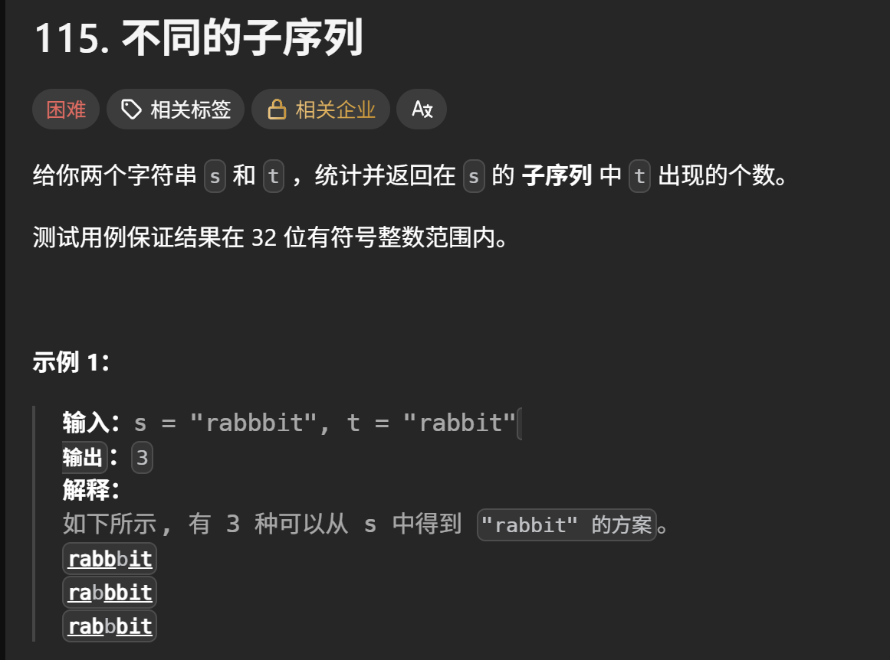

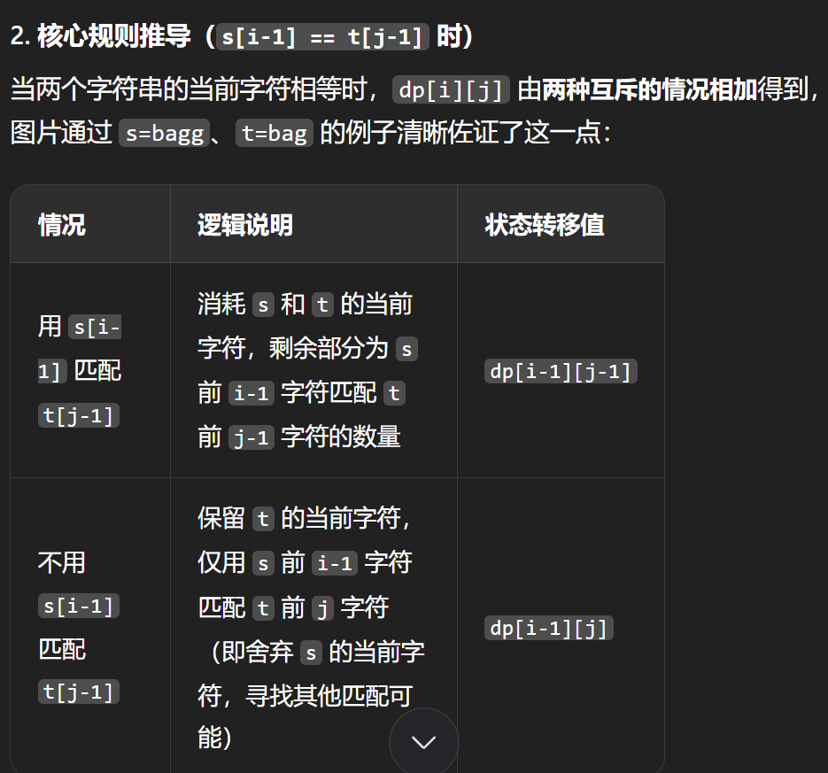

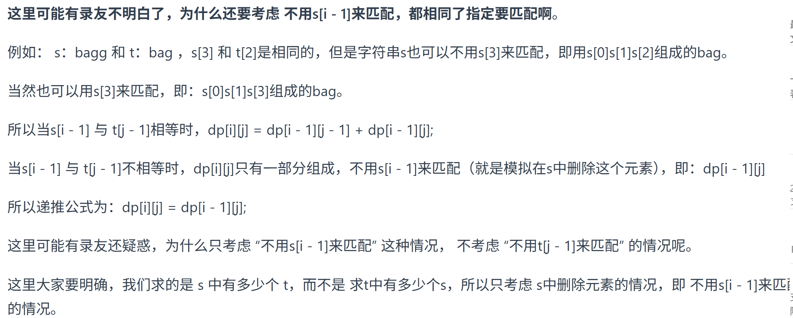

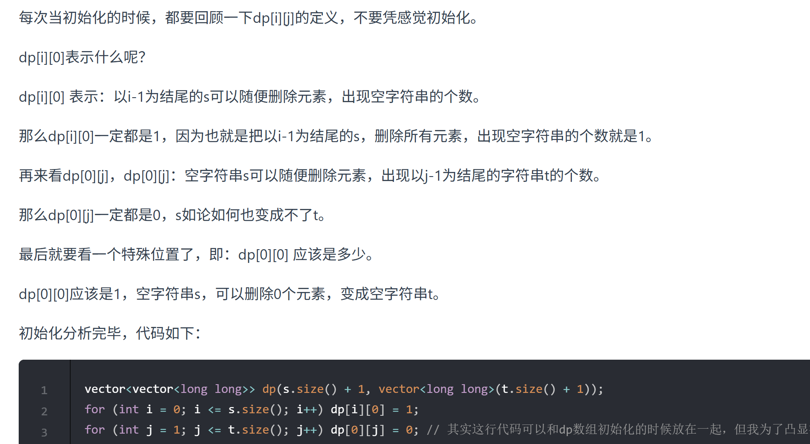

```cpp
int numDistinct(string s, string t) {
    vector<vector<uint64_t>> dp(s.size() + 1, 
                            vector<uint64_t> (t.size() + 1, 0));

    for(int i = 0; i <= s.size(); i ++) {
        dp[i][0] = 1;
    }
    for(int j = 1; j <= t.size(); j ++) {
        dp[0][j] = 0;
    }

    for(int i = 1; i <= s.size(); i ++) {
        for(int j = 1; j <= t.size(); j ++) {
            if(s[i - 1] == t[j - 1]) {
                dp[i][j] = dp[i - 1][j - 1] + dp[i - 1][j];
            } else {
                dp[i][j] = dp[i - 1][j];
            }
        }
    }

    return dp[s.size()][t.size()];
}
```

## **两个字符串的删除操作**

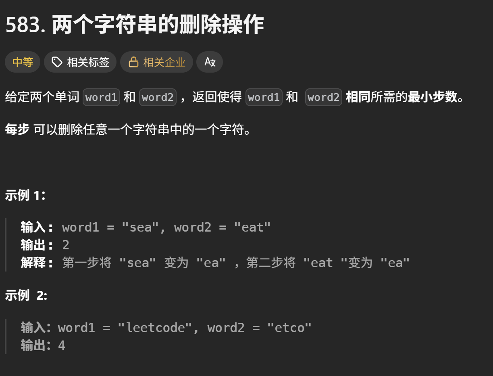

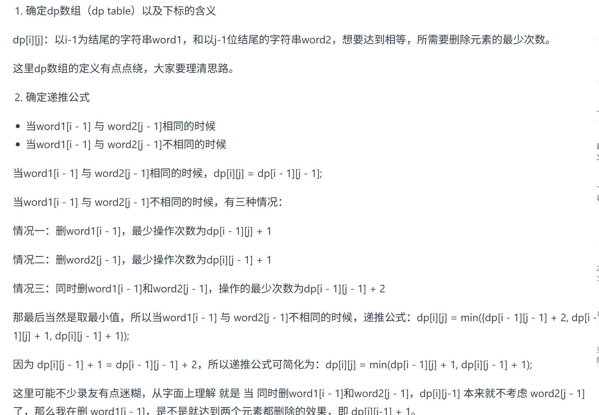

```cpp
int minDistance(string word1, string word2) {
    vector<vector<int>> dp(word1.size() + 1, 
                        vector<int> (word2.size() + 1, 0));

    for(int i = 0; i <= word1.size(); i ++) {
        dp[i][0] = i;
    }
    for(int j = 0; j <= word2.size(); j ++) {
        dp[0][j] = j;
    }

    for(int i = 1; i <= word1.size(); i ++) {
        for(int j = 1; j <= word2.size(); j ++) {
            if(word1[i - 1] == word2[j - 1]) {
                dp[i][j] = dp[i - 1][j - 1];
            } else {
                dp[i][j] = min(dp[i - 1][j] + 1, dp[i][j - 1] + 1);
            }
        }
    }

    return dp[word1.size()][word2.size()];
}
```

- 思路二：求出最长公共子序列

```cpp
int minDistance(string word1, string word2) {
    vector<vector<int>> dp(word1.size()+1, vector<int>(word2.size()+1, 0));
    for (int i=1; i<=word1.size(); i++){
        for (int j=1; j<=word2.size(); j++){
            if (word1[i-1] == word2[j-1]) dp[i][j] = dp[i-1][j-1] + 1;
            else dp[i][j] = max(dp[i-1][j], dp[i][j-1]);
        }
    }
    return word1.size()+word2.size()-dp[word1.size()][word2.size()]*2;
}
```

## **编辑距离**

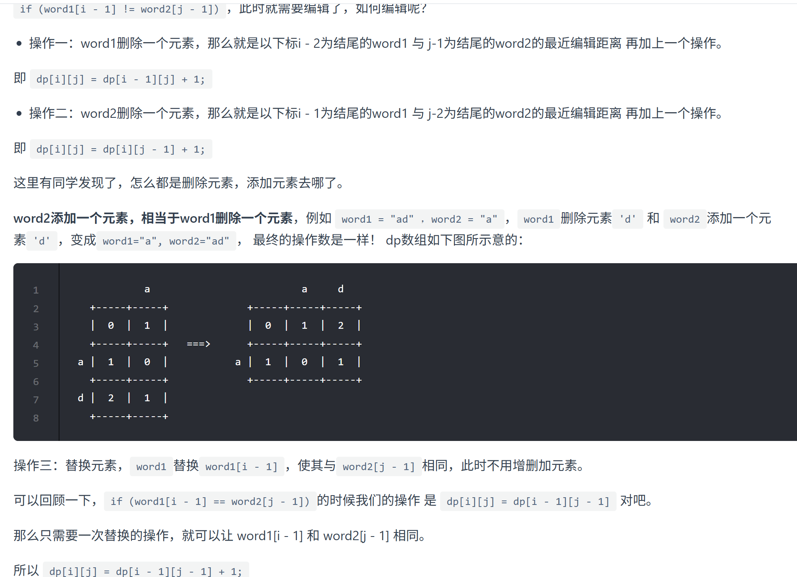

```cpp
int minDistance(string word1, string word2) {
    vector<vector<int>> dp(word1.size() + 1, vector<int>(word2.size() + 1, 0));
    for (int i = 0; i <= word1.size(); i++) dp[i][0] = i;
    for (int j = 0; j <= word2.size(); j++) dp[0][j] = j;
    for (int i = 1; i <= word1.size(); i++) {
        for (int j = 1; j <= word2.size(); j++) {
            if (word1[i - 1] == word2[j - 1]) {
                dp[i][j] = dp[i - 1][j - 1];
            }
            else {
                dp[i][j] = min({dp[i - 1][j - 1], dp[i - 1][j], dp[i][j - 1]}) + 1;
            }
        }
    }
    return dp[word1.size()][word2.size()];
}
```

## **回文子串**

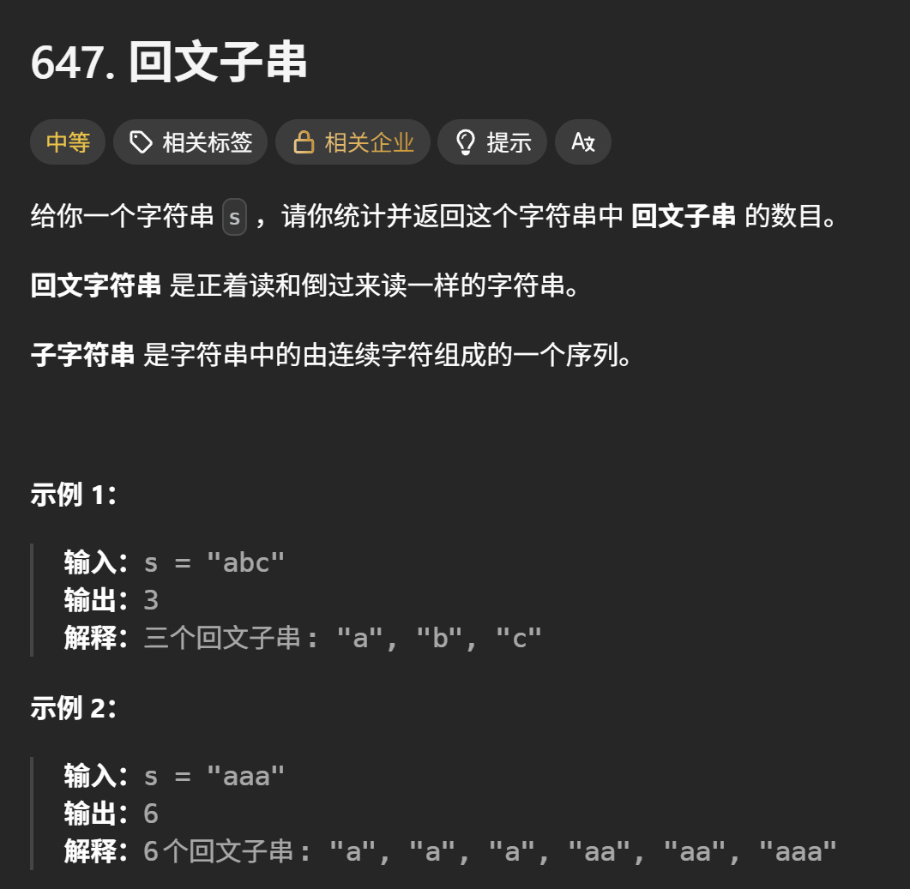

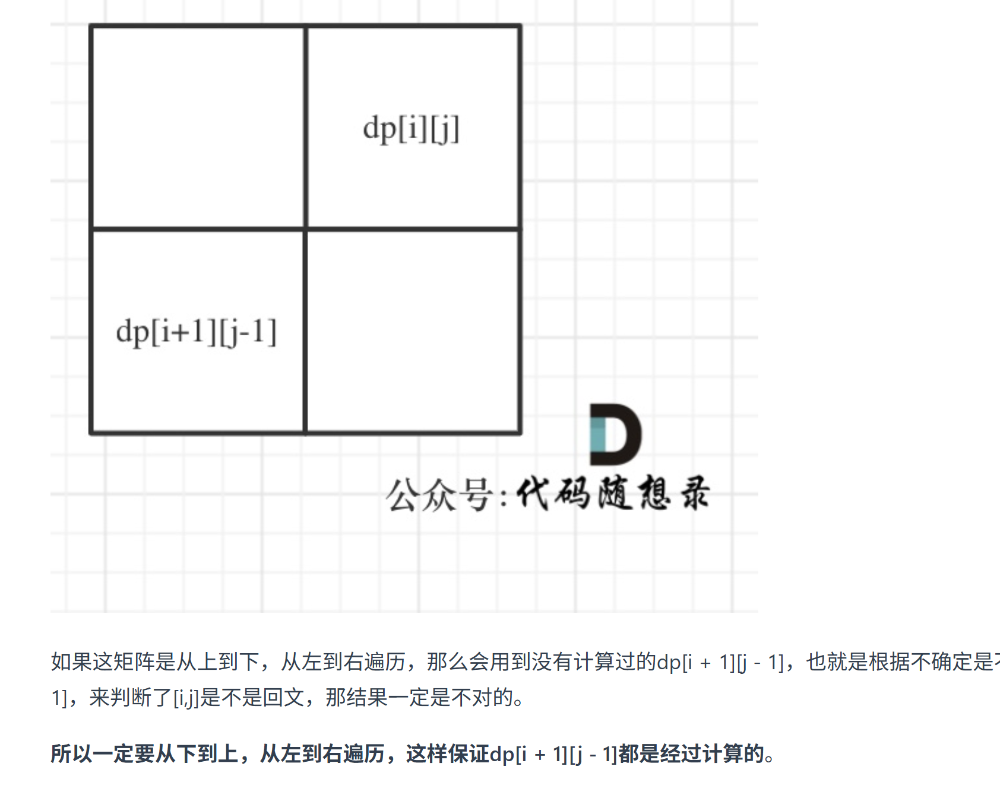

```cpp
int countSubstrings(string s) {
    vector<vector<bool>> dp(s.size(), vector<bool>(s.size(), false));
    int result = 0;
    for (int i = s.size() - 1; i >= 0; i--) {
        for (int j = i; j < s.size(); j++) {
            if (s[i] == s[j] && (j - i <= 1 || dp[i + 1][j - 1])) {
                result++;
                dp[i][j] = true;
            }
        }
    }
    return result;
}
```

- 双指针法：

```cpp
class Solution {
public:
    int countSubstrings(string s) {
        int result = 0;
        for (int i = 0; i < s.size(); i++) {
            result += extend(s, i, i, s.size()); // 以i为中心
            result += extend(s, i, i + 1, s.size()); // 以i和i+1为中心
        }
        return result;
    }
    int extend(const string& s, int i, int j, int n) {
        int res = 0;
        while (i >= 0 && j < n && s[i] == s[j]) {
            i--;
            j++;
            res++;
        }
        return res;
    }
};
```

## **最长回文子序列**

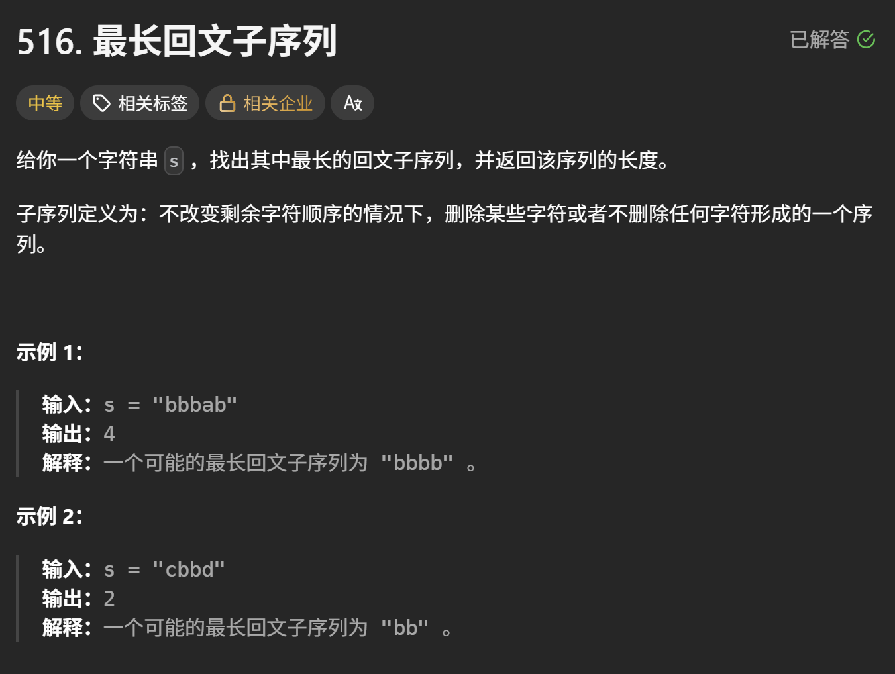

```cpp
int longestPalindromeSubseq(string s) {
    vector<vector<int>> dp(s.size(), vector<int>(s.size(), 0));
    for (int i = 0; i < s.size(); i++) dp[i][i] = 1;
    for (int i = s.size() - 1; i >= 0; i--) {
        for (int j = i + 1; j < s.size(); j++) {
            if (s[i] == s[j]) {
                dp[i][j] = dp[i + 1][j - 1] + 2;
            } else {
            // 如果字符串没有重复字符，这段可将返回结果赋值为1，因为dp[i][i]初始化了为1
                dp[i][j] = max(dp[i + 1][j], dp[i][j - 1]);
            }
        }
    }
    return dp[0][s.size() - 1];
}
```
