# **回溯算法**

## 理论基础

- 因为回溯的本质是穷举，穷举所有可能，然后选出我们想要的答案，如果想让回溯法高效一些，可以加一些剪枝的操作，但也改不了回溯法就是穷举的本质。
- **for循环可以理解是横向遍历，backtracking（递归）就是纵向遍历**
- 模板：

``` C++
void backtracking(参数) {
    if (终止条件) {
        存放结果;
        return;
    }

    for (选择：本层集合中元素（树中节点孩子的数量就是集合的大小）) {
        处理节点;
        backtracking(路径，选择列表); // 递归
        回溯，撤销处理结果
    }
}
```

## **组合**

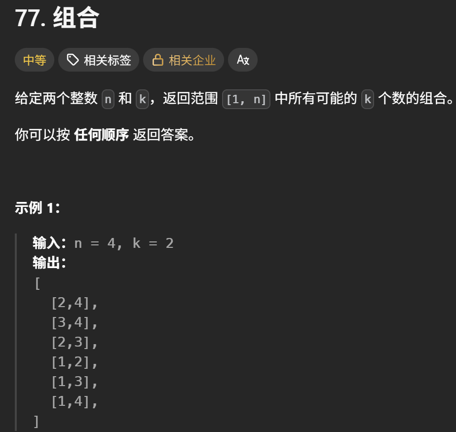

``` C++
class Solution {
private:
    vector<vector<int>> result; // 存放符合条件结果的集合
    vector<int> path; // 用来存放符合条件结果
    void backtracking(int n, int k, int start) {
        if (path.size() == k) {
            result.push_back(path);
            return;
        }
        //n - i >= k - path.size()
        //由于是左闭区间，故要加一
        for (int i = start; i <= n - (k - path.size()) + 1; i++) {
            path.push_back(i); // 处理节点
            backtracking(n, k, i + 1); // 递归
            path.pop_back(); // 回溯，撤销处理的节点
        }
    }
public:
    vector<vector<int>> combine(int n, int k) {
        result.clear(); // 可以不写
        path.clear();   // 可以不写
        backtracking(n, k, 1);
        return result;
    }
};
```

## **组合求和**

### **如果是一个集合来求组合的话，就需要startIndex**

``` C++
class Solution {
private:
    vector<vector<int>> result;
    vector<int> path;
    void backTracking(int k, int n, int sum, int start){
        if(path.size() == k){//终止条件为递归深度
            if(sum == n){//如果满足条件，才放进result
                result.push_back(path);
            }
            return;
        }
        //9 - i >= k - path.size()
        for(int i = start; i <= 9 - (k - path.size()) + 1; i ++){
            sum += i;
            path.push_back(i);
            backTracking(k, n, sum, i + 1);
            sum -= i;//除了撤销path外，还要撤销sum
            path.pop_back();
        }
    }

public:
    vector<vector<int>> combinationSum3(int k, int n) {
        backTracking(k, n, 0, 1);
        return result;
    }
};
```

### 对于可重复取用的

```cpp
for (int i = startIndex; i < candidates.size(); i++) {
            sum += candidates[i];
            path.push_back(candidates[i]);
            backtracking(candidates, target, sum, i); 
            // 不用i+1了，表示可以重复读取当前的数
            sum -= candidates[i];
            path.pop_back();
        }
```

### **部分和问题**

```cpp
bool found;

void backTracking(vector<int> num, vector<int> &path, int k, int start, int sum){
    if(sum == k){
        found = true;
        return;
    }
    for(int i = start; i < num.size(); i ++){
        if(num[i] == 0){//题目要求0不选 
            continue;
        }
        path.push_back(num[i]);
        sum += num[i];
        backTracking(num,path,k,i+1,sum);
        //要先检查是否满足题意在撤销，不然会改变结果
        //如果不在这里检查，应在上面的if语句直接输出结果或者存入result数组
        if(found){
            return;
        }
        path.pop_back();
        sum -= num[i];//记得撤销sum 
    }
}

int main(){
    int t;
    cin >> t;
    vector<int> path;
    while(t--){
        int n,k;
        vector<int> num(1000);
        cin >> n >> k;
        for(int i = 0; i < n; i ++){
            cin >> num[i];
        }
        path.clear();	
        found = false;//由于找到一组即可，故可用bool 
        backTracking(num,path,k,0,0);
        if(found){
            cout << "YES" << endl;
            for(int i = 0; i < path.size(); i ++){
                if(i != path.size() - 1){
                    cout << path[i] << " ";
                }else{
                    cout << path[i] << endl;
                }
            } 
        }else{
            cout << "NO" << endl;
        }
    }
}
```


### **每个数字不可重复取用，所给数组元素有重复，但结果不可重复**

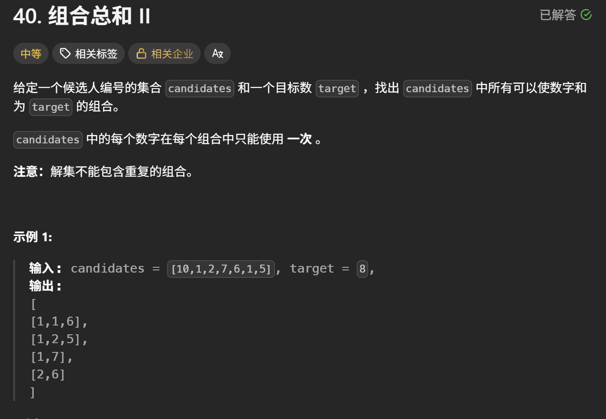

- **每个数字不可重复取用**：递归函数参数 **i + 1**
- **元素有重复**：由于还要去重，所以得先排序，同一树枝上元素有重复没有关系，因为**同一结果数组里面元素有重复符合题意，不符合的是整个数组重复**
- **结果不可重复** ：同一树层上的不可重复， 因为这意味着**接下来递归的 内容 和上一个重复的元素一样**（数组已经排序，且递归是按下标递归）

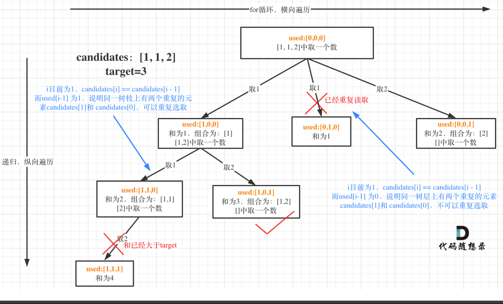

---

- used[i - 1] == true，说明同一树枝candidates[i - 1]使用过，因为**每次放入会复制为true，而同树层横向跳跃前，不会经过used[i]=false这一操作**
- used[i - 1] == false，说明同一树层candidates[i - 1]使用过，因为**从该节点遍历到该树枝完后才跳到同一个树层的下一个节点，而跳出时会撤销：used[i]=false**
- candidates[i] = candidates[i - 1] 条件一加，表明当前元素和上一层的相同
- 合在一起，表示该元素在横向或竖向上重复了

---

```cpp
class Solution {
private:
    vector<vector<int>> result;
    vector<int> path;
    void backTracking(vector<int>& candidates, int target, int startIndex, 
    int sum, vector<bool> &used){
        if(sum > target){
            return;
        }else if(sum == target){
            result.push_back(path);
            return;
        }
        for(int i = startIndex; i < candidates.size() && 
        sum + candidates[i] <= target; i++){
            //同一树层的还相同的元素去掉，因为这代表后面的回溯会重复
            // used[i - 1] == true，说明同一树枝candidates[i - 1]使用过
            // used[i - 1] == false，说明同一树层candidates[i - 1]使用过
            //candidates[i] = candidates[i - 1] 条件一加，表明当前元素和上一层的相同
            if(i > 0 && candidates[i] == candidates[i - 1] && used[i - 1] == false){
                continue;
            }
            path.push_back(candidates[i]);
            sum += candidates[i];
            used[i] = true;
            backTracking(candidates, target, i + 1, sum, used);
            used[i] = false;//记得撤销used数组
            sum -= candidates[i];
            path.pop_back();
        }
    }

public:
    vector<vector<int>> combinationSum2(vector<int>& candidates, int target) {
        //这里不能放在private里，因为那里candidates还没有定义
        vector<bool> used(candidates.size(), false);
        //排序后相同的元素相邻，candidates[i] == candidates[i-1] 才能检测出所有重复元素
        sort(candidates.begin(), candidates.end());
        backTracking(candidates, target, 0, 0, used);
        return result;
    }
};
```


## 电话号码的字母组合

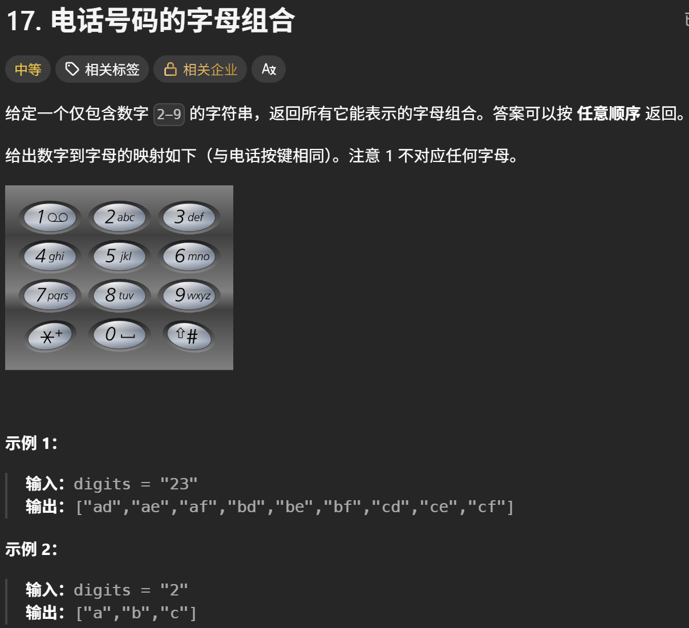

### **如果是多个集合取组合，各个集合之间相互不影响，那么就不用startIndex**

```cpp
class Solution {
private:
    const string letterMap[10] = {
        "",
        "",
        "abc",
        "def",
        "ghi",
        "jkl",
        "mno",
        "pqrs",
        "tuv",
        "wxyz",
    };

public:
    vector<string> result;
    string path;
    void backTracking(const string &digits, int index){
        if(index == digits.size()){
            result.push_back(path);
            return;
        }
        int num = digits[index] - '0';
        string letters = letterMap[num];
        for(int i = 0; i <letters.size(); i ++){
            path.push_back(letters[i]);
            backTracking(digits, index + 1);
            path.pop_back();
        }
    }

    vector<string> letterCombinations(string digits) {
        if(digits.size() == 0){
            return result;
        }
        backTracking(digits, 0);
        return result;
    }
};
```

## **分割字符串**

### **分割回文串**

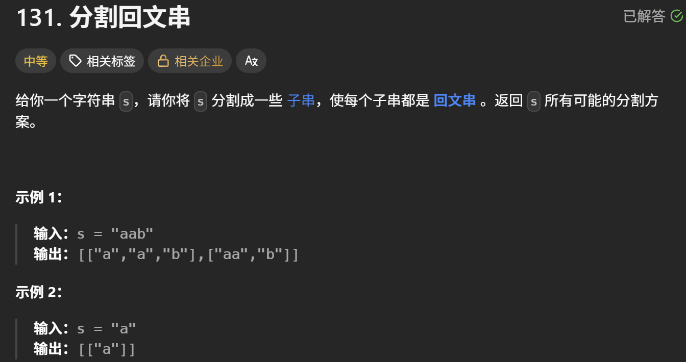

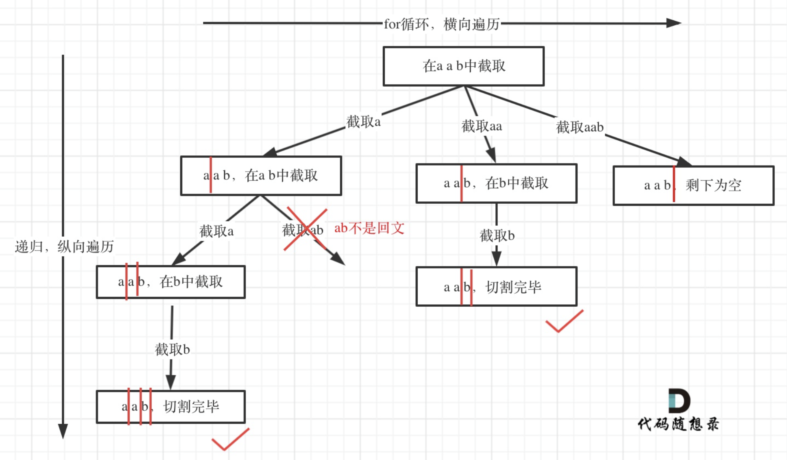

```cpp
class Solution {
private:
    vector<vector<string>> result;
    vector<string> path;
    bool isPalindrome(const string &s, int start, int end){
        for(int i = start, j = end; i < j; i ++, j --){
            if(s[i] != s[j]){
                return false;
            }
        }
        return true;
    }

    void backTracking(const string &s, int startIndex){
        //由于题目没有给取几个数，则递归深度为字符串长度
        //（因为要每一个字符都分割），故直接用 startIndex >= s.size() 为终止条件
        if(startIndex >= s.size()){
            //这里可以直接放
            //因为不符合的在上一层已经被continue掉了
            result.push_back(path);
            return;
        }
        for(int i = startIndex; i < s.size(); i ++){
            if(isPalindrome(s, startIndex, i)){
                //从startIndex开始截取， 每一种可能的长度都试
                string str = s.substr(startIndex, i - startIndex + 1);
                path.push_back(str);
            }else{
                continue;
            }
            backTracking(s, i + 1);//是i + 1， 不是startIndex + 1
            path.pop_back();
        }
    }

public:
    vector<vector<string>> partition(string s) {
        backTracking(s, 0);
        return result;
    }
};
```

### **复原IP地址**

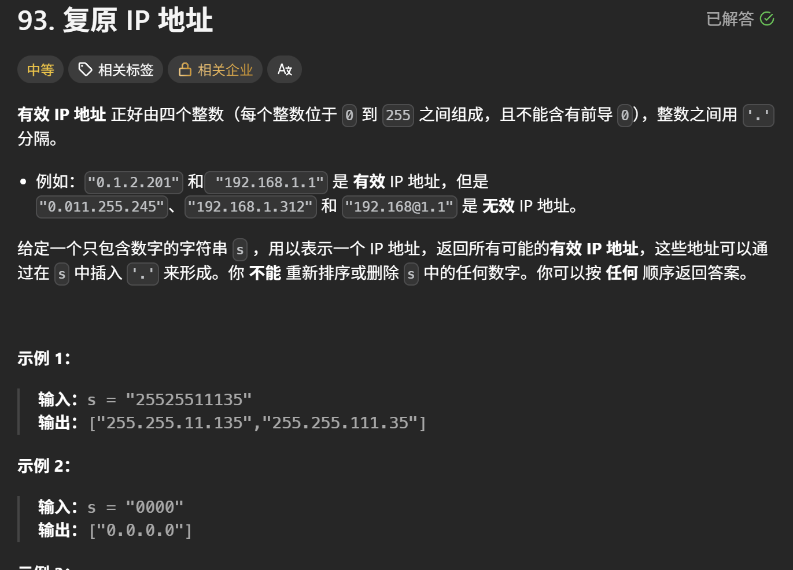

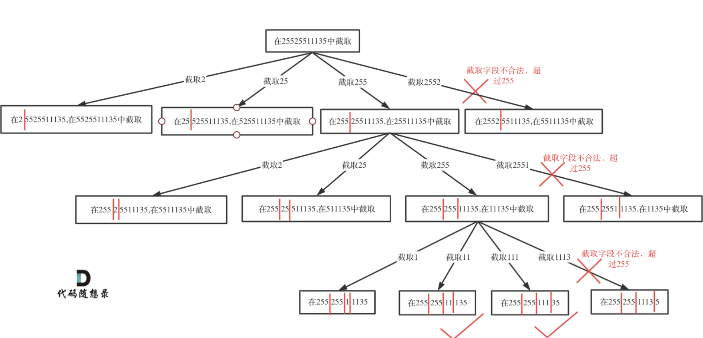

- **字符串大于10的字符转化为整型** -> isValid()
- s.insert(s.begin() + i + 1, '.');
- s.erase(s.begin() + i + 1);

```cpp
class Solution {
private:
    vector<string> result;
    bool isValid(const string &s, int start, int end){
        if(start > end){
            return false;
        }
        if(s[start] == '0' && start != end){
            return false;
        }
        //以下是整数分解
        int num = 0;
        for(int i = start; i <= end; i ++){
            if(s[i] > '9' || s[i] < '0'){
                return false;
            }
            num = num * 10 + (s[i] - '0');
            if(num > 255){
                return false;
            }
        }
        return true;
    }

    void backTracking(string &s, int startIndex, int pointNum){
        if(pointNum == 3){
            //到了第四个也即最后一个，后面不需要加'.'
            //如果在让函数进入下面的for循环，会多加'.'，且让pointNum继续增加
            //所以这里一定要再加一个if语句，判断最后一个数是否符合
            if(isValid(s, startIndex, s.size() - 1)){
                result.push_back(s);
                return;
            }
        }
        for(int i = startIndex; i < s.size(); i ++){
            if(isValid(s, startIndex, i)) {
                s.insert(s.begin() + i + 1, '.');
                pointNum ++;
                //注意是i + 2,因为有'.'
                backTracking(s, i + 2, pointNum);
                pointNum --;
                //注意是 i + 1，不是startIndex + 1
                s.erase(s.begin() + i + 1);
            }else{
                //不用continue, 因为如果从startIndex到i不满足，那到i + 1必然不满足
                break;
            }
        }
    }

public:
    vector<string> restoreIpAddresses(string s) {
        result.clear();
        if(s.size() <  4 || s.size() > 12){
            return result;
        }
        backTracking(s, 0, 0);
        return result;
    }
};
```

## 所有子集

- 但由于**要取树上的所有节点**，所有可以不用return，或者也可以

### 不含重复元素

- 记得result要放在终止语句之外

```cpp
result.push_back(path); // 收集子集，要放在终止添加的上面，否则会漏掉自己
        if (startIndex >= nums.size()) { // 终止条件可以不加
            return;
        }
```

### 含重复元素

- 类似组合求和使用used数组那道
- **要记得排序**

```cpp
if(startIndex >= nums.size()){
    return;
}
```


- 使用**set**去重版本
- **要记得去重**
- 错误写法：
  - 把uset定义放到类成员位置，然后模拟回溯的样子 insert一次，erase一次，这样把树枝的情况都记录了，不是单纯的控制某一节点下的同一层了。
  - 把 unordered_set uset; 放到类成员位置，然后每次进入单层的时候用uset.clear()，层与层之间的uset是同一个，那么就会相互影响

```cpp
void backtracking(vector<int>& nums, int startIndex) {
        result.push_back(path);
        unordered_set<int> uset;
        for (int i = startIndex; i < nums.size(); i++) {
            if (uset.find(nums[i]) != uset.end()) {
                continue;
            }
            uset.insert(nums[i]);
            path.push_back(nums[i]);
            backtracking(nums, i + 1);
            path.pop_back();
        }
    }
```

- 不用used数组去重

```cpp
void backtracking(vector<int>& nums, int startIndex) {
        result.push_back(path);
        for (int i = startIndex; i < nums.size(); i++) {
            // 而我们要对同一树层使用过的元素进行跳过
            if (i > startIndex && nums[i] == nums[i - 1] ) { 
            // 注意这里使用i > startIndex
                continue;
            }
            path.push_back(nums[i]);
            backtracking(nums, i + 1);
            path.pop_back();
        }
    }
```

### **非递减子序列**

!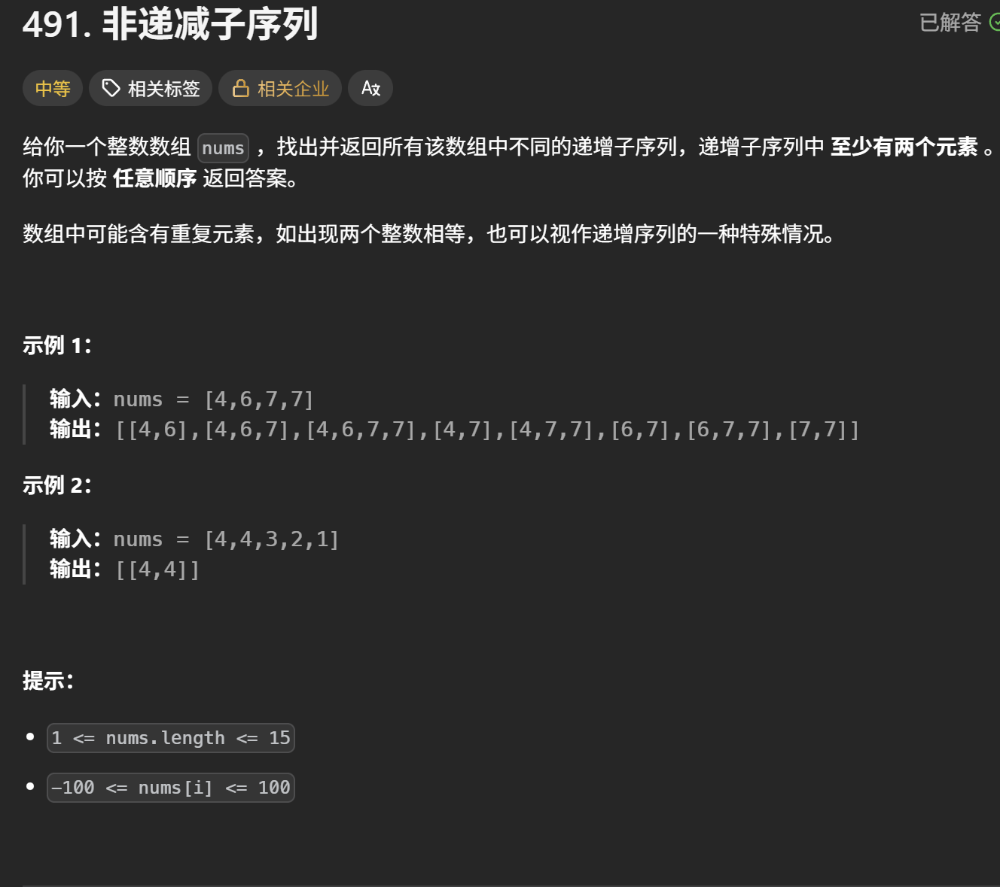

- 本题求**自增子序列，是不能对原数组进行排序的**，排完序的数组都是自增子序列了,所以不能使用之前的去重逻辑！
- 可以用set，但时间复杂度较高
- 以下用used数组

```cpp
    void backtracking(vector<int>& nums, int startIndex) {
        if (path.size() > 1) {
            result.push_back(path);
        }
        // 这里使用数组来进行去重操作，题目说数值范围[-100, 100]
        //这递归函数里定义used数组，这样才能表明同一层中是否用过
        int used[201] = {0}; 
        for (int i = startIndex; i < nums.size(); i++) {
            //这里记得检验path是否为空
            if ((!path.empty() && nums[i] < path.back())
                    || used[nums[i] + 100] == 1) {
                    continue;
            }
            // 记录这个元素在本层用过了，本层后面不能再用了
            //对每一个数一个专门的位置，表明同一层中若用过，则直接跳过
            used[nums[i] + 100] = 1; 
            path.push_back(nums[i]);
            backtracking(nums, i + 1);
            path.pop_back();
        }
    }
```

## **全排列**

### 不含重复数字

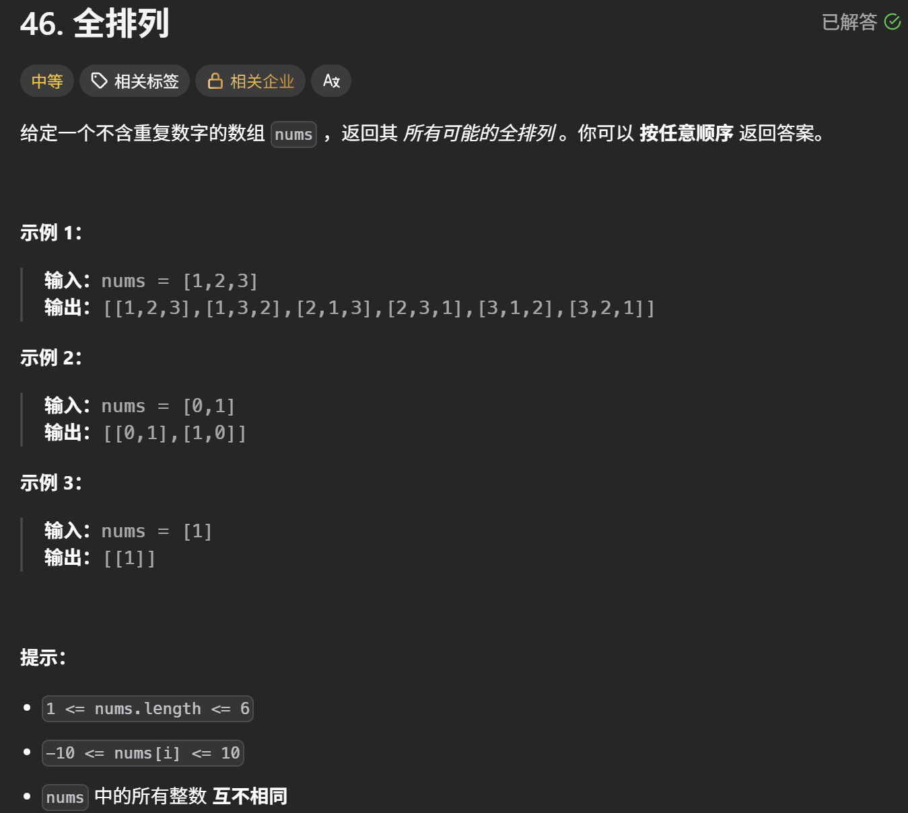

- 与所给数组中有重复元素，但结果数组不能重复那道不同，
- **排列要求同一树枝上的不能重复，那道要求同一树层不能重复**

```cpp
void backTracking(vector<int> nums, vector<bool> &used){
        if(path.size() == nums.size()){
            result.push_back(path);
            return;
        }
        for(int i = 0; i < nums.size(); i ++){
            //表示这一个树枝上nums[i]已经用过，直接终止，进入nums[i + 1]
            if(used[i] == true){
                continue;
            }
            path.push_back(nums[i]);
            used[i] = true;
            backTracking(nums, used);
            used[i] = false;
            path.pop_back();
        }
    }
```

### 含有重复数字

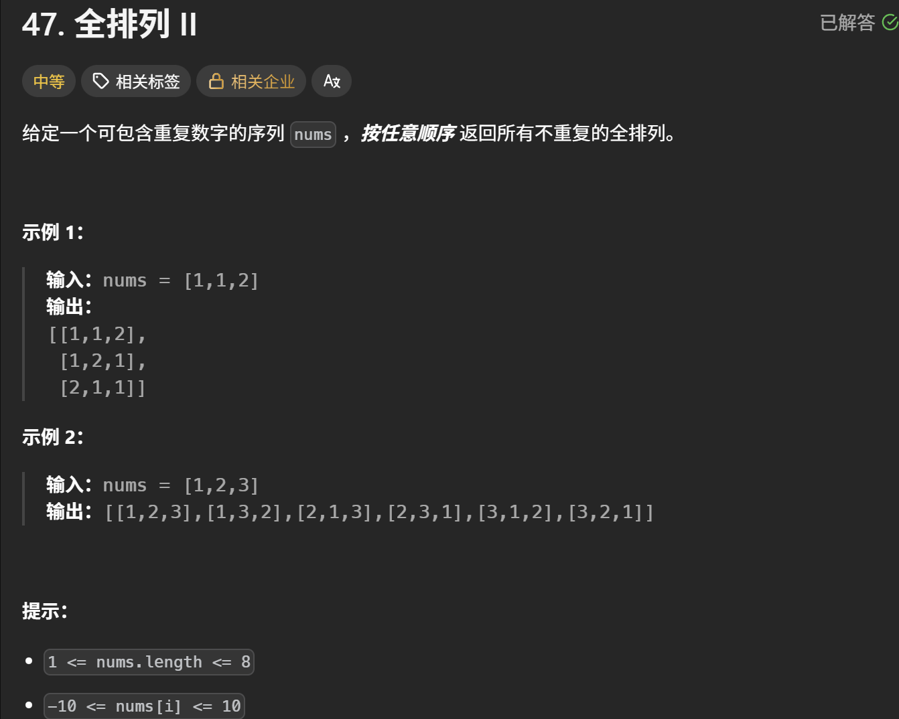

- 第一种，**树层上去重**

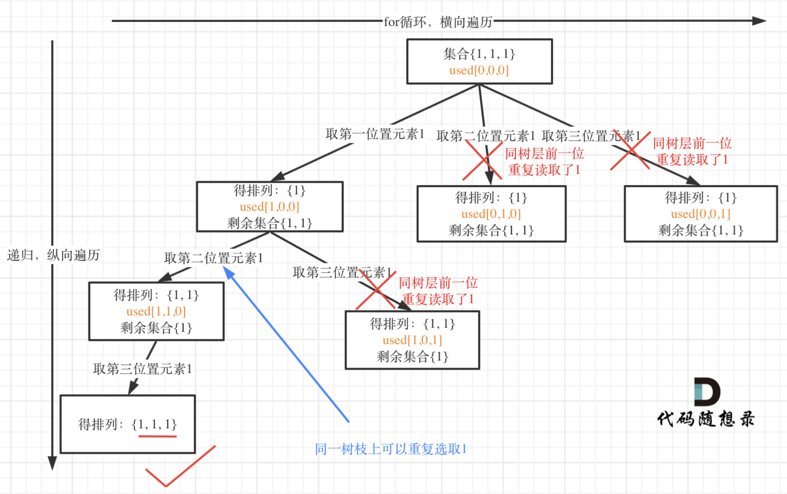

```cpp
if (i > 0 && nums[i] == nums[i - 1] && used[i - 1] == false) {
    continue;
}
```

- 第二种，**树枝上去重**

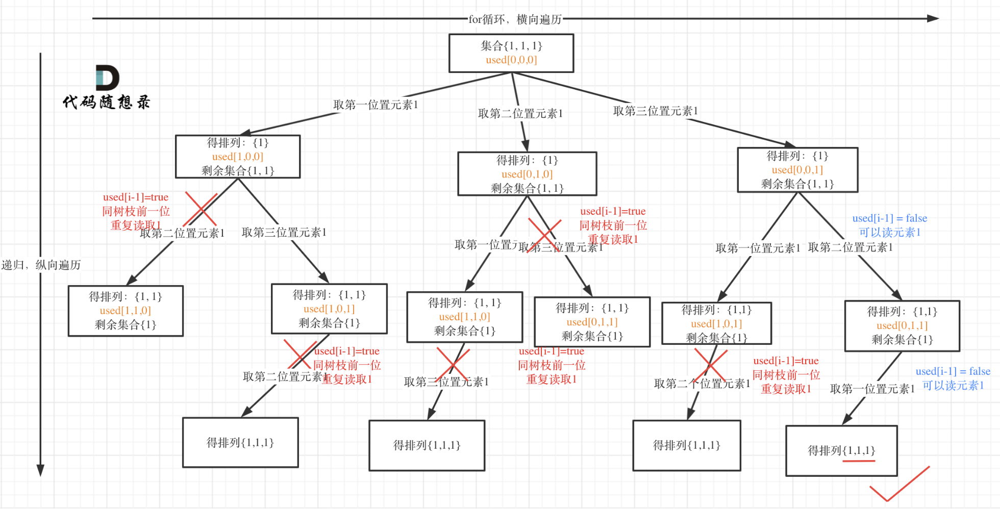

```cpp
if (i > 0 && nums[i] == nums[i - 1] && used[i - 1] == true) {
    continue;
}
```

- 对比：前者相当于去掉**枝干**，后者相当于去掉**细枝**

  - 排列：**无start，全数组遍历**，即使跳过当前这个相同元素，后续还能在其他分支中选取其他索引的元素，不会影响有效排列的生成（只是多走一些分支，最终结果完整
  - 组合：**有start**，组合的start=i+1逻辑是 “单向推进，不回头”，一旦在当前树枝上因为used[i-1] == true跳过某个元素，后续没有任何机会再选取该元素来组成有效组合
- 性能：**对于排列问题，树层上去重和树枝上去重，都是可以的，但是树层上去重效率更高！**
- 注意：不能因为used[i - 1]是true或者false都行就不写这个条件，因为 used[i - 1] **要一直是 true 或者一直是false** 才可以，而不是 一会是true 一会又是false。 所以这个条件要写上

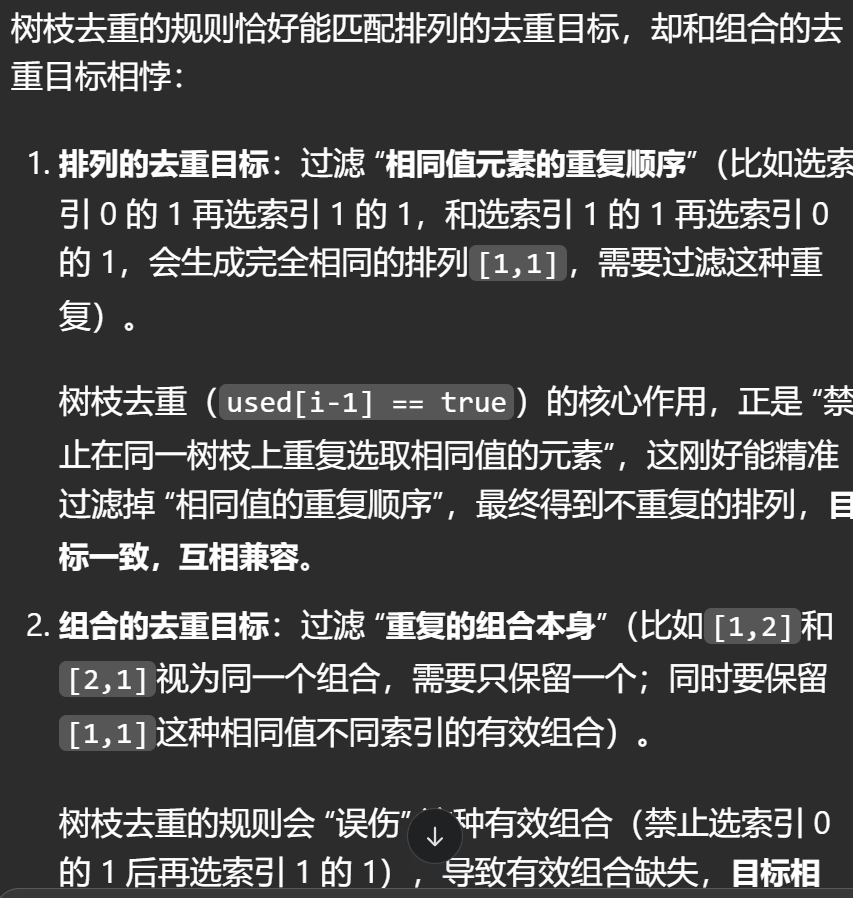

## **重新安排行程**

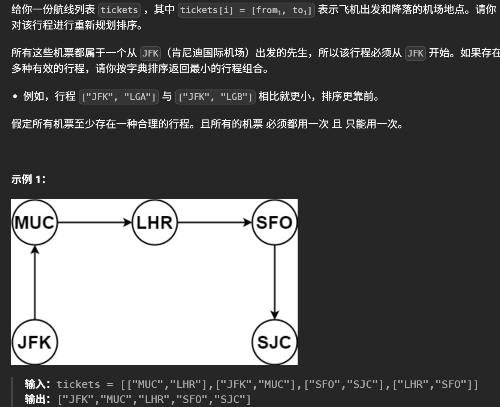

- 选择**unoedered_map<string, map<string, int>>**

```cpp
class Solution {
private:
// unordered_map<出发机场, map<到达机场, 航班次数>> targets
unordered_map<string, map<string, int>> targets;
bool backtracking(int ticketNum, vector<string>& result) {
    if (result.size() == ticketNum + 1) {
        return true;
    }
    for (pair<const string, int>& target : targets[result[result.size() - 1]]) {
        if (target.second > 0 ) { // 记录到达机场是否飞过了
            result.push_back(target.first);
            target.second--;
            if (backtracking(ticketNum, result)) return true;
            result.pop_back();
            target.second++;
        }
    }
    return false;
}
public:
    vector<string> findItinerary(vector<vector<string>>& tickets) {
        targets.clear();
        vector<string> result;
        for (const vector<string>& vec : tickets) {
            targets[vec[0]][vec[1]]++; // 记录映射关系
        }
        result.push_back("JFK"); // 起始机场
        backtracking(tickets.size(), result);
        return result;
    }
};
```

## **N皇后**

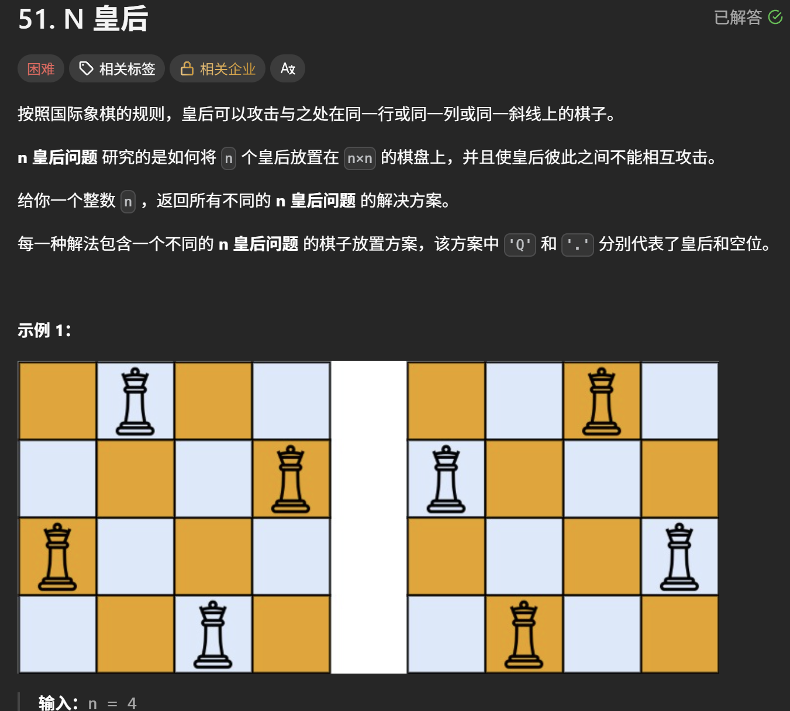

```cpp
class Solution {
private:
vector<vector<string>> result;
// n 为输入的棋盘大小
// row 是当前递归到棋盘的第几行了
void backtracking(int n, int row, vector<string>& chessboard) {
    if (row == n) {
        result.push_back(chessboard);
        return;
    }
    for (int col = 0; col < n; col++) {
        if (isValid(row, col, chessboard, n)) { // 验证合法就可以放
            chessboard[row][col] = 'Q'; // 放置皇后
            backtracking(n, row + 1, chessboard);
            chessboard[row][col] = '.'; // 回溯，撤销皇后
        }
    }
}
bool isValid(int row, int col, vector<string>& chessboard, int n) {
    // 检查列
    for (int i = 0; i < row; i++) { // 这是一个剪枝
        if (chessboard[i][col] == 'Q') {
            return false;
        }
    }
    // 检查 45度角是否有皇后
    for (int i = row - 1, j = col - 1; i >=0 && j >= 0; i--, j--) {
        if (chessboard[i][j] == 'Q') {
            return false;
        }
    }
    // 检查 135度角是否有皇后
    for(int i = row - 1, j = col + 1; i >= 0 && j < n; i--, j++) {
        if (chessboard[i][j] == 'Q') {
            return false;
        }
    }
    return true;
}
public:
    vector<vector<string>> solveNQueens(int n) {
        result.clear();
        std::vector<std::string> chessboard(n, std::string(n, '.'));
        backtracking(n, 0, chessboard);
        return result;
    }
};
```

## **解数独**

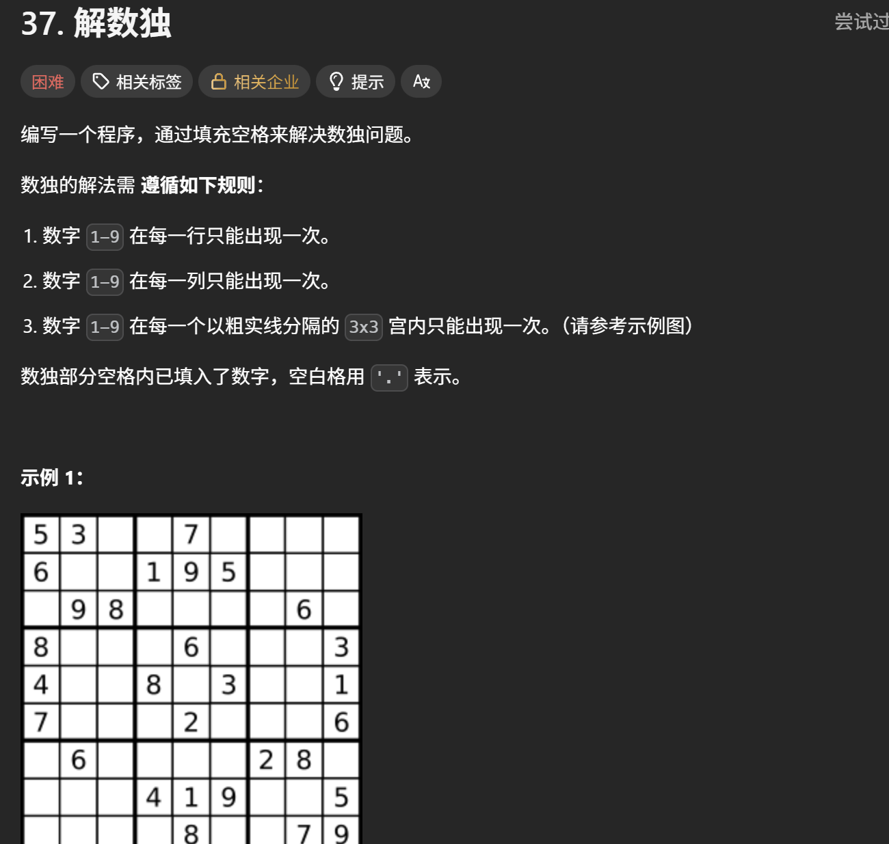

```cpp
class Solution {
private:
bool backtracking(vector<vector<char>>& board) {
    for (int i = 0; i < board.size(); i++) {        // 遍历行
        for (int j = 0; j < board[0].size(); j++) { // 遍历列
            if (board[i][j] == '.') {
                for (char k = '1'; k <= '9'; k++) {     // (i, j) 这个位置放k是否合适
                    if (isValid(i, j, k, board)) {
                        board[i][j] = k;                // 放置k
                        if (backtracking(board)) return true; // 如果找到合适一组立刻返回
                        board[i][j] = '.';              // 回溯，撤销k
                    }
                }
                return false;  // 9个数都试完了，都不行，那么就返回false
            }
        }
    }
    return true; // 遍历完没有返回false，说明找到了合适棋盘位置了
}
bool isValid(int row, int col, char val, vector<vector<char>>& board) {
    for (int i = 0; i < 9; i++) { // 判断行里是否重复
        if (board[row][i] == val) {
            return false;
        }
    }
    for (int j = 0; j < 9; j++) { // 判断列里是否重复
        if (board[j][col] == val) {
            return false;
        }
    }
    int startRow = (row / 3) * 3;
    int startCol = (col / 3) * 3;
    for (int i = startRow; i < startRow + 3; i++) { // 判断9方格里是否重复
        for (int j = startCol; j < startCol + 3; j++) {
            if (board[i][j] == val ) {
                return false;
            }
        }
    }
    return true;
}
public:
    void solveSudoku(vector<vector<char>>& board) {
        backtracking(board);
    }
};

```
