# **图论**

## **理论基础**

### **连通性**

- 无向连通图：
- 有向强连通图：**要相互**
- 连通分量：
- 强连通分量：

### **图的构造**

- 朴素存储：如图第一行指6指向7
- 邻接矩阵：如图指节点2指向节点5，权值为6
- 邻接表：

## **深搜**

```cpp
void dfs(参数) {
    if (终止条件) {
        存放结果;
        return;
    }

    for (选择：本节点所连接的其他节点) {
        处理节点;
        dfs(图，选择的节点); // 递归
        回溯，撤销处理结果
    }
}
```

### **所有可达路径**


- 邻接矩阵

```cpp
#include <iostream>
#include <vector>
using namespace std;
vector<vector<int>> result; // 收集符合条件的路径
vector<int> path; // 1节点到终点的路径

void dfs (const vector<vector<int>>& graph, int x, int n) {
    // 当前遍历的节点x 到达节点n 
    if (x == n) { // 找到符合条件的一条路径
        result.push_back(path);
        return;
    }
    for (int i = 1; i <= n; i++) { // 遍历节点x链接的所有节点
        if (graph[x][i] == 1) { // 找到 x链接的节点
            path.push_back(i); // 遍历到的节点加入到路径中来
            dfs(graph, i, n); // 进入下一层递归
            path.pop_back(); // 回溯，撤销本节点
        }
    }
}

int main() {
    int n, m, s, t;
    cin >> n >> m;

    // 节点编号从1到n，所以申请 n+1 这么大的数组
    vector<vector<int>> graph(n + 1, vector<int>(n + 1, 0));

    while (m--) {
        cin >> s >> t;
        // 使用邻接矩阵 表示无线图，1 表示 s 与 t 是相连的
        graph[s][t] = 1;
    }

    path.push_back(1); // 无论什么路径已经是从0节点出发
    dfs(graph, 1, n); // 开始遍历

    // 输出结果
    if (result.size() == 0) cout << -1 << endl;
    for (const vector<int> &pa : result) {
        for (int i = 0; i < pa.size() - 1; i++) {
            cout << pa[i] << " ";
        }
        cout << pa[pa.size() - 1]  << endl;
    }
}
```

- 邻接表

```cpp
#include <iostream>
#include <vector>
#include <list>
using namespace std;

vector<vector<int>> result; // 收集符合条件的路径
vector<int> path; // 1节点到终点的路径

void dfs (const vector<list<int>>& graph, int x, int n) {

    if (x == n) { // 找到符合条件的一条路径
        result.push_back(path);
        return;
    }
    for (int i : graph[x]) { // 找到 x指向的节点
        path.push_back(i); // 遍历到的节点加入到路径中来
        dfs(graph, i, n); // 进入下一层递归
        path.pop_back(); // 回溯，撤销本节点
    }
}

int main() {
    int n, m, s, t;
    cin >> n >> m;

    // 节点编号从1到n，所以申请 n+1 这么大的数组
    vector<list<int>> graph(n + 1); // 邻接表
    while (m--) {
        cin >> s >> t;
        // 使用邻接表 ，表示 s -> t 是相连的
        graph[s].push_back(t);

    }

    path.push_back(1); // 无论什么路径已经是从0节点出发
    dfs(graph, 1, n); // 开始遍历

    // 输出结果
    if (result.size() == 0) cout << -1 << endl;
    for (const vector<int> &pa : result) {
        for (int i = 0; i < pa.size() - 1; i++) {
            cout << pa[i] << " ";
        }
        cout << pa[pa.size() - 1]  << endl;
    }
}
```

## **广搜**


```cpp
int dir[4][2] = {0, 1, 1, 0, -1, 0, 0, -1}; // 表示四个方向
// grid 是地图，也就是一个二维数组
// visited标记访问过的节点，不要重复访问
// x,y 表示开始搜索节点的下标
void bfs(vector<vector<char>>& grid, vector<vector<bool>>& visited, int x, int y) {
    queue<pair<int, int>> que; // 定义队列
    que.push({x, y}); // 起始节点加入队列
    visited[x][y] = true; // 只要加入队列，立刻标记为访问过的节点
    while(!que.empty()) { // 开始遍历队列里的元素
        pair<int ,int> cur = que.front(); que.pop(); // 从队列取元素
        int curx = cur.first;
        int cury = cur.second; // 当前节点坐标
        for (int i = 0; i < 4; i++) { // 开始想当前节点的四个方向左右上下去遍历
            int nextx = curx + dir[i][0];
            int nexty = cury + dir[i][1]; // 获取周边四个方向的坐标
            if (nextx < 0 || nextx >= grid.size() || nexty < 0 || nexty >= grid[0].size()) continue;  // 坐标越界了，直接跳过
            if (!visited[nextx][nexty]) { // 如果节点没被访问过
                que.push({nextx, nexty});  // 队列添加该节点为下一轮要遍历的节点
                visited[nextx][nexty] = true; // 只要加入队列立刻标记，避免重复访问
            }
        }
    }

}
```

## **岛屿数量**


- 本题思路，是用遇到一个没有遍历过的节点陆地，计数器就加一，然后把该节点陆地所能遍历到的陆地都标记上
- 在遇到标记过的陆地节点和海洋节点的时候直接跳过。 这样计数器就是最终岛屿的数量
- 深搜：

```cpp
#include <iostream>
#include <vector>
using namespace std;
int dir[4][2] = {0, 1, 1, 0, -1, 0, 0, -1}; // 四个方向
void dfs(const vector<vector<int>>& grid, vector<vector<bool>>& visited, int x, int y) {
    if (visited[x][y] || grid[x][y] == 0) return; // 终止条件：访问过的节点 或者 遇到海水
    visited[x][y] = true; // 标记访问过
    for (int i = 0; i < 4; i++) {
        int nextx = x + dir[i][0];
        int nexty = y + dir[i][1];
        if (nextx < 0 || nextx >= grid.size() || nexty < 0 || nexty >= grid[0].size()) continue;  // 越界了，直接跳过
        dfs(grid, visited, nextx, nexty);
    }
}

int main() {
    int n, m;
    cin >> n >> m;
    vector<vector<int>> grid(n, vector<int>(m, 0));
    for (int i = 0; i < n; i++) {
        for (int j = 0; j < m; j++) {
            cin >> grid[i][j];
        }
    }

    vector<vector<bool>> visited(n, vector<bool>(m, false));

    int result = 0;
    for (int i = 0; i < n; i++) {
        for (int j = 0; j < m; j++) {
            if (!visited[i][j] && grid[i][j] == 1) {
                result++; // 遇到没访问过的陆地，+1
                dfs(grid, visited, i, j); // 将与其链接的陆地都标记上 true
            }
        }
    }
    cout << result << endl;
}
```

- 广搜：

```cpp
// 区别只在bfs函数
void bfs(const vector<vector<int>>& grid, vector<vector<bool>>& visited, int x, int y) {
    queue<pair<int, int>> que;
    que.push({x, y});
    visited[x][y] = true; // 只要加入队列，立刻标记
    while(!que.empty()) {
        pair<int ,int> cur = que.front(); que.pop();
        int curx = cur.first;
        int cury = cur.second;
        for (int i = 0; i < 4; i++) {
            int nextx = curx + dir[i][0];
            int nexty = cury + dir[i][1];
            if (nextx < 0 || nextx >= grid.size() || nexty < 0 || nexty >= grid[0].size()) continue;  // 越界了，直接跳过
            if (!visited[nextx][nexty] && grid[nextx][nexty] == 1) {
                que.push({nextx, nexty});
                visited[nextx][nexty] = true; // 只要加入队列立刻标记
            }
        }
    }
}
```

## **最大岛屿面积**

- 总体类似，区别在要用全局变量count记录更新每一轮的数量，然后用result记录最大值

## **孤岛的总面积**

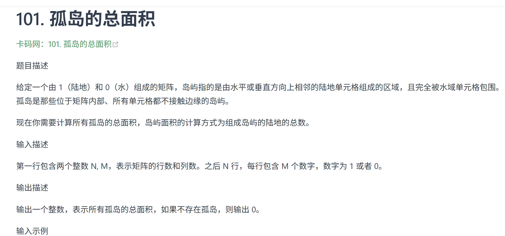

- 只要从周边找到陆地然后 通过 dfs或者bfs **将周边靠陆地且相邻的陆地都变成海洋**，然后再去重新遍历地图 统计此时还剩下的陆地就可以了
- 深搜：

```cpp
#include <iostream>
#include <vector>
using namespace std;
int dir[4][2] = {-1, 0, 0, -1, 1, 0, 0, 1}; // 保存四个方向
void dfs(vector<vector<int>>& grid, int x, int y) {
    grid[x][y] = 0;
    for (int i = 0; i < 4; i++) { // 向四个方向遍历
        int nextx = x + dir[i][0];
        int nexty = y + dir[i][1];
        // 超过边界
        if (nextx < 0 || nextx >= grid.size() || nexty < 0 || nexty >= grid[0].size()) continue;
        // 不符合条件，不继续遍历
        if (grid[nextx][nexty] == 0) continue;

        dfs (grid, nextx, nexty);
    }
    return;
}

int main() {
    int n, m;
    cin >> n >> m;
    vector<vector<int>> grid(n, vector<int>(m, 0));
    for (int i = 0; i < n; i++) {
        for (int j = 0; j < m; j++) {
            cin >> grid[i][j];
        }
    }

    // 从左侧边，和右侧边 向中间遍历
    for (int i = 0; i < n; i++) {
        if (grid[i][0] == 1) dfs(grid, i, 0);
        if (grid[i][m - 1] == 1) dfs(grid, i, m - 1);
    }
    // 从上边和下边 向中间遍历
    for (int j = 0; j < m; j++) {
        if (grid[0][j] == 1) dfs(grid, 0, j);
        if (grid[n - 1][j] == 1) dfs(grid, n - 1, j);
    }
    int count = 0;
    for (int i = 0; i < n; i++) {
        for (int j = 0; j < m; j++) {
            if (grid[i][j] == 1) count++;
        }
    }
    cout << count << endl;
}
```

- 广搜：

```cpp
// 只在bfs函数有区别
void bfs(vector<vector<int>>& grid, int x, int y) {
    queue<pair<int, int>> que;
    que.push({x, y});
    grid[x][y] = 0; // 只要加入队列，立刻标记
    while(!que.empty()) {
        pair<int ,int> cur = que.front(); que.pop();
        int curx = cur.first;
        int cury = cur.second;
        for (int i = 0; i < 4; i++) {
            int nextx = curx + dir[i][0];
            int nexty = cury + dir[i][1];
            if (nextx < 0 || nextx >= grid.size() || nexty < 0 || nexty >= grid[0].size()) continue;  // 越界了，直接跳过
            if (grid[nextx][nexty] == 1) {
                que.push({nextx, nexty});
                grid[nextx][nexty] = 0; // 只要加入队列立刻标记
            }
        }
    }
}
```

## **沉没孤岛**

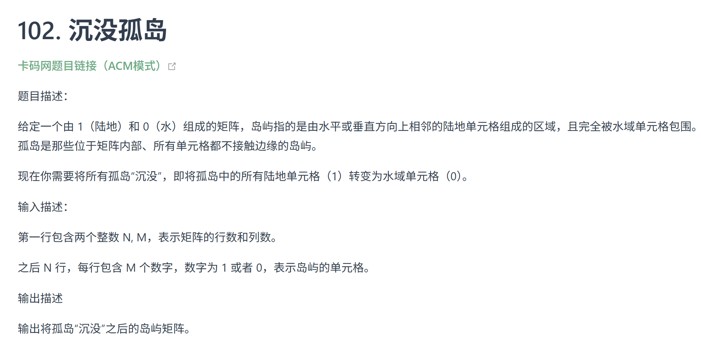

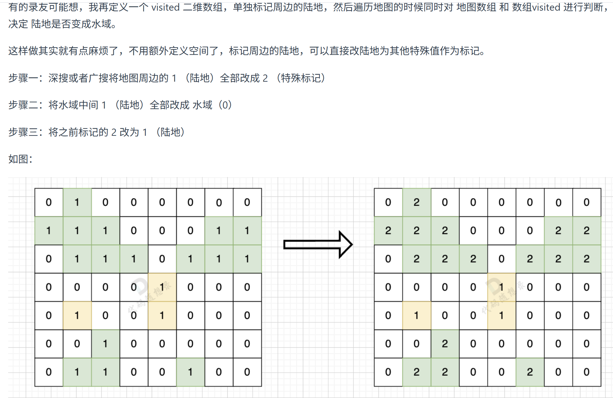

```cpp
#include <iostream>
#include <vector>
using namespace std;
int dir[4][2] = {-1, 0, 0, -1, 1, 0, 0, 1}; // 保存四个方向
void dfs(vector<vector<int>>& grid, int x, int y) {
    grid[x][y] = 2;
    for (int i = 0; i < 4; i++) { // 向四个方向遍历
        int nextx = x + dir[i][0];
        int nexty = y + dir[i][1];
        // 超过边界
        if (nextx < 0 || nextx >= grid.size() || nexty < 0 || nexty >= grid[0].size()) continue;
        // 不符合条件，不继续遍历
        if (grid[nextx][nexty] == 0 || grid[nextx][nexty] == 2) continue;
        dfs (grid, nextx, nexty);
    }
    return;
}

int main() {
    int n, m;
    cin >> n >> m;
    vector<vector<int>> grid(n, vector<int>(m, 0));
    for (int i = 0; i < n; i++) {
        for (int j = 0; j < m; j++) {
            cin >> grid[i][j];
        }
    }

    // 步骤一：
    // 从左侧边，和右侧边 向中间遍历
    for (int i = 0; i < n; i++) {
        if (grid[i][0] == 1) dfs(grid, i, 0);
        if (grid[i][m - 1] == 1) dfs(grid, i, m - 1);
    }

    // 从上边和下边 向中间遍历
    for (int j = 0; j < m; j++) {
        if (grid[0][j] == 1) dfs(grid, 0, j);
        if (grid[n - 1][j] == 1) dfs(grid, n - 1, j);
    }
    // 步骤二、步骤三
    for (int i = 0; i < n; i++) {
        for (int j = 0; j < m; j++) {
            if (grid[i][j] == 1) grid[i][j] = 0;
            if (grid[i][j] == 2) grid[i][j] = 1;
        }
    }
    for (int i = 0; i < n; i++) {
        for (int j = 0; j < m; j++) {
            cout << grid[i][j] << " ";
        }
        cout << endl;
    }
}
```

## **水流问题**

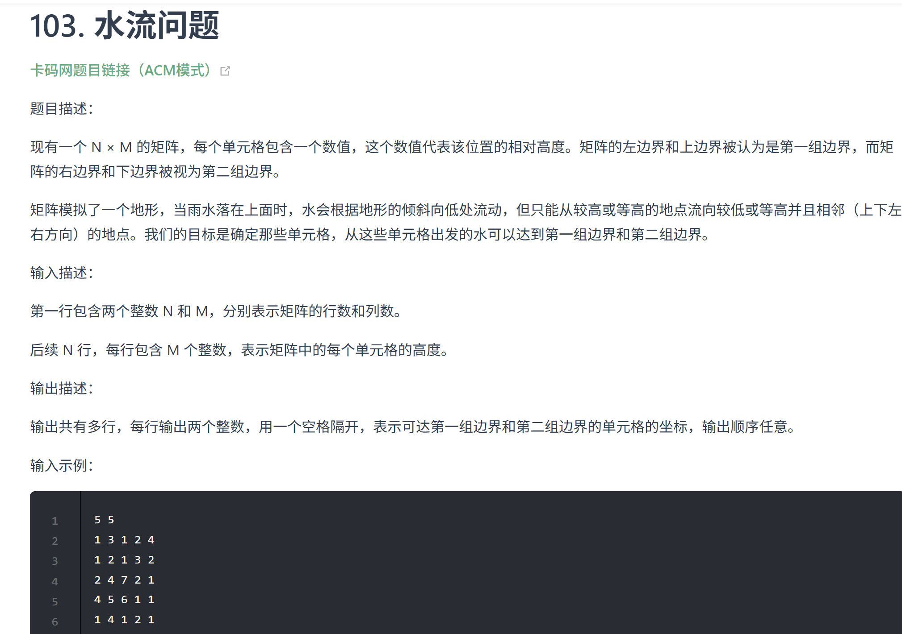

```cpp
#include <iostream>
#include <vector>
using namespace std;
int n, m;
int dir[4][2] = {-1, 0, 0, -1, 1, 0, 0, 1};

// 从 x，y 出发 把可以走的地方都标记上
void dfs(vector<vector<int>>& grid, vector<vector<bool>>& visited, int x, int y) {
    if (visited[x][y]) return;

    visited[x][y] = true;

    for (int i = 0; i < 4; i++) {
        int nextx = x + dir[i][0];
        int nexty = y + dir[i][1];
        if (nextx < 0 || nextx >= n || nexty < 0 || nexty >= m) continue;
        if (grid[x][y] < grid[nextx][nexty]) continue; // 高度不合适

        dfs (grid, visited, nextx, nexty);
    }
    return;
}
bool isResult(vector<vector<int>>& grid, int x, int y) {
    vector<vector<bool>> visited(n, vector<bool>(m, false));

    // 深搜，将x,y出发 能到的节点都标记上。
    dfs(grid, visited, x, y);
    bool isFirst = false;
    bool isSecond = false;

    // 以下就是判断x，y出发，是否到达第一组边界和第二组边界
    // 第一边界的上边
    for (int j = 0; j < m; j++) {
        if (visited[0][j]) {
            isFirst = true;
            break;
        }
    }
    // 第一边界的左边
    for (int i = 0; i < n; i++) {
        if (visited[i][0]) {
            isFirst = true;
            break;
        }
    }
    // 第二边界下边
    for (int j = 0; j < m; j++) {
        if (visited[n - 1][j]) {
            isSecond = true;
            break;
        }
    }
    // 第二边界右边
    for (int i = 0; i < n; i++) {
        if (visited[i][m - 1]) {
            isSecond = true;
            break;
        }
    }
    if (isFirst && isSecond) return true;
    return false;
}


int main() {
    cin >> n >> m;
    vector<vector<int>> grid(n, vector<int>(m, 0));
    for (int i = 0; i < n; i++) {
        for (int j = 0; j < m; j++) {
            cin >> grid[i][j];
        }
    }
    // 遍历每一个点，看是否能同时到达第一组边界和第二组边界
    for (int i = 0; i < n; i++) {
        for (int j = 0; j < m; j++) {
            if (isResult(grid, i, j)) {
                cout << i << " " << j << endl;
            }
        }
    }
}
```


```cpp
#include <iostream>
#include <vector>
using namespace std;
int n, m;
int dir[4][2] = {-1, 0, 0, -1, 1, 0, 0, 1};
void dfs(vector<vector<int>>& grid, vector<vector<bool>>& visited, int x, int y) {
    if (visited[x][y]) return;

    visited[x][y] = true;

    for (int i = 0; i < 4; i++) {
        int nextx = x + dir[i][0];
        int nexty = y + dir[i][1];
        if (nextx < 0 || nextx >= n || nexty < 0 || nexty >= m) continue;
        if (grid[x][y] > grid[nextx][nexty]) continue; // 注意：这里是从低向高遍历

        dfs (grid, visited, nextx, nexty);
    }
    return;
}


int main() {

    cin >> n >> m;
    vector<vector<int>> grid(n, vector<int>(m, 0));

    for (int i = 0; i < n; i++) {
        for (int j = 0; j < m; j++) {
            cin >> grid[i][j];
        }
    }
    // 标记从第一组边界上的节点出发，可以遍历的节点
    vector<vector<bool>> firstBorder(n, vector<bool>(m, false));

    // 标记从第一组边界上的节点出发，可以遍历的节点
    vector<vector<bool>> secondBorder(n, vector<bool>(m, false));

    // 从最上和最下行的节点出发，向高处遍历
    for (int i = 0; i < n; i++) {
        dfs (grid, firstBorder, i, 0); // 遍历最左列，接触第一组边界
        dfs (grid, secondBorder, i, m - 1); // 遍历最右列，接触第二组边界
    }
    
    // 从最左和最右列的节点出发，向高处遍历
    for (int j = 0; j < m; j++) {
        dfs (grid, firstBorder, 0, j); // 遍历最上行，接触第一组边界
        dfs (grid, secondBorder, n - 1, j); // 遍历最下行，接触第二组边界
    }
    for (int i = 0; i < n; i++) {
        for (int j = 0; j < m; j++) {
            // 如果这个节点，从第一组边界和第二组边界出发都遍历过，就是结果
            if (firstBorder[i][j] && secondBorder[i][j]) cout << i << " " << j << endl;;
        }
    }


}
```

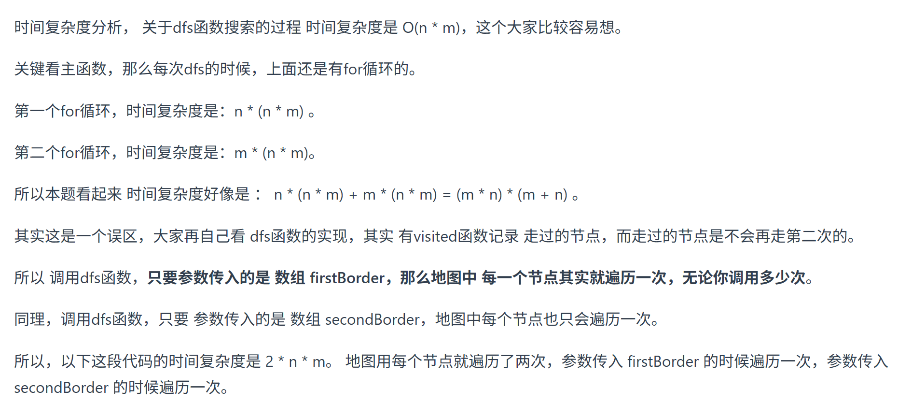

## **建造最大岛屿**

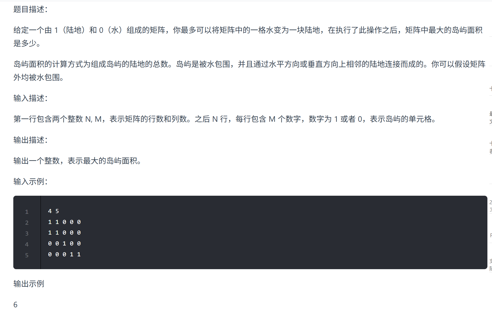


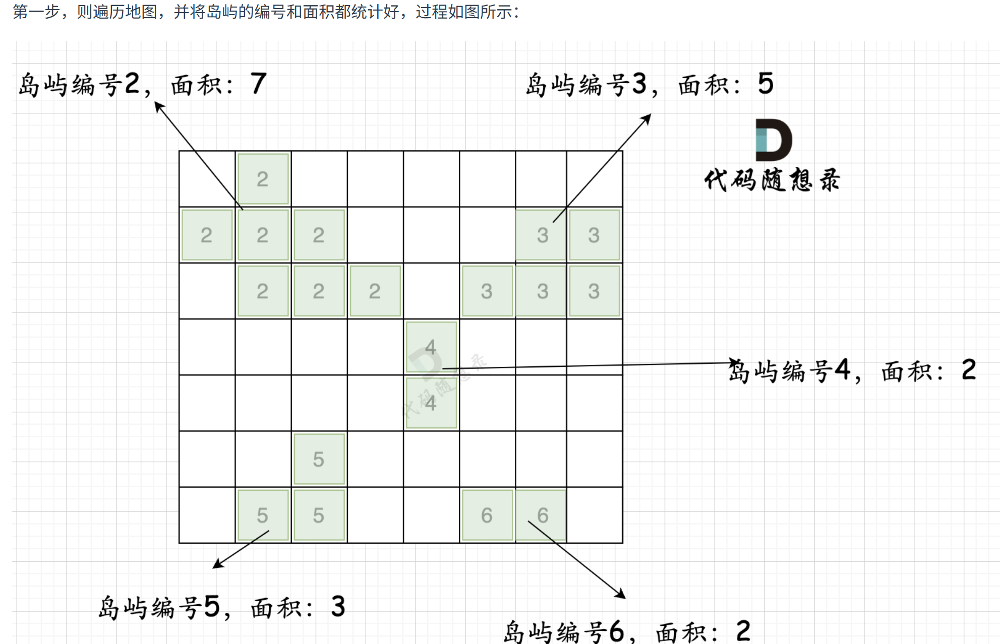

```cpp
#include <iostream>
#include <vector>
#include <unordered_set>
#include <unordered_map>
using namespace std;
int n, m;
int count;

int dir[4][2] = {0, 1, 1, 0, -1, 0, 0, -1}; // 四个方向
void dfs(vector<vector<int>>& grid, vector<vector<bool>>& visited, int x, int y, int mark) {
    if (visited[x][y] || grid[x][y] == 0) return; // 终止条件：访问过的节点 或者 遇到海水
    visited[x][y] = true; // 标记访问过
    grid[x][y] = mark; // 给陆地标记新标签
    count++;
    for (int i = 0; i < 4; i++) {
        int nextx = x + dir[i][0];
        int nexty = y + dir[i][1];
        if (nextx < 0 || nextx >= n || nexty < 0 || nexty >= m) continue;  // 越界了，直接跳过
        dfs(grid, visited, nextx, nexty, mark);
    }
}

int main() {
    cin >> n >> m;
    vector<vector<int>> grid(n, vector<int>(m, 0));

    for (int i = 0; i < n; i++) {
        for (int j = 0; j < m; j++) {
            cin >> grid[i][j];
        }
    }
    vector<vector<bool>> visited(n, vector<bool>(m, false)); // 标记访问过的点
    unordered_map<int ,int> gridNum;
    int mark = 2; // 记录每个岛屿的编号
    bool isAllGrid = true; // 标记是否整个地图都是陆地
    for (int i = 0; i < n; i++) {
        for (int j = 0; j < m; j++) {
            if (grid[i][j] == 0) isAllGrid = false;
            if (!visited[i][j] && grid[i][j] == 1) {
                count = 0;
                dfs(grid, visited, i, j, mark); // 将与其链接的陆地都标记上 true
                gridNum[mark] = count; // 记录每一个岛屿的面积
                mark++; // 记录下一个岛屿编号
            }
        }
    }
    if (isAllGrid) {
        cout << n * m << endl; // 如果都是陆地，返回全面积
        return 0; // 结束程序
    }

    // 以下逻辑是根据添加陆地的位置，计算周边岛屿面积之和
    int result = 0; // 记录最后结果
    unordered_set<int> visitedGrid; // 标记访问过的岛屿
    for (int i = 0; i < n; i++) {
        for (int j = 0; j < m; j++) {
            count = 1; // 记录连接之后的岛屿数量
            visitedGrid.clear(); // 每次使用时，清空
            if (grid[i][j] == 0) {
                for (int k = 0; k < 4; k++) {
                    int neari = i + dir[k][1]; // 计算相邻坐标
                    int nearj = j + dir[k][0];
                    if (neari < 0 || neari >= n || nearj < 0 || nearj >= m) continue;
                    if (visitedGrid.count(grid[neari][nearj])) continue; // 添加过的岛屿不要重复添加
                    // 把相邻四面的岛屿数量加起来
                    count += gridNum[grid[neari][nearj]];
                    visitedGrid.insert(grid[neari][nearj]); // 标记该岛屿已经添加过
                }
            }
            result = max(result, count);
        }
    }
    cout << result << endl;

}
```

## **岛屿的周长**

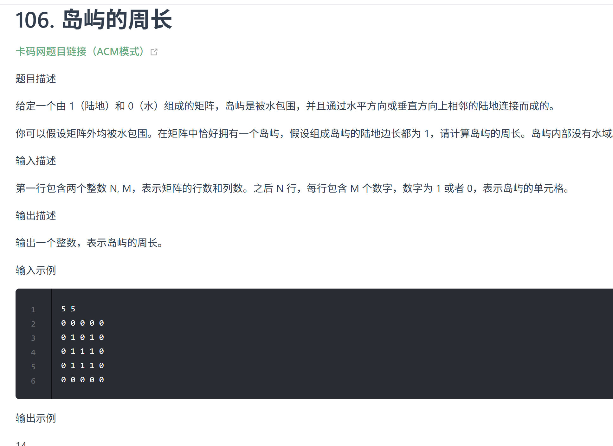

- **遇到水域或边界则周长加1**

```cpp
#include <iostream>
#include <vector>
using namespace std;
int main() {
    int n, m;
    cin >> n >> m;
    vector<vector<int>> grid(n, vector<int>(m, 0));
    for (int i = 0; i < n; i++) {
        for (int j = 0; j < m; j++) {
            cin >> grid[i][j];
        }
    }
    int direction[4][2] = {0, 1, 1, 0, -1, 0, 0, -1};
    int result = 0;
    for (int i = 0; i < n; i++) {
        for (int j = 0; j < m; j++) {
            if (grid[i][j] == 1) {
                for (int k = 0; k < 4; k++) {       // 上下左右四个方向
                    int x = i + direction[k][0];
                    int y = j + direction[k][1];    // 计算周边坐标x,y
                    if (x < 0                       // x在边界上
                            || x >= grid.size()     // x在边界上
                            || y < 0                // y在边界上
                            || y >= grid[0].size()  // y在边界上
                            || grid[x][y] == 0) {   // x,y位置是水域
                        result++;
                    }
                }
            }
        }
    }
    cout << result << endl;

}
```

- **sum * 4 - cover * 2**

```cpp
#include <iostream>
#include <vector>
using namespace std;
int main() {
    int n, m;
    cin >> n >> m;
    vector<vector<int>> grid(n, vector<int>(m, 0));
    for (int i = 0; i < n; i++) {
        for (int j = 0; j < m; j++) {
            cin >> grid[i][j];
        }
    }
    int sum = 0;    // 陆地数量
    int cover = 0;  // 相邻数量
    for (int i = 0; i < n; i++) {
        for (int j = 0; j < m; j++) {
            if (grid[i][j] == 1) {
                sum++; // 统计总的陆地数量
                // 统计上边相邻陆地
                if(i - 1 >= 0 && grid[i - 1][j] == 1) cover++;
                // 统计左边相邻陆地
                if(j - 1 >= 0 && grid[i][j - 1] == 1) cover++;
                // 为什么没统计下边和右边？ 因为避免重复计算
            }
        }
    }

    cout << sum * 4 - cover * 2 << endl;

}
```

## **字符串接龙**

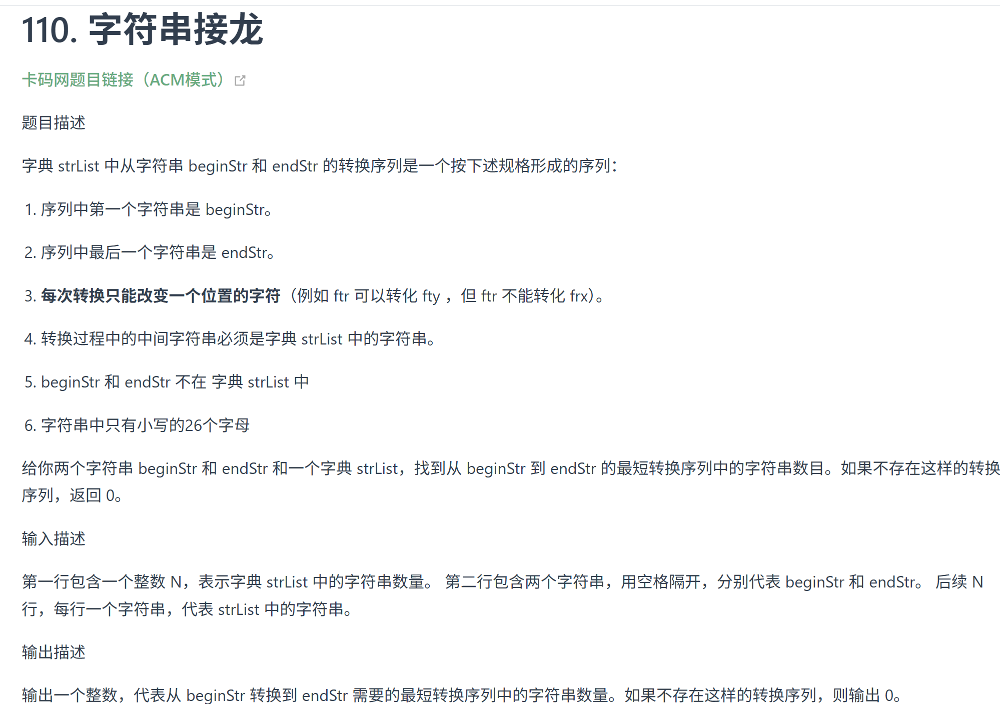

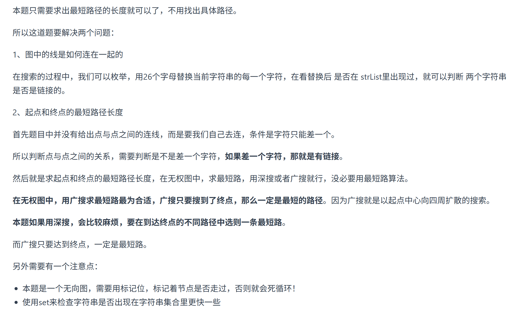

```cpp
#include <iostream>
#include <vector>
#include <string>
#include <unordered_set>
#include <unordered_map>
#include <queue>
using namespace std;
int main() {
    string beginStr, endStr, str;
    int n;
    cin >> n;
    unordered_set<string> strSet;
    cin >> beginStr >> endStr;
    for (int i = 0; i < n; i++) {
        cin >> str;
        strSet.insert(str);
    }

    // 记录strSet里的字符串是否被访问过，同时记录路径长度
    unordered_map<string, int> visitMap; // <记录的字符串，路径长度>

    // 初始化队列
    queue<string> que;
    que.push(beginStr);

    // 初始化visitMap
    visitMap.insert(pair<string, int>(beginStr, 1));

    while(!que.empty()) {
        string word = que.front();
        que.pop();
        int path = visitMap[word]; // 这个字符串在路径中的长度

        // 开始在这个str中，挨个字符去替换
        for (int i = 0; i < word.size(); i++) {
            string newWord = word; // 用一个新字符串替换str，因为每次要置换一个字符

            // 遍历26的字母
            for (int j = 0 ; j < 26; j++) {
                newWord[i] = j + 'a';
                if (newWord == endStr) { // 发现替换字母后，字符串与终点字符串相同
                    cout <<  path + 1 << endl; // 找到了路径 
                    return 0;
                }
                // 字符串集合里出现了newWord，并且newWord没有被访问过
                if (strSet.find(newWord) != strSet.end()
                        && visitMap.find(newWord) == visitMap.end()) {
                    // 添加访问信息，并将新字符串放到队列中
                    visitMap.insert(pair<string, int>(newWord, path + 1));
                    que.push(newWord);
                }
            }
        }
    }

    // 没找到输出0
    cout << 0 << endl;

}
```

## **有向图的完全联通**

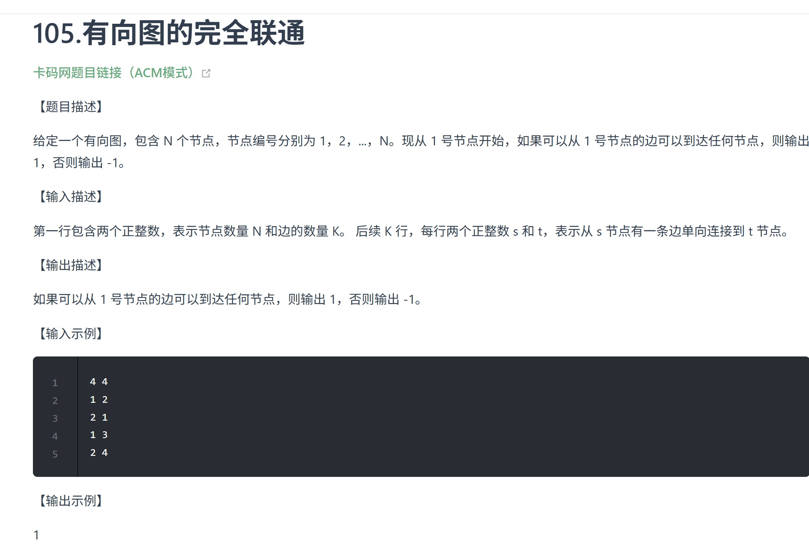

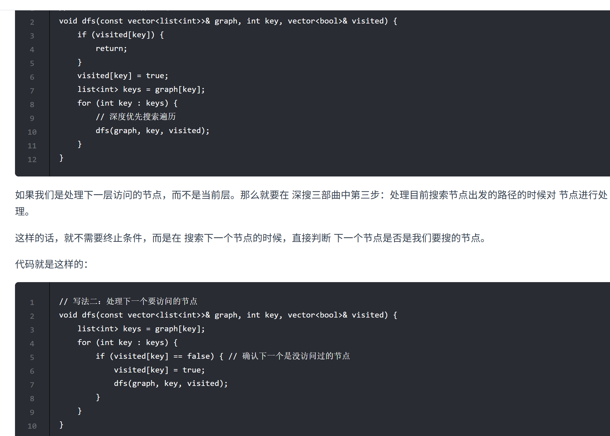

- 本题是需要判断 1节点 是否能到所有节点，那么我们就没有必要回溯去撤销操作了，只要遍历过的节点一律都标记上。
- 那什么时候需要回溯操作呢？
- 当我们需要搜索一条可行路径的时候，就需要回溯操作了，因为没有回溯，就没法“调头”， 如果不理解的话，去看我写的 0098.所有可达路径 的题解
- **dfs:**

```cpp
#include <iostream>
#include <vector>
#include <list>
using namespace std;

void dfs(const vector<list<int>>& graph, int key, vector<bool>& visited) {
    if (visited[key]) {
        return;
    }
    visited[key] = true;
    list<int> keys = graph[key];
    for (int key : keys) {
        // 深度优先搜索遍历
        dfs(graph, key, visited);
    }
}

int main() {
    int n, m, s, t;
    cin >> n >> m;

    // 节点编号从1到n，所以申请 n+1 这么大的数组
    vector<list<int>> graph(n + 1); // 邻接表
    while (m--) {
        cin >> s >> t;
        // 使用邻接表 ，表示 s -> t 是相连的
        graph[s].push_back(t);
    }
    vector<bool> visited(n + 1, false);
    dfs(graph, 1, visited);
    //检查是否都访问到了
    for (int i = 1; i <= n; i++) {
        if (visited[i] == false) {
            cout << -1 << endl;
            return 0;
        }
    }
    cout << 1 << endl;
}
```

- **bfs:**

```cpp
queue<int> que;
que.push(1); //  1 号房间开始

// 广度优先搜索的过程
while (!que.empty()) {
    int key = que.front(); que.pop();
        list<int> keys = graph[key];
        for (int key : keys) {
            if (!visited[key]) {
                que.push(key);
                visited[key] = true;
            }
        }
}
```

## **并查集理论基础**

### **背景**

并查集常用来解决连通性问题。

大白话就是当我们需要判断两个元素是否在同一个集合里的时候，我们就要想到用并查集。

并查集主要有两个功能：

- 将两个元素添加到一个集合中
- 判断两个元素在不在同一个集合

### **原理**

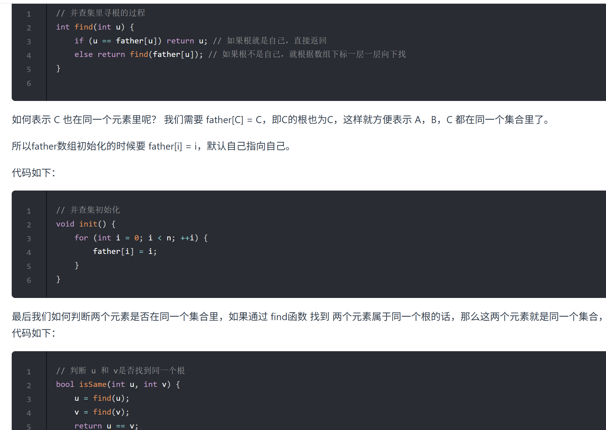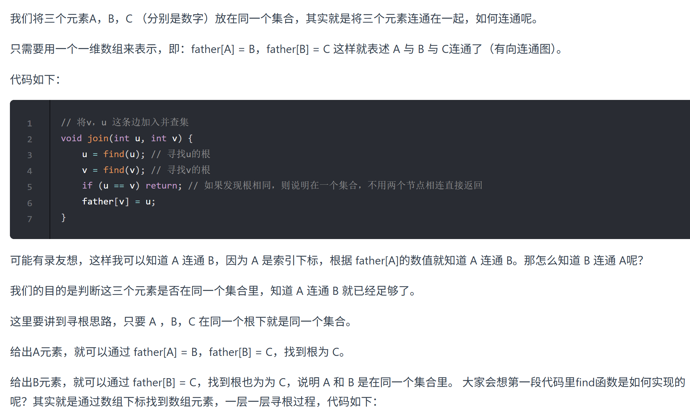

### **路径压缩**

- **将非根节点的所有节点直接指向根节点**

```cpp
// 并查集里寻根的过程
int find(int u) {
    if (u == father[u]) return u;
    else return father[u] = find(father[u]); // 路径压缩
}
```

### **常见误区**

- 错误：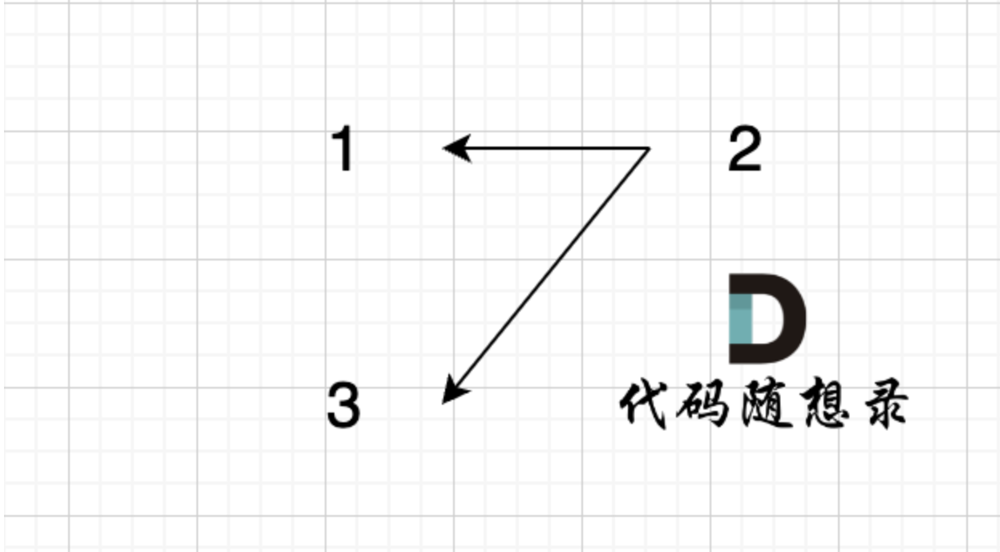

```cpp
void join(int u, int v) {
    if (isSame(u, v)) return ; // 如果发现根相同，则说明在一个集合，不用两个节点相连直接返回
    father[v] = u;
}
```

- 正确：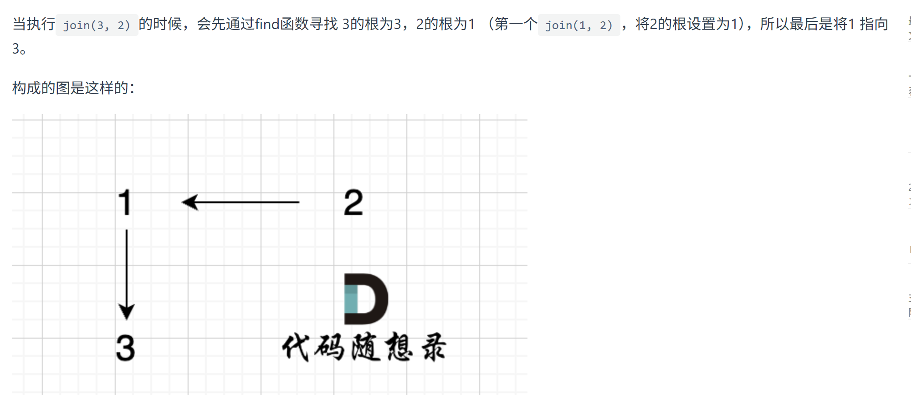

```cpp
void join(int u, int v) {
    u = find(u); // 寻找u的根
    v = find(v); // 寻找v的根
    if (u == v) return ; // 如果发现根相同，则说明在一个集合，不用两个节点相连直接返回
    father[v] = u;
}
```

### **按秩合并**

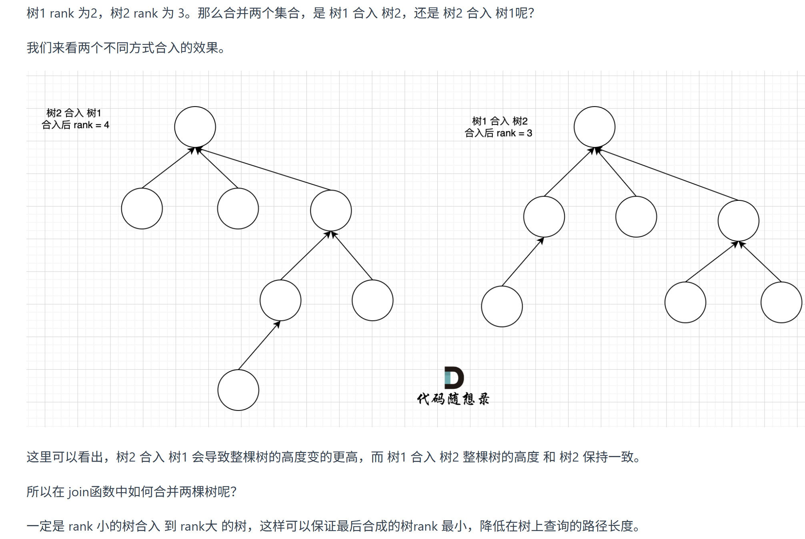

```cpp
int n = 1005; // n根据题目中节点数量而定，一般比节点数量大一点就好
vector<int> father = vector<int> (n, 0); // C++里的一种数组结构
vector<int> rank = vector<int> (n, 1); // 初始每棵树的高度都为1

// 并查集初始化
void init() {
    for (int i = 0; i < n; ++i) {
        father[i] = i;
        rank[i] = 1; // 也可以不写
    }
}
// 并查集里寻根的过程
int find(int u) {
    return u == father[u] ? u : find(father[u]);// 注意这里不做路径压缩
}

// 判断 u 和 v是否找到同一个根
bool isSame(int u, int v) {
    u = find(u);
    v = find(v);
    return u == v;
}

// 将v->u 这条边加入并查集
void join(int u, int v) {
    u = find(u); // 寻找u的根
    v = find(v); // 寻找v的根

    if (rank[u] <= rank[v]) father[u] = v; // rank小的树合入到rank大的树
    else father[v] = u;

    if (rank[u] == rank[v] && u != v) rank[v]++; 
    // 如果两棵树高度相同，则v的高度+1
    //因为上面 if (rank[u] <= rank[v]) father[u] = v; 注意是 <=
}
```

### **复杂度分析**

- 空间复杂度： **O(n)** ，申请一个father数组
- 路径压缩后的并查集时间复杂度**在O(logn)与O(1)之间**，且随着查询或者合并**操作的增加**，时间复杂度会越来越**趋于O(1)**
- 在**第一次**查询的时候，相当于是n叉树上从叶子节点到根节点的查询过程，时间复杂度是**logn**，但路径压缩后，后面的**查询操作都是O(1)**，而 join 函数 和 isSame函数 里涉及的查询操作也是一样的过程

## **寻找存在的路径**

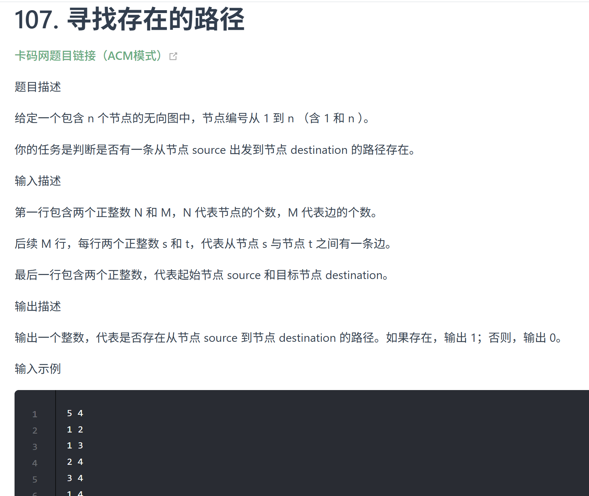

```cpp
#include <iostream>
#include <vector>
using namespace std;

int n; // 节点数量
vector<int> father = vector<int> (101, 0); // 按照节点大小定义数组大小

// 并查集初始化
void init() {
    for (int i = 1; i <= n; i++)  father[i] = i;
}
// 并查集里寻根的过程
int find(int u) {
    return u == father[u] ? u : father[u] = find(father[u]);
}

// 判断 u 和 v是否找到同一个根
bool isSame(int u, int v) {
    u = find(u);
    v = find(v);
    return u == v;
}

// 将v->u 这条边加入并查集
void join(int u, int v) {
    u = find(u); // 寻找u的根
    v = find(v); // 寻找v的根
    if (u == v) return ; // 如果发现根相同，则说明在一个集合，不用两个节点相连直接返回
    father[v] = u;
}

int main() {
    int m, s, t, source, destination;
    cin >> n >> m;
    init();
    while (m--) {
        cin >> s >> t;
        join(s, t);
    }
    cin >> source >> destination;
    if (isSame(source, destination)) cout << 1 << endl;
    else cout << 0 << endl;
}
```

## **多余的边**

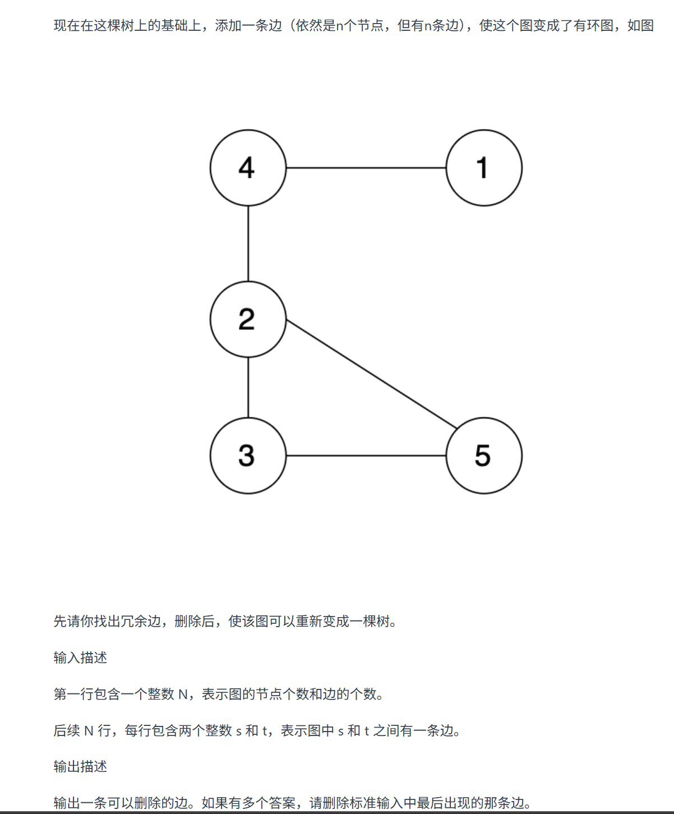

- 如果边的两个节点已经出现在同一个集合里，说明着边的两个节点已经连在一起了，再加入这条边一定就出现环了
- 节点A 和节点 B 不在同一个集合，那么就可以将两个 节点连在一起
- 题目是在 树的基础上 添加一条边，所以冗余边仅仅是一条

```cpp
void init() {}
void find() {}
void isSame() {}
void join() {}

int main() {
    int s, t;
    cin >> n;
    init();
    for (int i = 0; i < n; i++) {
        cin >> s >> t;
        if (isSame(s, t)) {
            cout << s << " " << t << endl;
            return 0;
        } else {
            join(s, t);
        }
    }
}
```

## **多余的边(有向)**

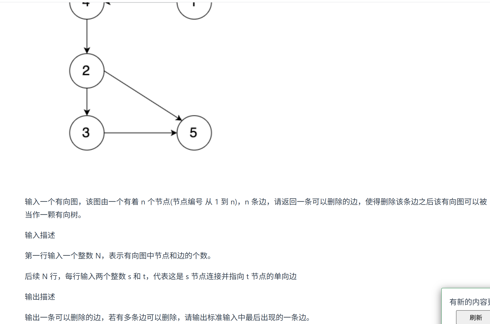

- 情况一：如果我们找到入度为2的点，那么删一条指向该节点的边就行了
- 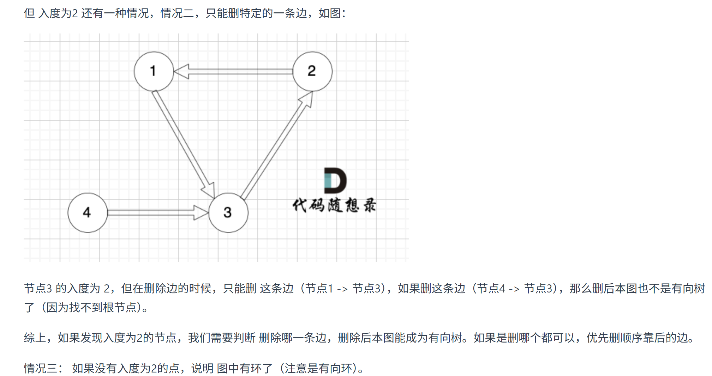
- 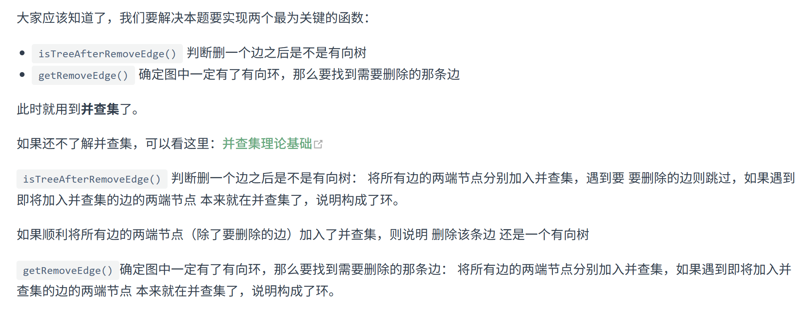

```cpp
#include <iostream>
#include <vector>
using namespace std;
int n;
vector<int> father (1001, 0);
// 并查集初始化
void init() {
    for (int i = 1; i <= n; ++i) {
        father[i] = i;
    }
}
// 并查集里寻根的过程
int find(int u) {
    return u == father[u] ? u : father[u] = find(father[u]);
}
// 将v->u 这条边加入并查集
void join(int u, int v) {
    u = find(u);
    v = find(v);
    if (u == v) return ;
    father[v] = u;
}
// 判断 u 和 v是否找到同一个根
bool same(int u, int v) {
    u = find(u);
    v = find(v);
    return u == v;
}

// 在有向图里找到删除的那条边，使其变成树
void getRemoveEdge(const vector<vector<int>>& edges) {
    init(); // 初始化并查集
    for (int i = 0; i < n; i++) { // 遍历所有的边
        if (same(edges[i][0], edges[i][1])) { // 构成有向环了，就是要删除的边
            cout << edges[i][0] << " " << edges[i][1];
            return;
        } else {
            join(edges[i][0], edges[i][1]);
        }
    }
}

// 删一条边之后判断是不是树
bool isTreeAfterRemoveEdge(const vector<vector<int>>& edges, int deleteEdge) {
    init(); // 初始化并查集
    for (int i = 0; i < n; i++) {
        if (i == deleteEdge) continue;
        if (same(edges[i][0], edges[i][1])) { // 构成有向环了，一定不是树
            return false;
        }
        join(edges[i][0], edges[i][1]);
    }
    return true;
}

int main() {
    int s, t;
    vector<vector<int>> edges;
    cin >> n;
    vector<int> inDegree(n + 1, 0); // 记录节点入度
    for (int i = 0; i < n; i++) {
        cin >> s >> t;
        inDegree[t]++;
        edges.push_back({s, t});
    }

    vector<int> vec; // 记录入度为2的边（如果有的话就两条边）
    // 找入度为2的节点所对应的边，注意要倒序，因为优先删除最后出现的一条边
    for (int i = n - 1; i >= 0; i--) {
        if (inDegree[edges[i][1]] == 2) {
            vec.push_back(i);
        }
    }
    // 情况一、情况二
    if (vec.size() > 0) {
        // 放在vec里的边已经按照倒叙放的，所以这里就优先删vec[0]这条边
        if (isTreeAfterRemoveEdge(edges, vec[0])) {
            cout << edges[vec[0]][0] << " " << edges[vec[0]][1];
        } else {
            cout << edges[vec[1]][0] << " " << edges[vec[1]][1];
        }
        return 0;
    }

    // 处理情况三
    // 明确没有入度为2的情况，那么一定有有向环，找到构成环的边返回就可以了
    getRemoveEdge(edges);
}
```

## **最小生成树之prim**


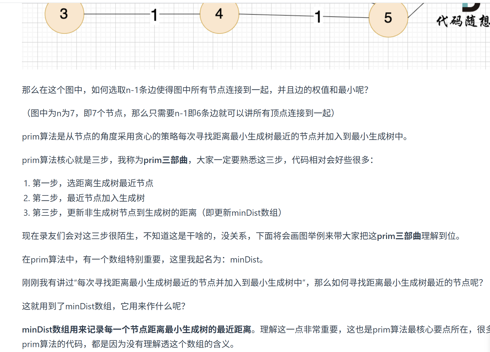

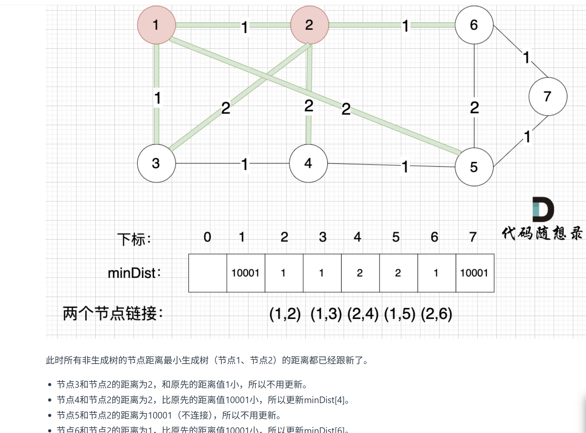

```cpp
#include<iostream>
#include<vector>
#include <climits>

using namespace std;
int main() {
    int v, e;
    int x, y, k;
    cin >> v >> e;
    // 填一个默认最大值，题目描述val最大为10000
    vector<int> parent(v + 1, -1);
    vector<vector<int>> grid(v + 1, vector<int>(v + 1, 10001));
    while (e--) {
        cin >> x >> y >> k;
        // 因为是双向图，所以两个方向都要填上
        grid[x][y] = k;
        grid[y][x] = k;

    }
    // 所有节点到最小生成树的最小距离
    vector<int> minDist(v + 1, 10001);

    // 这个节点是否在树里
    vector<bool> isInTree(v + 1, false);

    // 我们只需要循环 n-1次，建立 n - 1条边，就可以把n个节点的图连在一起
    for (int i = 1; i < v; i++) {

        // 1、prim三部曲，第一步：选距离生成树最近节点
        int cur = -1; // 选中哪个节点 加入最小生成树
        int minVal = INT_MAX;
        for (int j = 1; j <= v; j++) { // 1 - v，顶点编号，这里下标从1开始
            //  选取最小生成树节点的条件：
            //  （1）不在最小生成树里
            //  （2）距离最小生成树最近的节点
            if (!isInTree[j] &&  minDist[j] < minVal) {
                minVal = minDist[j];
                cur = j;
            }
        }
        // 2、prim三部曲，第二步：最近节点（cur）加入生成树
        isInTree[cur] = true;

        // 3、prim三部曲，第三步：更新非生成树节点到生成树的距离（即更新minDist数组）
        // cur节点加入之后， 最小生成树加入了新的节点，那么所有节点到 最小生成树的距离（即minDist数组）需要更新一下
        // 由于cur节点是新加入到最小生成树，那么只需要关心与 cur 相连的 非生成树节点 的距离 是否比 原来 非生成树节点到生成树节点的距离更小了呢
        for (int j = 1; j <= v; j++) {
            // 更新的条件：
            // （1）节点是 非生成树里的节点
            // （2）与cur相连的某节点的权值 比 该某节点距离最小生成树的距离小
            // 很多录友看到自己 就想不明白什么意思，其实就是 cur 是新加入 最小生成树的节点，那么 所有非生成树的节点距离生成树节点的最近距离 由于 cur的新加入，需要更新一下数据了
            if (!isInTree[j] && grid[cur][j] < minDist[j]) {
                minDist[j] = grid[cur][j];
                parent[j] = cur; // 记录边
            }
        }
    }
    // 统计结果
    int result = 0;
    for (int i = 2; i <= v; i++) { // 不计第一个顶点，因为统计的是边的权值，v个节点有 v-1条边
        result += minDist[i];
    }
    cout << result << endl;

}
```

## **最小生成树之kruskal**

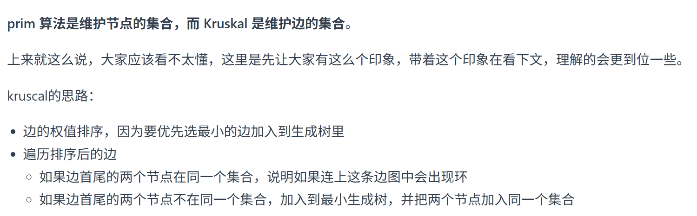
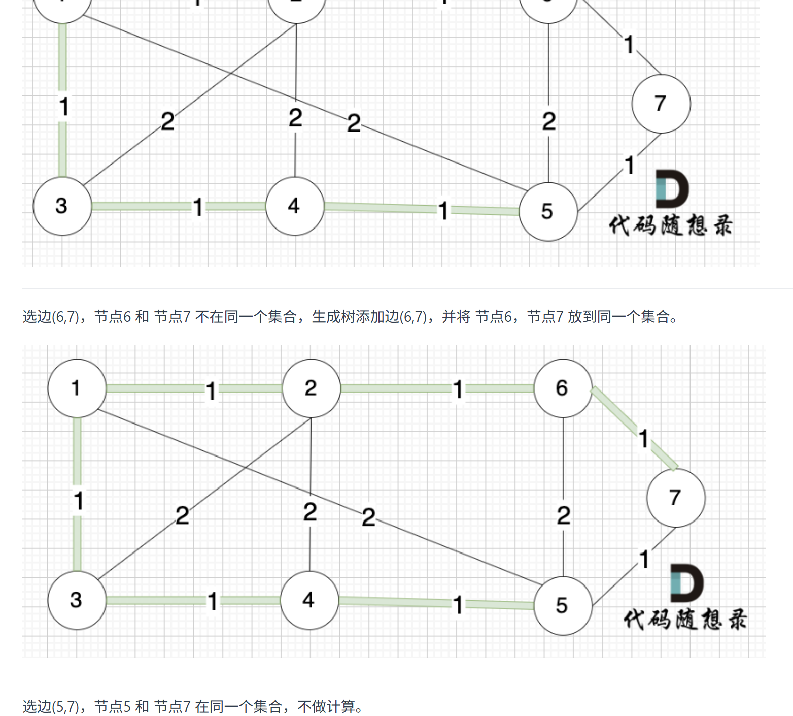

```cpp
#include <iostream>
#include <vector>
#include <algorithm>

using namespace std;

// l,r为 边两边的节点，val为边的数值
struct Edge {
    int l, r, val;
};

// 节点数量
int n = 10001;
// 并查集标记节点关系的数组
vector<int> father(n, -1); // 节点编号是从1开始的，n要大一些

// 并查集初始化
void init() {
    for (int i = 0; i < n; ++i) {
        father[i] = i;
    }
}

// 并查集的查找操作
int find(int u) {
    return u == father[u] ? u : father[u] = find(father[u]); // 路径压缩
}

// 并查集的加入集合
void join(int u, int v) {
    u = find(u); // 寻找u的根
    v = find(v); // 寻找v的根
    if (u == v) return ; // 如果发现根相同，则说明在一个集合，不用两个节点相连直接返回
    father[v] = u;
}

int main() {

    int v, e;
    int v1, v2, val;
    vector<Edge> edges;
    int result_val = 0;
    cin >> v >> e;
    while (e--) {
        cin >> v1 >> v2 >> val;
        edges.push_back({v1, v2, val});
    }

    // 执行Kruskal算法
    // 按边的权值对边进行从小到大排序
    sort(edges.begin(), edges.end(), [](const Edge& a, const Edge& b) {
            return a.val < b.val;
    });

    // 并查集初始化
    init();

    // 从头开始遍历边
    for (Edge edge : edges) {
        // 并查集，搜出两个节点的祖先
        int x = find(edge.l);
        int y = find(edge.r);

        // 如果祖先不同，则不在同一个集合
        if (x != y) {
            result_val += edge.val; // 这条边可以作为生成树的边
            join(x, y); // 两个节点加入到同一个集合
        }
    }
    cout << result_val << endl;
    return 0;
}
```

- 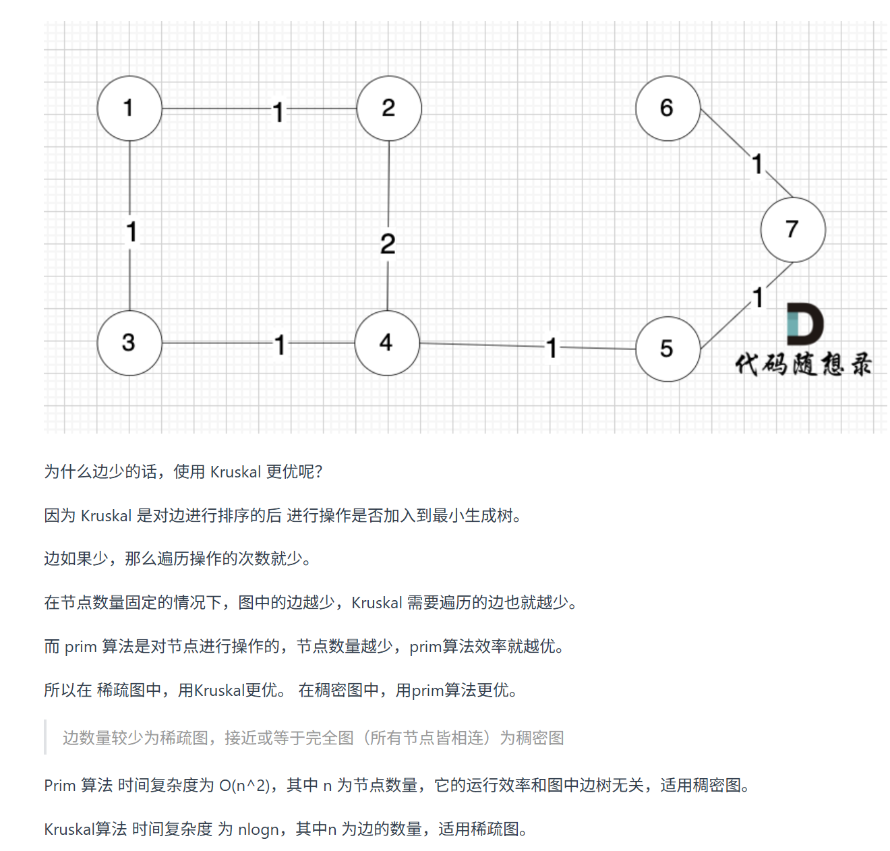