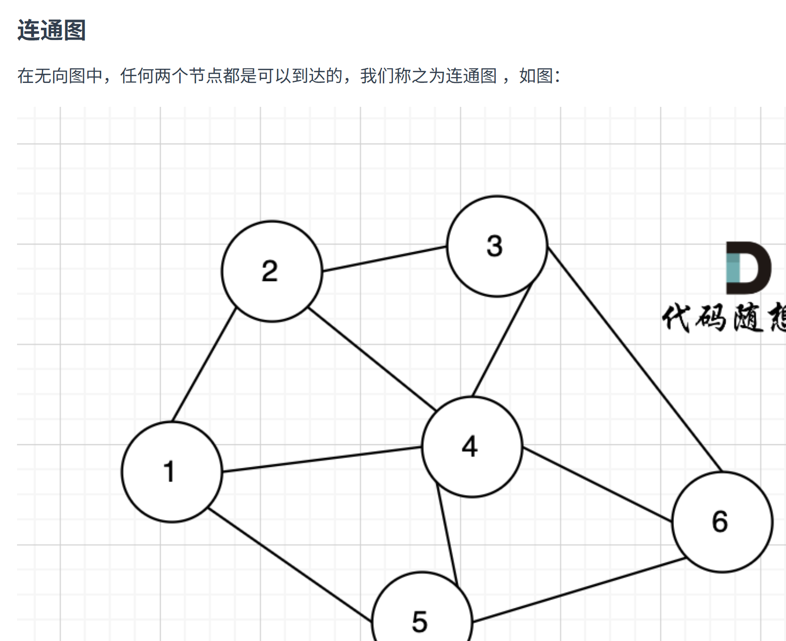
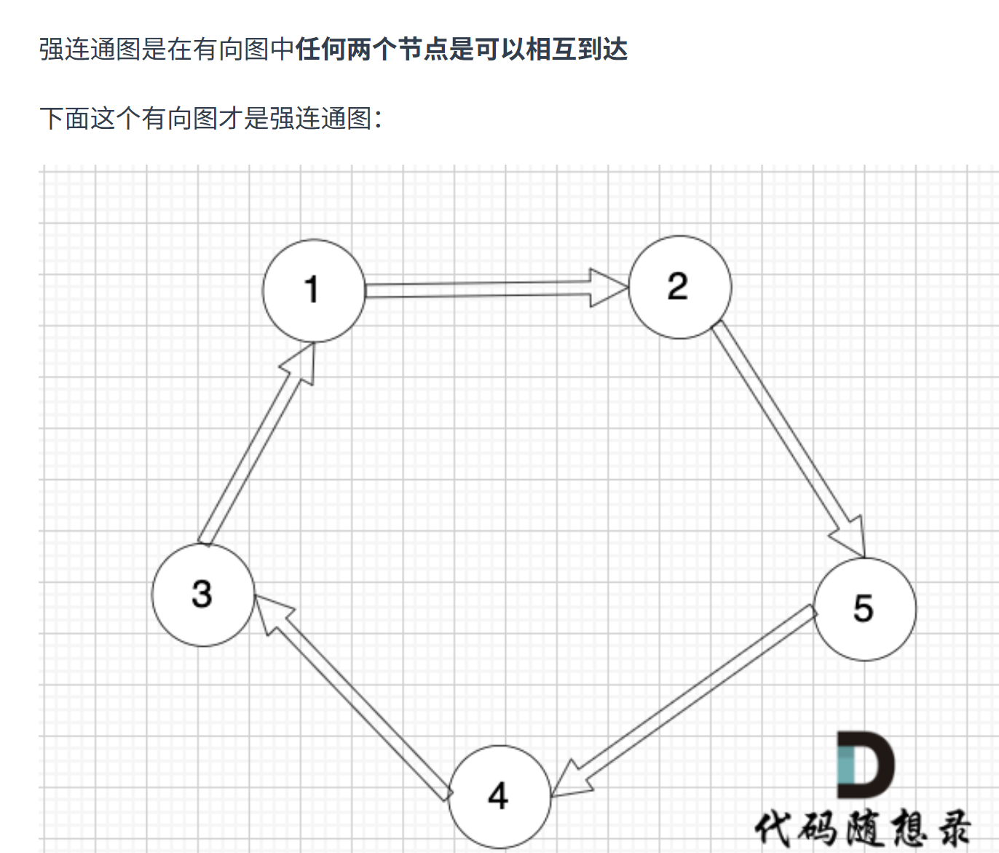
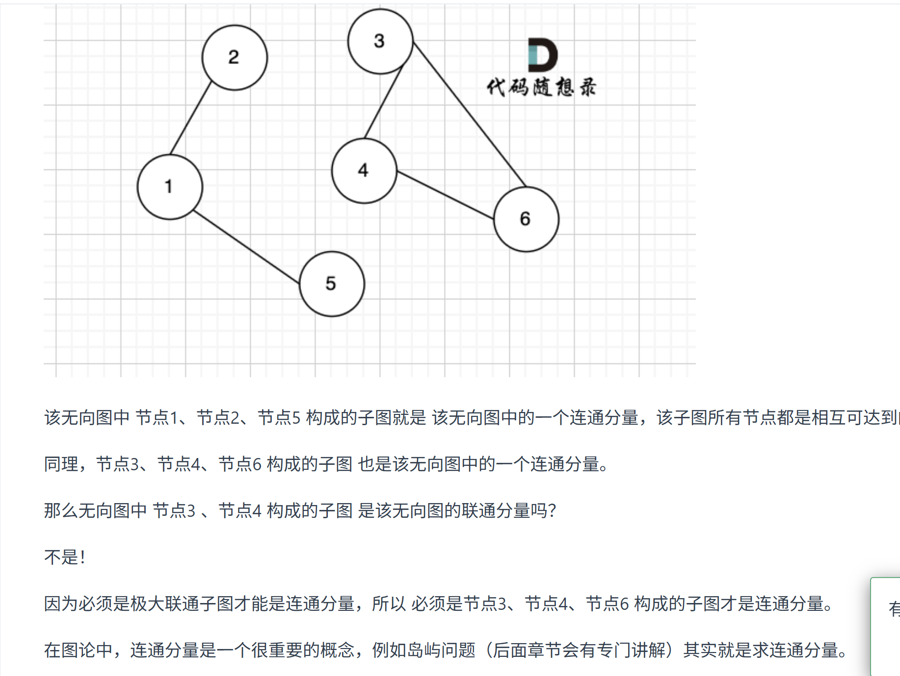
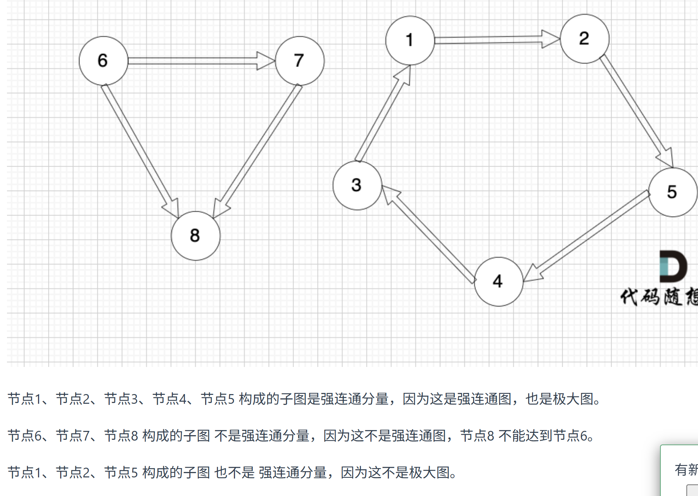
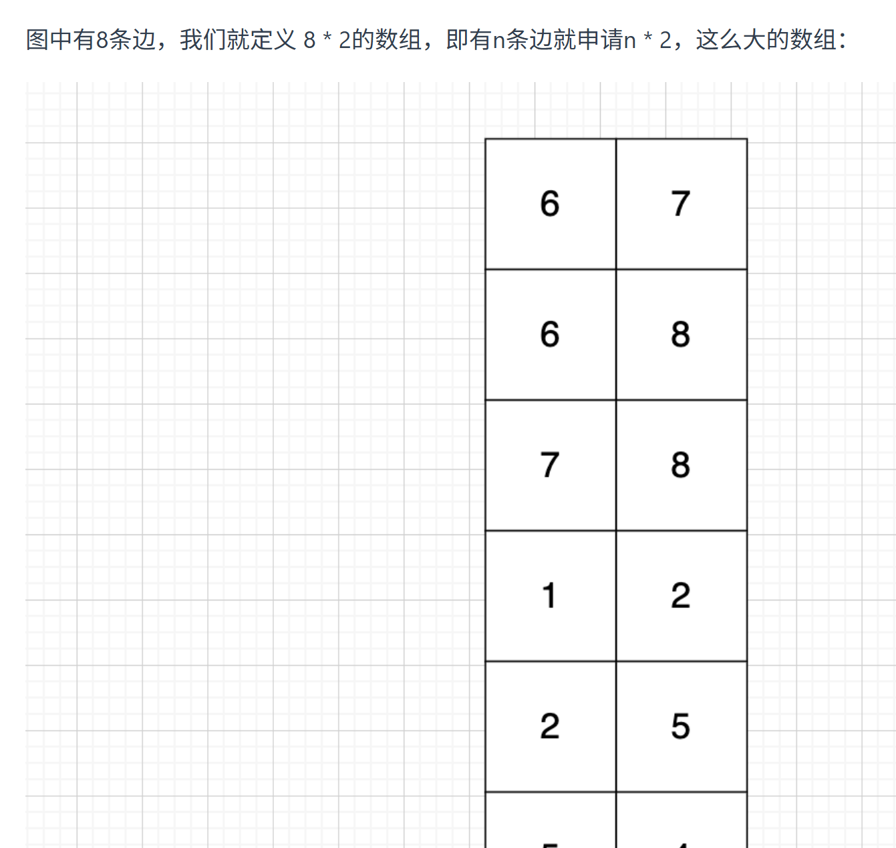
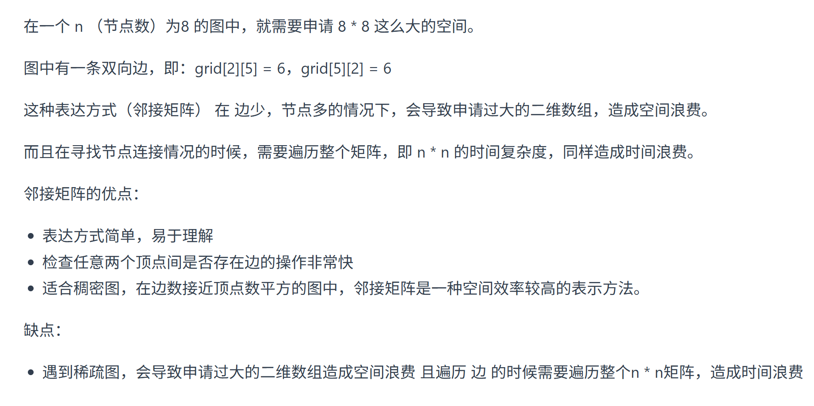
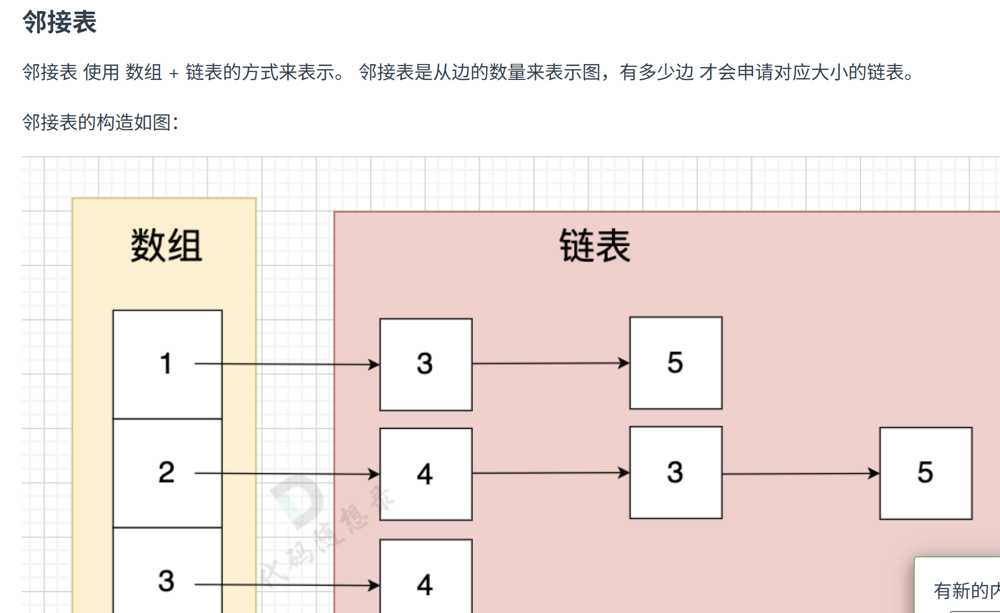
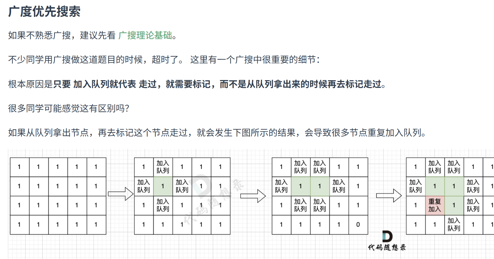

# **图论**

## **理论基础**

### **连通性**

- 无向连通图：
- 有向强连通图：**要相互**
- 连通分量：
- 强连通分量：

### **图的构造**

- 朴素存储：如图第一行指6指向7
- 邻接矩阵：如图指节点2指向节点5，权值为6
- 邻接表：

## **深搜**

```cpp
void dfs(参数) {
    if (终止条件) {
        存放结果;
        return;
    }

    for (选择：本节点所连接的其他节点) {
        处理节点;
        dfs(图，选择的节点); // 递归
        回溯，撤销处理结果
    }
}
```

### **所有可达路径**


- 邻接矩阵

```cpp
#include <iostream>
#include <vector>
using namespace std;
vector<vector<int>> result; // 收集符合条件的路径
vector<int> path; // 1节点到终点的路径

void dfs (const vector<vector<int>>& graph, int x, int n) {
    // 当前遍历的节点x 到达节点n 
    if (x == n) { // 找到符合条件的一条路径
        result.push_back(path);
        return;
    }
    for (int i = 1; i <= n; i++) { // 遍历节点x链接的所有节点
        if (graph[x][i] == 1) { // 找到 x链接的节点
            path.push_back(i); // 遍历到的节点加入到路径中来
            dfs(graph, i, n); // 进入下一层递归
            path.pop_back(); // 回溯，撤销本节点
        }
    }
}

int main() {
    int n, m, s, t;
    cin >> n >> m;

    // 节点编号从1到n，所以申请 n+1 这么大的数组
    vector<vector<int>> graph(n + 1, vector<int>(n + 1, 0));

    while (m--) {
        cin >> s >> t;
        // 使用邻接矩阵 表示无线图，1 表示 s 与 t 是相连的
        graph[s][t] = 1;
    }

    path.push_back(1); // 无论什么路径已经是从0节点出发
    dfs(graph, 1, n); // 开始遍历

    // 输出结果
    if (result.size() == 0) cout << -1 << endl;
    for (const vector<int> &pa : result) {
        for (int i = 0; i < pa.size() - 1; i++) {
            cout << pa[i] << " ";
        }
        cout << pa[pa.size() - 1]  << endl;
    }
}
```

- 邻接表

```cpp
#include <iostream>
#include <vector>
#include <list>
using namespace std;

vector<vector<int>> result; // 收集符合条件的路径
vector<int> path; // 1节点到终点的路径

void dfs (const vector<list<int>>& graph, int x, int n) {

    if (x == n) { // 找到符合条件的一条路径
        result.push_back(path);
        return;
    }
    for (int i : graph[x]) { // 找到 x指向的节点
        path.push_back(i); // 遍历到的节点加入到路径中来
        dfs(graph, i, n); // 进入下一层递归
        path.pop_back(); // 回溯，撤销本节点
    }
}

int main() {
    int n, m, s, t;
    cin >> n >> m;

    // 节点编号从1到n，所以申请 n+1 这么大的数组
    vector<list<int>> graph(n + 1); // 邻接表
    while (m--) {
        cin >> s >> t;
        // 使用邻接表 ，表示 s -> t 是相连的
        graph[s].push_back(t);

    }

    path.push_back(1); // 无论什么路径已经是从0节点出发
    dfs(graph, 1, n); // 开始遍历

    // 输出结果
    if (result.size() == 0) cout << -1 << endl;
    for (const vector<int> &pa : result) {
        for (int i = 0; i < pa.size() - 1; i++) {
            cout << pa[i] << " ";
        }
        cout << pa[pa.size() - 1]  << endl;
    }
}
```

## **广搜**


```cpp
int dir[4][2] = {0, 1, 1, 0, -1, 0, 0, -1}; // 表示四个方向
// grid 是地图，也就是一个二维数组
// visited标记访问过的节点，不要重复访问
// x,y 表示开始搜索节点的下标
void bfs(vector<vector<char>>& grid, vector<vector<bool>>& visited, int x, int y) {
    queue<pair<int, int>> que; // 定义队列
    que.push({x, y}); // 起始节点加入队列
    visited[x][y] = true; // 只要加入队列，立刻标记为访问过的节点
    while(!que.empty()) { // 开始遍历队列里的元素
        pair<int ,int> cur = que.front(); que.pop(); // 从队列取元素
        int curx = cur.first;
        int cury = cur.second; // 当前节点坐标
        for (int i = 0; i < 4; i++) { // 开始想当前节点的四个方向左右上下去遍历
            int nextx = curx + dir[i][0];
            int nexty = cury + dir[i][1]; // 获取周边四个方向的坐标
            if (nextx < 0 || nextx >= grid.size() || nexty < 0 || nexty >= grid[0].size()) continue;  // 坐标越界了，直接跳过
            if (!visited[nextx][nexty]) { // 如果节点没被访问过
                que.push({nextx, nexty});  // 队列添加该节点为下一轮要遍历的节点
                visited[nextx][nexty] = true; // 只要加入队列立刻标记，避免重复访问
            }
        }
    }

}
```

## **岛屿数量**


- 本题思路，是用遇到一个没有遍历过的节点陆地，计数器就加一，然后把该节点陆地所能遍历到的陆地都标记上
- 在遇到标记过的陆地节点和海洋节点的时候直接跳过。 这样计数器就是最终岛屿的数量
- 深搜：

```cpp
#include <iostream>
#include <vector>
using namespace std;
int dir[4][2] = {0, 1, 1, 0, -1, 0, 0, -1}; // 四个方向
void dfs(const vector<vector<int>>& grid, vector<vector<bool>>& visited, int x, int y) {
    if (visited[x][y] || grid[x][y] == 0) return; // 终止条件：访问过的节点 或者 遇到海水
    visited[x][y] = true; // 标记访问过
    for (int i = 0; i < 4; i++) {
        int nextx = x + dir[i][0];
        int nexty = y + dir[i][1];
        if (nextx < 0 || nextx >= grid.size() || nexty < 0 || nexty >= grid[0].size()) continue;  // 越界了，直接跳过
        dfs(grid, visited, nextx, nexty);
    }
}

int main() {
    int n, m;
    cin >> n >> m;
    vector<vector<int>> grid(n, vector<int>(m, 0));
    for (int i = 0; i < n; i++) {
        for (int j = 0; j < m; j++) {
            cin >> grid[i][j];
        }
    }

    vector<vector<bool>> visited(n, vector<bool>(m, false));

    int result = 0;
    for (int i = 0; i < n; i++) {
        for (int j = 0; j < m; j++) {
            if (!visited[i][j] && grid[i][j] == 1) {
                result++; // 遇到没访问过的陆地，+1
                dfs(grid, visited, i, j); // 将与其链接的陆地都标记上 true
            }
        }
    }
    cout << result << endl;
}
```

- 广搜：

```cpp
// 区别只在bfs函数
void bfs(const vector<vector<int>>& grid, vector<vector<bool>>& visited, int x, int y) {
    queue<pair<int, int>> que;
    que.push({x, y});
    visited[x][y] = true; // 只要加入队列，立刻标记
    while(!que.empty()) {
        pair<int ,int> cur = que.front(); que.pop();
        int curx = cur.first;
        int cury = cur.second;
        for (int i = 0; i < 4; i++) {
            int nextx = curx + dir[i][0];
            int nexty = cury + dir[i][1];
            if (nextx < 0 || nextx >= grid.size() || nexty < 0 || nexty >= grid[0].size()) continue;  // 越界了，直接跳过
            if (!visited[nextx][nexty] && grid[nextx][nexty] == 1) {
                que.push({nextx, nexty});
                visited[nextx][nexty] = true; // 只要加入队列立刻标记
            }
        }
    }
}
```
