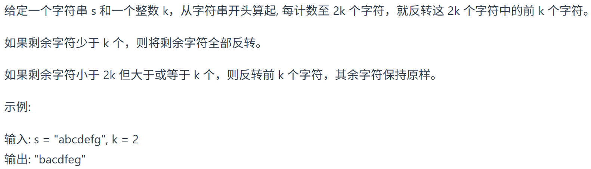
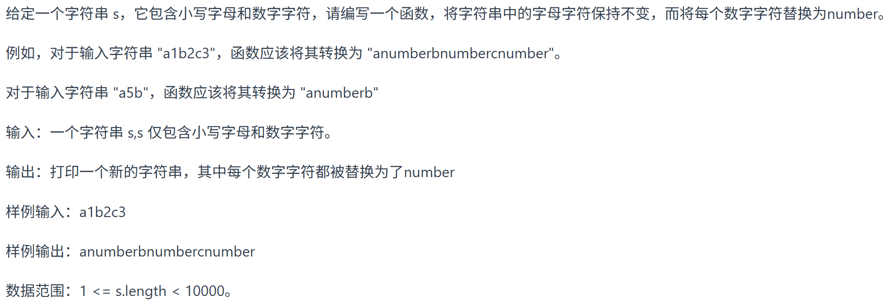
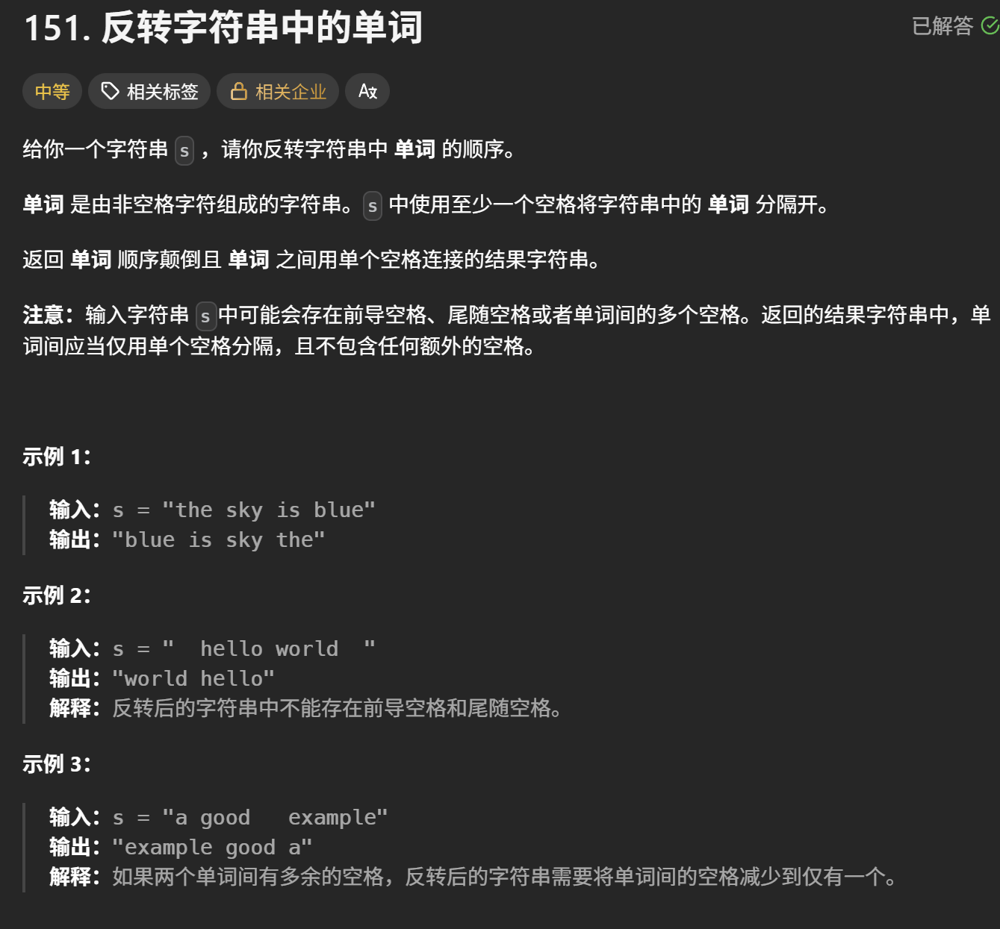
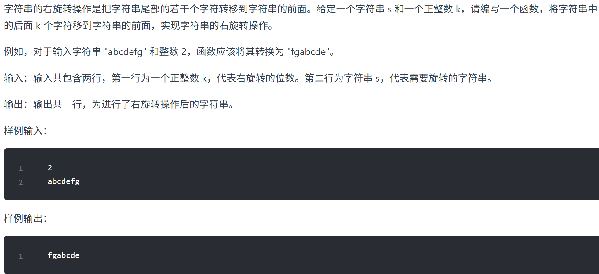
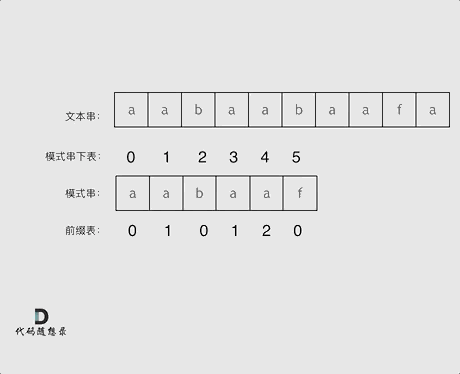
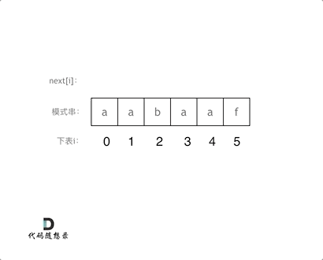

# **字符串**

## 反转字符串

- 

``` c++
void reverseString(vector<char>& s) {
    for (int i = 0, j = s.size() - 1; i < s.size()/2; i++, j--) {
        swap(s[i],s[j]);
    }
}
```

- 

其实在遍历字符串的过程中，只要让 i += (2 * k)，i 每次移动 2 * k 就可以了，然后判断是否需要有反转的区间
**所以当需要固定规律一段一段去处理字符串的时候，要想想在for循环的表达式上做做文章**

``` C++
string reverseStr(string s, int k) {
        for (int i = 0; i < s.size(); i += (2 * k)) {
            // 1. 每隔 2k 个字符的前 k 个字符进行反转
            // 2. 剩余字符小于 2k 但大于或等于 k 个，则反转前 k 个字符
            if (i + k <= s.size()) {
                reverse(s.begin() + i, s.begin() + i + k );
            } else {
                // 3. 剩余字符少于 k 个，则将剩余字符全部反转。
                reverse(s.begin() + i, s.end());
            }
        }
        return s;
    }
```

## **替换数字**



- 从前向后填充就是O(n^2)的算法了，因为每次添加元素都要将添加元素之后的所有元素整体向后移动，**避免原数组元素被覆盖**
- 其实很多数组填充类的问题，其做法都是**先预先给数组扩容带填充后的大小，然后在从后向前进行操作**

``` C++
string s;
    while (cin >> s) {
        int sOldIndex = s.size() - 1;
        int count = 0; // 统计数字的个数
        for (int i = 0; i < s.size(); i++) {
            if (s[i] >= '0' && s[i] <= '9') {
                count++;
            }
        }
        // 扩充字符串s的大小，也就是将每个数字替换成"number"之后的大小
        s.resize(s.size() + count * 5);
        int sNewIndex = s.size() - 1;
        // 从后往前将数字替换为"number"
        while (sOldIndex >= 0) {
            if (s[sOldIndex] >= '0' && s[sOldIndex] <= '9') {
                s[sNewIndex--] = 'r';
                s[sNewIndex--] = 'e';
                s[sNewIndex--] = 'b';
                s[sNewIndex--] = 'm';
                s[sNewIndex--] = 'u';
                s[sNewIndex--] = 'n';
            } else {
                s[sNewIndex--] = s[sOldIndex];
            }
            sOldIndex--;
        }
        cout << s << endl;    
```

## **翻转字符串里的单词**



- 移除多余空格
- 将整个字符串反转
- 将每个单词反转

``` c++
class Solution {
public:
    //移除多余空格，采用双指针
    void removeExtraSpace(string &s){
        int slow = 0;
        for(int i = 0; i < s.size(); i ++){
            if(s[i] != ' '){//遇到空格不处理，相当于去掉所有空格
                if(slow != 0){//开头不加空格
                    s[slow++] = ' ';//去掉空格，就要补上空格
                }
                while(i < s.size() && s[i] != ' '){
                //注意要加上"i < s.size()", 直至这个单词结束
                    s[slow++] = s[i++];//将单词填充到数组
                }
            }
        }
        //改变数组长度
        s.resize(slow);
    }

    void reverse(string& s, int start, int end){
        for(int i = start, j = end; i < j; i ++, j --){
            swap(s[i],s[j]);
        }
    }

    string reverseWords(string s) {
        removeExtraSpace(s);
        reverse(s,0,s.size()-1);
        //start是每次要翻转的单词的开始的下标
        int start = 0;
        for(int i = 0; i <= s.size(); i ++){
        //这里要 <= 是因为下面每次要反转的条件是遍历到空格，
        //而串尾没有空格，方便写出串尾条件 i==s.size()
            if(s[i] == ' ' || i == s.size()){
                reverse(s,start,i-1);
                start = i + 1;//记得更新start
            }
        }
        return s;
    }
};
```

## 右旋转字符串



- **先整体倒叙**, 再分别将两个部分翻转

``` c++
//reverse左闭右开
reverse(s.begin(), s.end()); // 整体反转
reverse(s.begin(), s.begin() + n); // 先反转前一段，长度n
reverse(s.begin() + n, s.end()); // 再反转后一段
```

## **KMP算法**

- 经典思想：当出现字符串不匹配时，可以记录一部分之前已经匹配的文本内容，利用这些信息避免从头再去做匹配
- 以下实现strStr()





``` C++
class Solution {
public:
    void getNext(int* next, const string& s) {
        int j = -1;
        next[0] = j;
        for(int i = 1; i < s.size(); i++) { // 注意i从1开始
            while (j >= 0 && s[i] != s[j + 1]) { // 前后缀不相同了
                j = next[j]; // 向前回退
            }
            if (s[i] == s[j + 1]) { // 找到相同的前后缀
                j++;
            }
            next[i] = j; // 将j（前缀的长度）赋给next[i]
        }
    }
    int strStr(string haystack, string needle) {
        if (needle.size() == 0) {
            return 0;
        }
		vector<int> next(needle.size());
		getNext(&next[0], needle);
        int j = -1; // // 因为next数组里记录的起始位置为-1
        for (int i = 0; i < haystack.size(); i++) { // 注意i就从0开始
            while(j >= 0 && haystack[i] != needle[j + 1]) { // 不匹配
                j = next[j]; // j 寻找之前匹配的位置
            }
            if (haystack[i] == needle[j + 1]) { // 匹配，j和i同时向后移动
                j++; // i的增加在for循环里
            }
            if (j == (needle.size() - 1) ) { // 文本串s里出现了模式串t
                return (i - needle.size() + 1);
            }
        }
        return -1;
    }
};
```

## **重复的子字符串**

### 暴力解法

- 暴力的解法， 就是一个for循环获取 子串的终止位置， 然后判断子串是否能重复构成字符串，又嵌套一个for循环，所以是O(n^2)的时间复杂度。
- 其实我们只需要判断，以第一个字母为开始的子串就可以，所以一个for循环获取子串的终止位置就行了。 而且遍历的时候 都不用遍历结束，只需要遍历到中间位置，因为子串结束位置大于中间位置的话，一定不能重复组成字符串

### **移动匹配**

- **如果有一个字符串s，在 s + s 拼接后， 不算首尾字符，如果能凑成s字符串，说明s 一定是重复子串组成**

``` C++
bool repeatedSubstringPattern(string s) {
        string t = s + s;
        t.erase(t.begin()); t.erase(t.end() - 1); // 掐头去尾
        if (t.find(s) != std::string::npos) return true; // r
        return false;
}
```

### **KMP**

- 充分条件：如果字符串s是由重复子串组成，那么 最长相等前后缀不包含的子串 一定是 s的最小重复子串。
- 必要条件：如果字符串s的最长相等前后缀不包含的子串 是 s最小重复子串，那么 s是由重复子串组成。
- 在必要条件，这个是 显而易见的，都已经假设 最长相等前后缀不包含的子串 是 s的最小重复子串了，那s必然是重复子串。
关键是需要证明， 字符串s的最长相等前后缀不包含的子串 什么时候才是 s最小重复子串。
- 同上我们证明了，当 **最长相等前后缀不包含的子串的长度** 可以被 **字符串s的长度整除，那么不包含的子串** 就是**s的最小重复子串**

``` C++
void getNext (int* next, const string& s){
        next[0] = -1;
        int j = -1;
        for(int i = 1;i < s.size(); i++){
            while(j >= 0 && s[i] != s[j + 1]) {
                j = next[j];
            }
            if(s[i] == s[j + 1]) {
                j++;
            }
            next[i] = j;
        }
    }
    bool repeatedSubstringPattern (string s) {
        if (s.size() == 0) {
            return false;
        }
        int next[s.size()];
        getNext(next, s);
        int len = s.size();
        if (next[len - 1] != -1 && len % (len - (next[len - 1] + 1)) == 0) {
            return true;
        }
        return false;
    }
```