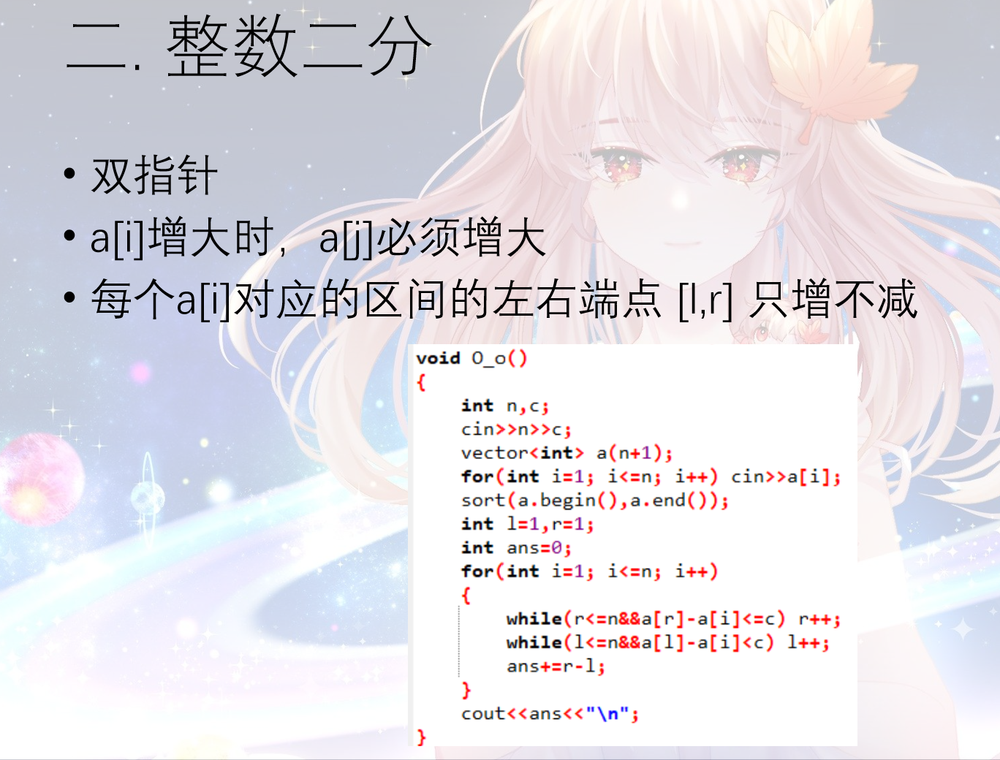
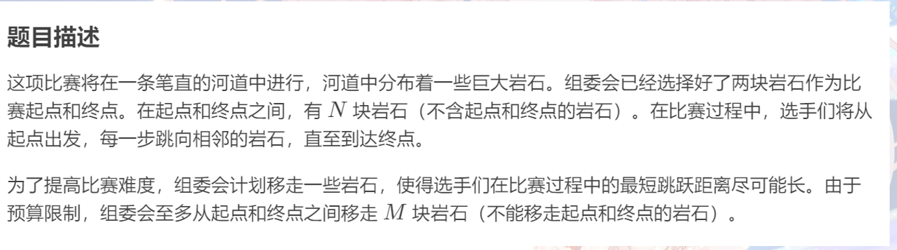
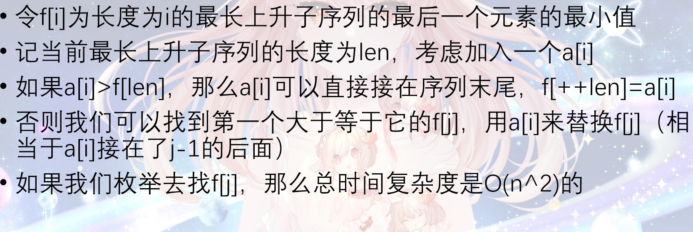
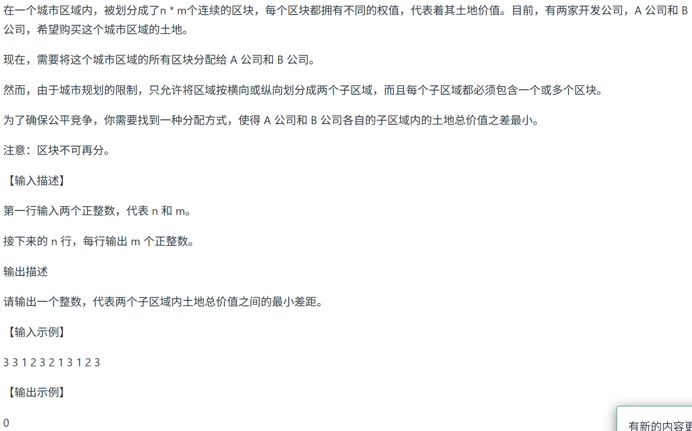

# Algorithm

## 二分（有序数组&&无重复）

### 整数二分

- 在一个**有序**数列中找到一个数X,确认是否存在 ，若存在则输出第一次出现的位置

``` c
int l = 1, r = n, ans = -1;
while(l < r){
    int mid = l + r >> 1;//相当于int mid = (l + r) / 2;
    if(a[mid] == x){
        ans = mid;
        break;
    }else if(a[mid < x]){
        l = mid + 1;
    } else{
        r = mid - 1;
    }
}
```

- **upper_bound和lower_bound**，找到第一个**大于**或**大于等于**x的数的位置

```csharp-interactive
int upper_bound(int a[], int n, int x){
    int l = 0, r = n;
    while(l < r){
        int mid = l + r >> 1;
        if(a[mid] > x){
            r = mid;//这里不能减1，a[mid]可能是答案
        }else{
            l = mid + 1;//要求的是第一个大于，不包括等于，所以可以跳过a[mid]
        }
    }
    return l ;//最终l就是第一个大于x的位置
}
```

- 
    1. 
    2. 
- 


```cpp
#include<iostream>
#include<vector>

using namespace std;

int main(){
    int L,N,M;
    cin >> L >> N >> M;
    vector<int> stones(n + 2);
    stones[0] = 0;
    for(int i = 1; i < n + 1; i ++){
        cin >> stones[i]; 
    }
    stones[N + 1] = L;
    int left = 1, right = L, ans = 0;
    while(left <= right){
        int mid = left + right >> 1;
        int remove = 0,;// 需要移除的石头数量
        int last = 0;// 上一个保留的石头位置
        for(int i = 1; i <= N + 1；i++){
            if(stones[i] - stones[last] < mid){
                remove ++;
            }else{
                last = i;
            }
        }
        if(remove > M){
            right = mid - 1;
        }else{
            // 可以移除不超过M块石头，说明mid可行，尝试更大值
            left = mid + 1;
            ans = mid;
        }
    }
    return 0;
}

```

- 输出一个序列的最长子序列的长度


```cpp
for (int i = 1; i < n; ++i) {
        // 枚举i之前的所有元素j
        for (int j = 0; j < i; ++j) {
            if (nums[j] < nums[i]) {  // 满足上升条件
                dp[i] = max(dp[i], dp[j] + 1);
            }
        }
    }
```




```cpp
for (int x : nums) {  // 遍历每个元素x
        // 二分查找f中第一个 >= x 的元素位置（f是严格递增的，可二分）
        auto it = lower_bound(f.begin(), f.end(), x);
        if (it == f.end()) {
            // 情况1：x比f中所有元素都大，直接加入f末尾，延长最长序列
            f.push_back(x);
        } else {
            // 情况2：x替换f中第一个>=x的元素，优化该长度序列的结尾
            *it = x;
        }
    }
```

### 实数二分

- **注意精度**
- 求x的1/3次方


- **三分**


## **前缀和**

### **一维**

- 用法:O(n)的预处理后可以在O(1)的时间内查询[l,r]的和
- 原数组:a[i]
- 预处理: **b[i] = b[i-1] + a[i]**;
- b数组含义: a数组前i项的和 
- 区间查询a数组 [l,r] 的和: cout<<b[r]-b[l-1]<< endl;

### **二维**

- 用法:O(n^2)的预处理后可以在O(1)的时间内查询以A(x1,y1),B(x2,y2)两点分别作左上角和右下角的矩形和
- 原数组:a[i][j]
- 预处理: **b[i][j] = a[i][j] + b[i-1][j] + b[i][j-1] - b[i-1][j-1]**
- b数组含义:a数组以(1,1),(i,j) 两点分别作左上角和右下角的矩形和
- 原理:容斥原理
- 区间查询以A(x1,y1),B(x2,y2)两点分别作左上角和右下角的矩形和:
- cout <<b[x2,y2] - b[x1-1,y2] - b[x2,y1-1] + b[x1-1,y1-1]<< endl;

### **开发商购买土地**



**二维前缀和另类求法**（==仅限一整行一整列==）：先分别求出横列和竖列和的数组，再遍历相加即可

``` c++
int n, m;
    cin >> n >> m;
    int sum = 0;
    vector<vector<int>> vec(n, vector<int>(m, 0)) ;
    for (int i = 0; i < n; i++) {
        for (int j = 0; j < m; j++) {
            cin >> vec[i][j];
            sum += vec[i][j];
        }
    }
    // 统计横向
    vector<int> horizontal(n, 0);
    for (int i = 0; i < n; i++) {
        for (int j = 0 ; j < m; j++) {
            horizontal[i] += vec[i][j];
        }
    }
    // 统计纵向
    vector<int> vertical(m , 0);
    for (int j = 0; j < m; j++) {
        for (int i = 0 ; i < n; i++) {
            vertical[j] += vec[i][j];
        }
    }
    int result = INT_MAX;
    int horizontalCut = 0;
    for (int i = 0 ; i < n; i++) {
        horizontalCut += horizontal[i];
        result = min(result, abs(sum - horizontalCut - horizontalCut));
    }
    int verticalCut = 0;
    for (int j = 0; j < m; j++) {
        verticalCut += vertical[j];
        result = min(result, abs(sum - verticalCut - verticalCut));
    }
    cout << result << endl;
```

## **差分**

### **一维**

- 用法:O(1)时间进行区间[l,r]加减值操作,O(n)时间还原
- 使用范围:有n次区间加减值操作,只需要知道最后一次操作后数组的值
- 答案数组:a[i]
- 差分数组初始化：b[i] = a[i] - a[i - 1];
- 区间加减值操作:**b[l] += x;  b[r+1] -= x**;
- 最后的答案:**a[i] = a[i-1]+b[i]**;

```cpp
 // 构造函数：根据原数组初始化差分数组
    Difference(vector<int>& nums) {
        int n = nums.size();
        diff.resize(n, 0);
        diff[0] = nums[0];
        for (int i = 1; i < n; i++) {
            diff[i] = nums[i] - nums[i - 1];
        }
    }
    
    // 区间修改：给区间[i, j]增加val（val可为负数）
    void increment(int i, int j, int val) {
        diff[i] += val;
        if (j + 1 < diff.size()) {
            diff[j + 1] -= val;
        }
    }
    
    // 获取修改后的结果数组
    vector<int> result() {
        vector<int> res(diff.size());
        res[0] = diff[0];
        for (int i = 1; i < diff.size(); i++) {
            res[i] = res[i - 1] + diff[i];
        }
        return res;
    }
```


### **二维**

- 用法:O(1)时间对以A(x1,y1),B(x2,y2)两点分别作左上角和右下角的矩形内的每一个值做加减值操作
- 答案数组:a[i][j]
- 矩形加减值:
- 初始化 差分数组 b 为全 0
（如果原数组 a 有初始值，需先把 a 转化为对 b 的 “单点更新”，
即对每个 a[i][j] 执行 insert(i,j,i,j,a[i][j])）

``` C
void insert(int x1,int y1,int x2,int y2,int c){
    b[x1][y1]+=c;
    b[x2+1][y1]-=c;
    b[x1][y2+1]-=c;
    b[x2+1][y2+1]+=c;
}

int main(){
    ...
    for (int i = 1; i <= n; ++i) {
        for (int j = 1; j <= m; ++j) {
            cin >> a[i][j];
            insert(i, j, i, j, a[i][j]);  
            // 初始化：将原数组值写入差分数组
        }
    }
    ...
}
//以(x1,y1),(x2,y2)两点分别作左上角和右下角的矩形内的每一个值加上c
```

- 最后的答案:**a[i][j] = a[i-1][j] + a[i][j-1] - a[i-1][j-1] + b[i][j]**;

## **移除元素**

### 暴力解法

``` c
for (int i = 0; i < size; i++) {
    if (nums[i] == val) { // 发现需要移除的元素，就将数组集体向前移动一位
        for (int j = i + 1; j < size; j++) {
            nums[j - 1] = nums[j];
        }
         i--; // 因为下标i以后的数值都向前移动了一位，所以i也向前移动一位
        size--; // 此时数组的大小-1
    }
}
```

### 快慢指针

``` c++
for (int fastIndex = 0; fastIndex < nums.size(); fastIndex++) {
    if (val != nums[fastIndex]) {
        nums[slowIndex++] = nums[fastIndex];
    }
 }
```

- **附上有序数组的平方（同样双指针）**

``` c
int n = nums.size();
int left = 0, right = n - 1;
vector<int> result(n, 0);
int i = n - 1;
while(left <= right){
    if(nums[left] * nums[left] < nums[right] * nums[right]){
        result[i--] = nums[right] * nums[right];
        right --;
    }else{
        result[i--] = nums[left] * nums[left];
        left ++;
    }
}
return result; 
```

## **滑动窗口（连续）**

### 固定大小窗口

- 求长度为3的连续子数组的最大和

```csharp-interactive
// 先算第一个窗口
for (int i = 0; i < 3; i++) {
    currentSum += nums[i];
}
maxSum = currentSum;

// 滑动窗口
for (int i = 3; i < nums.size(); i++) {
    currentSum = currentSum + nums[i] - nums[i-3];
    maxSum = max(maxSum, currentSum);
}
```

### 可变大小窗口

- 给定一个含有 n 个正整数的数组和一个正整数 s ，找出该数组中满足其和 ≥ s 的长度最小的 **连续** 子数组，并返回其长度。如果不存在符合条件的子数组，返回 0。

``` c
int lens = 0, result = 1000000;
int sum = 0, start = 0;
for(int end = 0; end < nums.size(); end ++){
    sum += nums[end];
     while(sum >= target){
        lens = end - start + 1;
        result = result <= lens ? result : lens;
        sum -= nums[start++];
    }
}
return result == 1000000 ? 0 : result;
```

## **螺旋矩阵（注意左闭右开）**

- 给你一个正整数 n ，生成一个包含 1 到 n2 所有元素，且元素按顺时针顺序螺旋排列的 n x n 正方形矩阵 matrix 

``` c
vector<vector<int>> res(n, vector<int>(n,0));
        int startx = 0, starty = 0;
        int count = 1; // 每个圈循环几次，例如n为奇数3，那么loop = 1 只是循环一圈，矩阵中间的值需要单独处理
        int circle = n / 2;
        int offset = 1;// 需要控制每一条边遍历的长度，每次循环右边界收缩一位
        int i,j;
        while(circle --){
            i = startx;
            j = starty;
            for(j; j < n - offset; j ++){
                res[i][j] = count ++;
            }
            for(i; i < n -offset; i ++){
                res[i][j] = count ++;
            }
            for(j; j > starty; j --){
                res[i][j] = count ++;
            }
            for(i; i > startx; i --){
                res[i][j] = count ++;
            }
            startx ++;
            starty ++;
            offset ++;
        }
        if(n % 2){
            res[startx][starty] = count;
        }
        return res;
```

- 给你一个 m 行 n 列的矩阵 matrix ，请按照 顺时针螺旋顺序 ，返回矩阵中的所有元素

``` c
vector<int> ans;
        //这道题不用左闭右开
        //由于不是方阵，最后一个数无法通过 mid = n/2 得知位置，所以只能左闭右闭
        //同时由于方阵，也无法像上题一样用offset界定边界和用circle算出绕圈次数，所以用上下左右
        if(matrix.empty())  return ans;
        int top = 0;
        int bottom = matrix.size() - 1;//记得减一
        int right = matrix[0].size() - 1;
        int left = 0;
        while(true){
            for(int i = left; i <= right; i ++){
                ans.push_back(matrix[top][i]);
            }
            if(++top > bottom)  break;
            for(int i = top; i <= bottom; i ++){
                ans.push_back(matrix[i][right]);
            }
            if(--right < left)  break;
            for(int i = right; i >= left; i --){
                ans.push_back(matrix[bottom][i]);
            }
            if(--bottom < top)  break;
            for(int i = bottom; i >= top; i --){
                ans.push_back(matrix[i][left]);
            }
            if(++left > right)  break;
        }
        return ans;
```
