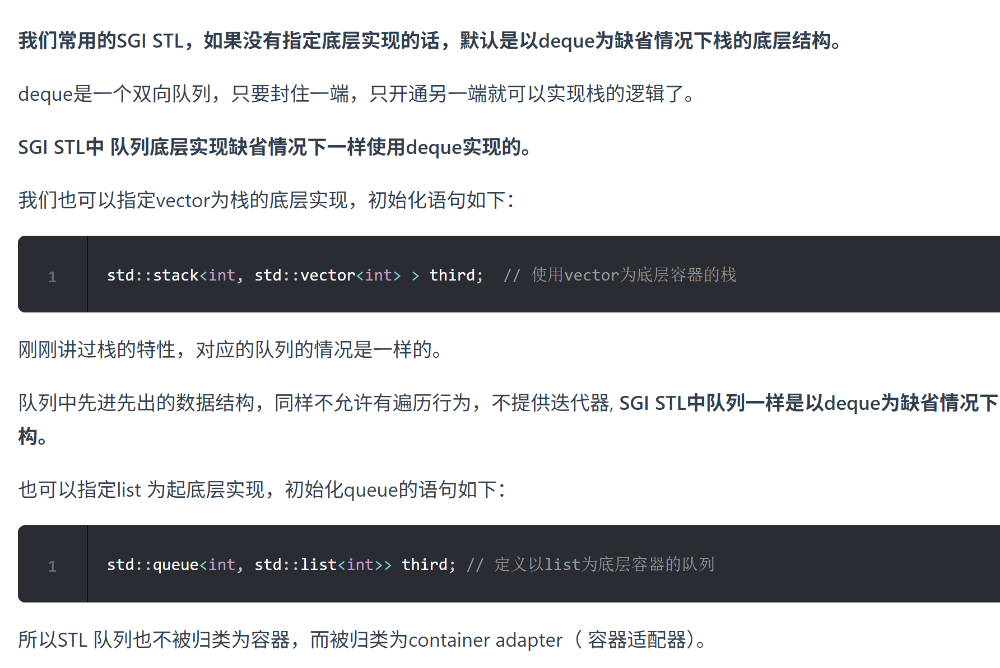
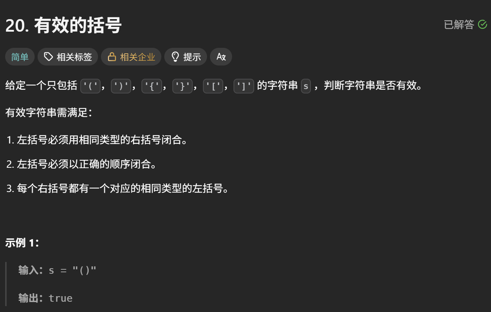
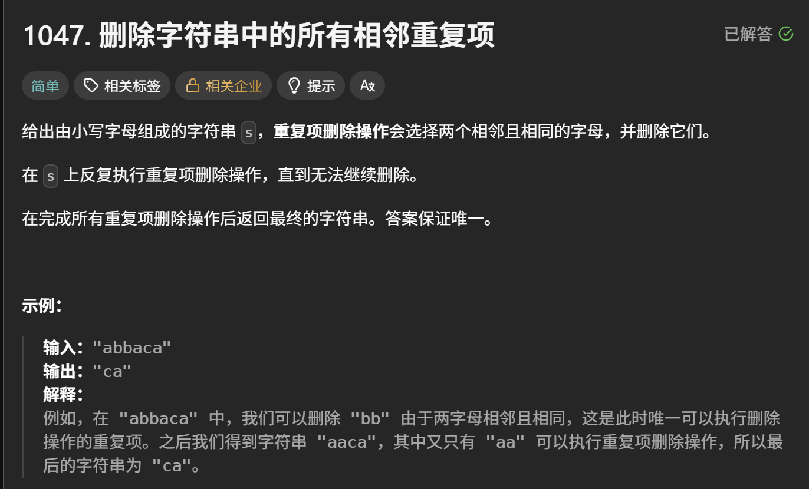
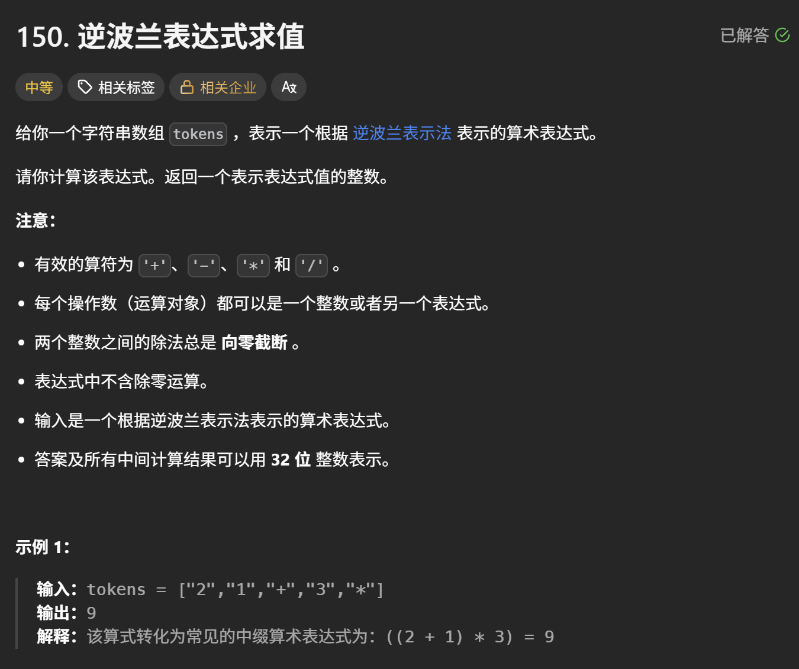
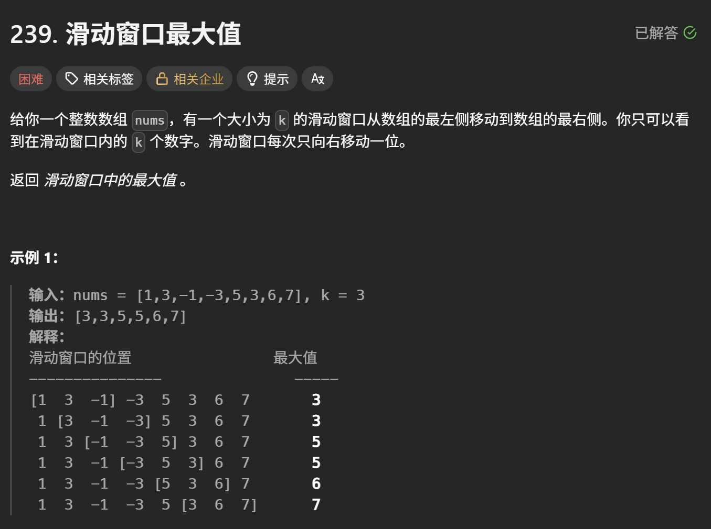
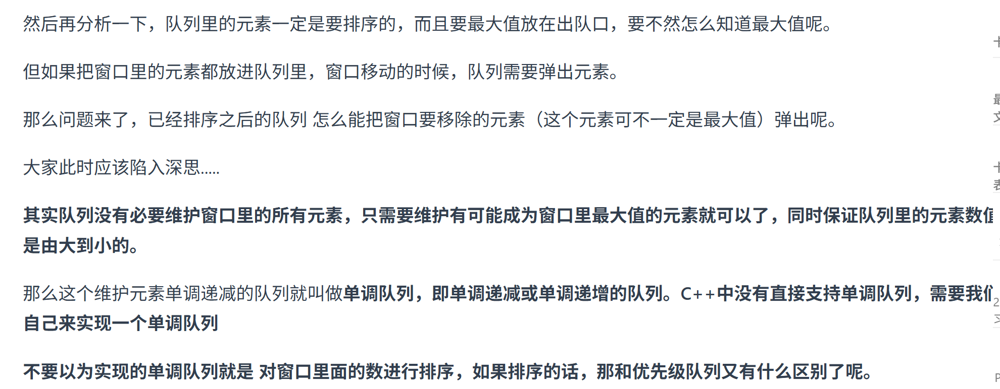
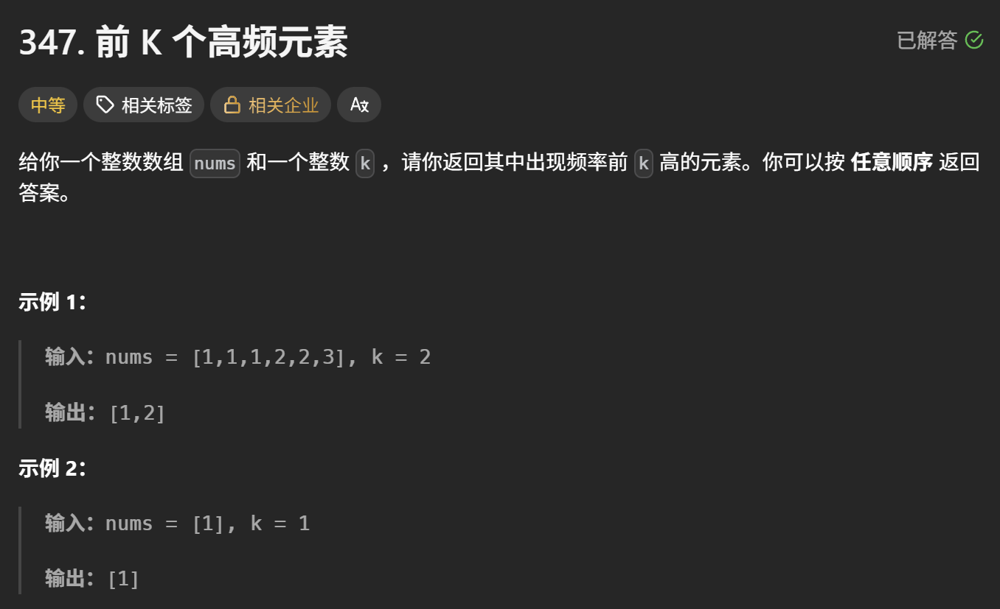
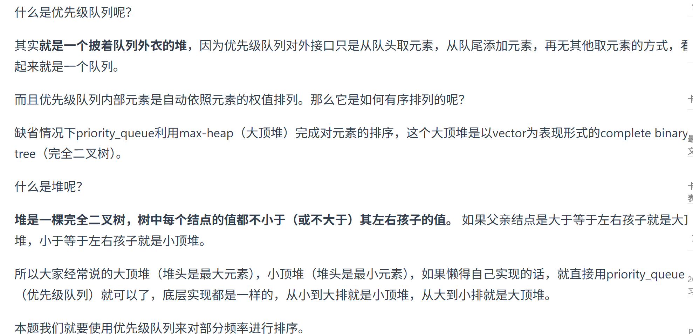
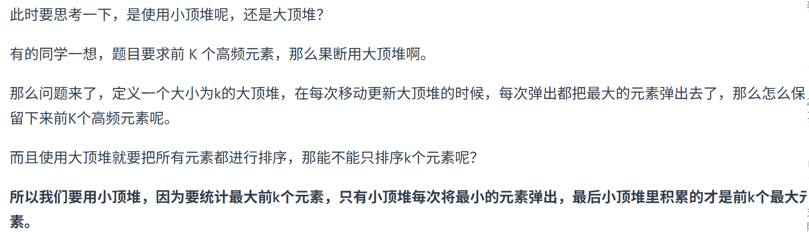
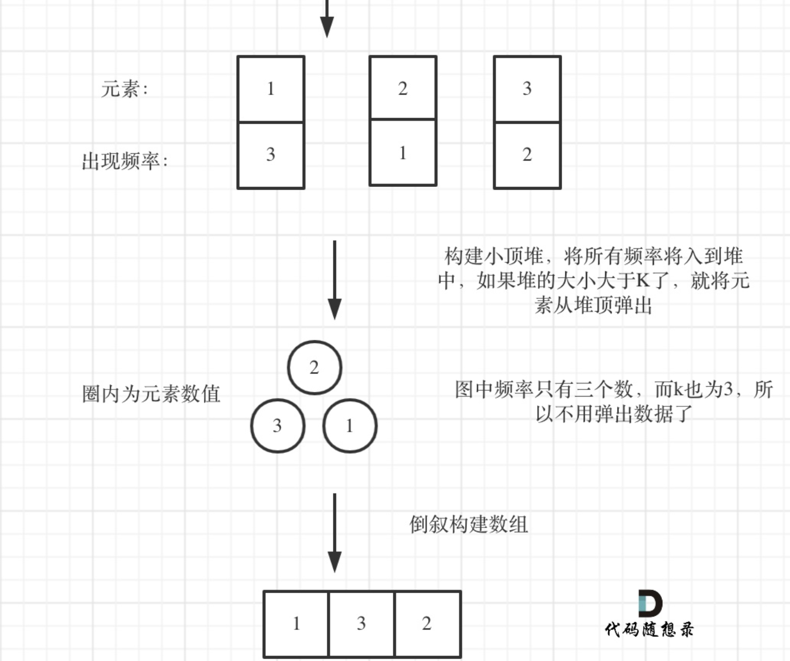

# **栈与队列**

## **理论基础**



## **用栈实现队列**

```cpp
class MyQueue {
public:
    stack<int> stIn;
    stack<int> stOut;
    /** Initialize your data structure here. */
    MyQueue() {

    }
    /** Push element x to the back of queue. */
    void push(int x) {
        stIn.push(x);
    }

    /** Removes the element from in front of queue and returns that element. */
    int pop() {
        // 只有当stOut为空的时候，再从stIn里导入数据（导入stIn全部数据）
        if (stOut.empty()) {
            // 从stIn导入数据直到stIn为空
            while(!stIn.empty()) {
                stOut.push(stIn.top());
                stIn.pop();
            }
        }
        int result = stOut.top();
        stOut.pop();
        return result;
    }

    /** Get the front element. */
    int peek() {
        int res = this->pop(); // 直接使用已有的pop函数
        stOut.push(res); // 因为pop函数弹出了元素res，所以再添加回去
        return res;
    }

    /** Returns whether the queue is empty. */
    bool empty() {
        return stIn.empty() && stOut.empty();
    }
};
```

## **用队列实现栈**

```cpp
class MyStack {
public:
    queue<int> que;

    MyStack() {

    }

    void push(int x) {
        que.push(x);
    }

    int pop() {
        int size = que.size();
        size--;
        while (size--) { // 将队列头部的元素（除了最后一个元素外） 重新添加到队列尾部
            que.push(que.front());
            que.pop();
        }
        int result = que.front(); // 此时弹出的元素顺序就是栈的顺序了
        que.pop();
        return result;
    }

    int top(){
        int size = que.size();
        size--;
        while (size--){
            // 将队列头部的元素（除了最后一个元素外） 重新添加到队列尾部
            que.push(que.front());
            que.pop();
        }
        int result = que.front(); // 此时获得的元素就是栈顶的元素了
        que.push(que.front());    // 将获取完的元素也重新添加到队列尾部，保证数据结构没有变化
        que.pop();
        return result;
    }

    bool empty() {
        return que.empty();
    }
};
```

## **有效的括号**



```cpp
bool isValid(string s) {
        if (s.size() % 2 != 0) return false; // 如果s的长度为奇数，一定不符合要求
        stack<char> st;
        for (int i = 0; i < s.size(); i++) {
            if (s[i] == '(') st.push(')');
            else if (s[i] == '{') st.push('}');
            else if (s[i] == '[') st.push(']');
            // 第三种情况：遍历字符串匹配的过程中，栈已经为空了，没有匹配的字符了，说明右括号没有找到对应的左括号 return false
            // 第二种情况：遍历字符串匹配的过程中，发现栈里没有我们要匹配的字符。所以return false
            else if (st.empty() || st.top() != s[i]) return false;
            else st.pop(); // st.top() 与 s[i]相等，栈弹出元素
        }
        // 第一种情况：此时我们已经遍历完了字符串，但是栈不为空，说明有相应的左括号没有右括号来匹配，所以return false，否则就return true
        return st.empty();
    }
```

## **删除相邻重复项**



```cpp
string removeDuplicates(string S) {
        stack<char> st;
        for (char s : S) {
            if (st.empty() || s != st.top()) {
                st.push(s);
            } else {
                st.pop(); // s 与 st.top()相等的情况
            }
        }
        string result = "";
        while (!st.empty()) { // 将栈中元素放到result字符串汇总
            result += st.top();
            st.pop();
        }
        reverse (result.begin(), result.end()); // 此时字符串需要反转一下
        return result;

    }
```

==**附带如何将stack转换为string**==

## **逆波兰表达式求值**



```cpp
int evalRPN(vector<string>& tokens) {
    // 力扣修改了后台测试数据，需要用longlong
    stack<long long> st; 
    for (int i = 0; i < tokens.size(); i++) {
        if (tokens[i] == "+" || tokens[i] == "-" || tokens[i] == "*" || tokens[i] == "/") {
            long long num1 = st.top();
            st.pop();
            long long num2 = st.top();
            st.pop();
            // 这里要 前面的数(num2) (运算) 后面的数(num1)
            if (tokens[i] == "+") st.push(num2 + num1);
            if (tokens[i] == "-") st.push(num2 - num1);
            if (tokens[i] == "*") st.push(num2 * num1);
            if (tokens[i] == "/") st.push(num2 / num1);
        } else {
            st.push(stoll(tokens[i]));
        }
    }

    long long result = st.top();
    st.pop(); // 把栈里最后一个元素弹出（其实不弹出也没事）
    return result;
}
```

## **滑动窗口最大值**



- 有的同学可能会想用一个大顶堆**优先级队列**来存放这个窗口里的k个数字，这样就可以知道最大的最大值是多少了， 但是问题是这个窗口是移动的，而大顶堆每次只能弹出最大值，我们无法移除其他数值，这样就造成大顶堆维护的不是滑动窗口里面的数值了。所以不能用大顶堆。
- 此时我们需要一个队列，这个队列呢，放进去窗口里的元素，然后随着窗口的移动，队列也一进一出，每次移动之后，队列告诉我们里面的最大值是什么。
- 

```cpp
class Solution {
private:
    class MyQueue { //单调队列（从大到小）
    public:// 这里要加public，不然下面访问不到
        deque<int> que; // 使用deque来实现单调队列
        // 每次弹出的时候，比较当前要弹出的数值是否等于队列出口元素的数值，如果相等则弹出。
        // 同时pop之前判断队列当前是否为空。
        void pop(int value) {
            if (!que.empty() && value == que.front()) {
                que.pop_front();
            }
        }
        // 如果push的数值大于入口元素的数值，那么就将队列后端的数值弹出，直到push的数值小于等于队列入口元素的数值为止。
        // 这样就保持了队列里的数值是单调从大到小的了。
        void push(int value) {
            while (!que.empty() && value > que.back()) {
                que.pop_back();
            }
            que.push_back(value);

        }
        // 查询当前队列里的最大值 直接返回队列前端也就是front就可以了。
        int front() {
            return que.front();
        }
    };
public:
    vector<int> maxSlidingWindow(vector<int>& nums, int k) {
        MyQueue que;
        vector<int> result;
        for (int i = 0; i < k; i++) { // 先将前k的元素放进队列
            que.push(nums[i]);
        }
        result.push_back(que.front()); // result 记录前k的元素的最大值
        for (int i = k; i < nums.size(); i++) {
            que.pop(nums[i - k]); // 滑动窗口移除最前面元素
            que.push(nums[i]); // 滑动窗口前加入最后面的元素
            result.push_back(que.front()); // 记录对应的最大值
        }
        return result;
    }
};
```

## **前k个高频元素**



- 
- 为什么不用**快排**呢， 使用快排要将map转换为vector的结构，然后**对整个数组进行排序**， 而这种场景下，我们其实**只需要维护k个有序的序列**就可以了，所以使用优先级队列是最优的
- 
- 

```cpp
class Solution {
public:
    // 小顶堆
    class mycomparison {
    public:
        bool operator()(const pair<int, int>& lhs, const pair<int, int>& rhs) {
            //sort 的比较器：a < b  →  a 排在 b 前面
            //priority_queue 的比较器：true → left优先级低于rhs → lhs在堆底
            return lhs.second > rhs.second;
        }
    };
    vector<int> topKFrequent(vector<int>& nums, int k) {
        // 要统计元素出现频率
        unordered_map<int, int> map; // map<nums[i],对应出现的次数>
        for (int i = 0; i < nums.size(); i++) {
            map[nums[i]]++;
        }

        // 对频率排序
        // 定义一个小顶堆，大小为k
        priority_queue<pair<int, int>, vector<pair<int, int>>, mycomparison> pri_que;

        // 用固定大小为k的小顶堆，扫面所有频率的数值
        for (unordered_map<int, int>::iterator it = map.begin(); it != map.end(); it++) {
            pri_que.push(*it);
            if (pri_que.size() > k) { // 如果堆的大小大于了K，则队列弹出，保证堆的大小一直为k
                pri_que.pop();
            }
        }

        // 找出前K个高频元素，因为小顶堆先弹出的是最小的，所以倒序来输出到数组
        vector<int> result(k);
        for (int i = k - 1; i >= 0; i--) {
            result[i] = pri_que.top().first;
            pri_que.pop();
        }
        return result;

    }
};
```
