# **贪心算法**

## 分发饼干

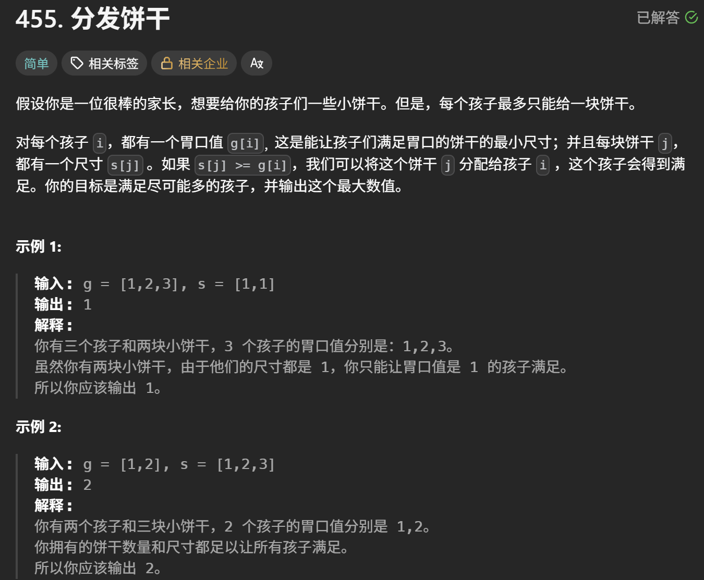

- 可以看出来，是先遍历的胃口，在遍历的饼干，那么可不可以 先遍历 饼干，在遍历胃口呢？
- 其实是不可以的。
- 外面的 for 是里的下标 i 是**固定移动**的，而 if 里面的下标 index 是**符合条件才移动**的

```cpp
int findContentChildren(vector<int>& g, vector<int>& s) {
        //必须先排序
        sort(g.begin(), g.end());
        sort(s.begin(), s.end());
        int index = s.size() - 1; // 饼干数组的下标
        int result = 0;
        //大饼干先满足大胃口
        for (int i = g.size() - 1; i >= 0; i--) { // 遍历胃口
            //记得index >= 0 , 使数组不越界
            if (index >= 0 && s[index] >= g[i]) { // 遍历饼干
                result++;
                index--;
            }
        }
        /*也可以从小饼干先满足小胃口
        for (int i = g.size() - 1; i >= 0; i--) { // 遍历胃口
            if (index >= 0 && s[index] >= g[i]) { // 遍历饼干
                result++;
                index--;
            }
        }*/
        return result;
    }
```

## **摆动序列**

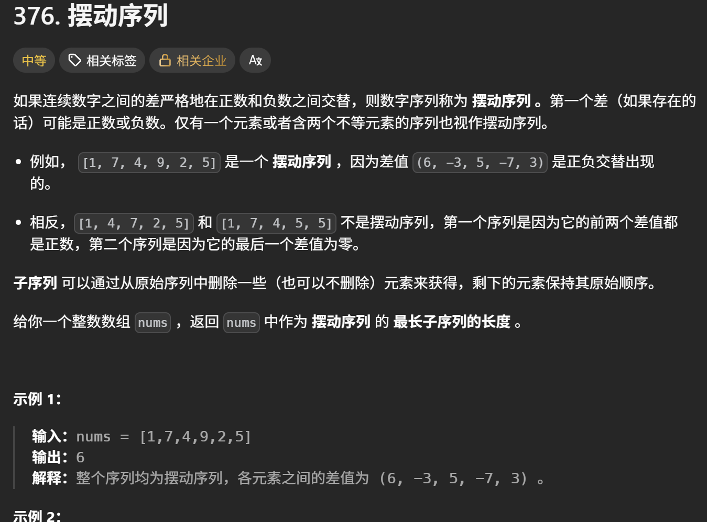

- 有三种情况：
  - 上下坡中有平坡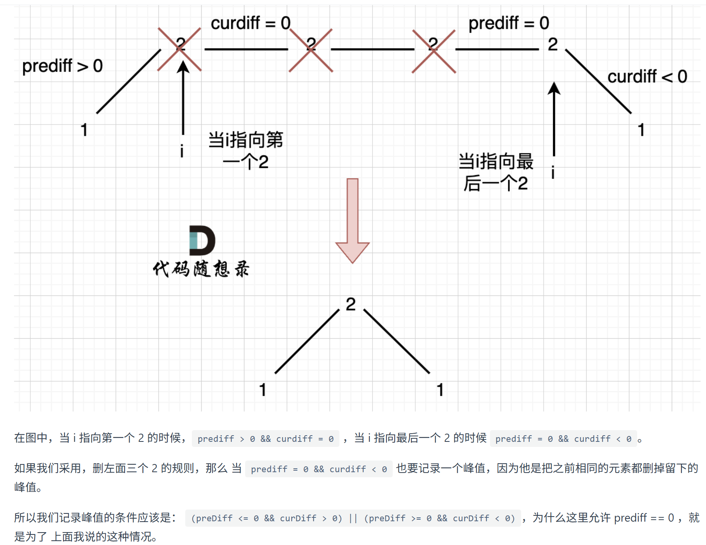
  - 数组首尾两端 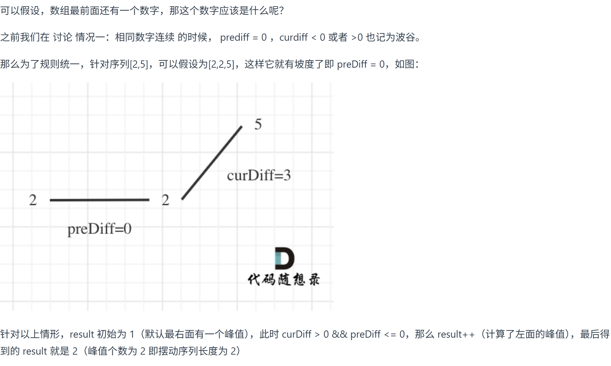
  - 单调坡中有平坡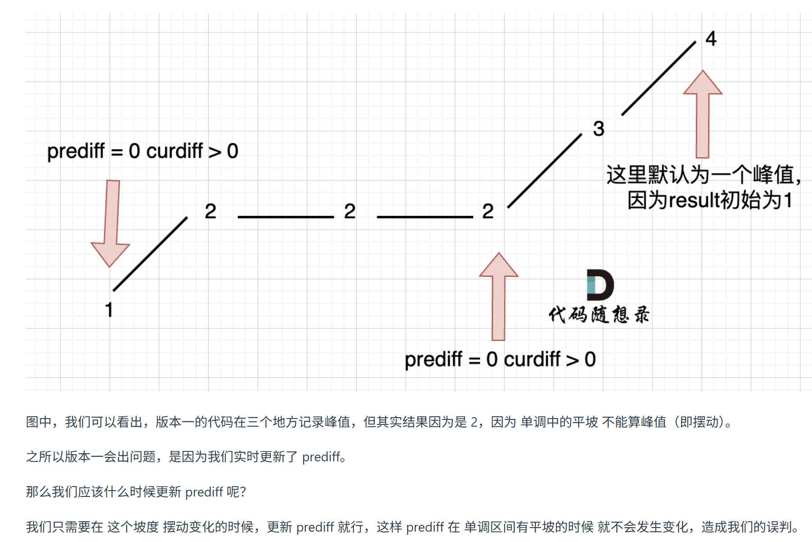

```cpp
int wiggleMaxLength(vector<int>& nums) {
        if (nums.size() <= 1) return nums.size();
        int curDiff = 0; // 当前一对差值
        int preDiff = 0; // 前一对差值
        int result = 1;  // 记录峰值个数，序列默认序列最右边有一个峰值
        for (int i = 0; i < nums.size() - 1; i++) {
            curDiff = nums[i + 1] - nums[i];
            // 出现峰值
            if ((preDiff <= 0 && curDiff > 0) || (preDiff >= 0 && curDiff < 0)) {
                result++;
                preDiff = curDiff; // 注意这里，只在摆动变化的时候更新prediff
            }
        }
        return result;
    }
```

## **最大子数组**

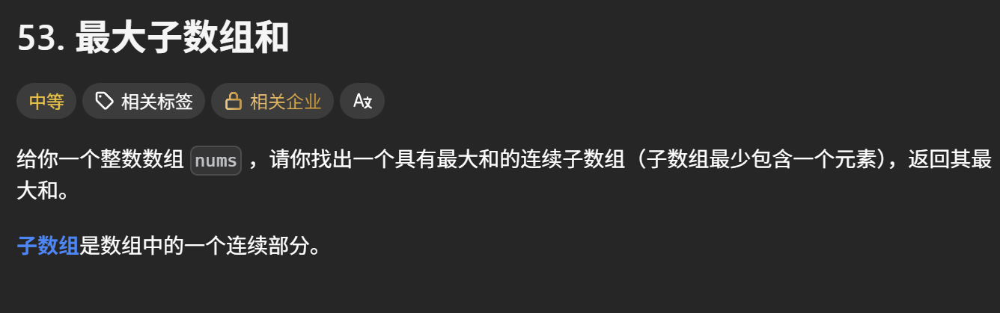

```cpp
int maxSubArray(vector<int>& nums) {
        int result = INT32_MIN;
        int count = 0;
        for (int i = 0; i < nums.size(); i++) {
            count += nums[i];
            if (count > result) { // 取区间累计的最大值（相当于不断确定最大子序终止位置）
                result = count;
            }
            if (count <= 0) count = 0; // 相当于重置最大子序起始位置，因为遇到负数一定是拉低总和
        }
        return result;
    }
```

## **买卖股票的最大利润**

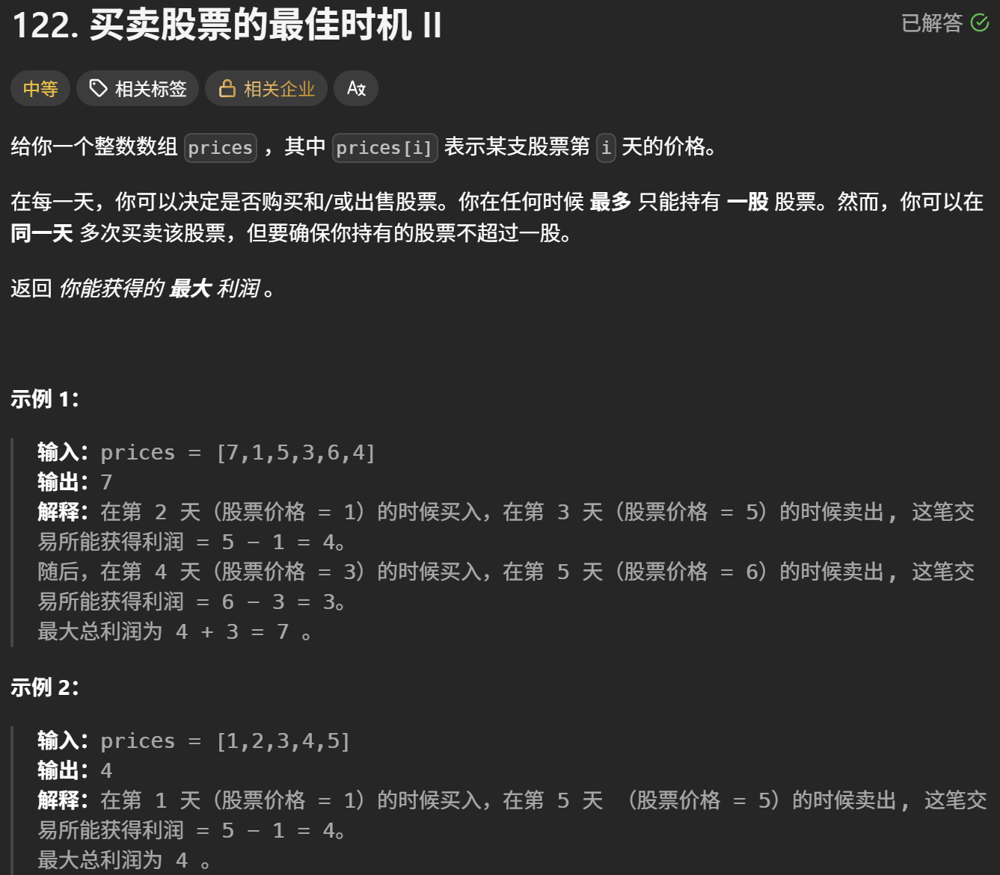

```cpp
int maxProfit(vector<int>& prices) {
        int result = 0;
        for(int i = 1; i < prices.size(); i ++) {
            result += max(prices[i] - prices[i - 1], 0);
        }
        return result;
    }
```

## **跳跃游戏I**

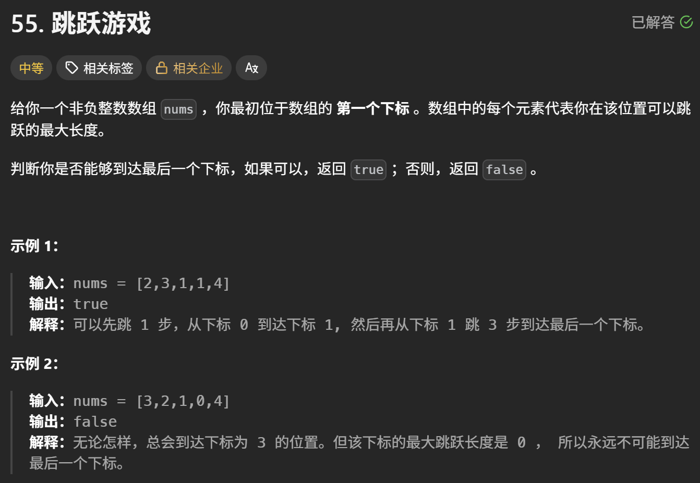

```cpp
bool canJump(vector<int>& nums) {
        int cover = 0;
        if (nums.size() == 1) return true; // 只有一个元素，就是能达到
        for (int i = 0; i <= cover; i++) { // 注意这里是小于等于cover
            cover = max(i + nums[i], cover);
            if (cover >= nums.size() - 1) return true; // 说明可以覆盖到终点了
        }
        return false;
    }
```

## **跳跃游戏II**

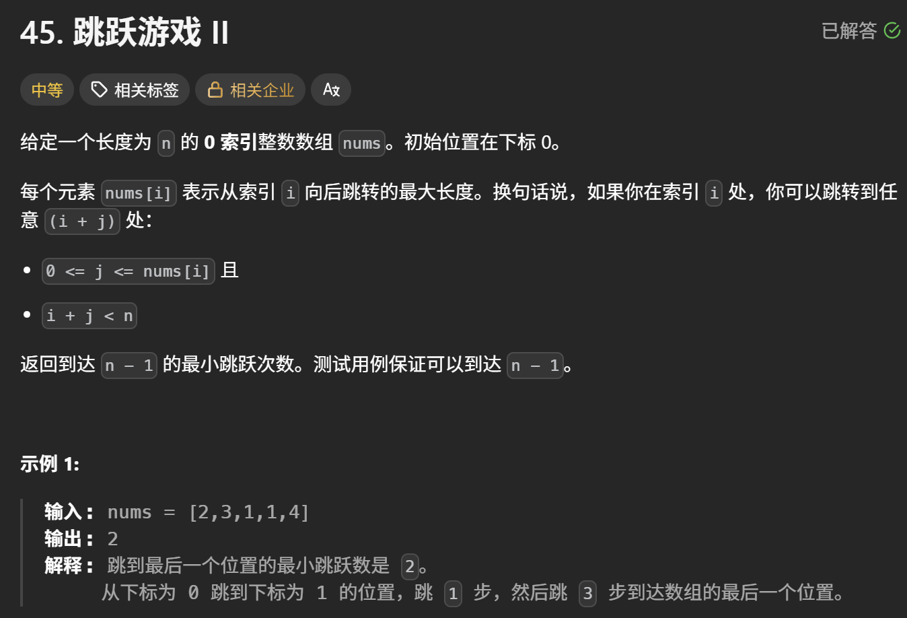

- 要从覆盖范围出发，不管怎么跳，覆盖范围内一定是可以跳到的，以最小的步数增加覆盖范围，覆盖范围一旦覆盖了终点，得到的就是最少步数！
- 这里需要统计两个覆盖范围，当前这一步的最大覆盖和下一步最大覆盖。
- 如果移动下标达到了当前这一步的最大覆盖最远距离了，还没有到终点的话，那么就必须再走一步来增加覆盖范围，直到覆盖范围覆盖了终点。
- 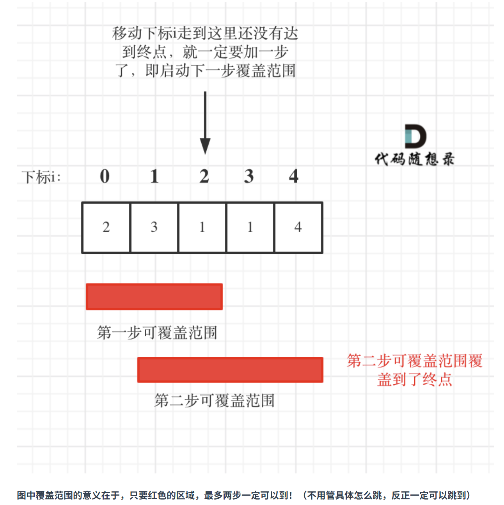
- 特殊情况：
  - 如果当前覆盖最远距离下标不是是集合终点，步数就加一，还需要继续走
  - 如果当前覆盖最远距离下标就是是集合终点，步数不用加一，因为不能再往后走了

```cpp
int jump(vector<int>& nums) {
        if (nums.size() == 1) return 0;
        int curDistance = 0;    // 当前覆盖最远距离下标
        int ans = 0;            // 记录走的最大步数
        int nextDistance = 0;   // 下一步覆盖最远距离下标
        for (int i = 0; i < nums.size(); i++) {
            nextDistance = max(nums[i] + i, nextDistance);  // 更新下一步覆盖最远距离下标
            if (i == curDistance) {        // 遇到当前覆盖最远距离下标
                ans++;                                 // 需要走下一步
                curDistance = nextDistance;    // 更新当前覆盖最远距离下标（相当于加油了）
                if (nextDistance >= nums.size() - 1) break;  
                // 当前覆盖最远距到达集合终点，不用做ans++操作了，直接结束
            }
        }
        return ans;
    }
```

## **K次取反后最大化的数组和**

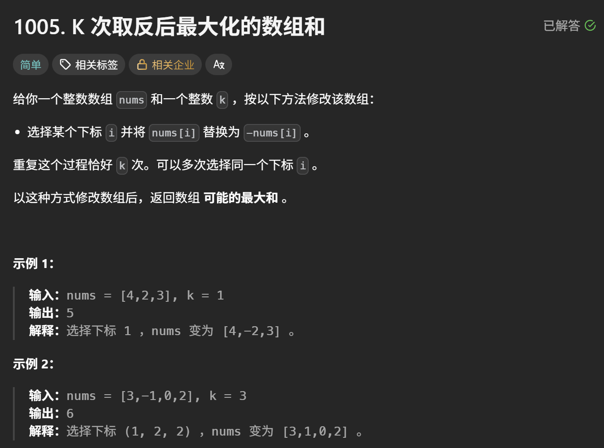

```cpp
class Solution {
static bool cmp(int a, int b) {
    return abs(a) > abs(b);
}
public:
    int largestSumAfterKNegations(vector<int>& A, int K) {
        sort(A.begin(), A.end(), cmp);       // 第一步
        for (int i = 0; i < A.size(); i++) { // 第二步
            if (A[i] < 0 && K > 0) {
                A[i] *= -1;
                K--;
            }
        }
        if (K % 2 == 1) A[A.size() - 1] *= -1; // 第三步
        int result = 0;
        for (int a : A) result += a;        // 第四步
        return result;
    }
};
```

## **加油站**

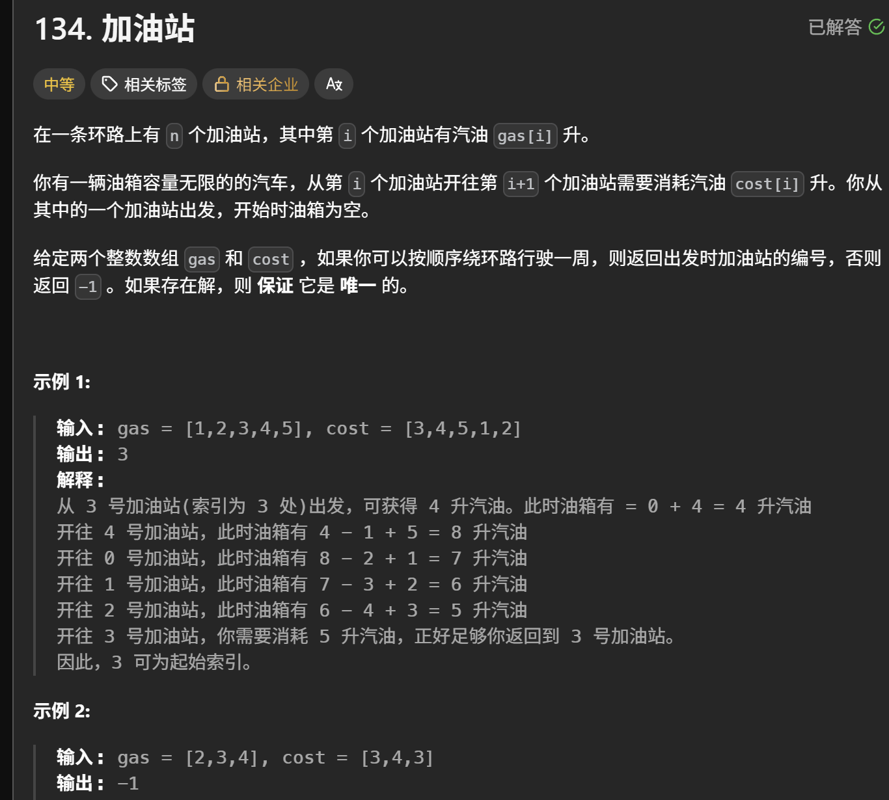

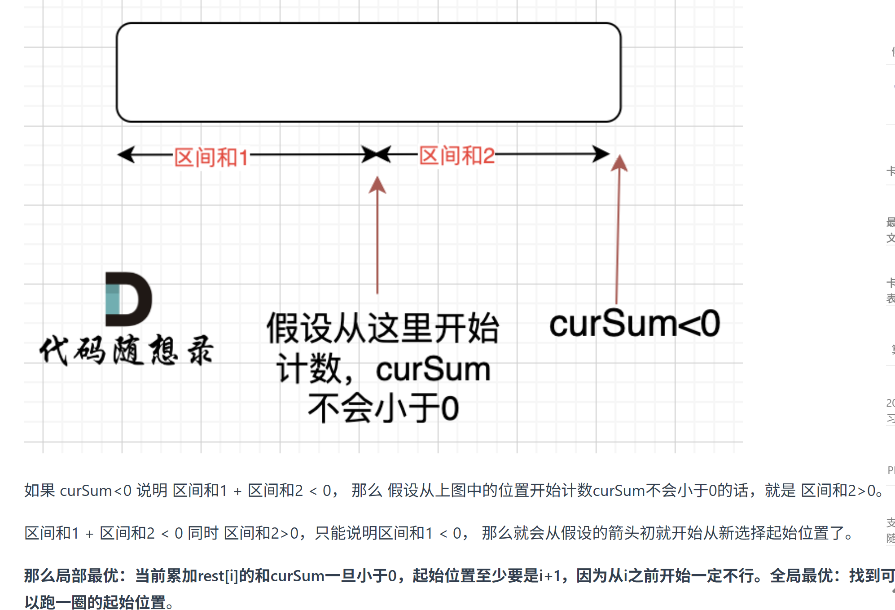
**这样的话这个中间点就也是重新标记的起始位置**

```cpp
int canCompleteCircuit(vector<int>& gas, vector<int>& cost) {
    int curSum = 0;
    int totalSum = 0;
    int start = 0;
    for (int i = 0; i < gas.size(); i++) {
        curSum += gas[i] - cost[i];
        totalSum += gas[i] - cost[i];
        if (curSum < 0) {   // 当前累加rest[i]和 curSum一旦小于0
            start = i + 1;  // 起始位置更新为i+1
            curSum = 0;     // curSum从0开始
        }
    }
    if (totalSum < 0) return -1; // 说明怎么走都不可能跑一圈了
    return start;
}
```

## **分发糖果**

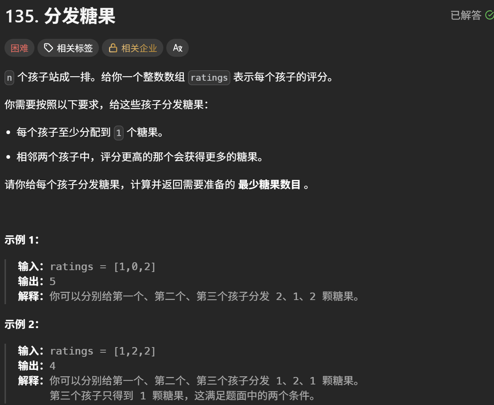

- 一次是从左到右遍历，只比较右边孩子评分比左边大的情况
- 一次是从右到左遍历，只比较左边孩子评分比右边大的情况

```cpp
int candy(vector<int>& ratings) {
    vector<int> candies(ratings.size(), 1);

    for(int i = 1; i < ratings.size(); i ++) {
        if(ratings[i] > ratings[i - 1]){
            candies[i] = candies[i - 1] + 1;
        }
    }

    for(int i = ratings.size() - 1; i > 0; i --) {
        if(ratings[i - 1] > ratings[i]) {
            candies[i - 1] = max(candies[i] + 1, candies[i -  1]);
        }
    }

    int sum = 0;
    for(int i = 0; i < candies.size(); i ++) {
        sum += candies[i];
    }

    return sum;
}
```

## **柠檬水找零**

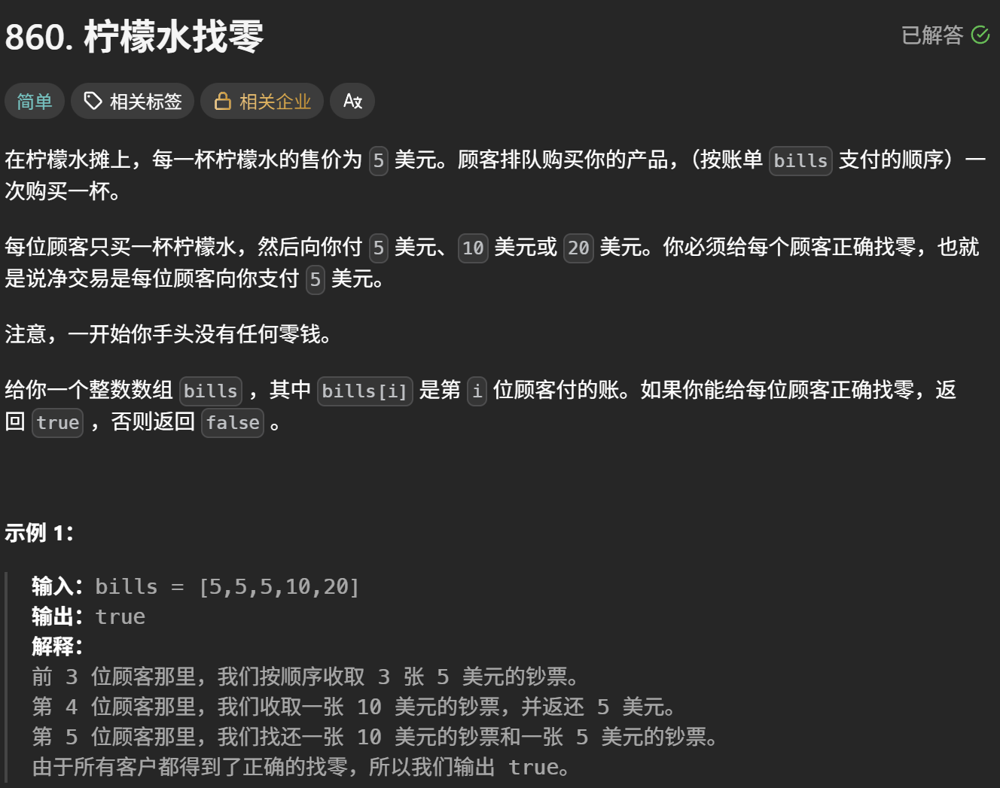

```cpp
bool lemonadeChange(vector<int>& bills) {
    int five = 0, ten = 0, twenty = 0;
    for (int bill : bills) {
        // 情况一
        if (bill == 5) five++;
        // 情况二
        if (bill == 10) {
            if (five <= 0) return false;
            ten++;
            five--;
        }
        // 情况三
        if (bill == 20) {
            // 优先消耗10美元，因为5美元的找零用处更大，能多留着就多留着
            if (five > 0 && ten > 0) {
                five--;
                ten--;
                twenty++; // 其实这行代码可以删了，因为记录20已经没有意义了，不会用20来找零
            } else if (five >= 3) {
                five -= 3;
                twenty++; // 同理，这行代码也可以删了
            } else return false;
        }
    }
    return true;
}
```

## **根据身高重建队列**

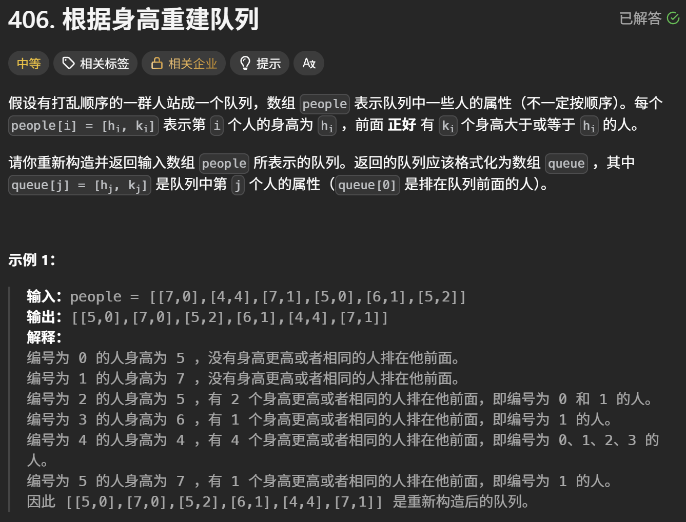

- 局部最优：优先按**身高高的people的k**来插入。插入操作过后的people满足队列属性
- 全局最优：最后都做完插入操作，整个队列满足题目队列属性

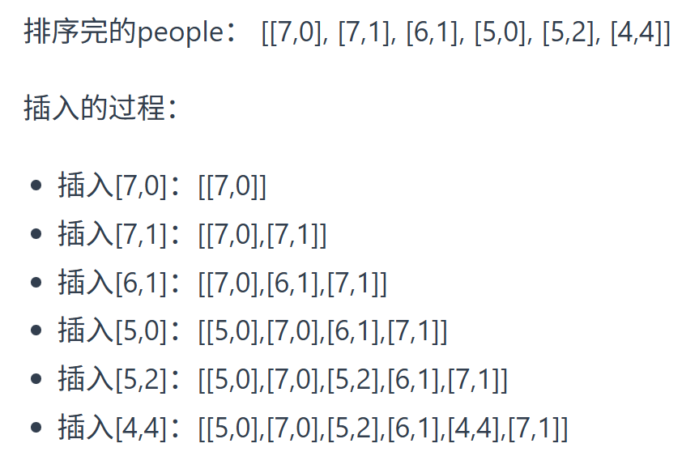

```cpp
class Solution {
public:
    // 身高从大到小排（身高相同k小的站前面）
    static bool cmp(const vector<int>& a, const vector<int>& b) {
        if (a[0] == b[0]) return a[1] < b[1];
        return a[0] > b[0];
    }
    vector<vector<int>> reconstructQueue(vector<vector<int>>& people) {
        sort (people.begin(), people.end(), cmp);
        list<vector<int>> que; // list底层是链表实现，插入效率比vector高的多
        for (int i = 0; i < people.size(); i++) {
            int position = people[i][1]; // 插入到下标为position的位置
            std::list<vector<int>>::iterator it = que.begin();
            while (position--) { // 寻找在插入位置
                it++;
            }
            que.insert(it, people[i]);
        }
        return vector<vector<int>>(que.begin(), que.end());
    }
};
```

- 用list效率比vector高很多，后面要变回vector
- 其技巧是**确定一边然后贪心另一边**，两边一起考虑，就会顾此失彼。

## **用最少的数量箭引爆气球**

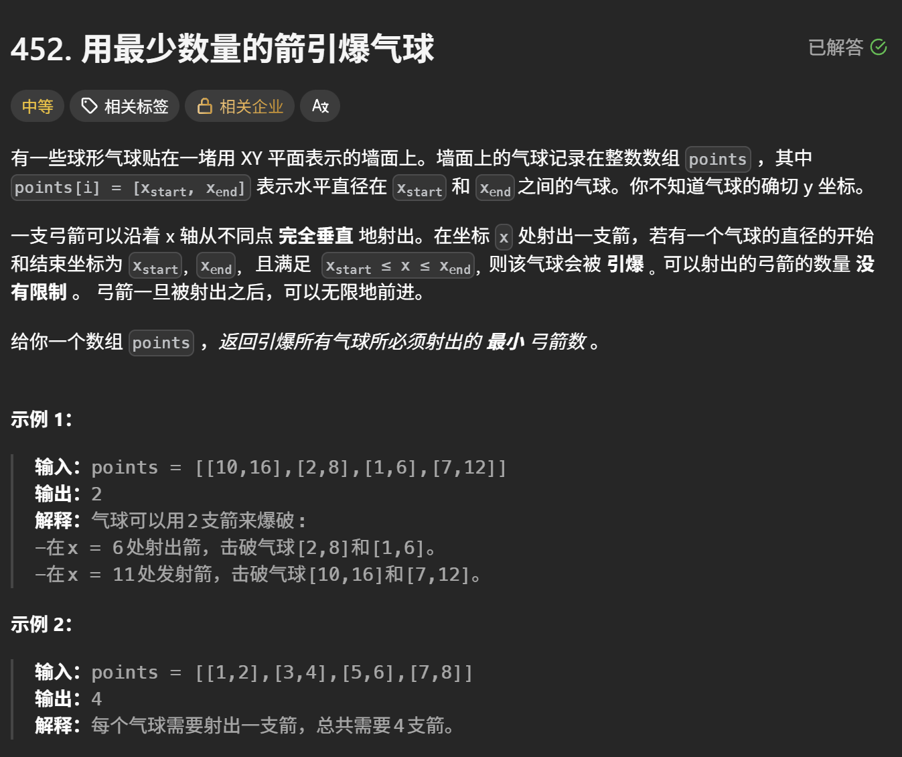

```cpp
class Solution {
private:
    static bool cmp(const vector<int>& a, const vector<int>& b) {
        return a[0] < b[0];
    }
public:
    int findMinArrowShots(vector<vector<int>>& points) {
        if (points.size() == 0) return 0;
        sort(points.begin(), points.end(), cmp);

        int result = 1; // points 不为空至少需要一支箭
        for (int i = 1; i < points.size(); i++) {
            if (points[i][0] > points[i - 1][1]) {  // 气球i和气球i-1不挨着，注意这里不是>=
                result++; // 需要一支箭
            }
            else {  // 气球i和气球i-1挨着
                points[i][1] = min(points[i - 1][1], points[i][1]); // 更新重叠气球最小右边界
            }
        }
        return result;
    }
};
```

## **划分字母区间**

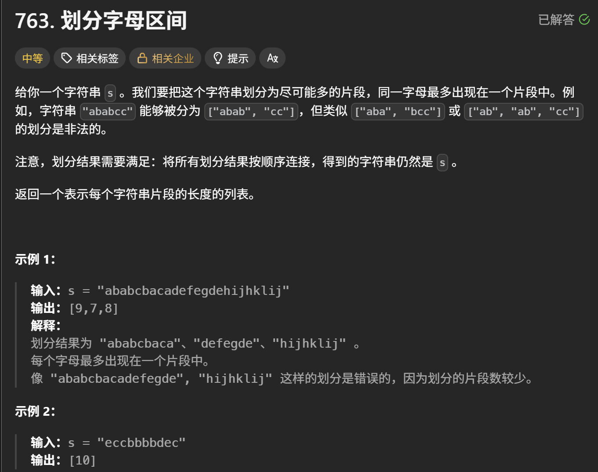

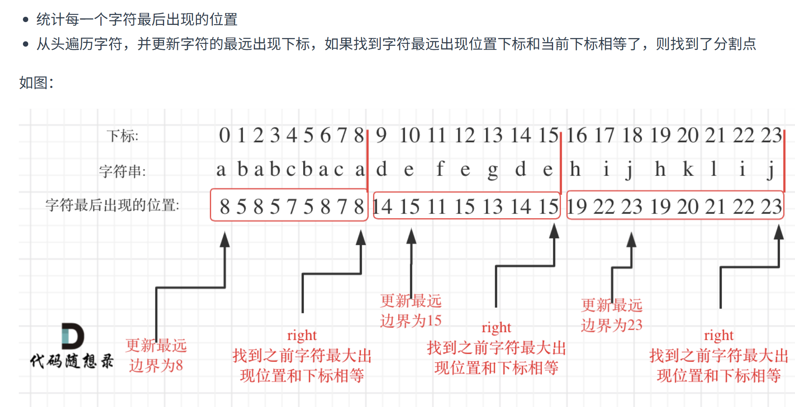

```cpp
vector<int> partitionLabels(string S) {
    int hash[27] = {0}; // i为字符，hash[i]为字符出现的最后位置
    for (int i = 0; i < S.size(); i++) { // 统计每一个字符最后出现的位置
        hash[S[i] - 'a'] = i;
    }
    vector<int> result;
    int left = 0;
    int right = 0;
    for (int i = 0; i < S.size(); i++) {
        right = max(right, hash[S[i] - 'a']); // 找到字符出现的最远边界
        if (i == right) {
            result.push_back(right - left + 1);
            left = i + 1;
        }
    }
    return result;
}
```

## **合并区间**

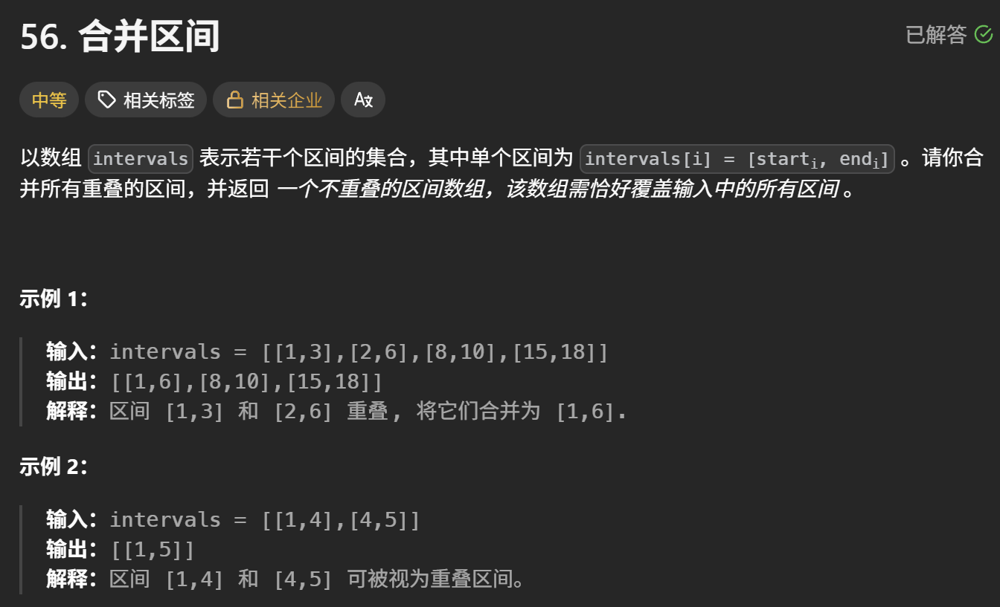

```cpp
vector<vector<int>> merge(vector<vector<int>>& intervals) {
    vector<vector<int>> result;
    if (intervals.size() == 0) return result; // 区间集合为空直接返回
    // 排序的参数使用了lambda表达式
    sort(intervals.begin(), intervals.end(), [](const vector<int>& a, const vector<int>& b){return a[0] < b[0];});

    // 第一个区间就可以放进结果集里，后面如果重叠，在result上直接合并
    result.push_back(intervals[0]); 

    for (int i = 1; i < intervals.size(); i++) {
        if (result.back()[1] >= intervals[i][0]) { // 发现重叠区间
            // 合并区间，只更新右边界就好，因为result.back()的左边界一定是最小值，因为我们按照左边界排序的
            result.back()[1] = max(result.back()[1], intervals[i][1]); 
        } else {
            result.push_back(intervals[i]); // 区间不重叠 
        }
    }
    return result;
}
```

## **单调递增的数字**

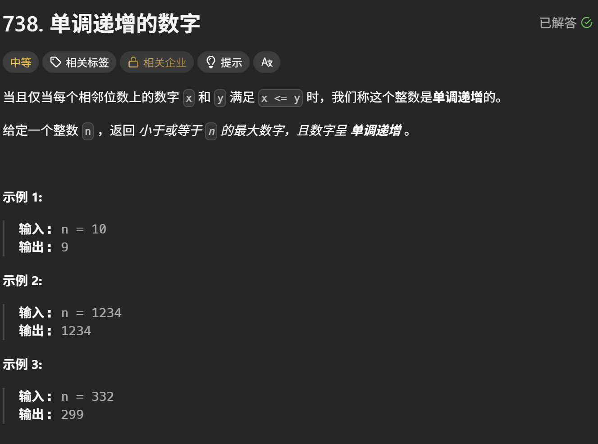

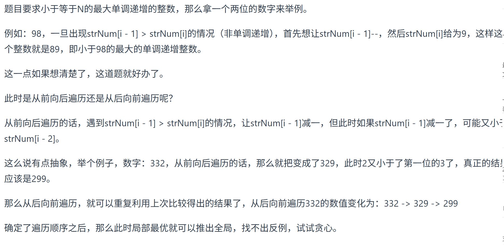

```cpp
int monotoneIncreasingDigits(int N) {
    string strNum = to_string(N);
    // flag用来标记赋值9从哪里开始
    // 设置为这个默认值，为了防止第二个for循环在flag没有被赋值的情况下执行
    int flag = strNum.size();
    for (int i = strNum.size() - 1; i > 0; i--) {
        if (strNum[i - 1] > strNum[i] ) {
            flag = i;
            strNum[i - 1]--;
        }
    }
    for (int i = flag; i < strNum.size(); i++) {
        strNum[i] = '9';
    }
    return stoi(strNum);
}
```

## **监控二叉树**

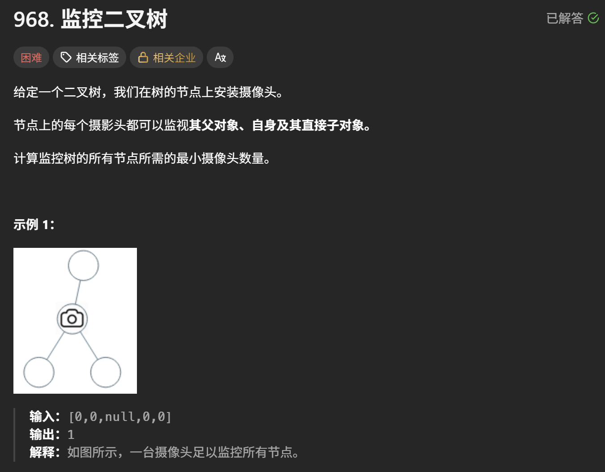
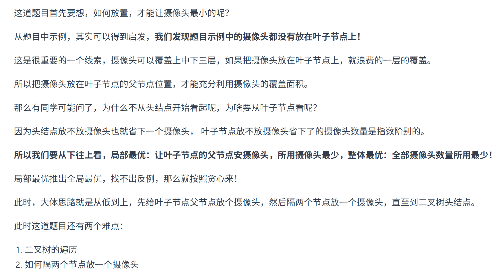
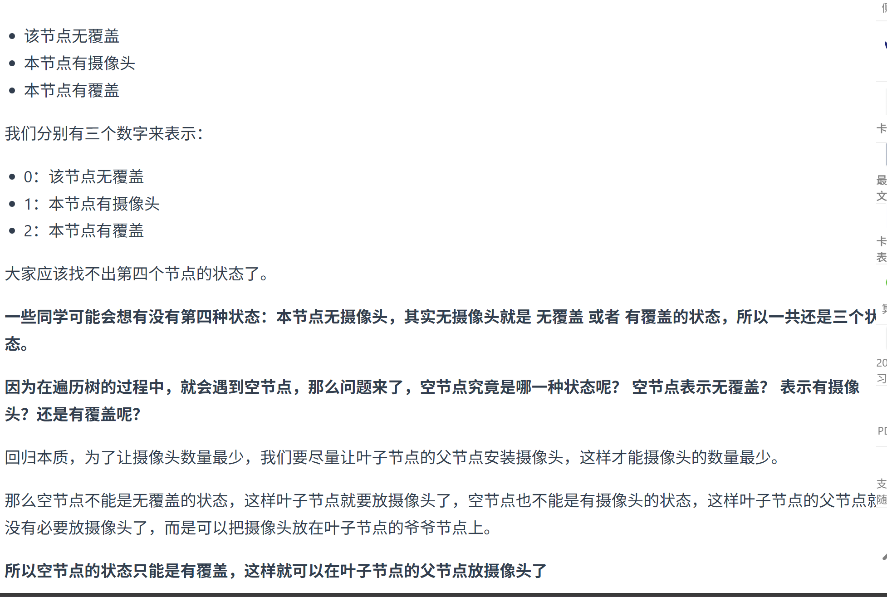

```cpp
class Solution {
private:
    int result;
    int traversal(TreeNode* cur) {

        // 空节点，该节点有覆盖
        if (cur == NULL) return 2;

        int left = traversal(cur->left);    // 左
        int right = traversal(cur->right);  // 右

        // 情况1
        // 左右节点都有覆盖
        if (left == 2 && right == 2) return 0;

        // 情况2
        // left == 0 && right == 0 左右节点无覆盖
        // left == 1 && right == 0 左节点有摄像头，右节点无覆盖
        // left == 0 && right == 1 左节点有无覆盖，右节点摄像头
        // left == 0 && right == 2 左节点无覆盖，右节点覆盖
        // left == 2 && right == 0 左节点覆盖，右节点无覆盖
        if (left == 0 || right == 0) {
            result++;
            return 1;
        }

        // 情况3
        // left == 1 && right == 2 左节点有摄像头，右节点有覆盖
        // left == 2 && right == 1 左节点有覆盖，右节点有摄像头
        // left == 1 && right == 1 左右节点都有摄像头
        // 其他情况前段代码均已覆盖
        if (left == 1 || right == 1) return 2;

        // 以上代码我没有使用else，主要是为了把各个分支条件展现出来，这样代码有助于读者理解
        // 这个 return -1 逻辑不会走到这里。
        return -1;
    }

public:
    int minCameraCover(TreeNode* root) {
        result = 0;
        // 情况4
        if (traversal(root) == 0) { // root 无覆盖
            result++;
        }
        return result;
    }
};
```
