# **链表**

## **定义**

### **单链表**

- 自己定义构造函数

``` c++
// 单链表
struct ListNode {
    int val;  // 节点上存储的元素
    ListNode *next;  // 指向下一个节点的指针
    ListNode(int x) : val(x), next(NULL) {}  // 节点的构造函数
    //你传一个整数x给构造函数，它会把节点的val赋值为x；同时把 next 指针初始化为NULL
};
ListNode* head = new ListNode(5);//int x 对应 5
```

- 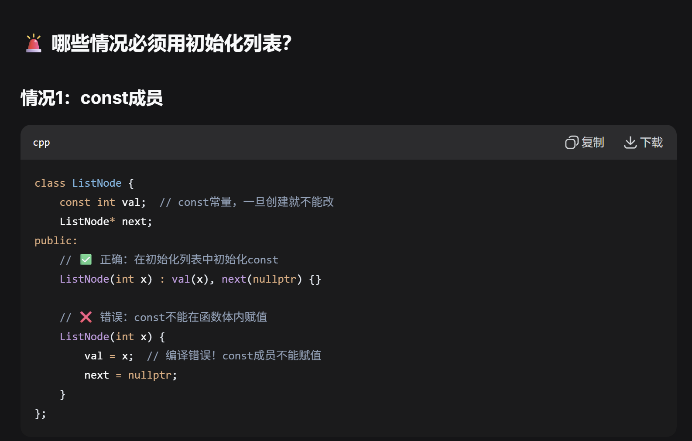
- 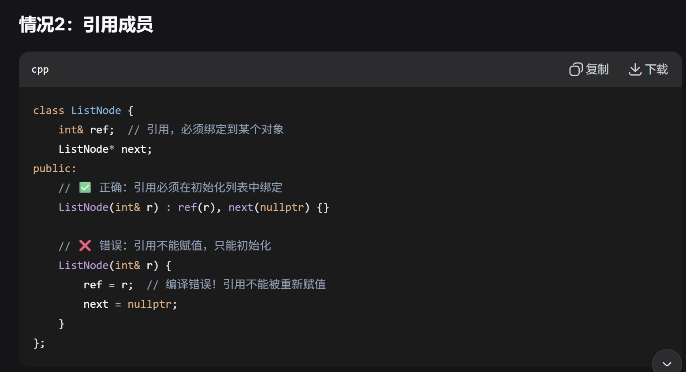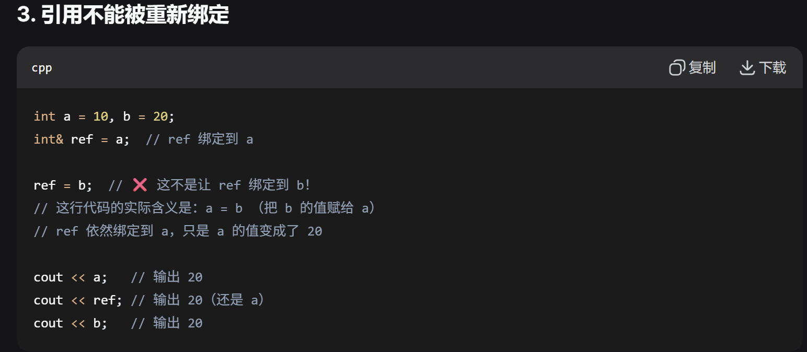
- 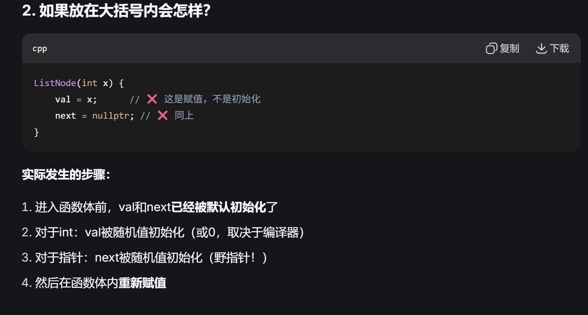

- 默认定义构造函数

``` c++
struct ListNode {
    int val;
    ListNode* next;
    
    // 默认构造函数（无参）
    ListNode() : val(0), next(nullptr) {}  // 默认值为0
};

ListNode* head = new ListNode();
head->val = 5;
```

## **删除 / 添加**

### 删除

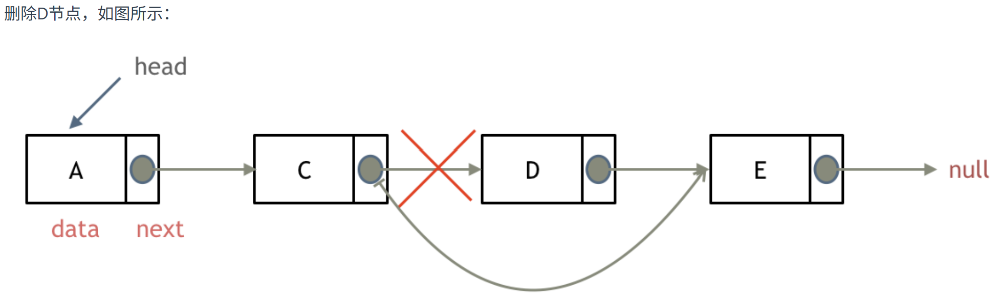

==记得释放 D 的内存==

### 添加

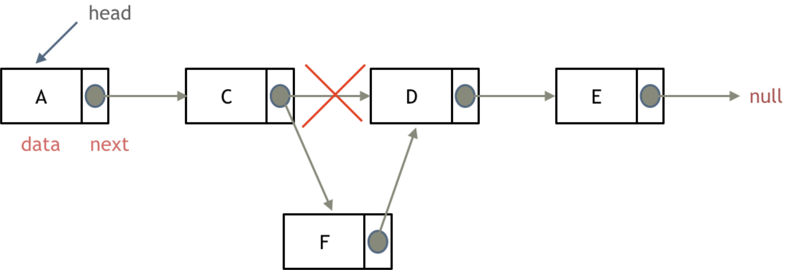

## **和数组相比**

要增删某个节点，**需要从头遍历查找**

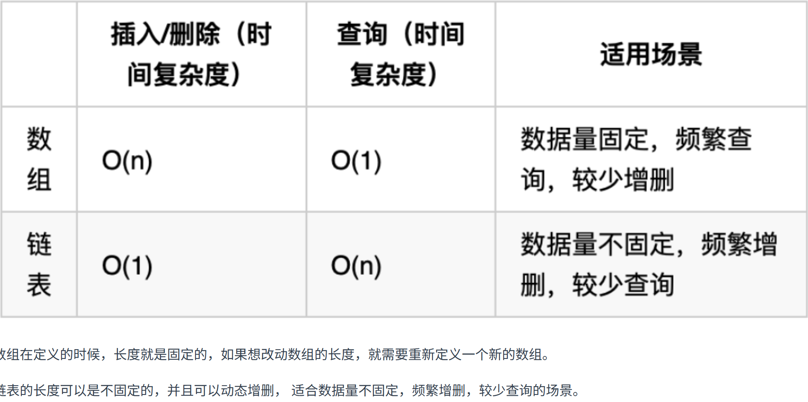

## **移除链表元素**

- 使用原链表，头节点和非头节点需要分开写

``` c++
ListNode* removeElements(ListNode* head, int val) {
        // 删除头结点
        while (head != NULL && head->val == val) { // 注意这里不是if
            ListNode* tmp = head;
            head = head->next;
            delete tmp;
        }

        // 删除非头结点
        ListNode* cur = head;
        while (cur != NULL && cur->next!= NULL) {
            if (cur->next->val == val) {
                ListNode* tmp = cur->next;
                cur->next = cur->next->next;
                delete tmp;
            } else {
                cur = cur->next;
            }
        }
        return head;
    }
```

- 创建虚拟数组

``` c++
ListNode* removeElements(ListNode* head, int val) {
        ListNode* dummyHead = new ListNode(0); // 设置一个虚拟头结点
        dummyHead->next = head; // 将虚拟头结点指向head，这样方便后面做删除操作
        ListNode* cur = dummyHead;
        while (cur->next != NULL) {
            if(cur->next->val == val) {
                ListNode* tmp = cur->next;
                cur->next = cur->next->next;
                delete tmp;
            } else {
                cur = cur->next;
            }
        }
        head = dummyHead->next;
        delete dummyHead;
        return head;
    }
```

## **一些基本操作**

- get(index)：获取链表中第 index 个节点的值。如果索引无效，则返回-1。
- addAtHead(val)：在链表的第一个元素之前添加一个值为 val 的节点。插入后，新节点将成为链表的第一个节点。
- addAtTail(val)：将值为 val 的节点追加到链表的最后一个元素。
- addAtIndex(index,val)：在链表中的第 index 个节点之前添加值为 val  的节点。如果 index 等于链表的长度，则该节点将附加到链表的末尾。如果 index 大于链表长度，则不会插入节点。如果index小于0，则在头部插入节点。
- deleteAtIndex(index)：如果索引 index 有效，则删除链表中的第 index 个节点。

- **单链表法**

``` C++
class MyLinkedList {
public:
    struct LinkedNode{
        int val;
        LinkedNode *next;
        LinkedNode(int val):val(val),next(nullptr){}
    };
    
    MyLinkedList() {
        _dummyHead = new LinkedNode(0);
        _size = 0;
    }
    
    int get(int index) {
        if(index >= _size || index < 0){
            return -1;
        }
        LinkedNode *cur = _dummyHead->next;
        while(index--){
            cur = cur->next; 
        }
        return cur->val;
    }
    
    void addAtHead(int val) {
        LinkedNode *newNode = new LinkedNode(val);
        newNode->next = _dummyHead->next;
        _dummyHead->next = newNode;
        _size ++;
    }
    
    void addAtTail(int val) {
        LinkedNode *newNode = new LinkedNode(val);
        LinkedNode *cur = _dummyHead->next;
        while(cur != nullptr){
            cur = cur->next;
        }
        cur->next = newNode;
        _size ++;
    }
    
    void addAtIndex(int index, int val) {
        if(index > _size)  return;
        if(index < 0)  index = 0;
        LinkedNode *newNode = new LinkedNode(val);
        LinkedNode *cur = _dummyHead;
        while(index--){
            cur = cur->next;
        }
        newNode->next = cur->next;
        cur->next = newNode;
        _size ++;
    }
    
    void deleteAtIndex(int index) {
        if(index >= _size || index < 0){
            return;
        }
        LinkedNode *cur = _dummyHead;
        while(index--){
            cur = cur->next;
        }
        LinkedNode *temp = cur->next;
        cur->next = cur->next->next;
        delete temp;
        //delete命令指示释放了tmp指针原本所指的那部分内存，
        //被delete后的指针tmp的值（地址）并非就是NULL，而是随机值。也就是被delete后，
        //如果不再加上一句tmp=nullptr,tmp会成为乱指的野指针
        //如果之后的程序不小心使用了tmp，会指向难以预想的内存空间
        temp = nullptr;
        _size --;
    }

    void printLinkedList() {
        LinkedNode* cur = _dummyHead;
        while (cur->next != nullptr) {
            cout << cur->next->val << " ";
            cur = cur->next;
        }
        cout << endl;
    }
private:
    int _size;
    LinkedNode *_dummyHead;
};

/**
 * Your MyLinkedList object will be instantiated and called as such:
 * MyLinkedList* obj = new MyLinkedList();
 * int param_1 = obj->get(index);
 * obj->addAtHead(val);
 * obj->addAtTail(val);
 * obj->addAtIndex(index,val);
 * obj->deleteAtIndex(index);
 */
```

- **双链表法**

```cpp
//采用循环虚拟结点的双链表实现
class MyLinkedList {
public:
    // 定义双向链表节点结构体
    struct DList {
        int elem; // 节点存储的元素
        DList *next; // 指向下一个节点的指针
        DList *prev; // 指向上一个节点的指针
        // 构造函数，创建一个值为elem的新节点
        DList(int elem) : elem(elem), next(nullptr), prev(nullptr) {};
    };

    // 构造函数，初始化链表
    MyLinkedList() {
        sentinelNode = new DList(0); // 创建哨兵节点，不存储有效数据
        sentinelNode->next = sentinelNode; // 哨兵节点的下一个节点指向自身，形成循环
        sentinelNode->prev = sentinelNode; // 哨兵节点的上一个节点指向自身，形成循环
        size = 0; // 初始化链表大小为0
    }

    // 获取链表中第index个节点的值
    int get(int index) {
        if (index > (size - 1) || index < 0) { // 检查索引是否超出范围
            return -1; // 如果超出范围，返回-1
        }
        int num;
        int mid = size >> 1; // 计算链表中部位置
        DList *curNode = sentinelNode; // 从哨兵节点开始
        if (index < mid) { // 如果索引小于中部位置，从前往后遍历
            for (int i = 0; i < index + 1; i++) {
                curNode = curNode->next; // 移动到目标节点
            }
        } else { // 如果索引大于等于中部位置，从后往前遍历
            for (int i = 0; i < size - index; i++) {
                curNode = curNode->prev; // 移动到目标节点
            }
        }
        num = curNode->elem; // 获取目标节点的值
        return num; // 返回节点的值
    }

    // 在链表头部添加节点
    void addAtHead(int val) {
        DList *newNode = new DList(val); // 创建新节点
        DList *next = sentinelNode->next; // 获取当前头节点的下一个节点
        newNode->prev = sentinelNode; // 新节点的上一个节点指向哨兵节点
        newNode->next = next; // 新节点的下一个节点指向原来的头节点
        size++; // 链表大小加1
        sentinelNode->next = newNode; // 哨兵节点的下一个节点指向新节点
        next->prev = newNode; // 原来的头节点的上一个节点指向新节点
    }

    // 在链表尾部添加节点
    void addAtTail(int val) {
        DList *newNode = new DList(val); // 创建新节点
        DList *prev = sentinelNode->prev; // 获取当前尾节点的上一个节点
        newNode->next = sentinelNode; // 新节点的下一个节点指向哨兵节点
        newNode->prev = prev; // 新节点的上一个节点指向原来的尾节点
        size++; // 链表大小加1
        sentinelNode->prev = newNode; // 哨兵节点的上一个节点指向新节点
        prev->next = newNode; // 原来的尾节点的下一个节点指向新节点
    }

    // 在链表中的第index个节点之前添加值为val的节点
    void addAtIndex(int index, int val) {
        if (index > size) { // 检查索引是否超出范围
            return; // 如果超出范围，直接返回
        }
        if (index <= 0) { // 如果索引为0或负数，在头部添加节点
            addAtHead(val);
            return;
        }
        int num;
        int mid = size >> 1; // 计算链表中部位置
        DList *curNode = sentinelNode; // 从哨兵节点开始
        if (index < mid) { // 如果索引小于中部位置，从前往后遍历
            for (int i = 0; i < index; i++) {
                curNode = curNode->next; // 移动到目标位置的前一个节点
            }
            DList *temp = curNode->next; // 获取目标位置的节点
            DList *newNode = new DList(val); // 创建新节点
            curNode->next = newNode; // 在目标位置前添加新节点
            temp->prev = newNode; // 目标位置的节点的前一个节点指向新节点
            newNode->next = temp; // 新节点的下一个节点指向目标位置的结点
            newNode->prev = curNode; // 新节点的上一个节点指向当前节点
        } else { // 如果索引大于等于中部位置，从后往前遍历
            for (int i = 0; i < size - index; i++) {
                curNode = curNode->prev; // 移动到目标位置的后一个节点
            }
            DList *temp = curNode->prev; // 获取目标位置的节点
            DList *newNode = new DList(val); // 创建新节点
            curNode->prev = newNode; // 在目标位置后添加新节点
            temp->next = newNode; // 目标位置的节点的下一个节点指向新节点
            newNode->prev = temp; // 新节点的上一个节点指向目标位置的节点
            newNode->next = curNode; // 新节点的下一个节点指向当前节点
        }
        size++; // 链表大小加1
    }

    // 删除链表中的第index个节点
    void deleteAtIndex(int index) {
        if (index > (size - 1) || index < 0) { // 检查索引是否超出范围
            return; // 如果超出范围，直接返回
        }
        int num;
        int mid = size >> 1; // 计算链表中部位置
        DList *curNode = sentinelNode; // 从哨兵节点开始
        if (index < mid) { // 如果索引小于中部位置，从前往后遍历
            for (int i = 0; i < index; i++) {
                curNode = curNode->next; // 移动到目标位置的前一个节点
            }
            DList *next = curNode->next->next; // 获取目标位置的下一个节点
            curNode->next = next; // 删除目标位置的节点
            next->prev = curNode; // 目标位置的下一个节点的前一个节点指向当前节点
        } else { // 如果索引大于等于中部位置，从后往前遍历
            for (int i = 0; i < size - index - 1; i++) {
                curNode = curNode->prev; // 移动到目标位置的后一个节点
            }
            DList *prev = curNode->prev->prev; // 获取目标位置的下一个节点
            curNode->prev = prev; // 删除目标位置的节点
            prev->next = curNode; // 目标位置的下一个节点的下一个节点指向当前节点
        }
        size--; // 链表大小减1
    }

private:
    int size; // 链表的大小
    DList *sentinelNode; // 哨兵节点的指针
};
```

## **反转单链表**

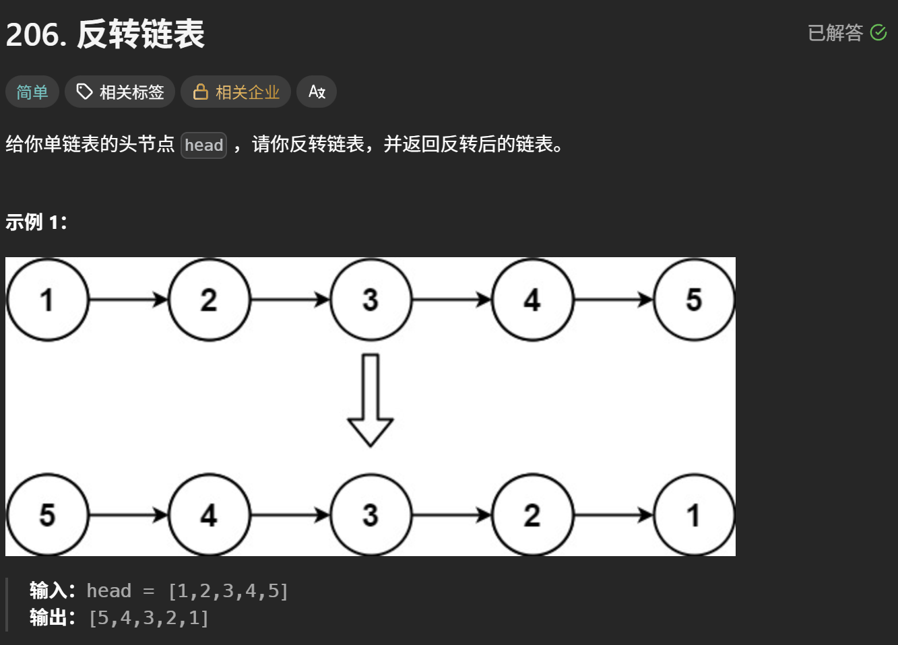

- 从前往后

```cpp
ListNode* reverseList(ListNode* head) {
    ListNode* temp; // 保存cur的下一个节点
    ListNode* cur = head;
    ListNode* pre = NULL;
    while(cur) {
        temp = cur->next;  // 保存一下 cur的下一个节点，因为接下来要改变cur->next
        cur->next = pre; // 翻转操作
        // 更新pre 和 cur指针
        pre = cur;
        cur = temp;
    }
    return pre;
}
```

- 从后往前

```cpp
ListNode* reverseList(ListNode* head) {
    // 边缘条件判断
    if(head == NULL) return NULL;
    if (head->next == NULL) return head;
    
    // 递归调用，翻转第二个节点开始往后的链表
    ListNode *last = reverseList(head->next);
    // 翻转头节点与第二个节点的指向
    head->next->next = head;
    // 此时的 head 节点为尾节点，next 需要指向 NULL
    head->next = NULL;
    return last;
}
```

## **两两交换链表中的节点**

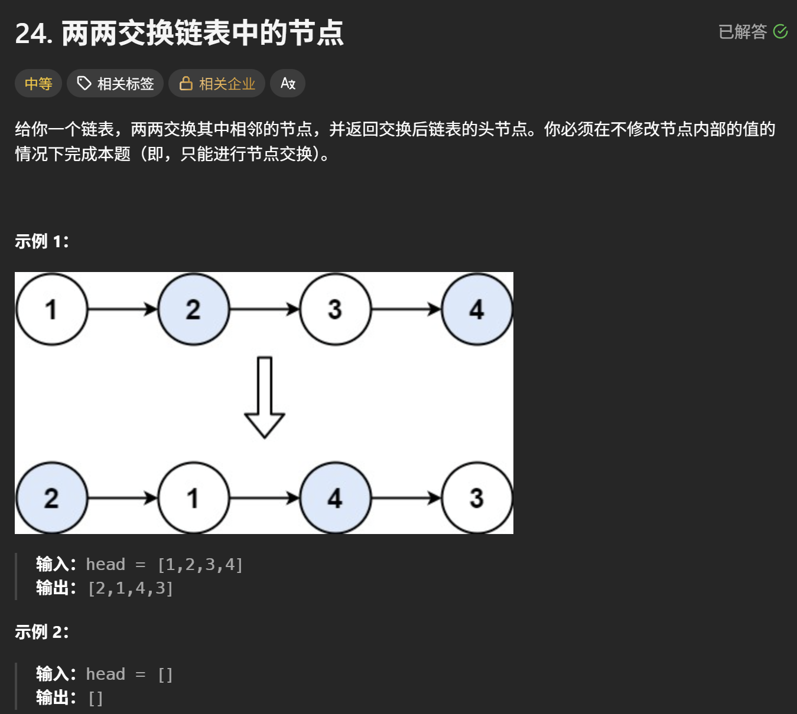

```cpp
ListNode* swapPairs(ListNode* head) {
    ListNode* dummyHead = new ListNode(0); // 设置一个虚拟头结点
    dummyHead->next = head; // 将虚拟头结点指向head，这样方便后面做删除操作
    ListNode* cur = dummyHead;
    while(cur->next != nullptr && cur->next->next != nullptr) {
        ListNode* tmp = cur->next; // 记录临时节点
        ListNode* tmp1 = cur->next->next->next; // 记录临时节点

        cur->next = cur->next->next;    // 步骤一
        cur->next->next = tmp;          // 步骤二
        cur->next->next->next = tmp1;   // 步骤三

        cur = cur->next->next; // cur移动两位，准备下一轮交换
    }
    ListNode* result = dummyHead->next;
    delete dummyHead;
    return result;
}
```

## **删除倒数第n个结点(双指针)**

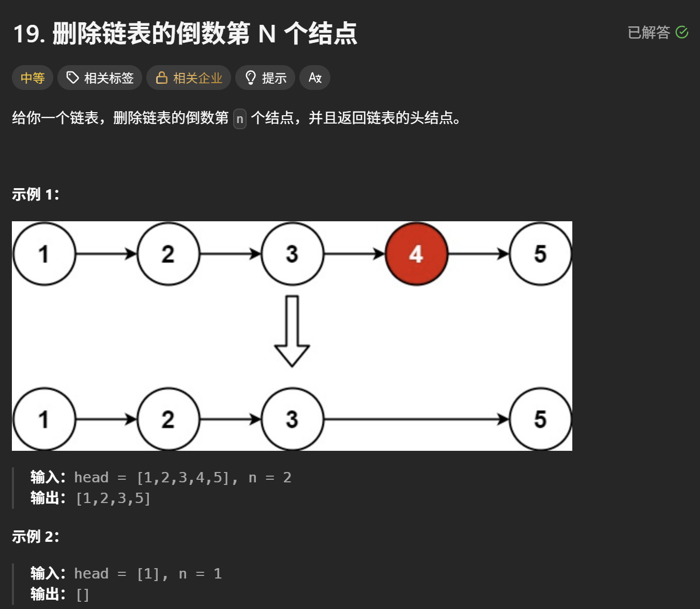

```cpp
ListNode* removeNthFromEnd(ListNode* head, int n) {
    ListNode* dummyHead = new ListNode(0);
    dummyHead->next = head;
    ListNode* slow = dummyHead;
    ListNode* fast = dummyHead;
    while(n-- && fast != NULL) {
        fast = fast->next;
    }
    fast = fast->next;
     // fast再提前走一步，因为需要让slow指向删除节点的上一个节点
    // 而且fast一开始是虚拟头结点
    while (fast != NULL) {
        fast = fast->next;
        slow = slow->next;
    }
    slow->next = slow->next->next; 
    
    // ListNode *tmp = slow->next;  C++释放内存的逻辑
    // slow->next = tmp->next;
    // delete tmp;
    
    return dummyHead->next;
}
```

## **链表相交**

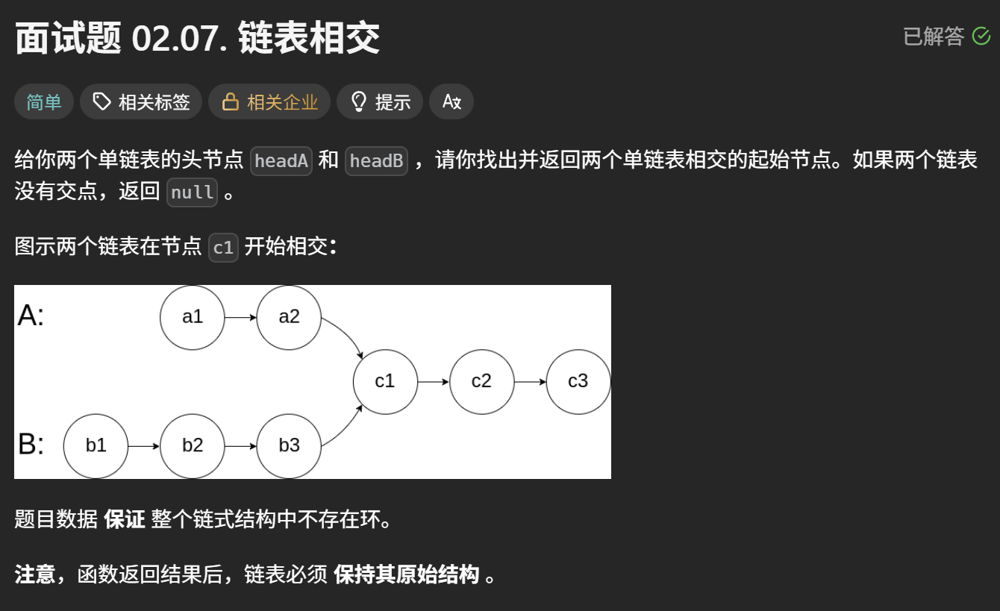

思路：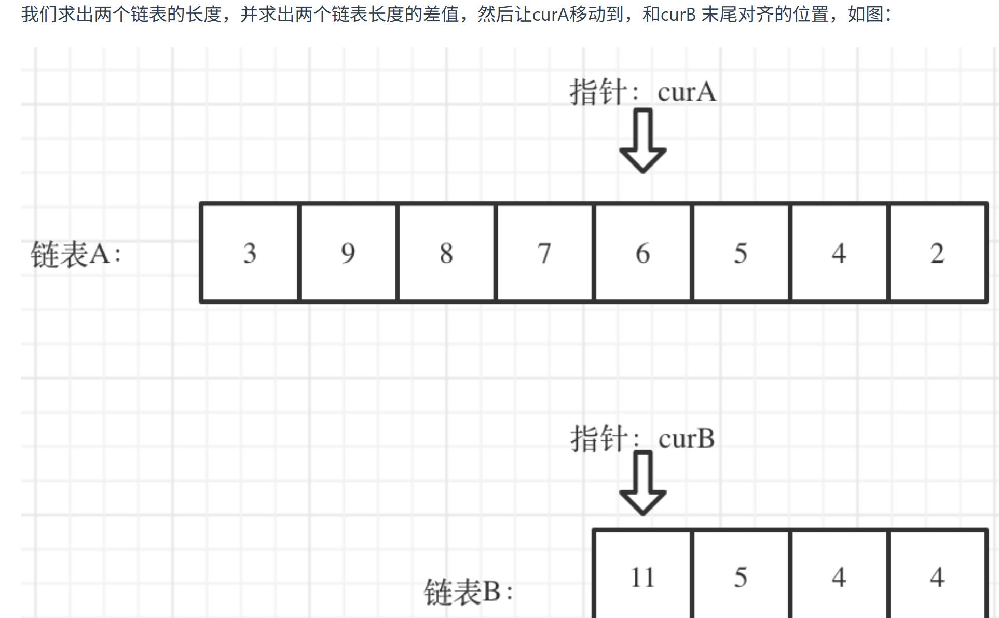

```cpp
ListNode *getIntersectionNode(ListNode *headA, ListNode *headB) {
    ListNode* curA = headA;
    ListNode* curB = headB;

    int lenA = 0, lenB = 0;
    while (curA != NULL) { // 求链表A的长度
        lenA++;
        curA = curA->next;
    }
    while (curB != NULL) { // 求链表B的长度
        lenB++;
        curB = curB->next;
    }

    curA = headA;
    curB = headB;

    // 让curA为最长链表的头，lenA为其长度
    if (lenB > lenA) {
        swap (lenA, lenB);
        swap (curA, curB);
    }

    // 求长度差
    int gap = lenA - lenB;
    // 让curA和curB在同一起点上（末尾位置对齐）
    while (gap--) {
        curA = curA->next;
    }

    // 遍历curA 和 curB，遇到相同则直接返回
    while (curA != NULL) {
        if (curA == curB) {
            return curA;
        }
        curA = curA->next;
        curB = curB->next;
    }

    return NULL;
}
```

## **环形链表II**

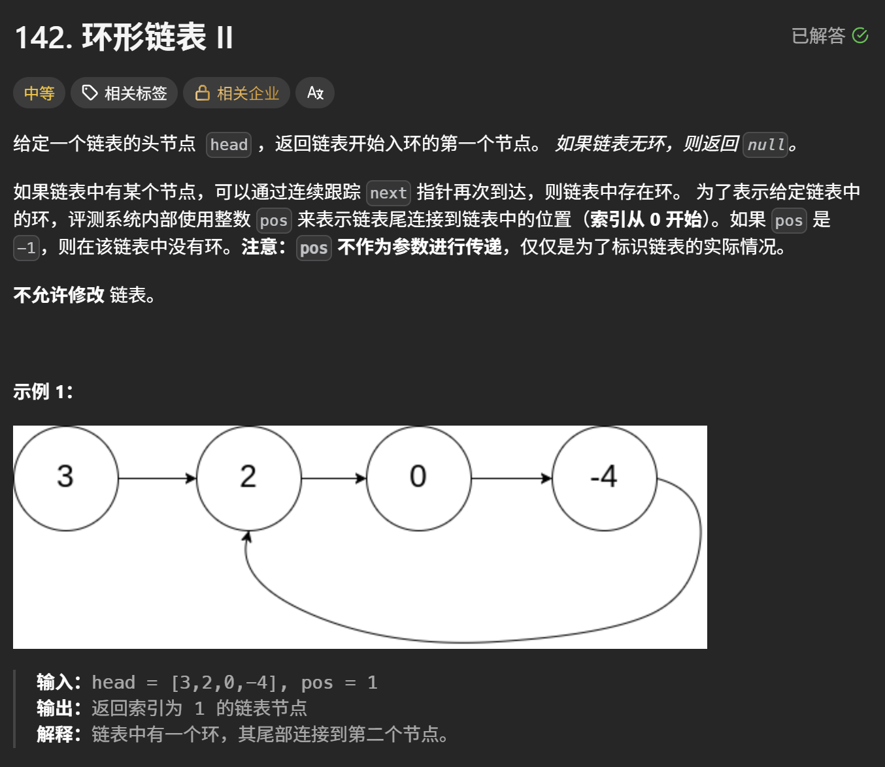

思路：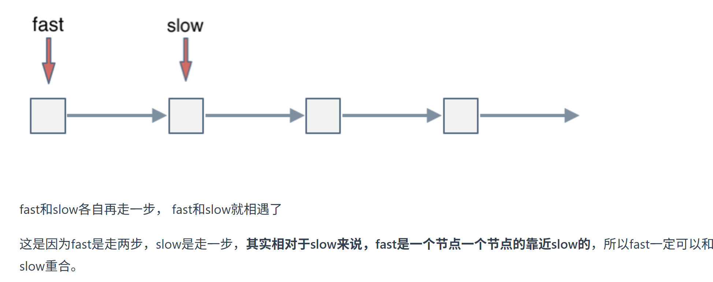
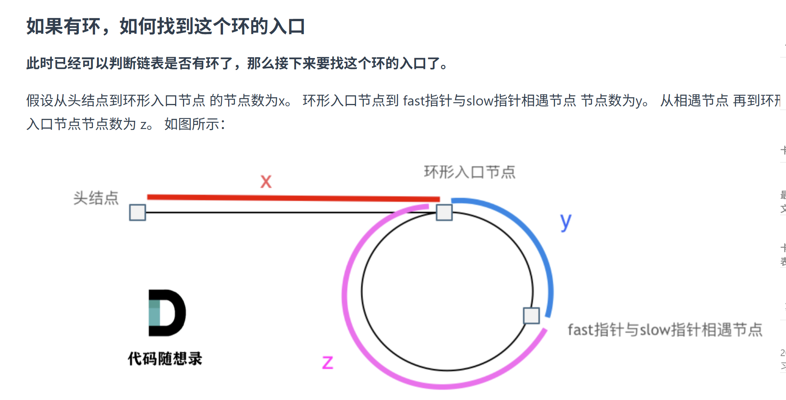
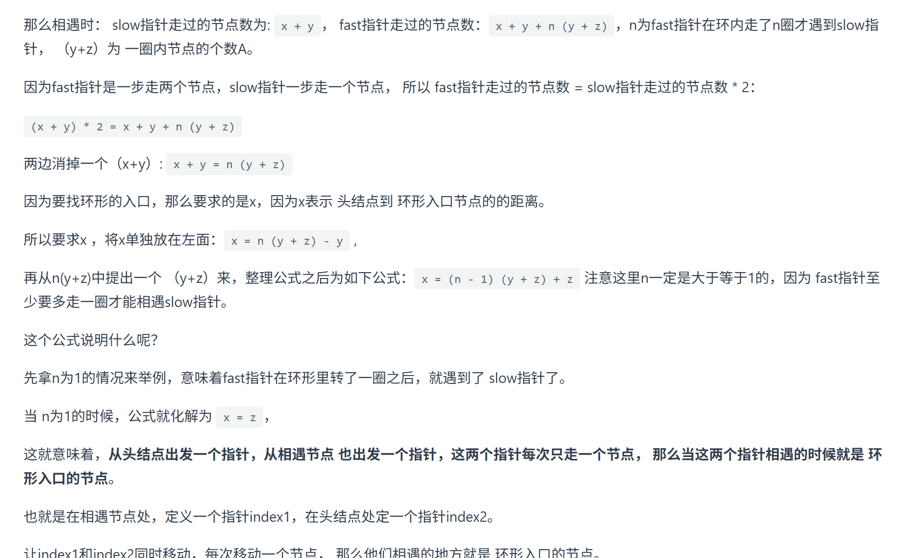
当n>1时也是如此，只不过多转了圈

```cpp
ListNode *detectCycle(ListNode *head) {
    ListNode* fast = head;
    ListNode* slow = head;
    while(fast != NULL && fast->next != NULL) {
        slow = slow->next;
        fast = fast->next->next;
        // 快慢指针相遇，此时从head 和 相遇点，同时查找直至相遇
        if (slow == fast) {
            ListNode* index1 = fast;
            ListNode* index2 = head;
            while (index1 != index2) {
                index1 = index1->next;
                index2 = index2->next;
            }
            return index2; // 返回环的入口
        }
    }
    return NULL;
}
```
